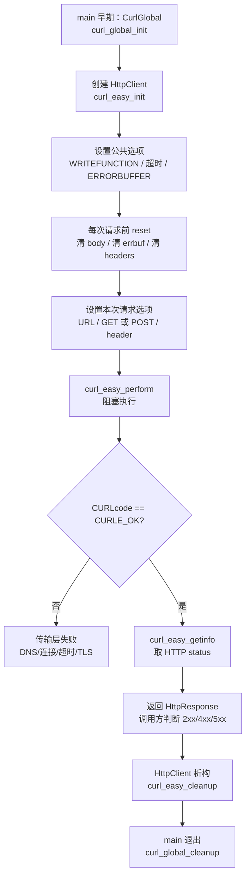
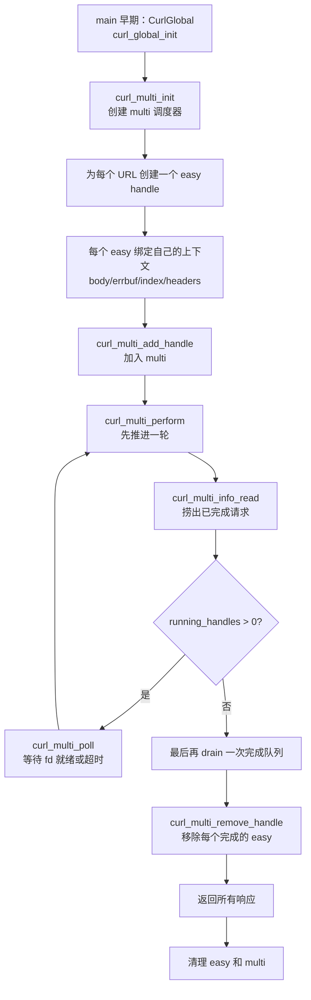
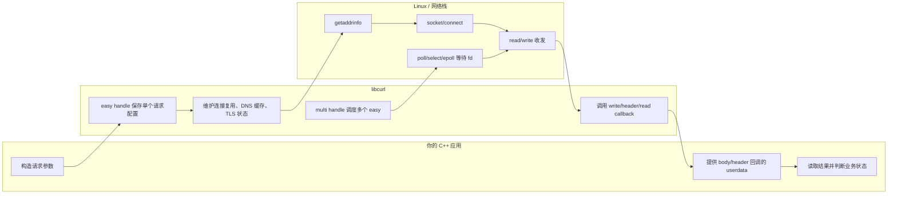

# 专题：libcurl —— 在 C++ 里做 HTTP 客户端

> 挂在第 11 章的补充专题，不是书里的正式小节。
>
> **为什么放第 11 章**：第 11 章我们亲手用 `socket`→`connect`→`getaddrinfo`→RIO 循环写了 echo 客户端和 Tiny 服务器。libcurl 就是把这一整套（DNS 解析 + 建连 + read/write 收发 + 协议解析）封装成一个稳定库，再加上 HTTP/HTTPS/HTTP2、TLS、重定向、cookie、连接复用。**理解了第 10-11 章，libcurl 的每一个 `setopt` 你都能对应到底层哪一步**——这份文档的目标就是把「库的 API」和「你已经懂的 syscall」接起来。
>
> **配套代码**：`experiments/http_client.cpp` 是 easy 接口的 RAII 封装示例（GET/POST JSON/自定义 header/错误处理），`experiments/Makefile` 里 `make http_client`。本文 §8 给出 multi 接口的完整 C++17 写法，适合后续单独抽成 `http_multi_client.cpp`。
>
> **本机验证说明**：本机已安装 `libcurl4-openssl-dev`（libcurl v8.5.0，OpenSSL flavour）。Ubuntu 24.04 的头文件位于 multiarch 路径 `/usr/include/x86_64-linux-gnu/curl/curl.h`，`g++ ... -lcurl` 能自动找到。`experiments/http_client.cpp` 已在本机用 `make http_client` 实际编译链接通过，生成 x86-64 ELF 可执行文件并动态链接 `/lib/x86_64-linux-gnu/libcurl.so.4`。当前网络把 `neverssl.com` 解析到 `198.18.0.156` 且 HTTP body 超时不返回，因此运行样例会走到「传输失败：超时」分支；这正好验证了错误处理路径。

---

## 1. 一句话：libcurl 是什么

libcurl 是 curl 命令行工具背后的 C 库，做**客户端**的 URL 数据传输。支持 HTTP/HTTPS/FTP/SMTP 等一堆协议，但 90% 的 C++ 后端用它只做一件事：**发 HTTP 请求、拿响应**（调别人的 REST 接口、传文件、做健康检查）。

它是 C 库，没有 C++ 接口——所以「在 C++ 里用 libcurl」的核心工作就是：**给这套 C 的 handle + setopt + 回调，套一层 RAII，把资源管理和错误处理的样板收干净**（和第 10 章给 UDS/socket fd 套 RAII 是同一种活）。

```
   你的 C++ 代码
        │  curl_easy_setopt(...) / curl_easy_perform(...)
        ▼
   ┌─────────────────────────────────────┐
   │            libcurl                   │
   │  URL 解析 → getaddrinfo(DNS)         │  ← 第 11 章 §11.4
   │  → socket()/connect()                │  ← 第 11 章 §11.4
   │  → TLS 握手(OpenSSL)                  │
   │  → write(请求) / read(响应) 循环      │  ← 第 10 章 RIO 干的活
   │  → 解析 HTTP 状态行/头/body           │
   └─────────────────┬───────────────────┘
                     ▼  回调把 body 一段段喂给你
              你的 write callback → std::string / 文件 / 流式处理器
```

---

## 2. 写 C++ libcurl 的总流程

先别陷进某个 `CURLOPT_XXX`。写 C++ libcurl 程序时，主线永远是下面两条：

- **easy 流程**：一个 easy handle 表示一次可复用的「请求会话」，`curl_easy_perform` 同步阻塞到请求完成。适合绝大多数普通 HTTP 调用。
- **multi 流程**：multi handle 本身不代表请求，它是一个「调度器」；真正的请求仍然是多个 easy handle。你把多个 easy handle 加进 multi，然后在一个事件循环里用 `curl_multi_poll` + `curl_multi_perform` 推进它们。适合单线程并发多个请求。

### 2.1 easy：单请求同步流程图



easy 的思维模型：你手写第 11 章客户端时，`open_clientfd` + `rio_writen` + `rio_readlineb` 是顺序阻塞的；`curl_easy_perform` 只是把这串动作封装成一个函数。

### 2.2 multi：单线程并发流程图



multi 的思维模型：这就是第 12 章 I/O 多路复用那条线。**不是开 N 个线程**，而是在一个线程里反复问 libcurl：「哪些 socket 可以继续读写了？哪些请求完成了？」

### 2.3 easy 与 multi 的泳道图



---

## 3. 三层 API：先认清自己该用哪层

libcurl 有三套接口，别一上来就纠结，**99% 的场景先用 easy；需要单线程并发时再上 multi**：

| 层 | 头 | 定位 | 什么时候用 |
|----|-----|------|-----------|
| **easy** | `curl_easy_*` | **同步阻塞**，一个 handle 发一个请求，`perform` 一路阻塞到收完 | 主线，绝大多数场景 |
| **multi** | `curl_multi_*` | **单线程内并发多个传输**，非阻塞、事件驱动（可配 `poll`/`select`/`epoll`） | 一个线程要同时打十几个请求、又不想开十几个线程 |
| **share** | `curl_share_*` | 让多个 easy handle **共享** DNS 缓存/cookie/SSL session 等数据 | 高频调同一批域名，想复用 DNS/连接，进阶优化 |

- 🎯 **easy 是阻塞的**：`curl_easy_perform` 会一直卡到请求完成或超时，语义就像你在第 11 章写的 `open_clientfd` + 收发循环。要并发，最简单的做法是**每线程一个 easy handle**（handle 不能跨线程并发共享，见 §10）。
- 🎯 **multi 才是「单线程高并发」正解**：`curl_multi_perform` 推进所有传输一小步就返回，你用 `curl_multi_poll` 等 fd 就绪——这就是 libcurl 版的 §12 I/O 多路复用。
- ⚠️ **multi 不是 easy 的替代品，而是 easy 的调度器**：multi 里每个请求仍然要有自己的 `CURL*` easy handle；URL、header、body 回调、错误缓冲都绑在 easy 上。

---

## 4. 通用地基：C++ 先把 C 资源包好

无论 easy 还是 multi，都先写这几块基础设施。它们解决的是 C++ 里最容易出错的事：资源释放、异常边界、回调 userdata 生命周期。

### 4.1 全局 init/cleanup：进程级 RAII

```cpp
#include <curl/curl.h>

#include <stdexcept>

class CurlGlobal {
public:
  CurlGlobal() {
    if (curl_global_init(CURL_GLOBAL_DEFAULT) != CURLE_OK)
      throw std::runtime_error("curl_global_init 失败");
  }

  ~CurlGlobal() { curl_global_cleanup(); }

  CurlGlobal(const CurlGlobal &) = delete;
  CurlGlobal &operator=(const CurlGlobal &) = delete;
};
```

- 🎯 **`curl_global_init` 管进程，`curl_easy_init` 管请求 handle**。全局 init 初始化底层 TLS 库、Win socket 等，整个进程只调一次。
- ⚠️ **`curl_global_init` 非线程安全**：必须在 `main` 早期、单线程时调。如果你不显式调，`curl_easy_init` 可能帮你懒加载，但多线程程序里这个时机不可控。

### 4.2 easy/multi handle：`unique_ptr` + deleter

```cpp
#include <memory>

struct CurlEasyDeleter {
  void operator()(CURL *h) const noexcept {
    if (h)
      curl_easy_cleanup(h);
  }
};
using EasyHandle = std::unique_ptr<CURL, CurlEasyDeleter>;

struct CurlMultiDeleter {
  void operator()(CURLM *m) const noexcept {
    if (m)
      curl_multi_cleanup(m);
  }
};
using MultiHandle = std::unique_ptr<CURLM, CurlMultiDeleter>;
```

- 🔧 easy handle 出作用域自动 `curl_easy_cleanup`。
- 🔧 multi handle 出作用域自动 `curl_multi_cleanup`。
- ⚠️ 对 multi 来说，**先 `curl_multi_remove_handle`，再让 easy handle cleanup**；否则 multi 还持有那个 easy 的指针。

### 4.3 `curl_slist`：header 链表也要 RAII

```cpp
#include <memory>

using HeaderList = std::unique_ptr<curl_slist, decltype(&curl_slist_free_all)>;

HeaderList make_headers() {
  curl_slist *raw = nullptr;
  raw = curl_slist_append(raw, "Content-Type: application/json");
  raw = curl_slist_append(raw, "Authorization: Bearer <token>");
  return HeaderList(raw, curl_slist_free_all);
}
```

- ⚠️ `curl_slist_append` 返回新的链表头，必须写回 `raw`。
- ⚠️ `CURLOPT_HTTPHEADER` **不复制整个链表**；header 链表必须活到 `perform` 或 multi 传输完成之后。easy 同步请求可以把 header guard 放在函数局部；multi 并发请求必须把 header guard 放进每个 transfer context 里。

### 4.4 写回调：把 body 收进 `std::string`

```cpp
#include <string>

static size_t write_to_string(char *ptr, size_t size, size_t nmemb, void *userdata) {
  size_t total = size * nmemb;
  try {
    auto *out = static_cast<std::string *>(userdata);
    out->append(ptr, total);
    return total; // 返回已处理字节数 = total → 继续传输
  } catch (...) {
    return 0; // 返回 != total → libcurl 中断，perform 返回 CURLE_WRITE_ERROR
  }
}
```

- 🎯 回调签名固定：`size_t cb(char *ptr, size_t size, size_t nmemb, void *userdata)`。
- 🎯 `userdata` 就是 `CURLOPT_WRITEDATA` 传进去的指针。
- ⚠️ **C++ 异常绝不能穿出 C 回调**。libcurl 是 C 代码，异常穿过 C 栈帧是未定义行为；回调里必须 `try/catch`，把异常转换成 libcurl 看得懂的「短返回」。

---

## 5. easy handle 的完整写法

### 5.1 easy 生命周期七步

一个最小 GET 请求的完整调用序列，每一步都要看懂：

```c
curl_global_init(CURL_GLOBAL_DEFAULT);   // ① 进程级：初始化全局状态（TLS 库等），非线程安全
CURL *h = curl_easy_init();              // ② 创建一个 easy handle（不透明句柄）
curl_easy_setopt(h, CURLOPT_URL, "https://example.com");  // ③ 配置：设 N 个选项
curl_easy_setopt(h, CURLOPT_WRITEFUNCTION, cb);           //    （URL、回调、超时、header…）
curl_easy_setopt(h, CURLOPT_WRITEDATA, &buf);
CURLcode rc = curl_easy_perform(h);      // ④ 执行：阻塞直到完成，返回传输层结果码
long code;
curl_easy_getinfo(h, CURLINFO_RESPONSE_CODE, &code);      // ⑤ 事后取信息：HTTP 状态码/耗时/大小
curl_easy_cleanup(h);                    // ⑥ 销毁 handle
curl_global_cleanup();                   // ⑦ 进程退出前：清理全局状态
```

- 🎯 **`setopt` 是可变参数**：第三个参数的类型由第二个选项枚举决定——`long`、`char*`、函数指针、`void*` 都有。传错类型是运行期 UB，编译器不会帮你查。设 `long` 选项要写 `1L` 别写 `1`。
- 🎯 **`getinfo` 只能在 `perform` 之后调**：HTTP 状态码、DNS 耗时、下载字节数这些是传输结果，perform 前还不存在。
- 🎯 **handle 可复用**：`perform` 完不 cleanup，改几个 setopt 再 perform，能复用底层 TCP/TLS 连接（keep-alive）。配套 `HttpClient` 就是一个对象持有一个 handle 反复用。

### 5.2 一个推荐的 C++ easy 封装

配套代码 `experiments/http_client.cpp` 就是这条路线：

```cpp
struct HttpResponse {
  long status = 0;
  std::string body;

  bool ok() const { return status >= 200 && status < 300; }
};

class HttpClient {
public:
  HttpClient() : handle_(curl_easy_init()) {
    if (!handle_)
      throw std::runtime_error("curl_easy_init 失败");

    curl_easy_setopt(handle_.get(), CURLOPT_WRITEFUNCTION, write_to_string);
    curl_easy_setopt(handle_.get(), CURLOPT_FOLLOWLOCATION, 1L);
    curl_easy_setopt(handle_.get(), CURLOPT_MAXREDIRS, 5L);
    curl_easy_setopt(handle_.get(), CURLOPT_TIMEOUT, 10L);
    curl_easy_setopt(handle_.get(), CURLOPT_CONNECTTIMEOUT, 5L);
    curl_easy_setopt(handle_.get(), CURLOPT_ERRORBUFFER, errbuf_);
  }

  HttpResponse get(const std::string &url) {
    reset_per_request();
    curl_easy_setopt(handle_.get(), CURLOPT_URL, url.c_str());
    curl_easy_setopt(handle_.get(), CURLOPT_HTTPGET, 1L); // 从 POST 切回 GET 时需要
    return perform();
  }

  HttpResponse post_json(const std::string &url, const std::string &json) {
    reset_per_request();
    curl_easy_setopt(handle_.get(), CURLOPT_URL, url.c_str());
    curl_easy_setopt(handle_.get(), CURLOPT_COPYPOSTFIELDS, json.c_str());

    curl_slist *raw = nullptr;
    raw = curl_slist_append(raw, "Content-Type: application/json");
    HeaderList headers(raw, curl_slist_free_all);
    curl_easy_setopt(handle_.get(), CURLOPT_HTTPHEADER, headers.get());

    return perform(); // headers 活到 perform 返回，生命周期正确
  }

private:
  EasyHandle handle_;
  char errbuf_[CURL_ERROR_SIZE] = {0};
  std::string body_;

  void reset_per_request() {
    body_.clear();
    errbuf_[0] = '\0';
    curl_easy_setopt(handle_.get(), CURLOPT_WRITEDATA, &body_);
    curl_easy_setopt(handle_.get(), CURLOPT_HTTPHEADER, nullptr); // 避免上一次 header 串味
  }

  HttpResponse perform() {
    CURLcode rc = curl_easy_perform(handle_.get());
    if (rc != CURLE_OK) {
      std::string msg = errbuf_[0] ? errbuf_ : curl_easy_strerror(rc);
      throw std::runtime_error("传输失败: " + msg);
    }

    HttpResponse resp;
    curl_easy_getinfo(handle_.get(), CURLINFO_RESPONSE_CODE, &resp.status);
    resp.body = body_;
    return resp;
  }
};
```

这段封装的重点不是「代码多漂亮」，而是把易错点集中到类内部：

- `CURL*` 的 cleanup 交给 `EasyHandle`；
- body 的回调 userdata 由 `HttpClient` 内部维护；
- 每次请求前清掉上次的 body/error/header；
- 传输层失败抛异常，HTTP 4xx/5xx 正常返回给调用方判断。

---

## 6. easy 常用请求怎么发

### 6.1 GET

默认就是 GET，设好 URL、回调即可：

```cpp
curl_easy_setopt(h, CURLOPT_URL, "https://api.example.com/users/1");
curl_easy_setopt(h, CURLOPT_HTTPGET, 1L);   // 显式声明，从 POST 切回来时必须
curl_easy_perform(h);
```

### 6.2 POST 表单

`application/x-www-form-urlencoded` 是传统表单格式，设 `POSTFIELDS` 后 libcurl 自动切成 POST：

```cpp
curl_easy_setopt(h, CURLOPT_POSTFIELDS, "name=yanxu&age=30");
// 设了 POSTFIELDS 就自动变 POST，不用再设 CURLOPT_POST
```

### 6.3 POST JSON

现代 REST 主流是原始 JSON body，`Content-Type` 要自己设：

```cpp
curl_slist *raw = nullptr;
raw = curl_slist_append(raw, "Content-Type: application/json");
HeaderList headers(raw, curl_slist_free_all);

curl_easy_setopt(h, CURLOPT_HTTPHEADER, headers.get());
curl_easy_setopt(h, CURLOPT_COPYPOSTFIELDS, R"({"name":"yanxu"})");
curl_easy_perform(h);
```

- ⚠️ **`CURLOPT_POSTFIELDS` vs `CURLOPT_COPYPOSTFIELDS`**：`POSTFIELDS` 只存指针不复制，所以那块 body 内存必须一直活到 `perform` 之后；`COPYPOSTFIELDS` 让 libcurl 复制一份，调用方不用操心生命周期，代价是一次拷贝。拿不准就用 COPY 版。
- ⚠️ body 里可能有 `\0` 或二进制时，别只靠 C 字符串结尾；要配 `CURLOPT_POSTFIELDSIZE_LARGE` 明确长度。

### 6.4 自定义 header / 超时 / 重定向 / 状态码

```cpp
curl_slist *raw = nullptr;
raw = curl_slist_append(raw, "Authorization: Bearer <token>");
raw = curl_slist_append(raw, "X-Request-Id: abc123");
HeaderList headers(raw, curl_slist_free_all);

curl_easy_setopt(h, CURLOPT_HTTPHEADER, headers.get());
curl_easy_setopt(h, CURLOPT_TIMEOUT, 10L);         // 整个请求最多 10 秒（含传输）
curl_easy_setopt(h, CURLOPT_CONNECTTIMEOUT, 5L);   // 建立连接阶段最多 5 秒
curl_easy_setopt(h, CURLOPT_FOLLOWLOCATION, 1L);   // 自动跟随 3xx 重定向
curl_easy_setopt(h, CURLOPT_MAXREDIRS, 5L);        // 防无限跳转

CURLcode rc = curl_easy_perform(h);
long code = 0;
curl_easy_getinfo(h, CURLINFO_RESPONSE_CODE, &code);   // perform 后取 HTTP 状态码
```

- ⚠️ **一定设超时**。libcurl 默认没有整体超时（`CURLOPT_TIMEOUT` 默认 0 = 永不超时），生产里对方 hang 住你就一起 hang。
- 🎯 **`FOLLOWLOCATION` 默认关**。很多接口用 3xx 跳转，不开你只会拿到一个 302 和空 body。开了要配 `MAXREDIRS`。

---

## 7. 错误处理：分清「传输层失败」和「HTTP 非 2xx」

这是新手最常搞混、也最影响正确性的一点：**`curl_easy_perform` 返回 `CURLE_OK` 只代表「HTTP 事务成功完成了」，不代表「业务成功」**。

```
curl_easy_perform 的 CURLcode        HTTP 状态码 (getinfo)
─────────────────────────────        ──────────────────────
CURLE_OK          传输成功  ────┬──►  200/201  真正成功
                                ├──►  404       传输成功，但资源不存在
                                └──►  500       传输成功，但服务端报错
CURLE_COULDNT_CONNECT 连不上         （没有状态码——根本没拿到响应）
CURLE_OPERATION_TIMEDOUT 超时        （没有状态码）
CURLE_COULDNT_RESOLVE_HOST DNS 失败  （没有状态码）
CURLE_SSL_CONNECT_ERROR TLS 握手失败 （没有状态码）
```

- 🎯 **两层错误要分别判**：
  1. **传输层**：`curl_easy_perform` 的 `CURLcode` != `CURLE_OK` → 连不上/DNS/超时/TLS 失败，根本没有 HTTP 响应。用 `curl_easy_strerror(rc)` 拿人话，或设 `CURLOPT_ERRORBUFFER` 拿更详细的上下文文案。
  2. **HTTP 层**：`CURLcode == OK` 但 `CURLINFO_RESPONSE_CODE` 是 4xx/5xx → 传输成功、业务失败。libcurl 不把它当错误（除非你设 `CURLOPT_FAILONERROR`，让 ≥400 直接令 perform 返回 `CURLE_HTTP_RETURNED_ERROR`）。
- 🔧 **配套代码的分工**：`HttpClient::perform` 把「传输层失败」抛 `std::runtime_error`（异常处理真·异常），把「HTTP 非 2xx」正常返回给调用方由 `resp.ok()` 判断（业务预期内的结果不该用异常）。这个划分很重要——别把 404 也抛异常。

```cpp
CURLcode rc = curl_easy_perform(h);
if (rc != CURLE_OK)                       // 传输层：真失败
  throw std::runtime_error(errbuf[0] ? errbuf : curl_easy_strerror(rc));

long status = 0;
curl_easy_getinfo(h, CURLINFO_RESPONSE_CODE, &status);   // HTTP 层：交给调用方判 2xx
```

---

## 8. multi handle 的完整写法

### 8.1 multi 到底在做什么

multi 的关键句：**一个 multi handle 管理多个 easy handle；每个 easy handle 仍然代表一个具体请求**。

```
CURLM* multi
   ├── CURL* easy #0  URL=https://a.example.com  body=ctx0.body  err=ctx0.errbuf
   ├── CURL* easy #1  URL=https://b.example.com  body=ctx1.body  err=ctx1.errbuf
   └── CURL* easy #2  URL=https://c.example.com  body=ctx2.body  err=ctx2.errbuf
```

你自己要维护每个请求的上下文：URL、响应 body、错误 buffer、原始顺序 index、自定义 header 生命周期等。libcurl 只负责在 socket 可读/可写时推进传输，并在某个 easy 完成时把完成消息塞进 multi 的消息队列。

### 8.2 multi 的事件循环

multi 最小稳定循环就是四步：

1. `curl_multi_add_handle`：把所有 easy 加进去；
2. `curl_multi_perform`：先推进一轮，得到当前还在跑的 `running_handles`；
3. `curl_multi_poll`：等待 libcurl 内部 socket 就绪或超时；
4. `curl_multi_info_read`：每轮都把「已经完成」的 easy 捞出来，取状态码，`remove_handle`。

```cpp
int running = 0;
curl_multi_perform(multi, &running);

auto drain_finished = [&] {
  int left = 0;
  while (CURLMsg *msg = curl_multi_info_read(multi, &left)) {
    if (msg->msg != CURLMSG_DONE)
      continue;
    // msg->easy_handle 是刚完成的 easy
    // msg->data.result 是它的 CURLcode
    // 这里 getinfo / remove_handle / 记录结果
  }
};

drain_finished();
while (running > 0) {
  int numfds = 0;
  curl_multi_poll(multi, nullptr, 0, 1000, &numfds);
  curl_multi_perform(multi, &running);
  drain_finished();
}
drain_finished();
```

- 🎯 `curl_multi_perform` 是「推进状态机」，不是「等到所有完成」。它会尽可能做当前能做的事，然后返回。
- 🎯 `curl_multi_poll` 是「睡眠等待 fd 就绪/超时」，避免你空转烧 CPU。
- ⚠️ 每轮都要 `curl_multi_info_read`，否则完成事件堆着不处理，easy handle 也不会被你 remove。

### 8.3 一个完整的 C++17 multi GET 批量示例

下面这段是可以抽成 `http_multi_client.cpp` 的完整骨架。它演示的是「单线程并发 GET 多个 URL」，结果按输入顺序返回。

```cpp
// http_multi_client.cpp —— libcurl multi 接口的 C++17 RAII 示例
// 编译：g++ -std=c++17 -Wall http_multi_client.cpp -lcurl -o http_multi_client

#include <curl/curl.h>

#include <array>
#include <iostream>
#include <memory>
#include <stdexcept>
#include <string>
#include <unordered_map>
#include <utility>
#include <vector>

class CurlGlobal {
public:
  CurlGlobal() {
    if (curl_global_init(CURL_GLOBAL_DEFAULT) != CURLE_OK)
      throw std::runtime_error("curl_global_init 失败");
  }
  ~CurlGlobal() { curl_global_cleanup(); }
  CurlGlobal(const CurlGlobal &) = delete;
  CurlGlobal &operator=(const CurlGlobal &) = delete;
};

struct CurlEasyDeleter {
  void operator()(CURL *h) const noexcept {
    if (h)
      curl_easy_cleanup(h);
  }
};
using EasyHandle = std::unique_ptr<CURL, CurlEasyDeleter>;

struct CurlMultiDeleter {
  void operator()(CURLM *m) const noexcept {
    if (m)
      curl_multi_cleanup(m);
  }
};
using MultiHandle = std::unique_ptr<CURLM, CurlMultiDeleter>;

static size_t write_to_string(char *ptr, size_t size, size_t nmemb, void *userdata) {
  size_t total = size * nmemb;
  try {
    auto *out = static_cast<std::string *>(userdata);
    out->append(ptr, total);
    return total;
  } catch (...) {
    return 0;
  }
}

static void check_multi(CURLMcode rc, const char *what) {
  if (rc != CURLM_OK)
    throw std::runtime_error(std::string(what) + ": " + curl_multi_strerror(rc));
}

struct MultiResponse {
  std::string url;
  CURLcode transport = CURLE_OK; // 传输层结果
  long status = 0;               // HTTP 状态码；传输失败时通常为 0
  std::string body;
  std::string error;

  bool transport_ok() const { return transport == CURLE_OK; }
  bool ok() const { return transport_ok() && status >= 200 && status < 300; }
};

struct Transfer {
  std::size_t index = 0;
  std::string url;
  EasyHandle easy;
  std::string body;
  std::array<char, CURL_ERROR_SIZE> errbuf{};

  Transfer(std::size_t i, std::string u) : index(i), url(std::move(u)), easy(curl_easy_init()) {
    if (!easy)
      throw std::runtime_error("curl_easy_init 失败");

    errbuf[0] = '\0';
    curl_easy_setopt(easy.get(), CURLOPT_URL, url.c_str());
    curl_easy_setopt(easy.get(), CURLOPT_HTTPGET, 1L);
    curl_easy_setopt(easy.get(), CURLOPT_WRITEFUNCTION, write_to_string);
    curl_easy_setopt(easy.get(), CURLOPT_WRITEDATA, &body);
    curl_easy_setopt(easy.get(), CURLOPT_ERRORBUFFER, errbuf.data());
    curl_easy_setopt(easy.get(), CURLOPT_FOLLOWLOCATION, 1L);
    curl_easy_setopt(easy.get(), CURLOPT_MAXREDIRS, 5L);
    curl_easy_setopt(easy.get(), CURLOPT_TIMEOUT, 10L);
    curl_easy_setopt(easy.get(), CURLOPT_CONNECTTIMEOUT, 5L);
  }
};

std::vector<MultiResponse> get_all(const std::vector<std::string> &urls) {
  MultiHandle multi(curl_multi_init());
  if (!multi)
    throw std::runtime_error("curl_multi_init 失败");

  std::vector<std::unique_ptr<Transfer>> transfers;
  transfers.reserve(urls.size());

  std::vector<MultiResponse> results(urls.size());
  std::unordered_map<CURL *, Transfer *> owner; // 完成消息里的 CURL* → 我们的上下文

  for (std::size_t i = 0; i < urls.size(); ++i) {
    auto t = std::make_unique<Transfer>(i, urls[i]);
    CURL *raw = t->easy.get();

    results[i].url = t->url;
    check_multi(curl_multi_add_handle(multi.get(), raw), "curl_multi_add_handle");
    owner.emplace(raw, t.get());
    transfers.push_back(std::move(t));
  }

  auto drain_finished = [&] {
    int left = 0;
    while (CURLMsg *msg = curl_multi_info_read(multi.get(), &left)) {
      if (msg->msg != CURLMSG_DONE)
        continue;

      auto it = owner.find(msg->easy_handle);
      if (it == owner.end())
        throw std::runtime_error("收到未知 easy handle 的完成消息");

      Transfer &t = *it->second;
      MultiResponse &r = results[t.index];
      r.transport = msg->data.result;

      if (r.transport == CURLE_OK) {
        curl_easy_getinfo(msg->easy_handle, CURLINFO_RESPONSE_CODE, &r.status);
        r.body = std::move(t.body);
      } else {
        r.error = t.errbuf[0] ? t.errbuf.data() : curl_easy_strerror(r.transport);
      }

      check_multi(curl_multi_remove_handle(multi.get(), msg->easy_handle),
                  "curl_multi_remove_handle");
      owner.erase(it);
    }
  };

  int running = 0;
  check_multi(curl_multi_perform(multi.get(), &running), "curl_multi_perform");
  drain_finished();

  while (running > 0) {
    int numfds = 0;
    check_multi(curl_multi_poll(multi.get(), nullptr, 0, 1000, &numfds),
                "curl_multi_poll");
    check_multi(curl_multi_perform(multi.get(), &running), "curl_multi_perform");
    drain_finished();
  }

  drain_finished(); // 防止最后一轮完成消息还没被捞出
  return results;
}

int main() {
  CurlGlobal g;

  const std::vector<std::string> urls = {
      "https://httpbin.org/get",
      "https://httpbin.org/status/404",
      "https://example.com/",
  };

  try {
    std::vector<MultiResponse> rs = get_all(urls);
    for (const auto &r : rs) {
      std::cout << "== " << r.url << " ==\n";
      if (!r.transport_ok()) {
        std::cout << "传输失败: " << r.error << "\n";
        continue;
      }
      std::cout << "HTTP 状态码: " << r.status
                << (r.ok() ? " (2xx OK)" : " (非 2xx，业务失败)") << "\n";
      std::cout << "body 长度: " << r.body.size() << " 字节\n\n";
    }
  } catch (const std::exception &e) {
    std::cerr << "错误: " << e.what() << "\n";
    return 1;
  }

  return 0;
}
```

### 8.4 multi 写法的关键点

- 🎯 **每个 easy 都要有独立上下文**：`body`、`errbuf`、header 链表、上传 body 生命周期都不能混用。
- 🎯 **完成顺序不等于输入顺序**：网络谁先回来不确定。示例里用 `index` 把结果放回原位置。
- 🎯 **`curl_multi_info_read` 读到的是完成事件**：`msg->data.result` 是这个 easy 的 `CURLcode`，仍然只代表传输层；HTTP 状态码还要 `curl_easy_getinfo`。
- ⚠️ **完成后必须 `curl_multi_remove_handle`**：remove 之后 easy 才能安全 cleanup 或重用。
- ⚠️ **multi 回调仍然在你的调用线程执行**：不是后台线程。`write_to_string` 会在你调用 `curl_multi_perform` 的线程里被触发。
- ⚠️ **multi 里 header/body 的生命周期更容易错**：因为 `get_all()` 发起请求后不会立刻完成，所有 per-request 数据必须放在 `Transfer` 这种活到完成之后的对象里。

### 8.5 easy、多线程 easy、multi 怎么选

| 需求 | 推荐写法 | 原因 |
|------|----------|------|
| 偶尔请求一个 REST 接口 | 一个 `HttpClient` + easy | 代码最简单，阻塞语义清楚 |
| 同步服务里每个 worker 线程自己请求外部接口 | 每线程一个 easy handle / `HttpClient` | 避免 handle 跨线程共享 |
| 一个线程要同时拉几十个 URL | multi + 多个 easy | 单线程 I/O 多路复用，避免线程膨胀 |
| 要和现有 epoll/reactor 集成 | multi socket API（进阶） | `curl_multi_poll` 不够细时再用 |
| 高频请求同一批域名 | easy/multi + 连接复用，必要时 share | 减少 DNS/TCP/TLS 成本 |

---

## 9. HTTPS / TLS：默认是安全的，别手贱关掉

访问 `https://` 时 libcurl 默认做**完整证书校验**，两个开关默认都开：

- `CURLOPT_SSL_VERIFYPEER = 1`：校验对端证书是否由受信任 CA 签发（防伪造证书）。
- `CURLOPT_SSL_VERIFYHOST = 2`：校验证书里的域名和你访问的主机名匹配（防拿别的合法证书冒充）。

⚠️ **网上一堆「连不上就把这俩设 0」的答案，等于关掉 HTTPS 的全部安全性**——中间人可以随便伪造证书、解密/篡改你的流量，HTTPS 退化成没加密。**正确的做法**：证书校验失败通常是本机 CA 根证书过期/缺失，装/更新 `ca-certificates`，或用 `CURLOPT_CAINFO` 指定 CA bundle 路径，而不是关校验。只有在内网、自签证书、且你清楚风险时才临时关，生产绝不关。

---

## 10. ⚠️ 易错点专区

- **`curl_global_init` 非线程安全**：必须 `main` 早期、单线程调一次；多线程程序若靠 `curl_easy_init` 隐式触发它，会数据竞争。
- **一个 easy handle 不能跨线程并发**：handle 内含连接状态、缓冲，多线程同时 `perform` 同一个 handle 直接崩；每线程各持一个 handle，或用 multi 在一个线程里调度多个 easy。
- **multi 不是「一个 handle 发多个请求」**：multi 是调度器，真正每个请求仍然是一个 easy handle。
- **`curl_slist` 忘 `curl_slist_free_all`** → 内存泄漏；easy 用局部 RAII，multi 放进每个 transfer context。
- **`CURLOPT_HTTPHEADER` 不复制链表**：header 链表必须活到请求完成，multi 里尤其容易提前释放。
- **回调里 C++ 异常穿出 C 栈是 UB**：所有回调（write/header/read）整段 `try/catch`，异常转成「返回 != 期望字节数」的中断信号。
- **`CURLOPT_POSTFIELDS` 不复制指针**：body 内存要活到 `perform` 后；拿不准用 `CURLOPT_COPYPOSTFIELDS`。
- **`setopt` 第三参类型错是运行期 UB**：`long` 选项写 `1L`、字符串选项传 `const char*`、回调传函数指针，别混。
- **默认无超时**：不设 `CURLOPT_TIMEOUT`，对端 hang 住你就永久阻塞。
- **`FOLLOWLOCATION` 默认关**：接口用 302 跳转时不开会拿到空 body；开了要配 `MAXREDIRS`。
- **`perform` 返回 OK ≠ 业务成功**：4xx/5xx 要靠 `CURLINFO_RESPONSE_CODE` 单独判。
- **multi 完成后必须 remove handle**：`curl_multi_remove_handle` 之后 easy 才能 cleanup 或重用。

---

## 11. 🔧 工程关联：把 libcurl 拆回你懂的 syscall

- **libcurl 底层就是第 10-11 章的组合**：URL 解析 → `getaddrinfo`（§11.4 DNS）→ `socket`/`connect`（§11.4 建连）→ `write`/`read` 循环收发（§10 RIO 干的活）→ 解析 HTTP 状态行/头/body。你手写过一遍 echo 客户端，libcurl 只是把这套做到工业级 + 加 TLS/重定向/连接池。
- **easy 对应阻塞式客户端**：`curl_easy_perform` 就像 `connect` 后一路 `write/read` 到结束，适合先把语义写对。
- **multi 对应 I/O 多路复用**：`curl_multi_poll` 和你第 12 章会看到的 `poll/epoll` 是同一类思路——一个线程等多个 fd，就绪后推进状态机。
- **`strace -e trace=network ./http_client <url>` 能看穿它**：会打出 `socket(AF_INET, SOCK_STREAM, ...)`、`connect(...)`、以及 DNS 查询的 UDP `sendto`/`recvfrom`——和你在 §11 echo 客户端里看到的一模一样。`strace -e trace=%network,read,write` 还能看到 body 的 `read` 短读（§10 short count 在这里也成立）。
- **`curl --libcurl code.c <url>`**：curl 命令行有个神仙选项，把「等价的 C 代码」直接生成出来。想不起某个功能对应哪个 `setopt`？用 curl 命令拼出来，加 `--libcurl` 看它生成什么。
- **`CURLOPT_VERBOSE = 1L`（或命令行 `curl -v`）**：把 DNS、连接、TLS 握手、请求头、响应头全打到 stderr，排查「为什么连不上/证书报错/header 没生效」的第一工具。
- **和 UDS/socket RAII 的对称性**：那边是给 socket fd 套 `uds::Fd` RAII；这边是给 libcurl 的 C handle 套 `unique_ptr` RAII。贴着 C 接口写现代 C++，套路是通用的：不透明句柄 → `unique_ptr` + deleter，配对的 init/cleanup → 栈守卫对象，C 回调 → 挡住异常。

---

## 12. 🧪 实验题

**🧪 题 1：编译跑通 easy 配套代码 + 看穿底层 syscall**

```bash
cd Chapter11/experiments
sudo apt install libcurl4-openssl-dev     # 本机缺 -dev，先装
make http_client
./http_client https://httpbin.org/get
strace -e trace=network ./http_client https://httpbin.org/get 2>&1 | grep -E 'socket|connect'
```

要求：① 观察 GET 打出的 HTTP 状态码和 body；② 从 strace 输出里找出 `socket()` 和 `connect()`，确认目标端口是 443（HTTPS）；③ 换 `http://httpbin.org/get`（明文）再抓一次，对比 `connect` 端口变成 80。**结论**：libcurl 的一次 GET 就是你 §11 手写的 socket+connect。

**🧪 题 2：亲手制造并区分两类错误**

要求：分别构造并观察三种情况，确认代码走的是哪个分支——

1. `./http_client http://127.0.0.1:9/x`（没人监听的端口）→ 应打「传输失败: Couldn't connect」（传输层，走异常分支）；*（本机已实测通过这一条）*
2. 找一个返回 404 的 URL，如 `./http_client https://httpbin.org/status/404` → 应打「HTTP 状态码: 404 (非 2xx，业务失败)」（HTTP 层，**不**走异常分支）；
3. `./http_client https://expired.badssl.com/` → 应打「传输失败: SSL certificate problem」（TLS 校验失败，传输层）。

**结论**：把 §7 的两层错误模型对上号——只有 1、3 抛异常，2 是正常返回。

**🧪 题 3：验证证书校验的作用（理解 §9，勿用于生产）**

要求：对题 2 的第 3 条（`expired.badssl.com`），临时在代码里加 `curl_easy_setopt(h, CURLOPT_SSL_VERIFYPEER, 0L)` 后重新编译运行，观察请求**竟然成功了**。**结论**：这一个 `0L` 就让你对一个证书已过期（潜在被劫持）的站点建立了「加密但不可信」的连接——直观体会为什么生产绝不能关校验。看完把这行删掉。

**🧪 题 4：把 §8 multi 示例抽成文件并观察并发**

要求：① 把 §8.3 的代码保存为 `experiments/http_multi_client.cpp`；② 用 `g++ -std=c++17 -Wall http_multi_client.cpp -lcurl -o http_multi_client` 编译；③ 运行后观察三个 URL 的完成结果；④ 用 `strace -e trace=network ./http_multi_client` 看它在一个进程里发起多个 `connect`。**结论**：multi 的并发来自单线程 I/O 多路复用，不是多线程。
