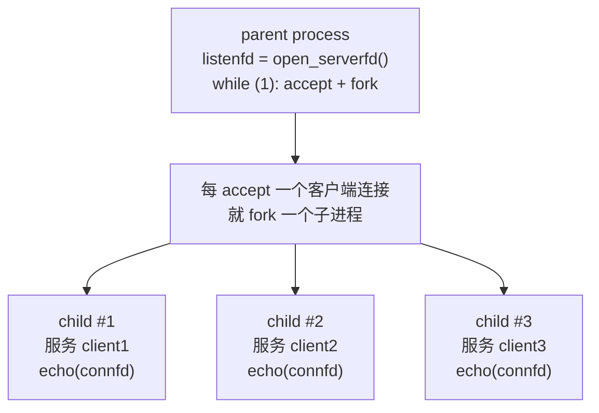
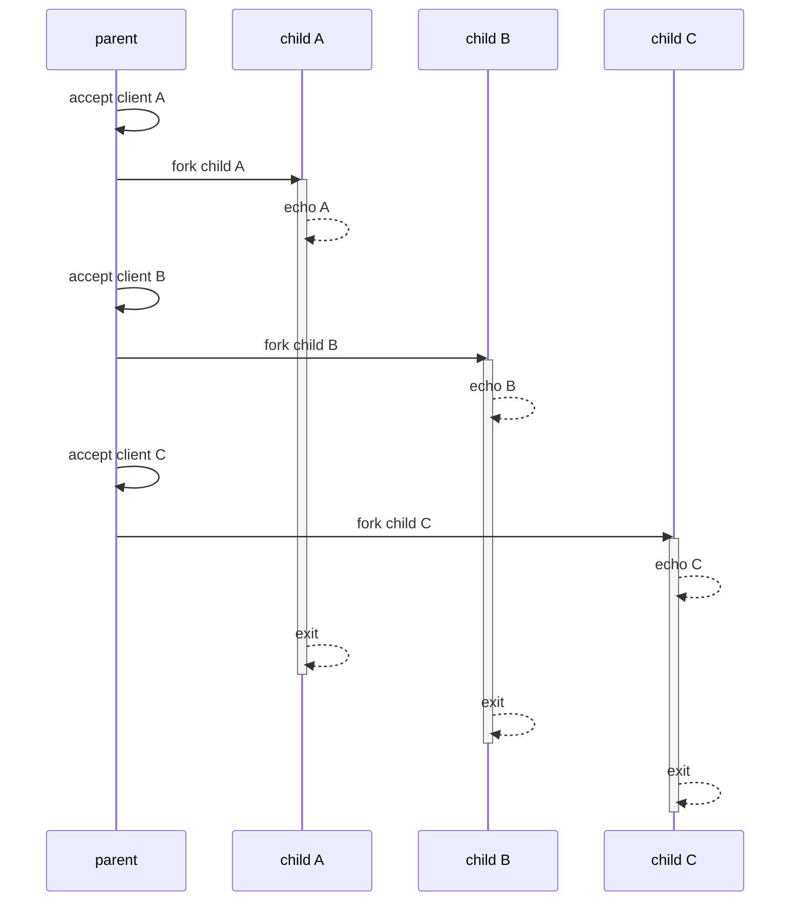
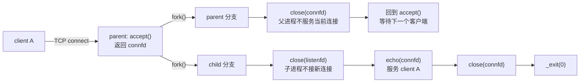
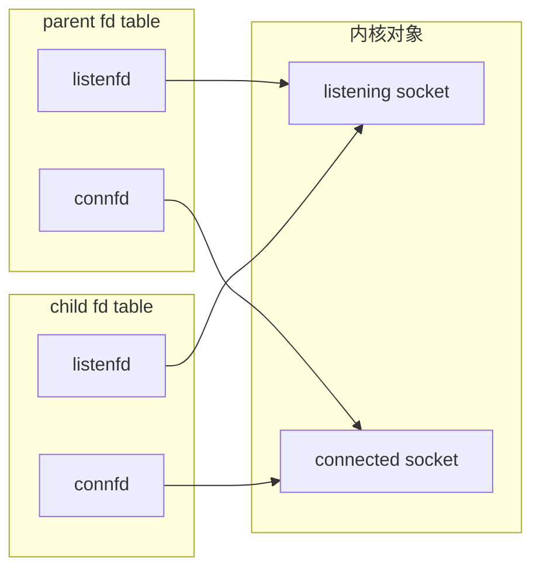
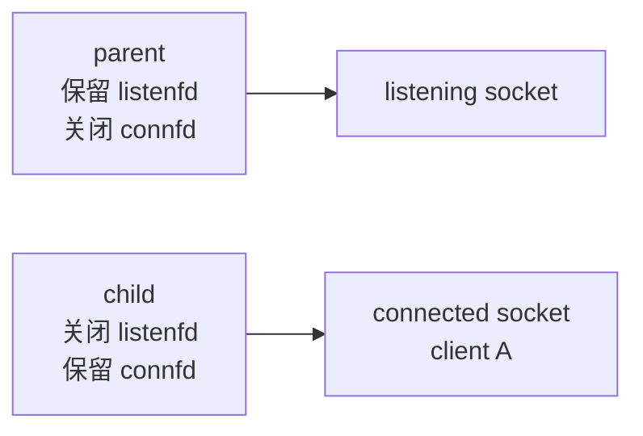
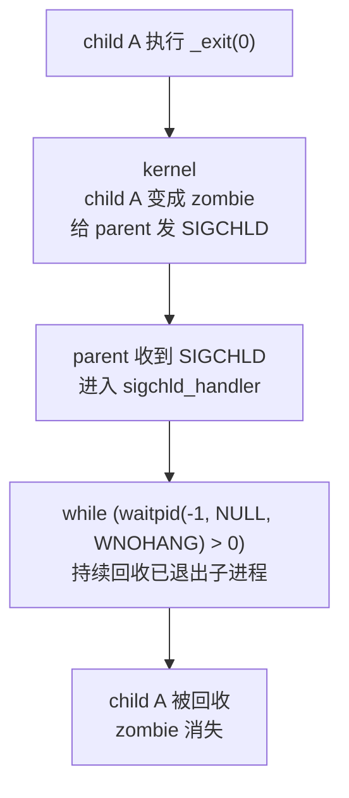

# §12.1 基于进程的并发编程

这一节的主线是：**把第 8 章的 `fork`/`waitpid` 和第 11 章的 socket 服务器拼起来，用“每个连接一个子进程”的方式让服务器同时服务多个客户端**。进程并发的优点是隔离强、实现直观、一个客户端崩溃不容易污染另一个客户端；代价是进程创建/上下文切换更重，默认不共享地址空间，所以一旦多个 worker 要共享状态，就必须引入 IPC。本节重点看的典型 IPC 收敛为 4 类：**UDS、`mmap`、`eventfd`、gRPC**。

> 本节代码组织：`experiments/process_echo_server.c` 是基于进程的并发 echo 服务器，复用第 11 章 `Chapter11/socket/net.h` 和第 10 章 `Chapter10/rio`；`experiments/process_echo_client.c` 是配套客户端；`experiments/ipc_demo.c` 汇总 UDS / `mmap` / `eventfd` 三个无需第三方依赖的 Linux IPC 最小例程；`experiments/grpc_echo/` 是可选 gRPC C++ echo 例程，需要额外安装 gRPC / Protobuf。

---

## 进程并发服务器模型

**🎯 核心模式：父进程只 accept，子进程只服务一个连接**

迭代式服务器的问题是：`doit(connfd)` 处理当前客户端时，主循环回不到 `accept`，新客户端只能排队。基于进程的并发服务器把一次连接交给子进程处理，父进程立刻回到 `accept` 等下一个连接。

```c
listenfd = open_serverfd(port);
while (1) {
    connfd = accept(listenfd, ...);
    if (fork() == 0) {        // 子进程
        close(listenfd);      // 子进程不负责接新连接
        echo(connfd);         // 服务当前客户端
        close(connfd);
        _exit(0);
    }
    close(connfd);            // 父进程不服务当前连接
}
```

这就是 `experiments/process_echo_server.c` 的骨架。真实工程里早期 Apache prefork、PostgreSQL 每连接进程模型、OpenSSH `sshd` 的连接处理，都能看到这个思路的影子。

**🎯 并发结构图：父进程接客，子进程服务**



父进程不会被某个慢客户端拖住：如果 client A 长时间不发数据，只会让 child A 阻塞在 `rio_readlineb`，父进程仍然能继续 `accept` client B / client C。



**🔧 单个连接的生命周期**



**⚠️ `listenfd` 和 `connfd` 的关闭规则不能反**

`fork` 后父子进程各自复制一份描述符表，但这些 fd 指向同一批内核打开文件表项 / socket 对象：

```text
父进程：listenfd -> 监听 socket      connfd -> 已连接 socket
fork 后：
父进程：listenfd ✅继续保留          connfd ❌关闭
子进程：listenfd ❌关闭              connfd ✅继续保留
```

如果父进程忘记关闭 `connfd`，即使子进程关闭了连接，内核引用计数仍不为 0，客户端可能迟迟看不到 EOF；如果子进程忘记关闭 `listenfd`，监听 socket 的生命周期会被无意义延长，服务器退出/重启时排障更混乱。

`fork` 刚结束时，父子进程都能看到两个 fd：



关掉不属于自己职责的 fd 后，边界才清楚：



**🔧 例子：用不同 PID 证明并发**

```bash
cd Chapter12/12.1/experiments
make
./process_echo_server 8080

# 另开两个终端
printf 'hello from A\n' | ./process_echo_client 127.0.0.1 8080
printf 'hello from B\n' | ./process_echo_client 127.0.0.1 8080
```

服务器端会打印不同 child PID，说明多个连接由不同子进程并发处理。

---

## 子进程回收与 SIGCHLD

**🎯 并发服务器一定要处理僵尸进程**

子进程服务完客户端后 `_exit`，如果父进程不 `waitpid`，内核必须保留它的退出状态，进程就会变成 zombie。单次实验看不明显，但长时间运行的服务器会积累大量 `Z` 状态进程，占用 PID 表项。

**🎯 子进程回收流程图**



把完整流程压缩成一句就是：

```text
child exit → zombie → kernel 发 SIGCHLD → parent waitpid → zombie 被清理
```

```c
static void sigchld_handler(int sig) {
    int olderrno = errno;
    while (waitpid(-1, NULL, WNOHANG) > 0) {
        ;  // 一次 SIGCHLD 可能对应多个已退出子进程，必须循环收干净
    }
    errno = olderrno;
}
```

这里的 `WNOHANG` 很关键：handler 不能阻塞等待“尚未退出”的子进程，否则父进程可能卡死在信号处理函数里。

**⚠️ `SIGCHLD` 不排队，handler 里必须 while**

如果 10 个子进程几乎同时退出，内核可能只交付一次 `SIGCHLD`。handler 里只调用一次 `waitpid`，就会漏掉其他已经退出的子进程。

```c
// 错误：只回收一个，容易漏 zombie
waitpid(-1, NULL, WNOHANG);

// 正确：直到没有已退出子进程为止
while (waitpid(-1, NULL, WNOHANG) > 0) {}
```

**🔧 观察方法**

```bash
ps -o pid,ppid,stat,cmd --ppid <server-pid>
ps -ef | grep defunct
```

这和第 8 章 shell 实验完全同源：后台作业退出后不回收，也会产生僵尸。

---

## 进程并发的优点与代价

**🎯 优点：隔离强，编程模型简单**

每个连接在独立地址空间里运行：

```text
client A -> child A -> 独立虚拟地址空间
client B -> child B -> 独立虚拟地址空间
```

一个子进程写坏自己的堆、栈溢出、甚至崩溃，通常不会直接破坏其他连接的状态；父进程仍可继续 `accept`。这就是进程模型在安全敏感服务里长期存在的原因。

**⚠️ 代价：资源开销高，状态共享麻烦**

`fork` 虽然有 COW，创建进程仍比创建线程重；进程切换也比用户态协程/事件循环更重。更重要的是，子进程默认不共享全局变量：

```c
static int counter = 0;

if (fork() == 0) {
    counter++;       // 只改子进程自己的副本
    _exit(0);
}
waitpid(-1, NULL, 0);
printf("counter = %d\n", counter);  // 父进程仍然看到 0
```

所以多进程服务器要共享连接数、缓存、会话、任务队列时，必须靠 IPC 或外部存储。下面 4 种是值得重点建立工程直觉的典型 IPC。

---

## 四类典型 IPC：UDS、mmap、eventfd、gRPC

**🎯 一张选择表**

| IPC | 数据模型 | 典型用途 | 关键限制 |
|-----|----------|----------|----------|
| UDS（Unix Domain Socket） | 本机 socket：`SOCK_STREAM` / `SOCK_DGRAM` / `SOCK_SEQPACKET` | 本机 C/S API、守护进程控制面、传 fd | 只限本机；只有 `SOCK_STREAM` 没有消息边界，`SOCK_DGRAM` / `SOCK_SEQPACKET` 保留消息边界 |
| `mmap` / shared memory | 多进程共享同一批物理页 | 大块数据、低延迟共享状态、环形缓冲区 | 只共享内存，不提供同步；必须配 semaphore/mutex/futex/eventfd |
| `eventfd` | 内核维护的 64 位计数器 | 跨进程/线程事件通知、唤醒 `epoll` 主循环 | 只能传计数，不适合传 payload |
| gRPC | Protobuf 消息 + HTTP/2 RPC | 跨语言、跨机器、服务接口契约 | 依赖重、比 UDS/mmap/eventfd 更慢；本机调用默认仍走 loopback TCP |

**🔧 怎么选**

- **本机服务 API / 控制面**：优先 UDS。Docker、containerd、PostgreSQL、Wayland、D-Bus 都大量使用 UDS。
- **大块共享数据 / 高频读写状态**：优先 `mmap` shared memory，但必须额外设计同步。
- **只需要“通知你有事了”**：优先 `eventfd`，特别适合和 `epoll` 组合。
- **跨语言、跨机器、要接口契约和生态**：用 gRPC；如果只是同机高频 IPC，它通常太重。

---

## UDS：本机进程间的 socket API

**🎯 UDS 复用 socket 编程模型，但不走 TCP/IP**

UDS 用 `AF_UNIX` / `AF_LOCAL`，地址不是 IP:port，而是文件系统路径（或 Linux 抽象命名空间）。它仍然复用 socket API，但要先分清 socket 类型：`SOCK_STREAM` 是字节流，`SOCK_DGRAM` 是数据报，Linux 还常见 `SOCK_SEQPACKET` 这种连接型、可靠有序、保留消息边界的类型。

| UDS 类型 | 创建方式 | 语义 | 消息边界 | 常用 API 形态 |
|----------|----------|------|----------|---------------|
| `SOCK_STREAM` | `socket(AF_UNIX, SOCK_STREAM, 0)` | 类似 TCP 的可靠字节流 | 没有 | `bind` / `listen` / `accept` / `connect` / `read` / `write` |
| `SOCK_DGRAM` | `socket(AF_UNIX, SOCK_DGRAM, 0)` | 类似 UDP 的本机数据报 | 有 | `bind` / `sendto` / `recvfrom`，也可 `connect` 后 `send` / `recv` |
| `SOCK_SEQPACKET` | `socket(AF_UNIX, SOCK_SEQPACKET, 0)` | 连接型、可靠有序、按包收发 | 有 | `bind` / `listen` / `accept` / `connect` / `send` / `recv` |

**🎯 `SOCK_STREAM`：像 TCP，一条连接上跑字节流**

服务端通常走 `bind` → `listen` → `accept`，拿到 `connfd` 后再 `read` / `write`：

```c
int listenfd = socket(AF_UNIX, SOCK_STREAM, 0);

struct sockaddr_un addr = {0};
addr.sun_family = AF_UNIX;
snprintf(addr.sun_path, sizeof(addr.sun_path), "/tmp/csapp.sock");

unlink(addr.sun_path);  // 路径式 UDS 重启前通常要清理旧 socket 文件
bind(listenfd, (struct sockaddr *)&addr, sizeof(addr));
listen(listenfd, 8);

int connfd = accept(listenfd, NULL, NULL);
```

客户端用 `connect` 连到服务端路径，之后也像 TCP 一样 `read` / `write`：

```c
int fd = socket(AF_UNIX, SOCK_STREAM, 0);
connect(fd, (struct sockaddr *)&addr, sizeof(addr));
write(fd, "hello", 5);
```

`SOCK_STREAM` UDS 是字节流：一次 `write` 对端可能多次 `read` 才读完，也可能多条消息粘在一起。应用层仍要定义协议：换行、长度前缀、定长头部都可以。

**🎯 `SOCK_DGRAM`：像 UDP，一次 sendto 对应一个数据报**

服务端绑定一个路径，然后用 `recvfrom` 一次收一个 datagram；如果要回包，可以用 `recvfrom` 填出来的 peer 地址 `sendto` 回去：

```c
int fd = socket(AF_UNIX, SOCK_DGRAM, 0);

struct sockaddr_un server = {0};
server.sun_family = AF_UNIX;
snprintf(server.sun_path, sizeof(server.sun_path), "/tmp/csapp_dgram.sock");

unlink(server.sun_path);
bind(fd, (struct sockaddr *)&server, sizeof(server));

char buf[128];
struct sockaddr_un peer;
socklen_t peerlen = sizeof(peer);
ssize_t n = recvfrom(fd, buf, sizeof(buf), 0,
                     (struct sockaddr *)&peer, &peerlen);
sendto(fd, buf, (size_t)n, 0, (struct sockaddr *)&peer, peerlen);
```

客户端创建 `SOCK_DGRAM` socket 后，用 `sendto` 发到服务端路径；如果客户端还想收回复，通常也要 `bind` 一个自己的本地路径：

```c
int fd = socket(AF_UNIX, SOCK_DGRAM, 0);

struct sockaddr_un client = {0};
client.sun_family = AF_UNIX;
snprintf(client.sun_path, sizeof(client.sun_path), "/tmp/csapp_client_%ld.sock", (long)getpid());
unlink(client.sun_path);
bind(fd, (struct sockaddr *)&client, sizeof(client));

struct sockaddr_un server = {0};
server.sun_family = AF_UNIX;
snprintf(server.sun_path, sizeof(server.sun_path), "/tmp/csapp_dgram.sock");

sendto(fd, "hello", 5, 0, (struct sockaddr *)&server, sizeof(server));
```

`SOCK_DGRAM` UDS 保留消息边界：发送两次 `sendto("hello")` / `sendto("world")`，接收端就是两次 `recvfrom`，不会像 `SOCK_STREAM` 那样读成 `"helloworld"` 或被拆成半条消息。它只在本机传输，不经过 IP 网络；Linux 上通常可靠，但仍可能因为接收缓冲区满、单个数据报过大或权限问题而发送失败。

**⚠️ 不要把 UDS 整体等同于“没有消息边界”**

没有消息边界的是 `socket(AF_UNIX, SOCK_STREAM, 0)`；`socket(AF_UNIX, SOCK_DGRAM, 0)` 和 `socket(AF_UNIX, SOCK_SEQPACKET, 0)` 都保留消息边界。

**🔧 工程价值**

- 比 loopback TCP 少 IP 协议栈开销，适合同机服务间通信。
- 能通过 `SCM_RIGHTS` 传 fd，这是 TCP 做不到的。
- 路径式 UDS 能靠目录权限做访问控制；Linux 抽象命名空间不落文件系统，但也少了文件权限这层约束。

---

## mmap：共享同一批物理页

**🎯 `mmap` 让多个进程看到同一段内存**

`fork` 前创建 `MAP_SHARED | MAP_ANONYMOUS` 映射，父子进程会共享同一批物理页：

```c
struct region {
    sem_t ready;
    char message[128];
};

struct region *r = mmap(NULL, sizeof(*r), PROT_READ | PROT_WRITE,
                        MAP_SHARED | MAP_ANONYMOUS, -1, 0);
sem_init(&r->ready, 1, 0);   // pshared=1，跨进程共享

if (fork() == 0) {
    sem_wait(&r->ready);
    puts(r->message);
    _exit(0);
}

snprintf(r->message, sizeof(r->message), "hello via mmap");
sem_post(&r->ready);
```

无亲缘进程也能共享内存，只是通常要换成文件映射或 POSIX shared memory：

```c
int fd = shm_open("/csapp_shm", O_CREAT | O_RDWR, 0600);
ftruncate(fd, sizeof(struct region));
struct region *r = mmap(NULL, sizeof(*r), PROT_READ | PROT_WRITE, MAP_SHARED, fd, 0);
```

**⚠️ `mmap` 只共享数据，不自动解决同步**

shared memory 是最快也最危险的 IPC：双方直接读写同一批物理页，没有内核帮你划消息边界，也没有自动互斥。必须额外配同步机制，例如：

- POSIX semaphore：`sem_init(&sem, 1, value)`，第二个参数 `pshared=1` 才能跨进程。
- process-shared pthread mutex/condvar：需要 `pthread_mutexattr_setpshared`。
- futex：更底层，很多同步库最终落到它。
- `eventfd`：常用来通知“共享内存里有新数据”。

**🔧 工程价值**

shared memory 适合大块数据或高频状态共享，因为不用把数据在进程之间复制来复制去。典型模式是：`mmap` 放数据环形队列，`eventfd` 负责通知消费者。

---

## eventfd：轻量事件计数器

**🎯 `eventfd` 是内核里的 64 位计数器**

一端写入 `uint64_t`，另一端读出累计值。默认模式下，`read` 会把计数器清零。

```c
int efd = eventfd(0, 0);

if (fork() == 0) {
    uint64_t value;
    read(efd, &value, sizeof(value));
    printf("counter = %llu\n", (unsigned long long)value);
    _exit(0);
}

uint64_t three = 3;
write(efd, &three, sizeof(three));
```

**⚠️ `eventfd` 不是消息队列**

它不保存 payload，只保存计数。你不能靠它传结构体、字符串、请求内容；它表达的是“有 N 次事件发生了”。如果要传数据，常见组合是：

```text
mmap/shared memory 存数据 + eventfd 通知对端来取
```

**🔧 工程价值**

- 可被 `epoll` 监听，适合唤醒事件循环。
- 比 pipe 作为 wakeup fd 更语义化：pipe 传字节，eventfd 传计数。
- 常见于 reactor、线程池、虚拟化、异步 I/O 框架。

---

## gRPC：跨语言/跨机器的 RPC IPC

**🎯 gRPC 不是内核 IPC，而是高层 RPC 框架**

gRPC 的核心是三件事：

1. 用 `.proto` 定义接口和消息。
2. 用 `protoc` 生成 client/server stub。
3. 运行时通过 HTTP/2 传输 Protobuf 编码后的消息。

```proto
syntax = "proto3";

service EchoService {
  rpc Echo(EchoRequest) returns (EchoReply) {}
}

message EchoRequest {
  string message = 1;
}

message EchoReply {
  string message = 1;
}
```

C++ 服务端实现的形态：

```cpp
class EchoServiceImpl final : public EchoService::Service {
 public:
  grpc::Status Echo(grpc::ServerContext *ctx,
                    const EchoRequest *request,
                    EchoReply *reply) override {
    reply->set_message("echo: " + request->message());
    return grpc::Status::OK;
  }
};
```

**⚠️ gRPC 解决“服务接口”，不是最轻量本机通信**

如果 client 和 server 都在本机，gRPC 默认仍然走 `localhost:port` 的 TCP 连接。它的优势是跨语言、跨机器、接口契约、流式 RPC、生态完善；代价是依赖重、序列化/调度开销更高。只做本机高频 IPC 时，UDS / `mmap` / `eventfd` 通常更合适。

**🔧 本仓库例程**

`experiments/grpc_echo/` 提供：

- `echo.proto`
- `server.cpp`
- `client.cpp`
- `CMakeLists.txt`
- `README.md`

它不进入默认 `make`，因为需要额外安装 gRPC / Protobuf。

---

## 易错点

- **以为 `fork` 后全局变量天然共享 → 实际是 COW 私有副本，父子要共享状态必须用 IPC 或 shared memory。**
- **父进程忘记关闭 `connfd` → socket 引用计数不归零，客户端 EOF/连接释放行为会异常。**
- **子进程忘记关闭 `listenfd` → 监听 socket 生命周期被子进程拖住，退出和重启排障变复杂。**
- **只 `waitpid` 一次 → `SIGCHLD` 不排队，多个子进程同时退出会漏回收。**
- **把 UDS 整体理解成“没有消息边界” → 只有 `SOCK_STREAM` 是字节流；`SOCK_DGRAM` / `SOCK_SEQPACKET` 都保留消息边界。**
- **UDS 路径式 socket 重启前不 `unlink` → 上次留下的 socket 文件会导致 `bind: Address already in use`。**
- **`mmap` 写成 `MAP_PRIVATE` 却期待共享 → `MAP_PRIVATE` 是 COW 私有映射，跨进程写入互不可见。**
- **匿名 `MAP_SHARED` 映射创建在 `fork` 之后 → 两个无亲缘进程拿不到同一段匿名映射，需用文件映射或 `shm_open`。**
- **shared memory 不配同步 → 读写会产生跨进程数据竞争，看到半写入状态或丢更新。**
- **把 `eventfd` 当消息队列 → 它只能传 64 位计数，payload 要放到别处。**
- **把 gRPC 当轻量本机 IPC → 它的价值是接口契约和跨语言/跨机器，本机高频路径通常不如 UDS/`mmap`。**

---

## 工程关联

- **Docker/containerd/PostgreSQL/Wayland/D-Bus**：大量本机控制面通信优先选 UDS，而不是 loopback TCP。
- **Nginx/Apache/PostgreSQL 的 worker 模型**：多进程 worker 通过 `accept`、UDS、shared memory、信号协作，是 §12.1 的直接工程化版本。
- **共享内存环形队列**：高吞吐日志、行情、视频帧、进程间队列常用 `mmap` 放数据，再用 futex/eventfd 做同步通知。
- **事件循环唤醒**：`eventfd` 可以挂进 `epoll`，常用于 worker 线程/进程通知 reactor 主循环。
- **微服务 / 跨语言 RPC**：gRPC 用 `.proto` 固化接口，C++/Go/Python/Java 都能生成 stub；适合服务边界，不适合替代所有本机 IPC。
- **线上排障命令**：`ps -o stat` 看 zombie，`lsof -p <pid>` 看 fd 是否泄漏，`ss -xl` 看 UDS，`pmap`/`/proc/<pid>/maps` 看 `mmap`，`ss -tnp` 看 gRPC 的 TCP 连接。

---

## 实验题

**🧪 题 1：基于进程的并发 echo 服务器**

源码片段见 `experiments/process_echo_server.c`：

```c
if (fork() == 0) {
    close(listenfd);
    echo(connfd);
    close(connfd);
    _exit(0);
}
close(connfd);
```

要求：

1. `cd Chapter12/12.1/experiments && make` 编译。
2. 一个终端运行 `./process_echo_server 8080`。
3. 另两个终端分别运行 `./process_echo_client 127.0.0.1 8080`，同时输入多行，观察 server 端不同 child PID。
4. 用 `ps -o pid,ppid,stat,cmd --ppid <server-pid>` 观察子进程生命周期，确认没有长期 `Z` 状态。
5. 临时注释 `SIGCHLD` handler 后重复压测，对比 zombie 行为。

**🧪 题 2：UDS / mmap / eventfd 一键跑通**

源码片段见 `experiments/ipc_demo.c`：

```bash
make ipc
./ipc_demo uds
./ipc_demo mmap
./ipc_demo eventfd
```

要求：

1. 运行 `make ipc`，观察三种 IPC 的输出。
2. 对 UDS，用 `strace -f -e trace=network,read,write ./ipc_demo uds`，观察 `socket(AF_UNIX)` / `bind` / `listen` / `accept` / `connect`。
3. 对 `mmap`，用 `strace -f -e trace=mmap,munmap,futex ./ipc_demo mmap`，观察共享映射和 semaphore 底层 futex 行为。
4. 对 `eventfd`，用 `strace -f -e trace=eventfd2,read,write ./ipc_demo eventfd`，确认写入和读出的是 8 字节计数器。
5. 思考组合模式：如果要传 4KB 数据并通知对端处理，为什么常用 `mmap` 存数据 + `eventfd` 通知，而不是只用 `eventfd`。

**🧪 题 3：gRPC echo 可选实验**

源码见 `experiments/grpc_echo/`。

要求：

1. 安装依赖：`protobuf-compiler`、`libprotobuf-dev`、`libgrpc++-dev`、`protobuf-compiler-grpc`、`cmake`、`g++`。
2. 编译：

   ```bash
   cd Chapter12/12.1/experiments/grpc_echo
   cmake -S . -B build
   cmake --build build -j
   ```

3. 终端 1 启动 server：

   ```bash
   ./build/grpc_echo_server 0.0.0.0:50051
   ```

4. 终端 2 调用 client：

   ```bash
   ./build/grpc_echo_client localhost:50051 'hello via gRPC'
   ```

5. 用 `ss -tnp | grep 50051` 验证 gRPC 本机调用默认走 loopback TCP，并解释它和 UDS 的定位差异。

**🧪 题 4：用工具观察并发服务器 fd 生命周期**

要求：

1. server 启动后运行 `lsof -p <server-pid>`，确认父进程持有 `LISTEN` socket。
2. 客户端连接期间，对 child PID 运行 `lsof -p <child-pid>`，确认子进程持有已连接 socket。
3. 临时注释父进程的 `close(connfd)`，重复连接，用 `lsof` 观察父进程积累的 socket fd。
4. 恢复代码并说明：fd 泄漏为什么会让长时间运行的服务器最终达到 `ulimit -n`。
