# epoll：Linux 高并发事件通知机制

`epoll` 的核心问题是：**当 fd 很多、但同一时刻真正活跃的 fd 很少时，怎样避免每次都线性扫描所有 fd**。`select` / `poll` 每次调用都要把“我关心哪些 fd”从用户态传给内核，再由内核扫描；`epoll` 则把兴趣集合长期保存在内核中，fd 状态变化时通过等待队列回调把事件放入就绪队列，用户调用 `epoll_wait` 时只取已经 ready 的事件。

一句话模型：

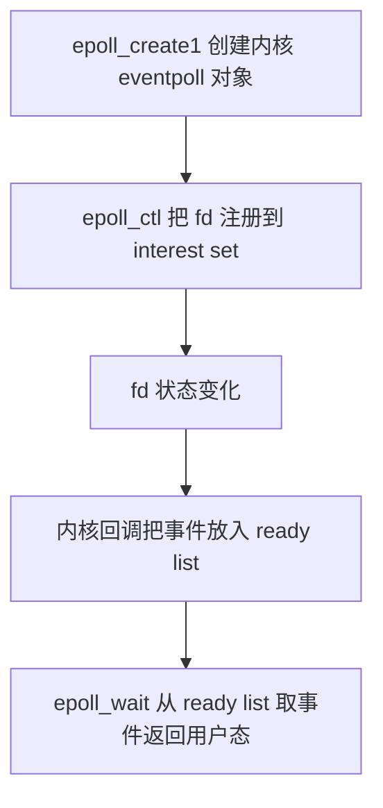

---

## epoll 和 select/poll 的本质差别

**🎯 select/poll 是“每轮询问所有 fd”，epoll 是“先注册，后收事件”**

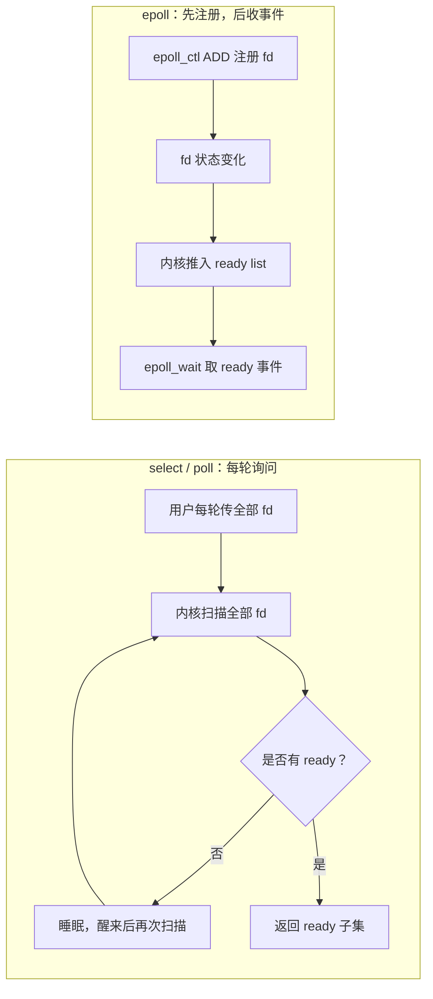

对比图：

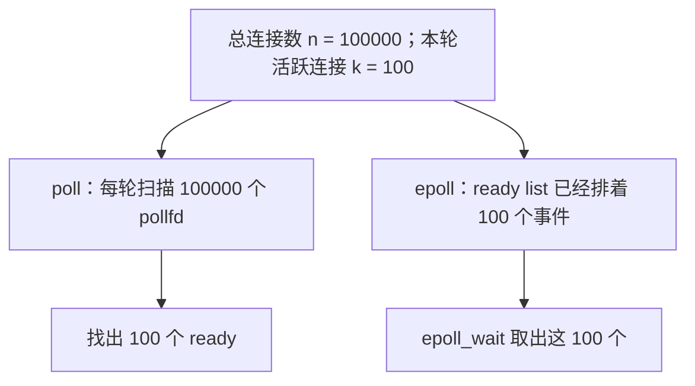

所以 epoll 的优势不是“单个 fd 的 I/O 更快”，而是**避免在大量空闲连接上反复做无用扫描**。

---

## 三个核心接口

## epoll_create1：创建 epoll instance

**🎯 epfd 是事件中心的 fd**

```c
#include <sys/epoll.h>

int epoll_create1(int flags);
```

常用写法：

```c
int epfd = epoll_create1(EPOLL_CLOEXEC);
if (epfd < 0) {
    perror("epoll_create1");
}
```

`epfd` 背后不是普通文件，而是一个内核事件管理对象。可以把它理解成：

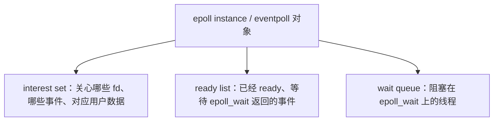

`EPOLL_CLOEXEC` 表示执行 `execve` 时自动关闭，避免 fd 泄漏到子进程。

---

## epoll_ctl：维护兴趣集合

**🎯 ADD / MOD / DEL 操作的是内核长期保存的 interest set**

```c
int epoll_ctl(int epfd, int op, int fd, struct epoll_event *event);
```

常见操作：

| 操作 | 含义 |
|---|---|
| `EPOLL_CTL_ADD` | 把 fd 加入 epoll 兴趣集合 |
| `EPOLL_CTL_MOD` | 修改 fd 关注的事件或用户数据 |
| `EPOLL_CTL_DEL` | 从兴趣集合删除 fd |

事件结构：

```c
struct epoll_event {
    uint32_t events;   // EPOLLIN / EPOLLOUT / EPOLLRDHUP / EPOLLET 等事件标志
    epoll_data_t data; // 用户自定义数据，epoll_wait 返回时原样带回
};
```

常用 `events` 标志：

| 事件 | 常见位置 | 含义 | 处理要点 |
|---|---|---|---|
| `EPOLLIN` | 注册 / 返回 | fd 可读；监听 socket 上表示可 `accept`，已连接 socket 上表示可 `read` | 监听 socket 调 `accept`；连接 socket 调 `read`，并处理 `read == 0` |
| `EPOLLOUT` | 注册 / 返回 | fd 可写；发送缓冲区有空间 | 不要默认一直注册，只有存在待发送数据且写不完时才打开 |
| `EPOLLERR` | 主要看返回 | fd 上有错误 | 即使没注册也可能返回；通常关闭 fd 或读取错误状态后关闭 |
| `EPOLLHUP` | 主要看返回 | fd 挂起/连接不可继续 | 即使没注册也可能返回；通常关闭 fd |
| `EPOLLRDHUP` | 注册 / 返回 | 对端关闭写方向，本端读方向 hang up | TCP 对端 `close` 或 `shutdown(SHUT_WR)` 常见；可能和 `EPOLLIN` 同时出现 |
| `EPOLLET` | 注册 | Edge Triggered，边缘触发模式 | 必须配合 nonblocking，并循环读写到 `EAGAIN` |
| `EPOLLONESHOT` | 注册 | 事件触发一次后自动禁用该 fd | 多线程 reactor 常用；处理完后要 `EPOLL_CTL_MOD` 重新 arm |

**⚠️ `EPOLLRDHUP` 不等于“缓冲区已经空了”**

对端关闭写方向时，本端可能同时收到：

```c
EPOLLIN | EPOLLRDHUP
```

这表示：接收缓冲区里可能还有数据可读，但读完后会到 EOF。生产代码通常先处理 `EPOLLIN` 把数据读完，再根据 `EPOLLRDHUP` 决定关闭或进入半关闭状态；教学版 echo server 可以简化为遇到 `EPOLLRDHUP` 就关闭连接。

常见注册：

```c
struct epoll_event ev;
ev.events = EPOLLIN | EPOLLRDHUP;
ev.data.fd = connfd;

if (epoll_ctl(epfd, EPOLL_CTL_ADD, connfd, &ev) < 0) {
    perror("epoll_ctl ADD");
}
```

`data` 是用户自定义字段。简单程序常用：

```c
ev.data.fd = connfd;
```

复杂服务器更常用：

```c
ev.data.ptr = conn;   // 指向连接对象，里面保存 fd、缓冲区、状态机
```

**⚠️ `event.data` 会原样返回给你**

`epoll_wait` 返回事件时，内核并不理解你的业务状态，只把注册时的 `data` 带回来：


---

## epoll_wait：取 ready list 中的事件

**🎯 epoll_wait 返回的是事件数组，不是让你再扫描全部 fd**

```c
int epoll_wait(int epfd,
               struct epoll_event *events,
               int maxevents,
               int timeout);
```

参数含义：

| 参数 | 含义 |
|---|---|
| `epfd` | epoll instance fd |
| `events` | 用户提供的输出数组 |
| `maxevents` | 最多返回多少个事件，必须 `> 0` |
| `timeout` | `-1` 永久等，`0` 立即返回，正数限时等，单位毫秒 |

典型写法：

```c
#define MAX_EVENTS 1024

struct epoll_event events[MAX_EVENTS];

while (1) {
    int n = epoll_wait(epfd, events, MAX_EVENTS, -1);
    if (n < 0) {
        if (errno == EINTR) {
            continue;
        }
        break;
    }

    for (int i = 0; i < n; ++i) {
        int fd = events[i].data.fd;
        uint32_t ev = events[i].events;
        // 处理 fd 上的事件
    }
}
```

返回值：

| 返回值 | 含义 |
|---|---|
| `> 0` | 返回的 ready event 数量 |
| `== 0` | 超时 |
| `< 0` | 出错，常见 `EINTR` |

---

## epoll instance 的内部结构直觉

**🎯 interest set + ready list + wait queue**

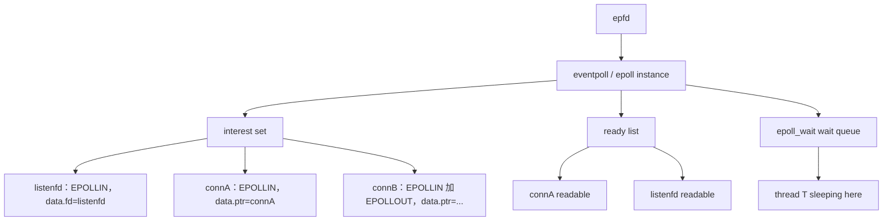

常见资料会说：Linux 内核用红黑树组织 interest set，用链表组织 ready list。对学习来说更重要的是这两个性质：

- `interest set` 长期存在，`epoll_wait` 不需要每轮重传所有 fd。
- `ready list` 只保存已经 ready 的项，`epoll_wait` 不需要扫描所有 fd。

**⚠️ 红黑树不是 epoll 快的唯一答案**

很多文章把 epoll 简化成“红黑树 + 就绪链表”。这个说法有帮助，但别误解：

- 红黑树主要服务 `epoll_ctl ADD/MOD/DEL` 查找和维护兴趣集合；
- 真正让 `epoll_wait` 避免 O(n) 扫描的是 ready list 和等待队列回调；
- 如果大量 fd 同时 ready，`epoll_wait` 仍要处理大量事件，不可能免费。

---

## 运行过程中内核在做什么

## 阶段 1：epoll_ctl ADD 注册 fd

用户态：

```c
ev.events = EPOLLIN;
ev.data.fd = connfd;
epoll_ctl(epfd, EPOLL_CTL_ADD, connfd, &ev);
```

内核大致做：

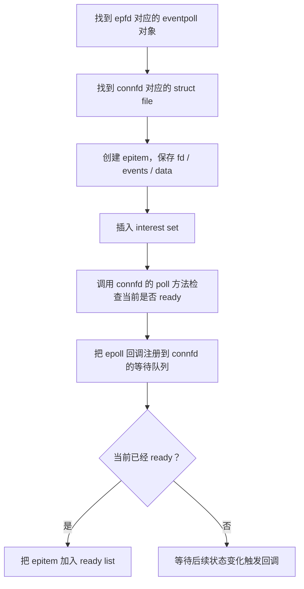

图示：

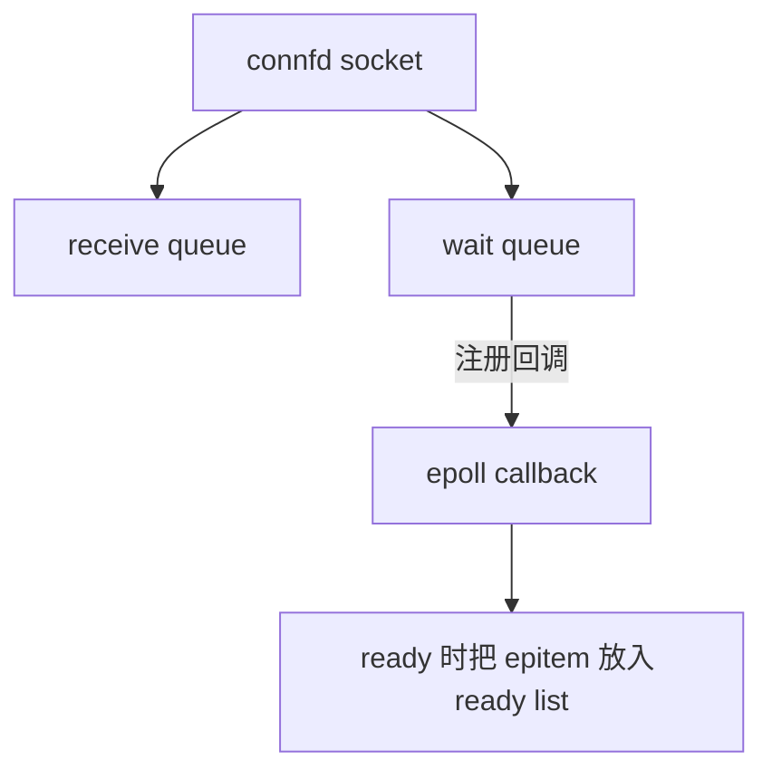

---

## 阶段 2：epoll_wait 睡眠

如果 ready list 为空：

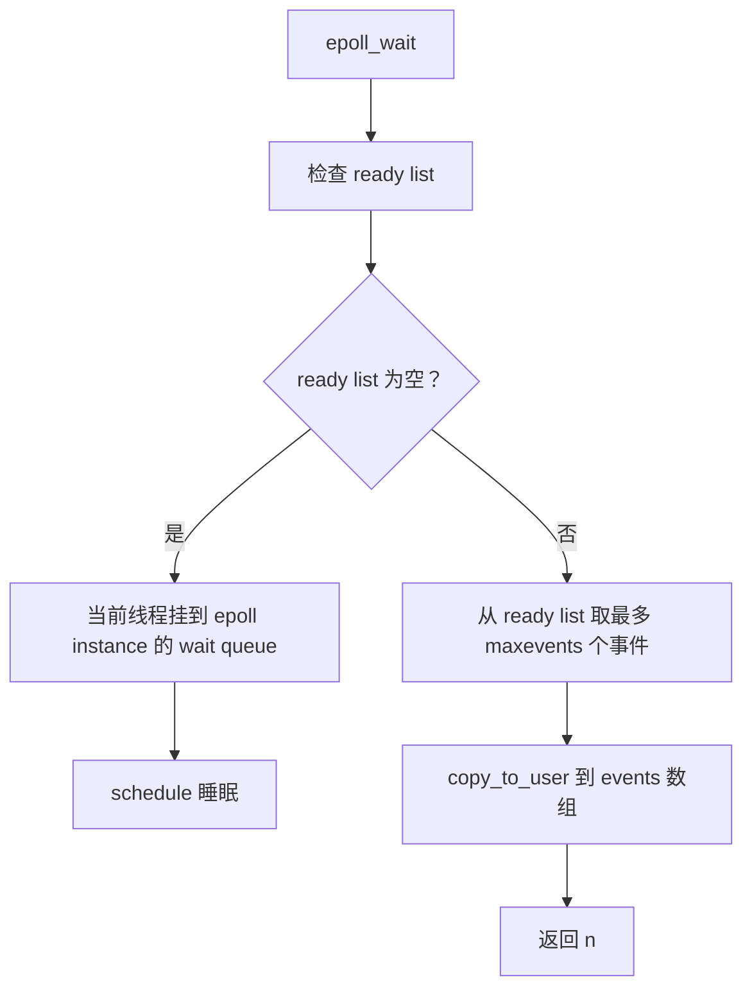

---

## 阶段 3：网络包到达，socket 变 ready

以客户端发送数据为例：

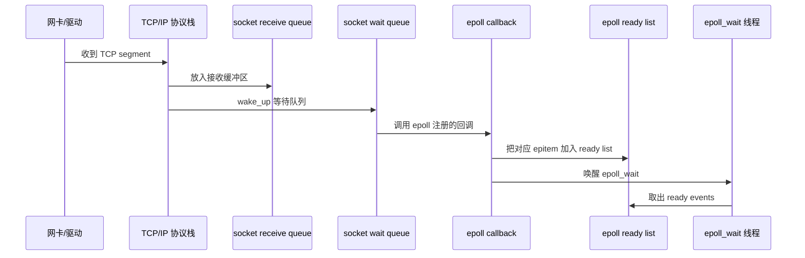

这张时序图的核心链路是：网卡收包后交给 TCP/IP 协议栈，TCP 栈把 payload 放入 socket receive queue，并通过 socket wait queue 调用 epoll 注册的回调；回调把对应 `epitem` 放入 ready list，再唤醒阻塞在 `epoll_wait` 的线程。

**🎯 重点：epoll 是被 socket 的等待队列“反向通知”的**

`select` / `poll` 也会用等待队列睡眠，但它们每次调用都重新登记并全量扫描；`epoll` 的等待队列回调随兴趣集合长期存在，状态变化时主动把事件推入 ready list。

---

## O_NONBLOCK：如何把 fd 设为非阻塞

**🎯 `O_NONBLOCK` 是 fd 的文件状态标志，不是 epoll 事件标志**

不能把 `O_NONBLOCK` 写进 `epoll_event.events`；要用 `fcntl` 修改 fd 自身的状态：

```c
#include <fcntl.h>

static int set_nonblocking(int fd) {
    int flags = fcntl(fd, F_GETFL, 0);
    if (flags < 0) {
        return -1;
    }

    if ((flags & O_NONBLOCK) != 0) {
        return 0;  // 已经是非阻塞模式
    }

    return fcntl(fd, F_SETFL, flags | O_NONBLOCK);
}
```

调用方式：

```c
if (set_nonblocking(fd) < 0) {
    perror("set_nonblocking");
    close(fd);
}
```

**⚠️ 必须先 `F_GETFL`，再按位或上 `O_NONBLOCK`**

下面这种写法会覆盖 fd 已有的其他文件状态标志，不推荐：

```c
fcntl(fd, F_SETFL, O_NONBLOCK);  // 错误倾向：可能清掉已有状态标志
```

正确操作是：


设置成功后，原本可能等待的 I/O 操作不再让当前线程睡眠。例如当前没有数据时：

```c
ssize_t n = read(fd, buf, sizeof(buf));
if (n < 0 && (errno == EAGAIN || errno == EWOULDBLOCK)) {
    // 现在没有数据，不是连接错误；返回事件循环处理其他 fd
}
```

常见操作在非阻塞模式下的结果：

| 操作 | 当前无法立即完成时的典型结果 |
|---|---|
| `read` / `recv` | 返回 `-1`，`errno` 为 `EAGAIN` 或 `EWOULDBLOCK` |
| `write` / `send` | 可能只写一部分；完全无法写时返回 `-1/EAGAIN` |
| `accept` / `accept4` | accept queue 为空时返回 `-1/EAGAIN` |
| `connect` | 常见返回 `-1/EINPROGRESS`，之后监听可写事件并检查 `SO_ERROR` |

**🎯 创建 fd 时也可以直接指定非阻塞**

Linux 为多种 fd 提供了创建时标志，可以避免“先创建、后设置”之间的窗口：

```c
int listenfd = socket(AF_INET,
                      SOCK_STREAM | SOCK_NONBLOCK | SOCK_CLOEXEC,
                      0);

int connfd = accept4(listenfd, NULL, NULL,
                     SOCK_NONBLOCK | SOCK_CLOEXEC);
```

两行代码设置的对象不同：

- `socket(..., SOCK_NONBLOCK, ...)` 设置新创建的 `listenfd`；
- `accept4(..., SOCK_NONBLOCK)` 设置本次返回的 `connfd`；
- 在 Linux 上，`accept` 返回的 socket **不会自动继承** `listenfd` 的 `O_NONBLOCK`，所以应使用 `accept4(..., SOCK_NONBLOCK)`，或在 `accept` 后对 `connfd` 调用 `set_nonblocking`。

如果 `listenfd` 已由封装函数创建，可以这样组合：

```c
int listenfd = open_serverfd(port);
if (listenfd < 0 || set_nonblocking(listenfd) < 0) {
    perror("open/set_nonblocking listenfd");
    // 清理并退出
}

while (1) {
    int connfd = accept4(listenfd, NULL, NULL,
                         SOCK_NONBLOCK | SOCK_CLOEXEC);
    if (connfd >= 0) {
        // 注册 connfd
        continue;
    }
    if (errno == EINTR) {
        continue;
    }
    if (errno == EAGAIN || errno == EWOULDBLOCK) {
        break;  // 当前 accept queue 已经取空
    }
    perror("accept4");
    break;
}
```

**⚠️ `O_NONBLOCK`、`FD_CLOEXEC` 和 `EPOLLET` 属于三类不同标志**

| 标志 | 设置位置 | 作用 |
|---|---|---|
| `O_NONBLOCK` | `fcntl(fd, F_SETFL, ...)`，或创建时的 `SOCK_NONBLOCK` | I/O 暂时不能完成时立即返回，不阻塞线程 |
| `FD_CLOEXEC` | `fcntl(fd, F_SETFD, ...)`，或创建时的 `SOCK_CLOEXEC` | `execve` 时自动关闭 fd |
| `EPOLLET` | `epoll_event.events` | 让 epoll 使用边缘触发通知 |

因此 ET 注册通常同时涉及两步：

```c
set_nonblocking(connfd);             // 改 fd 的 I/O 行为
add_epoll_fd(epfd, connfd,
             EPOLLIN | EPOLLET);     // 改 epoll 的通知方式
```

`O_NONBLOCK` 本身不会让 fd 自动加入 epoll，也不会把 LT 改成 ET；它只保证事件处理函数在读空、写满或连接队列取空时能够以 `EAGAIN` 返回事件循环。

**⚠️ `O_NONBLOCK` 关联的是 open file description**

通过 `dup` 得到的 fd，或 `fork` 后父子进程持有的同一打开文件描述，通常共享 `O_NONBLOCK` 状态；对其中一个 fd 修改该标志，可能影响另一个 fd。若只想让某一次 socket 调用非阻塞，可考虑 `recv` / `send` 的 `MSG_DONTWAIT`，它只作用于当前调用。

---

## LT：Level Triggered，水平触发

**🎯 默认模式：只要状态仍 ready，就会反复提醒**

```c
ev.events = EPOLLIN;   // 默认 LT
```

例子：

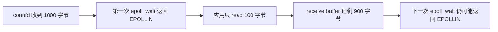

优点：

- 编程简单；
- 不容易漏事件；
- 和 `select` / `poll` 的 ready 语义接近。

缺点：

- 如果一直不把 fd 处理干净，会反复被提醒；
- 在大量 ready fd 下可能产生重复通知。

教学建议：**先用 LT 写通 echo server，再学习 ET。**

---

## ET：Edge Triggered，边缘触发

**🎯 边缘触发只在状态变化时提醒，必须配合 nonblocking + 读写到 EAGAIN**

```c
ev.events = EPOLLIN | EPOLLET;
```

状态变化示意：

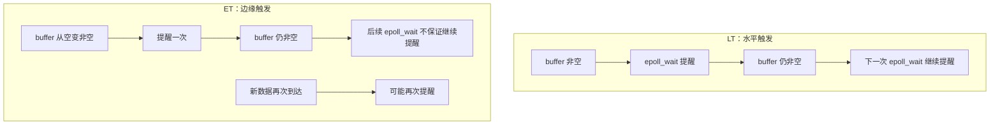

错误写法：

```c
// ET 模式下只读一次，可能把剩余数据永远留在缓冲区里
ssize_t n = read(fd, buf, sizeof(buf));
```

正确原则：

`ET + O_NONBLOCK + while read/write until EAGAIN`

读路径例子：

```c
while (1) {
    char buf[4096];
    ssize_t n = read(fd, buf, sizeof(buf));
    if (n > 0) {
        // 处理 buf[0..n)
    } else if (n == 0) {
        // 对端有序关闭
        close(fd);
        break;
    } else {
        if (errno == EAGAIN || errno == EWOULDBLOCK) {
            // 已经读空，本轮处理完成
            break;
        }
        if (errno == EINTR) {
            continue;
        }
        close(fd);
        break;
    }
}
```

为什么必须非阻塞？

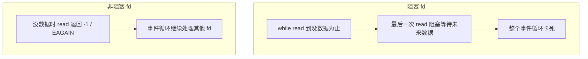

---

## EPOLLONESHOT：触发一次后自动禁用

**🎯 多线程 reactor 常用，避免多个线程同时处理同一连接**

```c
ev.events = EPOLLIN | EPOLLONESHOT;
```

语义：

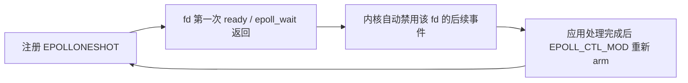

重新激活：

```c
struct epoll_event ev;
ev.events = EPOLLIN | EPOLLONESHOT;
ev.data.ptr = conn;
epoll_ctl(epfd, EPOLL_CTL_MOD, conn->fd, &ev);
```

适用场景：

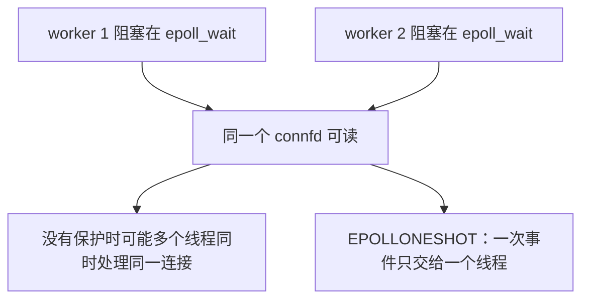

单线程教学 echo server 通常不需要 `EPOLLONESHOT`。

---

## epoll 版 echo server 结构

**🎯 推荐从 LT + nonblocking 开始**

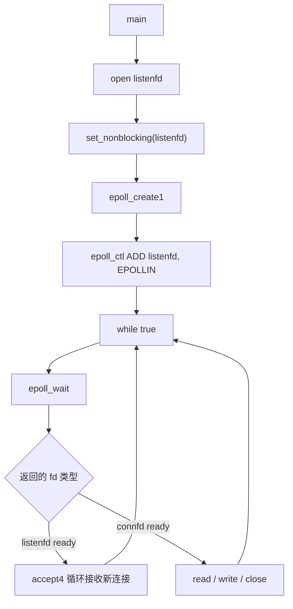

**🔧 最小骨架：LT echo server**

```c
#include <errno.h>
#include <fcntl.h>
#include <sys/epoll.h>
#include <unistd.h>

#define MAX_EVENTS 1024
#define MAXLINE 8192

static int set_nonblocking(int fd) {
    int flags = fcntl(fd, F_GETFL, 0);
    if (flags < 0) {
        return -1;
    }
    return fcntl(fd, F_SETFL, flags | O_NONBLOCK);
}

static void add_epoll_fd(int epfd, int fd, uint32_t events) {
    struct epoll_event ev;
    ev.events = events;
    ev.data.fd = fd;
    epoll_ctl(epfd, EPOLL_CTL_ADD, fd, &ev);
}

static void close_conn(int epfd, int fd) {
    epoll_ctl(epfd, EPOLL_CTL_DEL, fd, NULL);
    close(fd);
}

void epoll_echo_loop(int listenfd) {
    int epfd = epoll_create1(EPOLL_CLOEXEC);
    set_nonblocking(listenfd);
    add_epoll_fd(epfd, listenfd, EPOLLIN);

    struct epoll_event events[MAX_EVENTS];

    while (1) {
        int n = epoll_wait(epfd, events, MAX_EVENTS, -1);
        if (n < 0) {
            if (errno == EINTR) {
                continue;
            }
            break;
        }

        for (int i = 0; i < n; ++i) {
            int fd = events[i].data.fd;
            uint32_t ev = events[i].events;

            if (fd == listenfd) {
                while (1) {
                    int connfd = accept4(listenfd, NULL, NULL,
                                         SOCK_NONBLOCK | SOCK_CLOEXEC);
                    if (connfd >= 0) {
                        add_epoll_fd(epfd, connfd, EPOLLIN | EPOLLRDHUP);
                        continue;
                    }
                    if (errno == EAGAIN || errno == EWOULDBLOCK) {
                        break;
                    }
                    if (errno == EINTR) {
                        continue;
                    }
                    break;
                }
                continue;
            }

            if (ev & (EPOLLERR | EPOLLHUP | EPOLLRDHUP)) {
                close_conn(epfd, fd);
                continue;
            }

            if (ev & EPOLLIN) {
                char buf[MAXLINE];
                ssize_t nr = read(fd, buf, sizeof(buf));
                if (nr > 0) {
                    ssize_t off = 0;
                    while (off < nr) {
                        ssize_t nw = write(fd, buf + off, (size_t)(nr - off));
                        if (nw > 0) {
                            off += nw;
                        } else if (nw < 0 && errno == EINTR) {
                            continue;
                        } else if (nw < 0 && (errno == EAGAIN || errno == EWOULDBLOCK)) {
                            // 生产版应缓存剩余数据，并注册 EPOLLOUT。
                            break;
                        } else {
                            close_conn(epfd, fd);
                            break;
                        }
                    }
                } else if (nr == 0) {
                    close_conn(epfd, fd);
                } else if (errno != EAGAIN && errno != EWOULDBLOCK && errno != EINTR) {
                    close_conn(epfd, fd);
                }
            }
        }
    }

    close(epfd);
}
```

**⚠️ 为什么 listenfd 要循环 accept 到 EAGAIN**

即使是 LT，循环 `accept4` 也更稳；如果改成 ET，就必须循环。

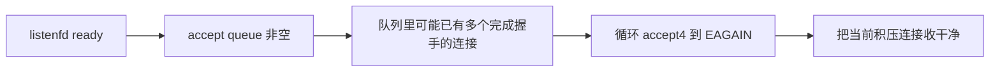

---

## EPOLLOUT 与写缓冲区

**⚠️ 不要默认一直监听 EPOLLOUT**

socket 大多数时候是可写的。如果一直注册：

```c
ev.events = EPOLLIN | EPOLLOUT;
```

`epoll_wait` 可能持续返回 `EPOLLOUT`，造成 busy loop。

正确状态机：

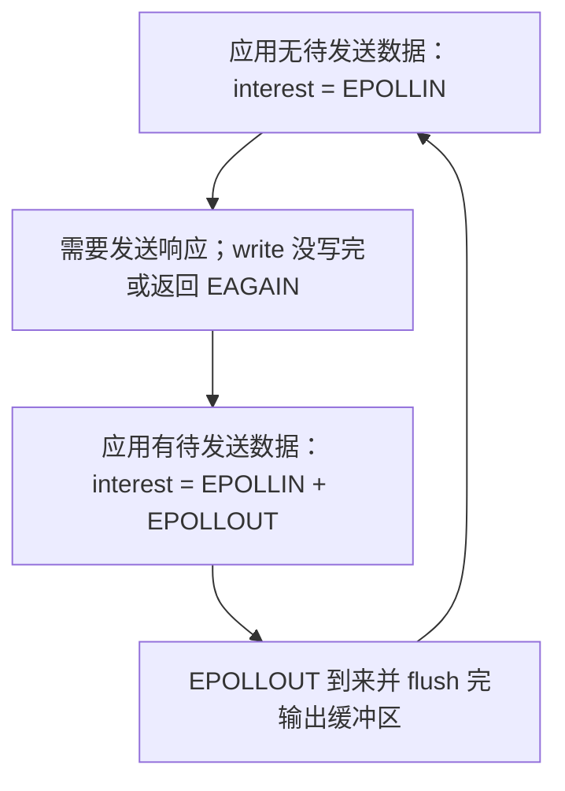

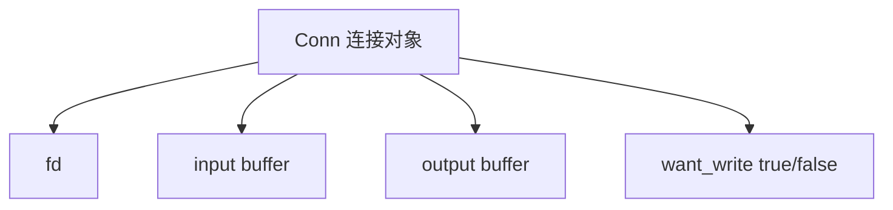

这就是真实 reactor 网络库必须维护连接对象的原因：fd 只是内核句柄，业务层还需要缓冲区和状态机。

---

## 复杂度和适用场景

**🎯 记住 n 和 k 的区别**

- `n`：`epoll` 管理的总 fd 数。
- `k`：本次 `epoll_wait` 返回的 ready 事件数。

复杂度直觉：

| 操作 | 复杂度直觉 | 说明 |
|---|---|---|
| `epoll_ctl ADD/MOD/DEL` | 近似 `O(log n)` | 维护 interest set |
| `epoll_wait` | 近似 `O(k)` | 从 ready list 返回事件 |
| 实际业务处理 | 取决于读写量 | 读写数据本身仍要花时间 |

适合 epoll 的典型场景：

```mermaid
flowchart LR
    A["大量长连接"] --> B["大部分时间空闲"]
    B --> C["少量连接同时活跃"]
    C --> D["适合 epoll"]
```

例如：

- HTTP keep-alive 连接；
- WebSocket / IM 长连接；
- 代理服务器；
- RPC 网关；
- Redis/Nginx 这类事件驱动服务。

不必过度使用的场景：

- fd 数量很少；
- 逻辑主要卡在 CPU 计算；
- 每个连接都有大量连续数据要处理；
- 跨平台优先而不想绑定 Linux。

这时 `poll` 或线程池也可能足够简单。

---

## 常见易错点

- **以为 epoll 会帮你读写数据 → epoll 只告诉你 fd ready，真正的 `read`/`write` 仍由用户态完成。**
- **为了性能盲目使用 ET → 默认优先 LT；只有能保证 nonblocking、循环读写到 `EAGAIN`、并维护完整连接缓冲区和状态机时，才考虑 ET。**
- **ET 模式只读一次 → 必须 nonblocking 并循环读到 `EAGAIN`，否则可能漏掉缓冲区剩余数据。**
- **ET 模式 listenfd 只 `accept` 一次 → 必须循环 `accept4` 到 `EAGAIN`，否则 accept queue 里可能残留连接。**
- **忘记设置非阻塞 → ET 读写到“没数据”为止时会阻塞整个事件循环。**
- **一直监听 `EPOLLOUT` → socket 常态可写，会造成高频空转。**
- **忽略 `EPOLLERR` / `EPOLLHUP` / `EPOLLRDHUP` → 连接关闭和错误路径处理不完整，容易 fd 泄漏。**
- **`read == 0` 当成没读到数据 → TCP 中这表示对端有序关闭，应关闭连接。**
- **关闭 fd 后仍处理旧事件 → fd 数字可能复用，复杂服务器应使用 `data.ptr` 和连接 generation 标记。**
- **认为 epoll 永远比 poll 快 → fd 很少或全部 fd 都很活跃时，epoll 的优势不明显。**
- **把“红黑树”当成全部原理 → epoll_wait 快的关键是 ready list + 等待队列回调，不是每轮查红黑树。**

---

## 工程关联

- **Nginx/Redis/Node.js/libuv 的事件驱动主循环**：Linux 后端普遍依赖 `epoll`，上层抽象成 callback / event loop / reactor。
- **LT / ET 的工程选择**：教学 demo、业务第一版、状态机还不完整时优先用 LT；LT 更稳，不容易因为少读一次而漏事件。
- **ET 的使用前提**：只有所有 fd 都是 nonblocking，并且 `EPOLLIN`/`EPOLLOUT` 路径都能循环处理到 `EAGAIN`，同时每个连接都有输入/输出缓冲区时，才适合使用 `EPOLLET`。
- **ET 不是单次 I/O 更快**：ET 的收益主要是减少“状态仍 ready”导致的重复通知；真正的 `read`/`write` 数据搬运成本不会因为 ET 消失。
- **多线程 reactor 不只靠 ET**：多个 worker 同时 `epoll_wait` 时，如果担心同一个连接被多个线程并发处理，应考虑 `EPOLLONESHOT` + 处理完后 `EPOLL_CTL_MOD` 重新 arm。
- **百万连接问题的本质**：不是让每个连接更快，而是让空闲连接几乎不消耗扫描成本；瓶颈会转移到内存、fd 限制、协议状态、业务处理。
- **`eventfd` / `timerfd` / `signalfd` 融合事件源**：线程通知、定时器、信号都能变成 fd 放入 epoll，统一进一个事件循环。
- **背压与慢客户端**：生产服务器必须维护输出缓冲区，只在需要时打开 `EPOLLOUT`，否则慢客户端会拖垮内存或事件循环。
- **排障工具**：`strace -e epoll_wait,epoll_ctl` 看事件循环阻塞/唤醒；`ss -tnp` 看连接状态；`ls /proc/<pid>/fd | wc -l` 看 fd 数量；`perf top` 看是否忙在事件循环。

---

## 建议实验

**🧪 题 1：LT 模式下不读完会反复触发**

要求：

1. 写 epoll LT echo server。
2. 客户端一次发送 1000 字节。
3. 服务端每次 `read(fd, buf, 10)` 只读 10 字节。
4. 观察后续 `epoll_wait` 会继续返回同一个 fd。
5. 解释“水平触发看的是当前状态”。

**🧪 题 2：ET 模式只读一次导致残留数据**

要求：

1. 把注册事件改为 `EPOLLIN | EPOLLET`。
2. 服务端仍然每次只 `read` 一次 10 字节。
3. 客户端发送 1000 字节后不再发送。
4. 观察剩余数据可能不再触发新的事件。
5. 修改为 nonblocking + 循环 read 到 `EAGAIN` 后验证修复。

**🧪 题 3：listenfd 在 ET 下必须 accept 到 EAGAIN**

要求：

1. listenfd 使用 `EPOLLIN | EPOLLET`。
2. 服务端每次事件只 `accept4` 一次。
3. 同时启动多个客户端连接。
4. 观察部分连接可能停留在 accept queue，直到下一次边缘事件才被处理。
5. 改成 `while accept4(...)` 到 `EAGAIN` 后验证。

**🧪 题 4：strace 观察 epoll_ctl 和 epoll_wait**

```bash
strace -tt -e trace=epoll_create1,epoll_ctl,epoll_wait,accept4,read,write ./epoll_server 8080
```

要求：

1. 启动服务器，观察 `epoll_create1` 和 `epoll_ctl ADD listenfd`。
2. 客户端连接后，观察 `epoll_wait` 返回 listenfd，随后 `accept4` 和 `epoll_ctl ADD connfd`。
3. 客户端发送数据后，观察 `epoll_wait` 返回 connfd，随后 `read/write`。
4. 客户端关闭后，观察服务端关闭连接并 `EPOLL_CTL_DEL`。

**🧪 题 5：eventfd 唤醒 epoll 主循环**

源码片段：

```c
int efd = eventfd(0, EFD_NONBLOCK | EFD_CLOEXEC);
add_epoll_fd(epfd, efd, EPOLLIN);

uint64_t one = 1;
write(efd, &one, sizeof(one));
```

要求：

1. 主线程把 `eventfd` 加入 epoll。
2. 另一个线程写 `eventfd`。
3. 主线程 `epoll_wait` 被唤醒后读取 `uint64_t` 计数。
4. 解释为什么很多网络库用 eventfd 做跨线程唤醒。
