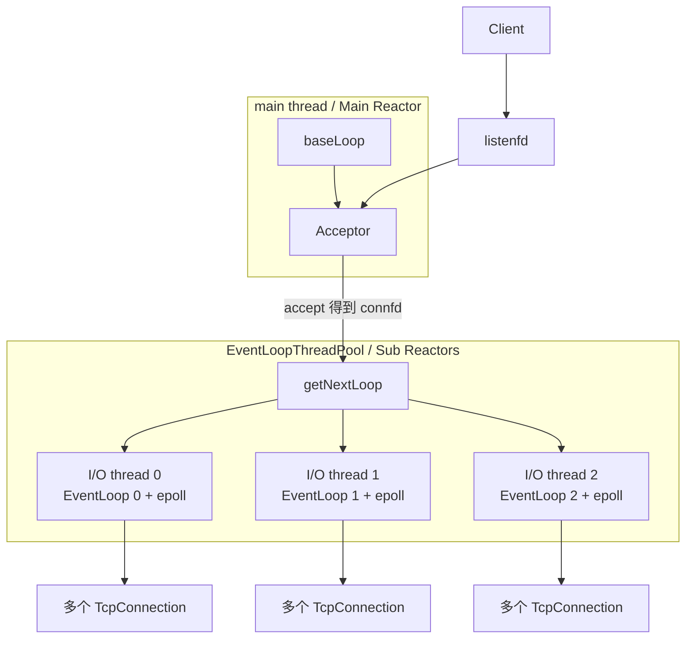
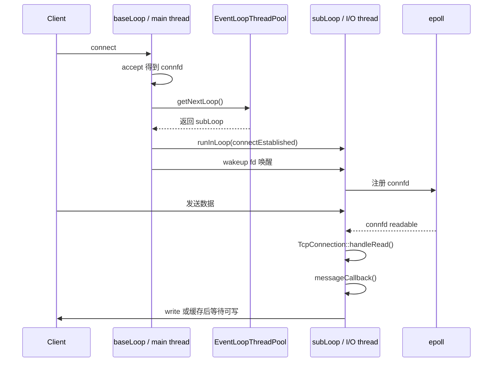
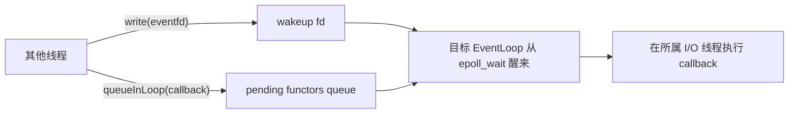
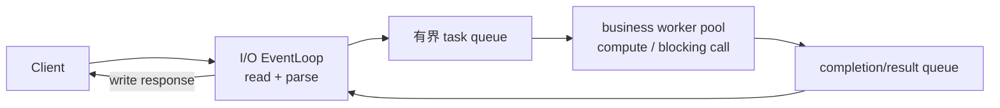

# Muduo：one loop per thread + thread pool 模型

Muduo 的网络并发模型可以概括为：**每个 I/O 线程运行且只运行一个 `EventLoop`，多个 I/O 线程组成 `EventLoopThreadPool`；每条 TCP 连接建立后固定归属于其中一个 `EventLoop`。** 这种设计既能通过多个事件循环利用多核，又能让单条连接保持清晰的单线程所有权。

一句话定义：

> 主线程中的 `baseLoop` 负责监听和接受新连接，`EventLoopThreadPool` 中的多个 I/O loop 负责已连接 socket 的读写；一条连接一旦分配给某个 loop，其 I/O、缓冲区、事件注册和生命周期状态原则上都由该 loop 所在线程串行管理。

---

## 先区分三个容易混淆的概念

**🎯 `one loop per thread` 不是一个连接一个线程**

它表示：

```text
一个 I/O 线程  <->  一个 EventLoop  <->  一个 epoll instance
一个 EventLoop  <->  管理很多 TcpConnection
```

而不是：

```text
一个 TcpConnection  <->  一个线程
```

例如：

```text
main thread
└── baseLoop
    └── listenfd：负责 accept

I/O thread 0
└── EventLoop 0
    ├── connection 1
    ├── connection 4
    └── connection 7

I/O thread 1
└── EventLoop 1
    ├── connection 2
    ├── connection 5
    └── connection 8

I/O thread 2
└── EventLoop 2
    ├── connection 3
    ├── connection 6
    └── connection 9
```

即使服务器维护十万条连接，I/O 线程通常仍然只有若干个，而不是创建十万个线程。

**🎯 `EventLoopThreadPool` 不是普通业务线程池**

Muduo 的 `EventLoopThreadPool` 是 **I/O 事件循环线程池**：

- 每个线程内部都有一个 `EventLoop`；
- 每个 `EventLoop` 都会调用 `poll` 或 `epoll_wait`；
- 线程负责 socket I/O、连接状态和网络回调。

普通业务 worker pool 则用于：

- CPU 密集计算；
- 阻塞数据库调用；
- 慢磁盘操作；
- 第三方阻塞 RPC。

两者可以同时存在，但职责不同。

**🎯 “连接属于某个 loop”不等于其他线程不能调用连接接口**

其他线程可以发起 `send`、关闭连接等请求，但不能绕过连接所属的 `EventLoop` 随意修改其内部 I/O 状态。跨线程操作通常要通过 `runInLoop` 或 `queueInLoop` 投递给所属线程执行。

---

## Muduo 中的核心组件

**🎯 类与 Reactor 角色的对应关系**

| Muduo 类 | 主要职责 | Reactor 中的角色 |
|---|---|---|
| `EventLoop` | 执行事件循环、分发事件、运行待执行回调 | Reactor / Dispatcher |
| `Poller` / `EPollPoller` | 封装 `poll` 或 `epoll` | Demultiplexer |
| `Channel` | 封装一个 fd、关注事件和事件回调 | Handle + Event Handler |
| `Acceptor` | 管理监听 socket，处理新连接事件 | AcceptHandler |
| `TcpConnection` | 表示一条 TCP 连接及其缓冲区、状态和回调 | Connection Handler / State |
| `EventLoopThread` | 创建线程并在线程中运行一个 `EventLoop` | 一个 I/O 执行单元 |
| `EventLoopThreadPool` | 管理多个 `EventLoopThread` 并分配连接 | Sub-Reactor pool |
| `TcpServer` | 组织 `Acceptor`、连接表和 I/O 线程池 | Server orchestration |

一个 `EventLoopThread` 可以抽象为：

```text
EventLoopThread
    = 一个 OS thread
    + 该线程中的一个 EventLoop
    + 该 EventLoop 使用的 epoll/poll
```

多个这样的线程组成：

```text
EventLoopThreadPool
    ├── EventLoopThread 0
    ├── EventLoopThread 1
    └── EventLoopThread 2
```

---

## 整体架构：主从 Reactor

**🎯 `baseLoop` 负责 accept，I/O loops 负责已连接 socket**

Muduo 的多线程服务器可以看成主从 Reactor：

- **Main Reactor**：主线程中的 `baseLoop`，监听 `listenfd` 并执行 `accept`；
- **Sub Reactors**：I/O 线程池中的多个 `EventLoop`，处理 `connfd` 的 `read/write`；
- **连接分配**：新连接通常按 round-robin 分配给某个 I/O loop；
- **固定归属**：连接分配完成后，一般不会在不同 I/O loop 之间迁移。



如果没有配置额外 I/O 线程，`EventLoopThreadPool::getNextLoop()` 会返回 `baseLoop`，整个服务器就退化为单 Reactor 单线程模型：

```text
baseLoop：accept + read + write + callback
```

---

## `setThreadNum` 表示什么

**🎯 它设置的是额外 I/O loop 的数量**

假设服务器配置：

```cpp
TcpServer server(&loop, listenAddr, "EchoServer");
server.setThreadNum(3);
server.start();
loop.loop();
```

可以把运行结构理解为：

```text
main thread：baseLoop，主要负责 listenfd 和 accept
I/O thread 0：EventLoop 0
I/O thread 1：EventLoop 1
I/O thread 2：EventLoop 2
```

因此通常共有四个与网络事件循环相关的线程：一个主线程和三个额外 I/O 线程。

新连接的分配大致为：

```text
connection A -> EventLoop 0
connection B -> EventLoop 1
connection C -> EventLoop 2
connection D -> EventLoop 0
connection E -> EventLoop 1
```

这种 round-robin 主要平衡连接数量，并不保证每个 loop 的实际 CPU、流量或回调负载完全相同。

---

## 一条连接从建立到收发数据的完整过程

**🎯 第一步：`baseLoop` 接受新连接**

客户端完成 TCP 三次握手后，监听 socket 变为 readable：

```text
baseLoop 的 epoll_wait 返回
    ↓
Acceptor 对应的 Channel 分发事件
    ↓
Acceptor::handleRead()
    ↓
accept()/accept4()
    ↓
得到 connfd
```

这个阶段发生在运行 `baseLoop` 的主线程中。

**🎯 第二步：为新连接选择 I/O loop**

`TcpServer` 从 `EventLoopThreadPool` 选择一个 sub-loop，逻辑可抽象为：

```cpp
EventLoop* ioLoop = threadPool_->getNextLoop();
```

然后使用这个 `ioLoop` 创建 `TcpConnection`：

```cpp
auto conn = std::make_shared<TcpConnection>(
    ioLoop,
    connName,
    sockfd,
    localAddr,
    peerAddr);
```

这里传入的 `ioLoop` 决定了连接今后的线程归属。

**🎯 第三步：把连接注册到目标 loop**

创建连接时当前代码通常仍在主线程，而目标 `ioLoop` 可能属于另一个 I/O 线程。主线程不能直接跨线程修改目标 loop 的 `Poller`，所以会把连接建立操作投递过去：

```cpp
ioLoop->runInLoop([conn] {
    conn->connectEstablished();
});
```

目标 loop 随后在自己的线程中完成：

```text
TcpConnection::connectEstablished()
    ↓
更新连接状态
    ↓
Channel::tie(...)
    ↓
Channel::enableReading()
    ↓
epoll_ctl(EPOLL_CTL_ADD/MOD, connfd, ...)
```

如果目标线程正在阻塞于 `epoll_wait`，`EventLoop` 会通过 wakeup fd 将其唤醒。

**🎯 第四步：后续 I/O 在所属线程处理**

假设连接被分配给 `EventLoop 0`：

```text
EventLoop 0 的 epoll_wait
    ↓
connfd readable
    ↓
Channel::handleEvent()
    ↓
TcpConnection::handleRead()
    ↓
从 socket 读取到 inputBuffer
    ↓
调用 messageCallback
```

后续与该连接有关的主要可变状态都应由 `EventLoop 0` 所在线程管理：

- socket 的 `read/write`；
- 输入缓冲区和输出缓冲区；
- `Channel` 的关注事件；
- `EPOLLOUT` 的启停；
- 连接状态变化；
- 关闭流程和资源释放。

完整时序如下：



---

## `EventLoop` 为什么具有线程亲和性

**🎯 一个 `EventLoop` 是一个单线程串行执行域**

`EventLoop` 在某个线程中创建并运行后，就与该线程绑定。它通常会记录所属线程的 thread id，并通过断言检查关键操作是否发生在正确线程。

基本约束是：

1. 一个线程最多运行一个活跃的 `EventLoop`；
2. `EventLoop::loop()` 必须在所属线程中执行；
3. `Channel` 的事件注册和更新必须由所属 loop 串行处理；
4. `TcpConnection` 的 I/O 状态原则上只由所属 loop 线程修改。

一个 loop 内的执行顺序大致是：

```text
epoll_wait
    ↓
依次处理 active Channels
    ├── handleRead(connection A)
    ├── handleWrite(connection B)
    └── handleClose(connection C)
    ↓
执行 pending functors
    ↓
再次 epoll_wait
```

同一个 loop 不会同时执行两个 callback，所以该 loop 所拥有的连接状态通常不需要为“loop 内部并发”加锁。

---

## 为什么一条连接要固定归属于一个 EventLoop

**🎯 核心目的是单一所有权，而不只是负载分配**

如果多个线程都能直接操作同一个 `TcpConnection`，会马上出现以下竞争：

```text
线程 A：读取并修改 inputBuffer
线程 B：关闭并释放连接

线程 A：向 outputBuffer 追加响应 1
线程 B：向 outputBuffer 追加响应 2

线程 A：启用 EPOLLOUT
线程 B：停用 EPOLLOUT
```

这将迫使实现给下列状态增加复杂同步：

- 连接状态；
- 输入、输出缓冲区；
- `Channel` 的事件掩码；
- `epoll_ctl` 更新顺序；
- 响应发送顺序；
- 对象引用计数和关闭流程。

Muduo 采用的边界是：

```text
连接 A 的全部可变 I/O 状态
             ↓
只由 EventLoop 0 的线程直接修改
```

于是同一连接上的操作自然串行化：

```text
read -> parse -> callback -> append output -> write
```

这种设计带来几个直接收益：

- 大幅减少连接级锁；
- 避免多个线程并发修改输出缓冲区；
- 更容易维持同一连接上的事件顺序；
- 简化 `EPOLLOUT` 的注册和取消；
- 简化关闭、错误处理和对象生命周期；
- 让网络代码接近单线程状态机，便于推理和排障。

---

## 跨线程操作：`runInLoop`、`queueInLoop` 和 wakeup fd

**🎯 其他线程通过投递任务与 I/O loop 通信**

如果当前代码就在目标 `EventLoop` 所属线程中，可以直接执行操作；否则，应把操作加入目标 loop 的 pending functors 队列。

概念上可以写成：

```cpp
void EventLoop::runInLoop(Functor cb)
{
    if (isInLoopThread()) {
        cb();
    } else {
        queueInLoop(std::move(cb));
    }
}
```

而 `queueInLoop` 的核心步骤是：

```text
其他线程
    ↓
给 pending functors 队列加锁
    ↓
push callback
    ↓
向 wakeup fd 写入数据
    ↓
目标 EventLoop 的 epoll_wait 返回
    ↓
目标线程执行 pending callback
```

Linux 版本通常使用可被 `epoll` 监听的 `eventfd` 作为 wakeup fd。它只负责表达“队列中有新任务”，真正的任务内容保存在用户态队列里。



这里必须保持正确的发布顺序：

```text
先把 callback 放入队列
再写 wakeup fd
```

否则 loop 可能被唤醒时还看不到待执行任务。

---

## 跨线程调用 `TcpConnection::send` 怎么处理

**🎯 公共接口可以跨线程调用，真正写 socket 的操作回到所属 loop**

假设业务线程调用：

```cpp
conn->send(message);
```

内部逻辑可以抽象为：

```cpp
void TcpConnection::send(std::string message)
{
    if (loop_->isInLoopThread()) {
        sendInLoop(message);
    } else {
        loop_->runInLoop([self = shared_from_this(),
                          message = std::move(message)] {
            self->sendInLoop(message);
        });
    }
}
```

控制流是：

```text
业务线程调用 send
    ↓
把发送任务和数据投递给连接所属 EventLoop
    ↓
eventfd 唤醒 I/O 线程
    ↓
I/O 线程执行 sendInLoop
    ↓
尝试 nonblocking write
    ↓
未写完则保存到 outputBuffer 并启用 EPOLLOUT
```

这并不是说 `write` 在操作系统层面只能由 I/O 线程调用，而是为了维持连接的单一所有权和统一状态机。

**⚠️ 跨线程发送时必须关注对象和数据生命周期**

异步投递意味着调用返回时，真正的发送操作可能尚未执行。回调不能捕获很快失效的裸指针或临时 buffer；通常需要：

- 复制或移动待发送数据；
- 使用安全的连接引用；
- 在执行时再次检查连接状态；
- 避免仅凭一个可能被复用的 fd 判断连接身份。

---

## I/O 线程池与业务线程池如何配合

**🎯 网络 callback 默认仍在 I/O loop 中运行**

Muduo 不会因为使用了 `EventLoopThreadPool`，就自动把 `messageCallback` 切换到普通业务 worker pool。

下面的代码仍然运行在连接所属的 I/O 线程中：

```cpp
void onMessage(const TcpConnectionPtr& conn,
               Buffer* input,
               Timestamp receiveTime)
{
    Response response = doSlowDatabaseQuery(); // 阻塞 I/O 线程
    conn->send(response.serialize());
}
```

如果 `doSlowDatabaseQuery()` 阻塞五秒，那么该 EventLoop 管理的其他连接也要等待五秒。

正确的职责划分通常是：

```text
I/O loop
    ├── nonblocking read
    ├── 拆包和基本协议校验
    └── 构造独立业务任务
             ↓
业务 worker pool
    ├── CPU 密集计算
    ├── 阻塞数据库访问
    └── 生成独立响应结果
             ↓
连接所属 I/O loop
    ├── 校验连接仍然有效
    ├── 按协议要求恢复响应顺序
    ├── 追加到 outputBuffer
    └── nonblocking write
```



**⚠️ 业务线程池不能无界接收任务**

生产实现至少还要考虑：

- task queue 容量上限；
- 单连接最大 in-flight 请求数；
- 慢客户端的 output buffer 高水位；
- 任务完成时连接可能已经关闭；
- 同一连接上的响应是否允许乱序；
- CPU 任务与阻塞任务是否应使用不同线程池。

---

## 与其他 Reactor 线程模型的对比

**🎯 单 Reactor 单线程**

```text
一个 EventLoop
    ├── accept
    ├── 所有连接的 read/write
    └── 所有业务 callback
```

优点是最简单、几乎不需要跨线程同步；缺点是不能利用多个 CPU 核，一个慢 callback 会拖住全部连接。

**🎯 单 Reactor + 业务 Worker Pool**

```text
一个 EventLoop
    ├── accept
    ├── 所有连接的 I/O
    └── 把重业务投递到 worker pool
```

它避免重业务阻塞事件循环，但网络 I/O 和连接状态仍由一个线程处理，I/O 分发本身仍是单线程。

**🎯 one loop per thread + I/O thread pool**

```text
一个 baseLoop 负责 accept
多个 I/O EventLoop 分担连接的 read/write
每条连接固定归属于一个 I/O loop
```

它可以让网络 I/O 利用多个 CPU 核，同时保持单连接的单线程语义。

**🎯 完整生产模型**

很多服务会同时使用两种线程池：

```text
一个 baseLoop
    +
多个 I/O EventLoop
    +
一个或多个业务 worker pool
```

即：

```text
Main Reactor：accept
    ↓
Sub Reactors：read / parse
    ↓
Business workers：compute / blocking operation
    ↓
Sub Reactors：write
```

---

## 为什么这种模型适合高并发服务器

**🎯 线程数量不随连接数量增长**

I/O 线程数量通常根据 CPU 核数和实际压测确定，而连接数可以远大于线程数：

```text
少量 I/O 线程
    ↓
每个线程通过 epoll 管理大量连接
```

这样避免了 thread-per-connection 模型中的：

- 大量线程栈内存；
- 高频上下文切换；
- 调度器开销；
- 线程数量随连接数量膨胀。

**🎯 可以利用多核**

多个 I/O loop 可以同时在不同 CPU 上运行：

```text
CPU 0：EventLoop 0
CPU 1：EventLoop 1
CPU 2：EventLoop 2
CPU 3：EventLoop 3
```

不同连接之间可以并行处理。

**🎯 单条连接仍保持串行语义**

虽然服务器整体是多线程的，但具体到一条连接：

```text
connection A 永远由 EventLoop 0 负责
connection B 永远由 EventLoop 1 负责
```

所以连接内部仍然可以按单线程状态机理解，避免把锁扩散到整个网络层。

---

## 局限与工程注意事项

**⚠️ 一个 callback 会阻塞其所在 loop 的所有连接**

假设 `EventLoop 0` 管理连接 A、D、G：

```text
connection A 的 callback 阻塞 5 秒
    ↓
EventLoop 0 无法继续处理事件
    ↓
connection D、G 即使 ready，也只能等待
```

其他 I/O loop 可以继续工作，但当前 loop 上的连接仍会一起出现延迟。因此 I/O callback 必须保持短小、非阻塞。

**⚠️ round-robin 不等于真实负载均衡**

可能出现：

```text
EventLoop 0：1000 个空闲长连接
EventLoop 1：1 个持续高流量连接
```

按连接数量看似均衡，按 CPU 和吞吐量却并不均衡。连接建立后的固定归属简化了状态管理，但也使动态迁移连接变得困难。

**⚠️ 跨线程投递是异步操作**

调用：

```cpp
loop->queueInLoop(callback);
```

只表示 callback 已经或即将进入目标 loop 的待执行队列，并不表示 callback 已经完成。调用方不能依赖同步完成语义。

**⚠️ 不能只使用 fd 表示一条长期连接**

连接关闭后，内核可能很快把同一个 fd 数字分配给新连接。跨线程迟到任务如果只保存 `fd`，可能误操作另一条连接。实现应使用受控的连接对象生命周期，必要时再增加稳定 connection id 或 generation 校验。

**⚠️ 业务任务返回顺序可能变化**

同一连接上的请求 A 先进入 worker pool，请求 B 后进入，但 B 可能先完成。如果协议要求响应有序，就必须采用以下策略之一：

- 每条连接只允许一个 in-flight 业务任务；
- 给请求增加 sequence，结果回到 I/O loop 后排序；
- 使用明确支持乱序响应并带 request id 的协议。

---

## 易错点

- **把 one loop per thread 理解为一个连接一个线程 → 一个线程运行一个 EventLoop，而一个 EventLoop 可以管理大量连接。**
- **把 `EventLoopThreadPool` 当成业务线程池 → 它首先是 I/O 事件循环线程池，每个线程都会运行自己的 `EventLoop`。**
- **以为 `messageCallback` 会自动在线程池中执行 → callback 默认运行在该连接所属的 I/O loop 线程中。**
- **以为配置多个 I/O 线程后 callback 就可以阻塞 → 阻塞仍会拖住同一个 loop 上的全部连接。**
- **让多个线程直接修改同一 `TcpConnection` → 应把连接 I/O 状态集中到其所属 EventLoop 中串行处理。**
- **把 `queueInLoop` 当成同步调用 → 它通常只完成任务入队，真正执行发生在目标 loop 的后续循环中。**
- **跨线程任务只保存 fd → fd 可能在旧连接关闭后被新连接复用，必须结合安全的连接身份和生命周期管理。**
- **认为 round-robin 能严格平衡负载 → 它通常只平衡连接分配，不保证 CPU、流量和 callback 成本均衡。**
- **把 I/O 线程数设置得越多越好 → 线程过多会增加上下文切换、cache 失效和跨线程通信开销，应通过压测确定。**

---

## 工程关联

- **Linux `epoll`**：每个 I/O `EventLoop` 通常拥有独立的 epoll instance，各自等待和管理分配给自己的连接 fd。
- **`eventfd` 跨线程唤醒**：其他线程调用 `queueInLoop` 时，通过 `eventfd` 让阻塞在 `epoll_wait` 的目标 loop 立即处理新任务。
- **单一所有权**：连接、缓冲区和 `Channel` 状态固定归一个 I/O 线程，减少 mutex 和复杂锁顺序。
- **CPU 亲和性**：在极端性能场景中，可以把 I/O 线程绑定到不同 CPU，但要结合 IRQ、NUMA、业务负载和实际压测，不能只看线程数。
- **背压**：慢客户端导致 output buffer 持续增长时，应设置高水位回调、暂停读取、限流或断开连接，不能无限占用内存。
- **线上排障**：某个 I/O 线程的 loop delay 升高时，只会明显影响分配给该 loop 的连接；可结合线程栈、`perf top`、`strace -p` 和 per-loop 延迟指标定位阻塞 callback。

---

## 建议实验

**🧪 题 1：观察连接如何分配给 I/O loop**

在连接建立回调中打印：

```cpp
void onConnection(const TcpConnectionPtr& conn)
{
    std::cout << "connection=" << conn->name()
              << " thread=" << std::this_thread::get_id()
              << '\n';
}
```

要求：

1. 配置 `server.setThreadNum(3)`；
2. 连续建立至少九条客户端连接；
3. 记录每条连接建立回调所在的 thread id；
4. 验证连接被分散到多个 I/O 线程；
5. 在同一连接上多次发送消息，验证其 callback 始终运行在同一线程。

**🧪 题 2：验证慢 callback 只拖住同一 loop**

临时让某类消息的处理函数休眠：

```cpp
if (message == "slow") {
    std::this_thread::sleep_for(std::chrono::seconds(5));
}
```

要求：

1. 启动多个 I/O loop；
2. 建立多条连接，并记录各自所属 thread id；
3. 在一条连接上发送 `slow`；
4. 同时向相同 loop 和不同 loop 上的连接发送普通消息；
5. 验证相同 loop 上的连接延迟明显增加，而其他 loop 仍能继续工作。

**🧪 题 3：观察跨线程 wakeup**

要求：

1. 从普通 worker 线程调用连接的 `send`；
2. 用 `strace -f` 跟踪 `eventfd2`、`write`、`read`、`epoll_wait` 和 socket `write`；
3. 观察 worker 线程写 wakeup fd；
4. 观察目标 I/O 线程从 `epoll_wait` 醒来；
5. 验证真正的 socket 输出由连接所属 I/O 线程完成。

可使用：

```bash
strace -f -tt \
  -e trace=eventfd2,epoll_wait,read,write \
  ./muduo_server
```

---

## 小结

Muduo 的 `one loop per thread + thread pool` 模型可以浓缩为：

```text
主线程中的 baseLoop
    ↓
监听 listenfd 并 accept
    ↓
从 EventLoopThreadPool 选择一个 I/O loop
    ↓
将新 TcpConnection 固定分配给该 loop
    ↓
该 loop 所在线程串行处理连接的 read/write、缓冲区和状态
    ↓
重业务按需交给另外的 worker pool
    ↓
结果再投递回连接所属 loop 发送
```

最关键的两个区分是：

```text
one loop per thread != one connection per thread
EventLoopThreadPool != business worker pool
```

这种模型真正的价值不是简单地增加线程数量，而是：

> **通过 `TcpConnection` 与 `EventLoop` 的固定归属，在利用多核并行处理不同连接的同时，维持单条连接可变状态的单线程所有权。**
