# poll：数组式的 I/O 多路复用接口

`poll` 的核心问题和 `select` 一样：**一个进程怎样同时等待多个 fd 的 I/O 状态变化**。它比 `select` 的接口更自然：不用 `fd_set` 位图，不用 `maxfd + 1`，也没有默认 1024 这种固定 bitset 限制；但它的底层模型仍然是**每次调用都把数组交给内核，内核线性扫描，睡眠后再线性扫描**。

一句话模型：

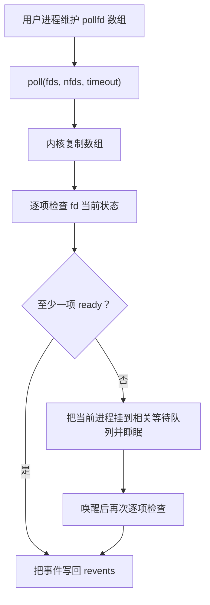

---

## 为什么有了 select 还要 poll

**🎯 poll 主要改善的是接口和 fd 表达能力，不是复杂度**

`select` 的两个典型问题：

- 问题 1：`fd_set` 是固定大小 bitset，默认 `FD_SETSIZE` 常见为 1024。
- 问题 2：`select` 会修改输入 `fd_set`，每轮都要重新构造/复制。

`poll` 改成数组：

```c
struct pollfd {
    int   fd;       // 监听哪个 fd
    short events;   // 用户关心什么事件
    short revents;  // 内核返回实际发生了什么事件
};
```

这样每个 fd 和它关心的事件放在同一个结构里：

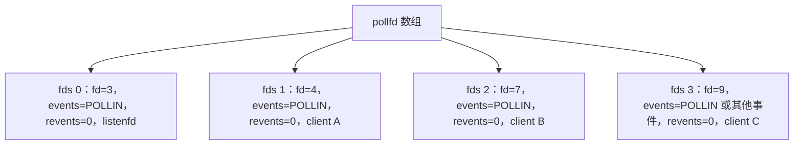

`poll` 返回后：

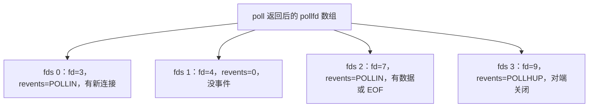

注意：`events` 是输入，`revents` 是输出，这比 `select` 原地改 `fd_set` 清楚很多。

---

## 用户态接口

**🎯 API 形状：pollfd 数组 + 数组长度 + timeout**

```c
#include <poll.h>

int poll(struct pollfd *fds, nfds_t nfds, int timeout);
```

参数含义：

| 参数 | 含义 | 例子 |
|---|---|---|
| `fds` | `struct pollfd` 数组 | `fds[0]` 放 listenfd，后面放 client fd |
| `nfds` | 数组中有效项数量 | 不是最大 fd，也不是 `maxfd+1` |
| `timeout` | 等待时间，单位毫秒 | `-1` 永久等，`0` 立即返回，正数限时等 |

返回值：

| 返回值 | 含义 |
|---|---|
| `> 0` | 有事件的 fd 数量，即 `revents != 0` 的项数 |
| `== 0` | 超时，没有任何事件 |
| `< 0` | 出错，检查 `errno`，常见 `EINTR` |

常用事件：

| 事件 | 常出现位置 | 含义 |
|---|---|---|
| `POLLIN` | `events` / `revents` | 可读；监听 socket 上表示可 `accept` |
| `POLLOUT` | `events` / `revents` | 可写；发送缓冲区有空间 |
| `POLLERR` | 通常只看 `revents` | fd 发生错误 |
| `POLLHUP` | 通常只看 `revents` | 对端关闭/挂起 |
| `POLLNVAL` | 只在 `revents` | fd 无效，例如已经 close 但仍留在数组中 |

**⚠️ 返回值不是数组下标**

```c
int nready = poll(fds, nfds, -1);
```

`nready == 3` 的意思是“有 3 个数组项的 `revents != 0`”，不是 `fds[3]` ready。仍然要扫描数组：

```c
for (nfds_t i = 0; i < nfds && nready > 0; ++i) {
    if (fds[i].revents != 0) {
        --nready;
        // 处理 fds[i]
    }
}
```

---

## poll 版事件循环

**🎯 用数组保存所有连接**

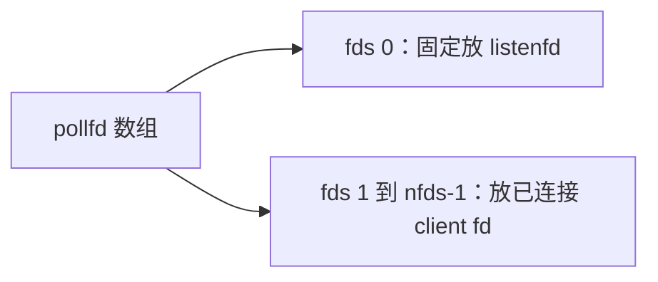

```c
#define MAX_CLIENTS 1024

struct pollfd fds[MAX_CLIENTS + 1];
nfds_t nfds = 1;

fds[0].fd = listenfd;
fds[0].events = POLLIN;
fds[0].revents = 0;
```

**🔧 例程骨架：poll 版并发 echo server**

```c
#include <errno.h>
#include <poll.h>
#include <unistd.h>

#define MAX_CLIENTS 1024
#define MAXLINE 8192

static void remove_pollfd(struct pollfd fds[], nfds_t *nfds, nfds_t i) {
    close(fds[i].fd);
    fds[i] = fds[*nfds - 1];
    --(*nfds);
}

void poll_echo_loop(int listenfd) {
    struct pollfd fds[MAX_CLIENTS + 1];
    nfds_t nfds = 1;

    fds[0].fd = listenfd;
    fds[0].events = POLLIN;
    fds[0].revents = 0;

    while (1) {
        int nready = poll(fds, nfds, -1);
        if (nready < 0) {
            if (errno == EINTR) {
                continue;
            }
            break;
        }

        if (fds[0].revents & POLLIN) {
            int connfd = accept(listenfd, NULL, NULL);
            if (connfd >= 0 && nfds < MAX_CLIENTS + 1) {
                fds[nfds].fd = connfd;
                fds[nfds].events = POLLIN;
                fds[nfds].revents = 0;
                ++nfds;
            } else if (connfd >= 0) {
                close(connfd);
            }
            if (--nready == 0) {
                continue;
            }
        }

        for (nfds_t i = 1; i < nfds && nready > 0; ++i) {
            short re = fds[i].revents;
            if (re == 0) {
                continue;
            }
            --nready;

            if (re & (POLLERR | POLLNVAL)) {
                remove_pollfd(fds, &nfds, i);
                --i;                // 当前位置换进来一个新元素，本轮不要跳过
                continue;
            }

            if (re & (POLLIN | POLLHUP)) {
                char buf[MAXLINE];
                ssize_t n = read(fds[i].fd, buf, sizeof(buf));
                if (n > 0) {
                    ssize_t off = 0;
                    while (off < n) {
                        ssize_t m = write(fds[i].fd, buf + off, (size_t)(n - off));
                        if (m > 0) {
                            off += m;
                        } else if (m < 0 && errno == EINTR) {
                            continue;
                        } else {
                            break;
                        }
                    }
                } else {
                    remove_pollfd(fds, &nfds, i);
                    --i;
                }
            }
        }
    }
}
```

这个例子保留了教学主线：一个进程、一个数组、一个事件循环。生产级实现还要进一步加入 nonblocking socket、连接级输入/输出缓冲区、短写处理、背压策略等。

---

## 运行过程中内核在做什么

和 `select` 一样，`poll` 也不是把兴趣集合永久保存在内核里；**每次调用都要重新复制用户态数组、重新遍历、重新注册等待关系**。

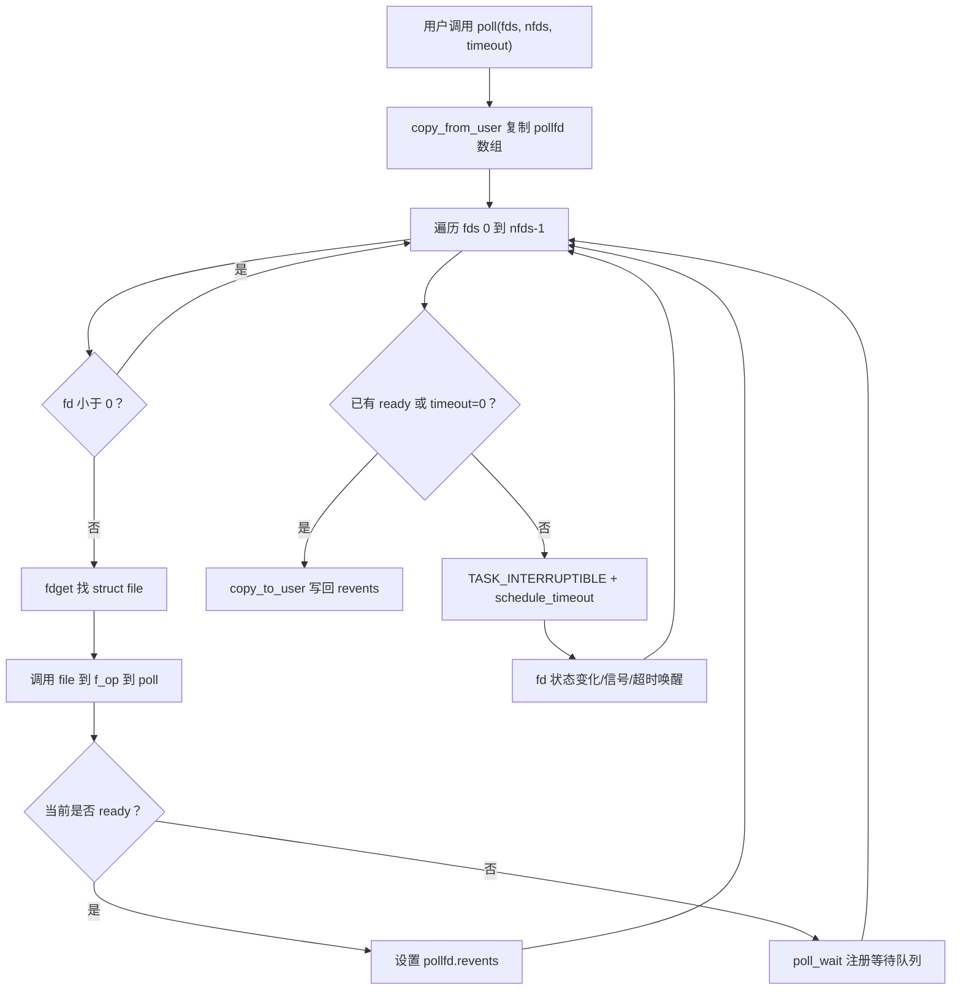

这张流程图对应的关键步骤是：复制 `pollfd[]`、逐项调用 `file->f_op->poll`、按 `events` 过滤出 `revents`、必要时登记等待队列并睡眠，最后把带 `revents` 的数组写回用户态。

**🎯 poll_wait 的作用：登记等待关系，不是立即睡眠**

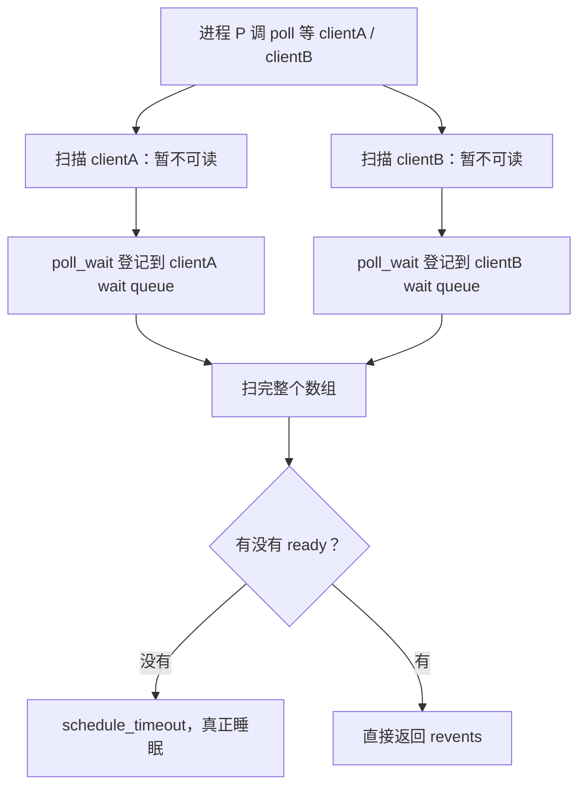

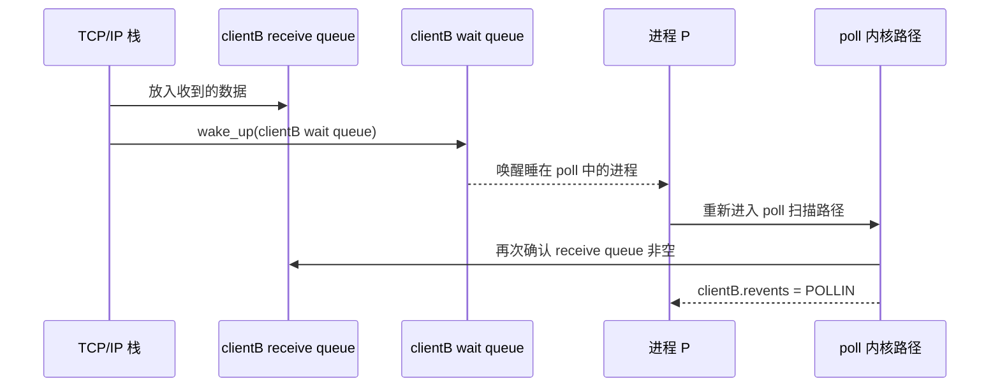

**⚠️ 唤醒不等于一定有 I/O 事件**

进程可能因为信号或超时醒来；也可能多个等待者竞争同一个事件，醒来时状态已经变了。所以被唤醒后必须重新遍历、重新确认。

---

## 复杂度和性能直觉

**🎯 poll 消除了 FD_SETSIZE，但没有消除 O(n) 扫描**

一次 `poll` 的主要成本：

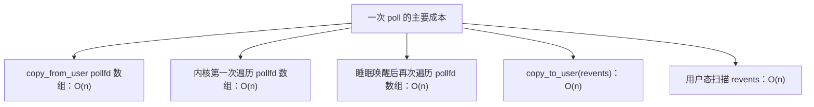

所以整体仍然是 `O(n)`。

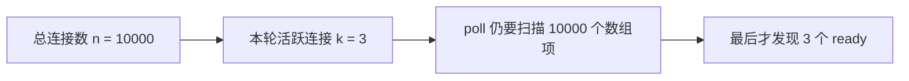

这就是 `epoll` 的价值：把“每轮扫描所有 fd”改成“内核维护就绪队列，用户只拿 ready 事件”。

**🎯 poll 比 select 更适合 fd 稀疏场景**

`select` 扫描范围由最大 fd 决定：


`poll` 扫描数组长度：

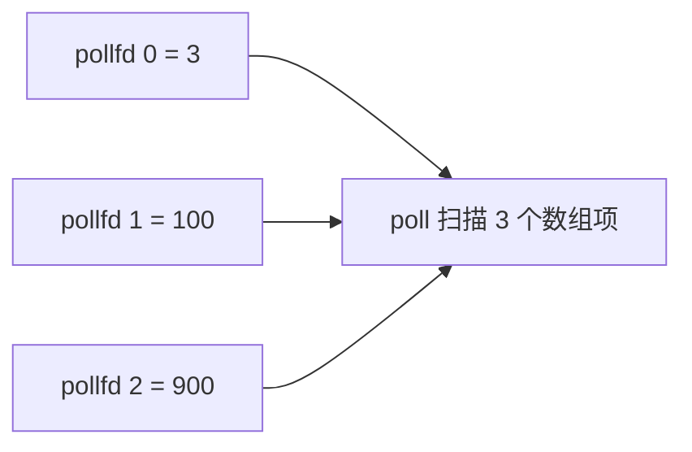

所以在“fd 编号很大但数量不多”的场景，`poll` 比 `select` 更自然。

---

## POLLOUT 的特殊坑

**⚠️ socket 通常大部分时间都是可写的**

如果你一直监听：

```c
fds[i].events = POLLIN | POLLOUT;
```

那么只要发送缓冲区有空间，`poll` 就会不断返回 `POLLOUT`，哪怕你根本没有数据要写，事件循环会变成忙循环。

正确策略：

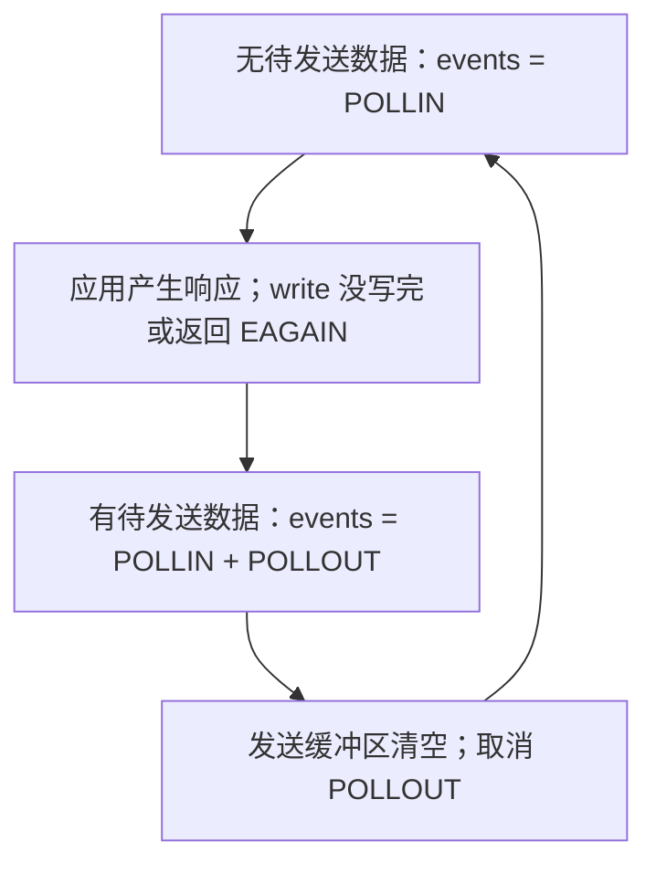

CSAPP 初学 echo server 可以先不展开写缓冲区，但要知道真实网络库必须处理这个问题。

---

## 和 select / epoll 的对比

| 维度 | select | poll | epoll |
|---|---|---|---|
| 用户传入结构 | `fd_set` 位图 | `pollfd[]` 数组 | `epoll_ctl` 注册兴趣集合 |
| 是否每轮传全部 fd | 是 | 是 | 否，兴趣集合长期在内核 |
| 固定 fd 上限 | 常见 `FD_SETSIZE=1024` | 无固定 bitset 上限 | 无固定 bitset 上限 |
| 查找 ready 的方式 | 扫描 `0..maxfd` | 扫描数组 | 取 ready list |
| 每轮复杂度 | `O(maxfd)` | `O(nfds)` | 近似 `O(k)`，k 为返回事件数 |
| 返回结果 | 修改 fd_set | 写 `revents` | 返回 event 数组 |
| 适合用途 | 教学、小 fd | 中小规模、可移植 | Linux 高并发长连接 |

`poll` 的定位：

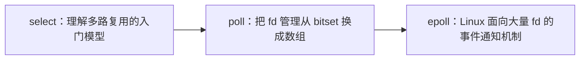

---

## 常见易错点

- **以为 `poll` 返回值是 ready 下标 → 返回值是 ready 数量，仍要扫描 `revents`。**
- **只检查 `POLLIN` → `POLLHUP`、`POLLERR`、`POLLNVAL` 也必须处理，否则可能 fd 泄漏或死循环。**
- **`POLLIN` 就一定有业务数据 → 对端关闭时 `read` 返回 0，也可能被报告为可读/挂起。**
- **关闭 fd 后仍留在数组里 → 下一轮可能得到 `POLLNVAL`，应删除该项或设为 `fd=-1`。**
- **用最后一个元素覆盖删除位置后忘记 `i--` → 换进来的 fd 本轮会被跳过。**
- **一直监听 `POLLOUT` → 大多数 socket 常态可写，会导致事件循环频繁空转。**
- **忽略 `EINTR` → 信号打断 `poll` 是正常情况，应重试或按上层语义退出。**
- **把 `timeout` 当精确定时器 → `poll` timeout 会受内核时钟粒度和调度延迟影响。**
- **以为 `poll` 是 epoll 的简化版 → `poll` 仍是每轮全量传数组、全量扫描，不维护内核长期兴趣集合。**

---

## 工程关联

- **跨平台事件循环后端**：很多库在 Linux 上优先 `epoll`，在其他 Unix 平台可能退回 `poll` 或 `select`，所以理解 `pollfd` 有助于理解事件库抽象。
- **中小规模 fd 管理**：命令行工具、代理小程序、测试 harness 同时等几个 socket/pipe/eventfd，用 `poll` 往往比 `select` 更清楚；它没有 `FD_SETSIZE` 固定 bitset 限制，也不用维护 `maxfd + 1`。
- **什么时候选 poll**：fd 数量不大、可移植性比极限性能更重要、代码希望保持简单时，`poll` 是合理选择；如果是 Linux 大量长连接服务，通常应优先考虑 `epoll`。
- **pollfd 数组管理策略**：删除连接时常用“最后一个元素覆盖当前位置”保持数组紧凑；覆盖后本轮循环要 `i--`，否则换进来的 fd 会被跳过。
- **临时禁用 fd**：把 `pollfd.fd` 设为 `-1` 可以让 `poll` 忽略这一项，适合临时关闭某类事件；但已关闭的真实 fd 如果还留在数组里，可能返回 `POLLNVAL`，应及时删除或置为 `-1`。
- **内核统一 readiness 接口**：socket、pipe、tty、eventfd、timerfd 都可以被 `poll` 等待，背后靠的是文件对象的 `f_op->poll` 方法；这也是 Linux 把很多事件源设计成 fd 的原因。
- **`POLLOUT` 背压设计**：真实服务不是“有响应就直接写完”，而是写不完就缓存，等 `POLLOUT` 再继续；这和网络拥塞、慢客户端、发送缓冲区大小直接相关。
- **不要一直监听 `POLLOUT`**：socket 大多数时间都可写，长期注册 `POLLOUT` 容易造成事件循环空转；正确做法是默认只关心 `POLLIN`，只有输出缓冲区非空且写不完时才临时加上 `POLLOUT`。
- **阻塞 fd 的风险**：`poll` 只保证“下一次操作大概率不会阻塞”，不保证大块 `write` 一定写完；生产代码通常仍会把 socket 设为 nonblocking，并维护连接级输入/输出缓冲区。
- **性能边界**：`poll` 的成本跟 `pollfd[]` 长度成正比；如果数组里有几万连接但每轮只有少数活跃，CPU 会浪费在线性扫描上，这就是迁移到 `epoll` 的典型信号。

---

## 建议实验

**🧪 题 1：poll 同时等待 stdin 和 timerfd**

源码片段：

```c
struct pollfd fds[2];
fds[0].fd = STDIN_FILENO;
fds[0].events = POLLIN;
fds[1].fd = tfd;
fds[1].events = POLLIN;

int n = poll(fds, 2, -1);
```

要求：

1. 用 `timerfd_create` 创建每秒触发一次的 fd。
2. `poll` 同时等待 stdin 和 timerfd。
3. 键盘输入时打印输入内容；timerfd 触发时读取 `uint64_t expirations`。
4. 解释为什么 timerfd/eventfd/signalfd 能融入同一个 I/O 多路复用循环。

**🧪 题 2：验证 `fd=-1` 会被 poll 忽略**

要求：

1. 创建 `pollfd fds[2]`，其中一个正常 fd，一个设置为 `-1`。
2. 调用 `poll` 并观察 `fd=-1` 的项不会产生事件。
3. 把一个已关闭 fd 留在数组里，观察 `POLLNVAL`。
4. 解释“临时禁用”和“错误 fd”在 `poll` 中的差异。

**🧪 题 3：观察 POLLOUT 忙循环**

要求：

1. 对一个正常 TCP 连接一直监听 `POLLIN | POLLOUT`。
2. 在没有任何待发送数据时打印每次 `poll` 返回。
3. 观察程序可能高频打印 `POLLOUT`。
4. 修改为“只有存在待发送缓冲区时才监听 `POLLOUT`”，对比 CPU 占用。

**🧪 题 4：strace 看 poll 系统调用**

```bash
strace -tt -e trace=poll,ppoll ./poll_server 8080
```

要求：

1. 客户端连接前观察 `poll([...], nfds, -1)` 阻塞。
2. 新连接到来后观察 `poll` 返回。
3. 多连几个客户端，观察 `nfds` 变化。
4. 客户端关闭后确认服务端从数组删除 fd，下一轮 `nfds` 下降。
