# Reactor 模型：I/O 多路复用背后的事件驱动架构

Reactor 模型要解决的问题是：**一个进程或少量线程如何管理大量连接，并在某个连接真的有 I/O 状态变化时才处理它**。它不是某个具体系统调用，而是一种事件驱动服务器架构；`select`、`poll`、`epoll` 都可以作为 Reactor 里的 I/O 多路复用器。

一句话定义：

> Reactor 是一种事件驱动并发模型：应用把 fd 和 handler 注册到事件循环，事件循环用 `select/poll/epoll` 等多路复用器等待 fd ready，然后同步调用对应 handler 执行实际 `accept/read/write` 和业务处理。

---

## Reactor 的核心直觉

**🎯 Reactor 等的是 ready，不是 completion**

Linux `select/poll/epoll` 通知的是 readiness：

```text
内核：这个 fd 现在 readable / writable / error
用户态：那我现在调用 accept/read/write 处理它
```

也就是说，Reactor 中真正执行 I/O 的仍然是用户态 handler。

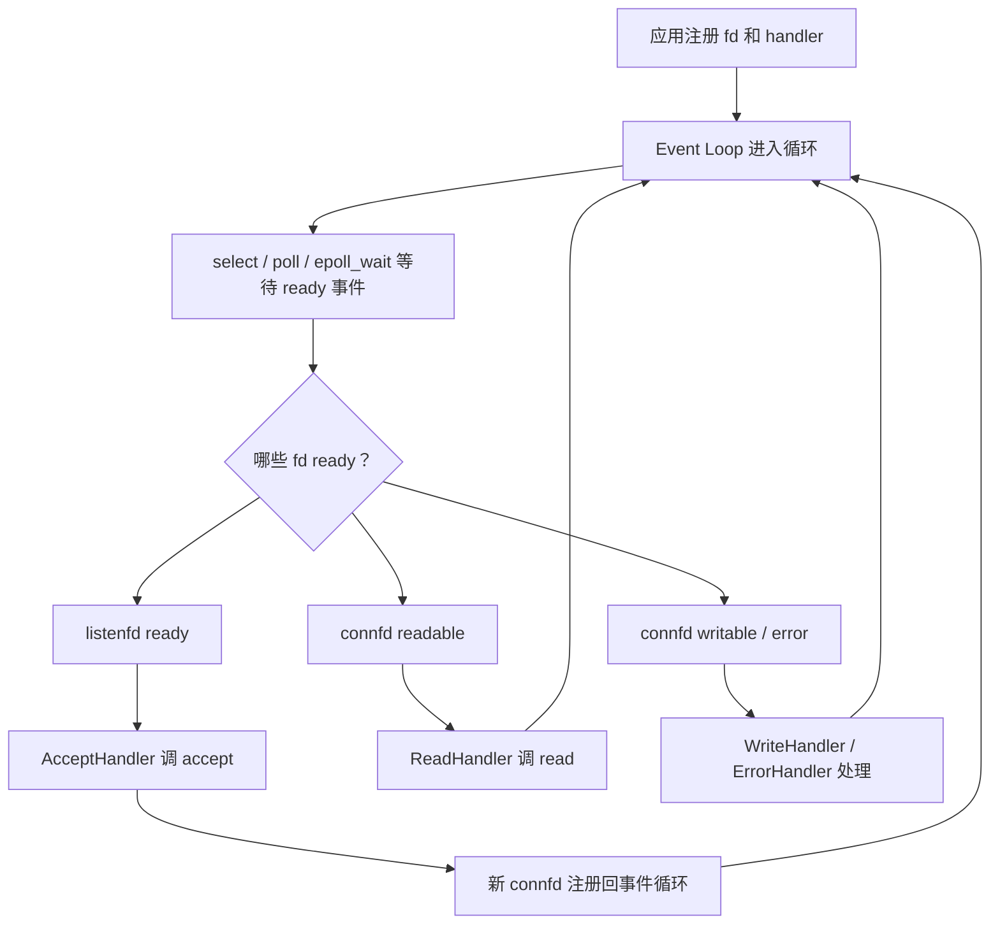

**⚠️ Reactor 不是“内核帮你把数据读完”**

`epoll_wait` 返回 `EPOLLIN` 时，只说明这个 fd 处于可读状态；如果 handler 不调用 `read`，数据仍在 socket 接收缓冲区里。

```c
int n = epoll_wait(epfd, events, MAX_EVENTS, -1);
for (int i = 0; i < n; ++i) {
    int fd = events[i].data.fd;
    if (events[i].events & EPOLLIN) {
        read(fd, buf, sizeof(buf));   // 用户态 handler 自己读
    }
}
```

---

## Reactor 的几个角色

**🎯 组件分工**

| 角色 | 含义 | 在本章例程中的对应物 |
|---|---|---|
| Handle | 事件源句柄，通常就是 fd | `listenfd`、`connfd` |
| Event | fd 上发生的 readiness 状态 | readable、writable、error、hangup |
| Demultiplexer | I/O 多路复用器，负责等待多个 fd | `select`、`poll`、`epoll_wait` |
| Event Handler | 事件处理函数 | `accept` 新连接、`read` 请求、`write` 回显 |
| Dispatcher / Reactor | 事件循环与分发器 | `while (1)` + 遍历 ready events |

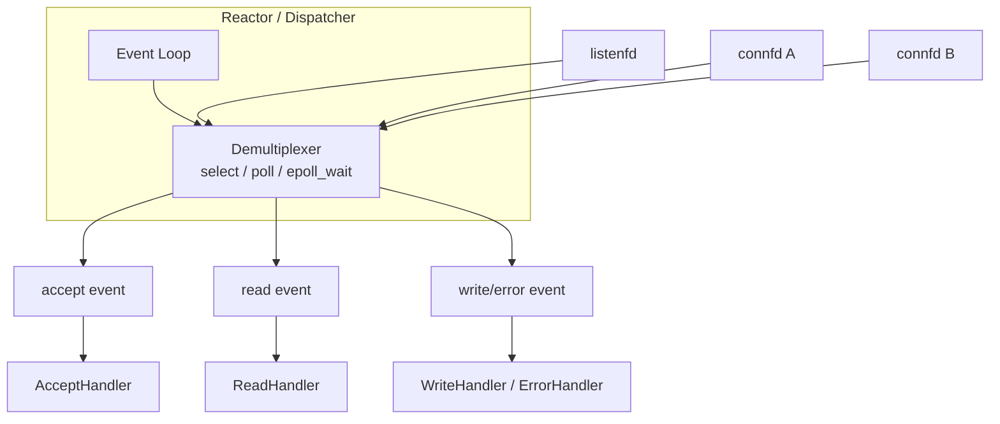

**🔧 和三个例程的对应关系**

| 例程 | Demultiplexer | 兴趣集合在哪里 | 返回结果在哪里 |
|---|---|---|---|
| `select_echo_server.c` | `select` | 用户态 `fd_set all_reads` | 被修改后的 `ready_reads` |
| `poll_echo_server.c` | `poll` | 用户态 `struct pollfd fds[]` | 每项 `revents` |
| `epoll_echo_server.c` | `epoll_wait` | 内核 epoll interest set | `struct epoll_event events[]` |

所以这三个例程都可以看成最小 Reactor，只是底层 demultiplexer 不同。

---

## 事件循环长什么样

**🎯 Reactor 的主循环就是“等待 → 分发 → 处理 → 再等待”**

```c
while (1) {
    int nready = wait_for_events(...);  // select / poll / epoll_wait

    for (int i = 0; i < nready; ++i) {
        event_t ev = next_ready_event(...);

        if (ev.fd == listenfd) {
            handle_accept(ev.fd);
        } else if (ev.readable) {
            handle_read(ev.fd);
        } else if (ev.writable) {
            handle_write(ev.fd);
        } else {
            handle_error(ev.fd);
        }
    }
}
```

以 epoll 版 echo server 为例，代码形状就是：

```c
while (1) {
    int nready = epoll_wait(epfd, events, MAX_EVENTS, -1);

    for (int i = 0; i < nready; ++i) {
        int fd = events[i].data.fd;
        uint32_t ev = events[i].events;

        if (fd == listenfd) {
            int connfd = accept(listenfd, NULL, NULL);
            add_epoll_fd(epfd, connfd, EPOLLIN | EPOLLRDHUP);
        } else if (ev & EPOLLIN) {
            read(fd, buf, sizeof(buf));
            write(fd, buf, n);
        }
    }
}
```

这就是 Reactor 最小形态。

---

## 从连接建立到回显：完整流程

**🎯 `listenfd` 负责接新连接，`connfd` 负责和某个客户端通信**

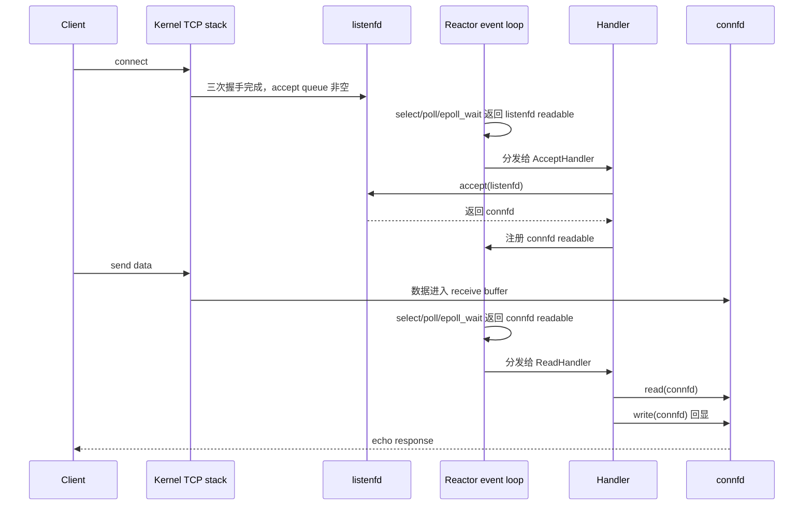

用普通流程图看：

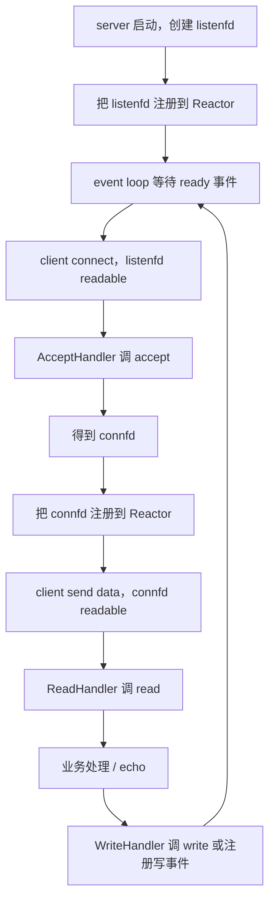

---

## 为什么 handler 不能阻塞太久

**⚠️ Reactor 的最大约束：事件循环线程被一个 handler 卡住，其他连接都要等**

一个 event loop 管很多连接：

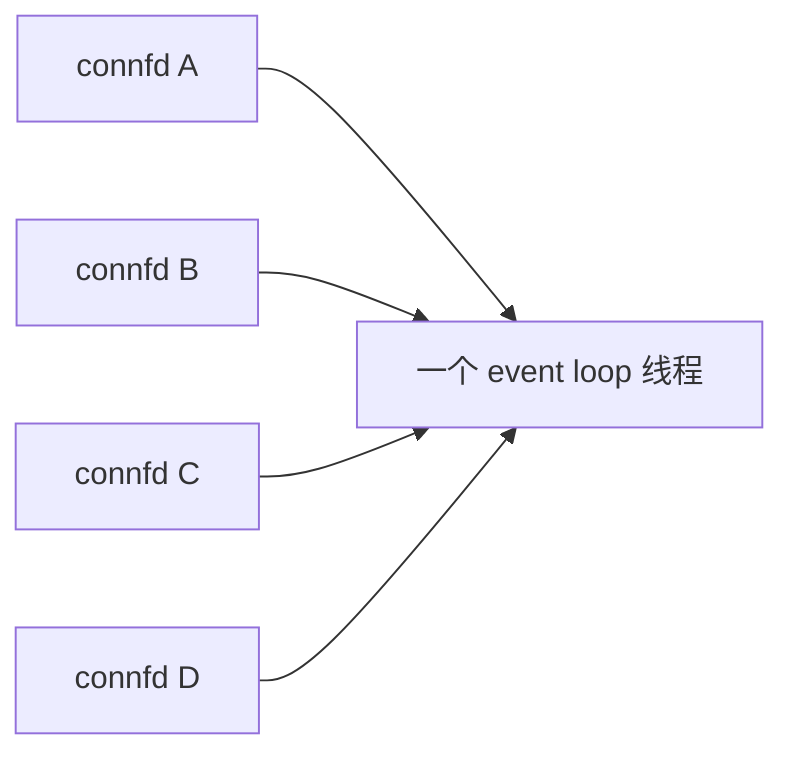

如果 A 的 handler 阻塞 5 秒：

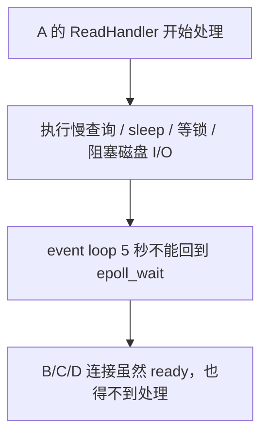

所以 Reactor handler 的工程规则是：

- 不做长时间 CPU 计算；
- 不在 event loop 里等慢磁盘、慢网络、慢锁；
- 大任务丢给 worker thread pool；
- 写不完就缓存，等下次可写事件继续 flush；
- 不要在事件循环里调用可能读完整协议对象的阻塞函数。

这也是本章例程 server 端使用 `read` 而不是 `rio_readlineb` 的原因：`rio_readlineb` 会为了等完整一行继续阻塞，某个客户端只发半行不发换行时，会卡住整个 Reactor。

---

## 写路径：为什么不能一直监听 EPOLLOUT

**🎯 真实 Reactor 需要输出缓冲区和按需写事件**

socket 大多数时候都是可写的。如果一直监听 `POLLOUT` / `EPOLLOUT`，event loop 会频繁被“可写”唤醒，即使应用没有任何数据要发。

正确模型：

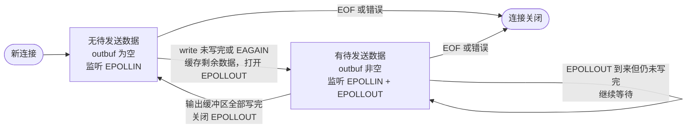

对应连接对象通常长这样：

```c
struct connection {
    int fd;
    char inbuf[4096];
    char outbuf[4096];
    size_t out_off;
    size_t out_len;
};
```

教学版 echo server 为了突出 `select/poll/epoll` 主线，直接 `read` 后 `rio_writen` 回显；生产版必须处理短写、`EAGAIN`、输出缓冲区和 `EPOLLOUT` 注册/取消。

---

## Reactor vs Proactor

**🎯 区别只看一句：通知的是“ready”还是“done”**

| 模型 | 内核通知什么 | 谁执行 I/O | 典型机制 |
|---|---|---|---|
| Reactor | fd 已 ready，可以读/写 | 用户态 handler 调 `read/write` | Linux `select/poll/epoll` |
| Proactor | I/O 已完成，结果可用 | 内核或异步 I/O 子系统执行 I/O | Windows IOCP、Linux `io_uring` completion 思路 |

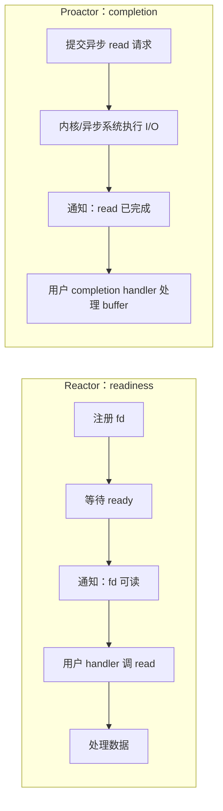

**⚠️ epoll 是 Reactor 后端，不是 Proactor**

`epoll_wait` 返回 `EPOLLIN` 后，你还没有数据；你只是知道“现在读大概率不会阻塞”。必须自己调用：

```c
ssize_t n = read(fd, buf, sizeof(buf));
```

而 completion-based 模型里，通知到来时读操作已经完成，buffer 里已经有结果。

---

## 常见 Reactor 变体

## 单 Reactor 单线程

**🎯 一个线程负责 accept/read/write/业务**

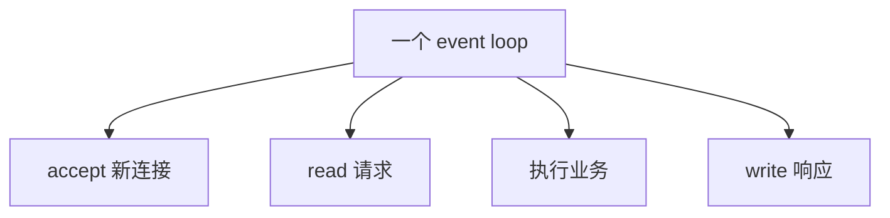

优点：简单、少锁、心智负担低。

缺点：任何 handler 阻塞都会拖住所有连接。

适合：业务非常轻、内存操作为主、请求处理很快的服务。

## 单 Reactor + Worker Pool

**🎯 event loop 负责 I/O 和连接状态，线程池只负责重业务**

这个模型最重要的边界是：**socket、`epoll` 和连接状态归 event loop 单线程所有，worker 不直接碰它们。** 跨线程只传递任务和计算结果，可以把锁限制在两个队列上，避免多个线程同时修改同一个连接。

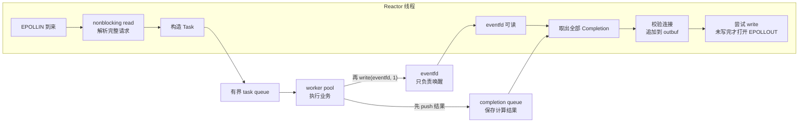

**🎯 queue 传数据，eventfd 只传“有新结果”这个信号**

图中的 `completion queue` 和 `eventfd` 不是同一个东西：

- `completion queue` 保存响应内容、连接标识、请求序号和错误信息；
- `eventfd` 是一个可被 `epoll` 监听的 64 位计数器，worker 向它写入 `1`，让阻塞在 `epoll_wait` 的 event loop 立即醒来；
- worker 必须**先把结果放入队列，再写 `eventfd`**，否则 event loop 可能醒来后暂时看不到结果；
- event loop 读一次 `eventfd` 后，应把 completion queue 尽量取空，而不是假定“一次唤醒只对应一个结果”。多次 `write(eventfd)` 可以合并成一次唤醒。

`eventfd` 通常只创建一个，并在启动时永久注册到当前 Reactor 的 epoll instance：

```c
int notifyfd = eventfd(0, EFD_NONBLOCK | EFD_CLOEXEC);

struct epoll_event ev = {
    .events = EPOLLIN,
    .data.fd = notifyfd,
};
epoll_ctl(epfd, EPOLL_CTL_ADD, notifyfd, &ev);
```

**🎯 一次请求的完整时序**

1. **读取请求**：`epoll_wait` 返回客户端 fd 的 `EPOLLIN`，event loop 用 nonblocking `read` 读取数据并解析出完整请求。
2. **投递任务**：event loop 构造独立的 `Task`，放入有界 task queue；`Task` 不能引用随后可能被覆盖的输入缓冲区。
3. **执行业务**：某个 worker 取出任务，执行 CPU 密集计算或允许阻塞的业务调用，但不调用该连接的 `read`、`write` 或 `epoll_ctl`。
4. **发布结果**：worker 把 `Completion` 放入线程安全的 completion queue，然后执行 `write(notifyfd, &one, sizeof(one))`。
5. **唤醒 Reactor**：`notifyfd` 变为可读，`epoll_wait` 返回；event loop 读取计数器并依次取出已完成结果。
6. **校验并写回**：event loop 确认目标连接仍存在，将响应追加到该连接的 `outbuf`，并立即尝试 nonblocking `write`。
7. **处理短写**：如果全部写完，继续只监听 `EPOLLIN`；如果短写或得到 `EAGAIN`，保留剩余数据并临时加上 `EPOLLOUT`，等 socket 再次可写。

对应的控制流可以概括为下面的伪代码：

```c
/* Reactor 线程 */
on_client_readable(conn) {
    read_and_parse(conn->inbuf);

    while (has_complete_request(conn)) {
        struct task task = make_task_copy(conn);
        task_queue_push(task);
    }
}

on_notifyfd_readable() {
    uint64_t count;
    while (read(notifyfd, &count, sizeof(count)) > 0)
        ; /* 清空 eventfd 计数 */

    struct completion result;
    while (completion_queue_try_pop(&result)) {
        struct connection *conn = find_live_connection(result.conn_id,
                                                       result.generation);
        if (conn == NULL)
            continue; /* 客户端已经关闭，丢弃迟到结果 */

        append_to_outbuf(conn, result.response);
        flush_or_enable_epollout(conn);
    }
}

/* worker 线程 */
worker_loop() {
    for (;;) {
        struct task task = task_queue_pop();
        struct completion result = run_business(task);

        completion_queue_push(result); /* 先发布数据 */

        uint64_t one = 1;
        write(notifyfd, &one, sizeof(one)); /* 再唤醒 Reactor */
    }
}
```

这段代码只是表达线程分工；真实实现还要检查系统调用返回值，并使用 mutex + condition variable、信号量或可靠的并发队列实现两个 queue。

**🎯 单一所有权减少共享状态**

| 资源 | 负责线程 | 原因 |
|---|---|---|
| `connfd` 的 `read` / `write` | event loop | 避免多个线程并发操作同一个字节流 |
| `epoll_ctl` 和 interest set | event loop | 保证事件注册状态按顺序更新 |
| `inbuf` / `outbuf` 和连接状态 | event loop | 通常不需要为每个连接加锁 |
| 请求对应的独立业务数据 | worker | 与连接可变状态解耦 |
| task queue / completion queue | 跨线程共享 | 这是需要明确同步的边界 |

**🎯 为什么通常不让 worker 直接写 socket**

worker 直接调用 `write(connfd, response, len)` 在技术上可行，但会打破“连接归 event loop 单线程所有”的边界，使以下问题同时出现：

- **并发写入**：Reactor 或其他 worker 也可能正在写同一个 socket。TCP 只提供有序字节流，不会替应用保留两次并发 `write` 的消息边界；两个响应的字节可能按不可控顺序进入发送流。
- **短写和 `EAGAIN`**：nonblocking `write` 可能只写出一部分，甚至返回 `EAGAIN`。worker 必须保存剩余数据，并请求 Reactor 注册 `EPOLLOUT`；这样最终还是需要跨线程协调 `outbuf` 和 interest set。
- **响应顺序**：同一连接上的请求 A 先提交、请求 B 后提交，但处理 B 的 worker 可能先完成并直接写回。若协议要求按请求顺序响应，就必须额外实现序号、排序和暂存。
- **连接生命周期**：worker 计算期间客户端可能已经断开，原来的 fd 甚至可能被关闭后复用于新连接。只保存 `connfd` 或裸 `connection *`，可能把迟到响应写给错误连接，或者访问已经释放的对象。
- **状态竞争**：关闭连接、更新 `outbuf`、启停 `EPOLLOUT` 和释放资源不再由同一线程串行执行，必须增加连接锁、引用计数以及严格的锁顺序，复杂度和死锁风险都会上升。
- **错误处理分散**：`EPIPE`、`ECONNRESET`、部分发送和高水位背压可能在任意 worker 中发生，连接状态机不再集中，排障也更困难。

因此常见实现让 worker 只生成独立的 `Completion`，然后由 event loop 串行执行：

```text
worker：执行业务并产生 Completion
    ↓
completion queue + eventfd：传递结果并唤醒 event loop
    ↓
event loop：校验连接 → 追加 outbuf → 尝试 write
                              ↓
                         短写时打开 EPOLLOUT
```

这样并不是因为 `write` 只能由 Reactor 调用，而是为了维持清晰的**单一所有权**：worker 负责计算，event loop 负责 socket I/O 和连接状态。需要注意，这只适用于 completion 必须回到连接或 event loop 的任务；如果 worker 完成后不需要写响应，也不需要更新连接、fd、定时器等 Reactor 状态，就不必为了“任务完成”而通知 Reactor。

**🔧 worker 直接写并非绝对错误**

如果协议和架构能保证一个连接始终只由一个固定 worker 拥有，那么该 worker 可以负责这个连接的全部 `read`、`write`、缓冲区和生命周期。这已经不是“多个 worker 计算、单 Reactor 管连接”的分工，而更接近多 Reactor 或连接分片模型。关键不是线程名字，而是**同一个连接的可变状态是否有唯一、稳定的所有者**。

**⚠️ 生产实现必须补齐的四个问题**

- **连接生命周期**：不能只在任务里保存 `fd`。客户端关闭后，同一个数字可能被新连接复用；任务应携带稳定的 `conn_id + generation`，event loop 写回前必须再次校验。worker 也不应长期持有可能被释放的裸 `connection *`。
- **同连接响应顺序**：两个请求并行投递后，后一个可能先计算完。最简单的策略是每个连接只允许一个 in-flight 任务；需要流水线并行时，则给请求增加 `sequence`，由 event loop 排序后再写回，或者让应用协议显式支持乱序响应。
- **背压和内存上限**：task queue 必须有容量上限，`outbuf` 也要设置高水位。队列满或慢客户端积压过多时，应暂停该连接的 `EPOLLIN`、拒绝新请求或关闭连接，不能无限分配内存。
- **线程池隔离**：CPU 密集任务的线程数通常接近可用 CPU 核数；数据库、文件或第三方 RPC 等阻塞任务可能长期占住线程，最好使用独立的 blocking pool，避免拖死所有计算任务。

这个模型适合业务逻辑明显重于 I/O 分发的服务器。它不会让单个任务本身变快，但能保证一个慢业务任务不会把整个 event loop 卡住；它的代价是队列同步、跨线程唤醒、响应排序和连接生命周期管理都必须设计清楚。

## 主从 Reactor

**🎯 main reactor 只 accept，sub reactors 处理已连接 fd 的 I/O**

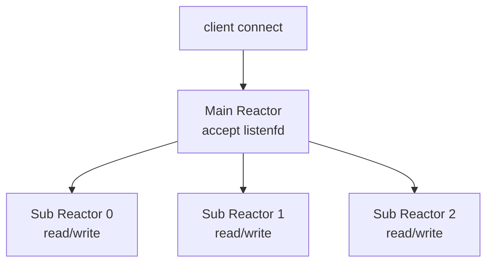

常见做法：

- main thread 负责监听 socket 和 `accept`；
- 新 `connfd` 按轮询或负载分配给某个 I/O 线程；
- 每个 I/O 线程有自己的 epoll instance；
- 跨线程唤醒常用 `eventfd`。

Nginx、Netty、libuv 等系统都能看到这类思想的变体。

---

## 和 CSAPP 第 12 章的关系

**🎯 §12.2 就是 Reactor 的入门版本**

| CSAPP 小节 | 编程模型 | 工程对应 |
|---|---|---|
| §12.1 基于进程 | `accept` 后 `fork` | process-per-connection / prefork |
| §12.2 I/O 多路复用 | 一个事件循环管理多个 fd | Reactor |
| §12.3+ 基于线程 | 多线程共享地址空间 | thread pool / multi-reactor |

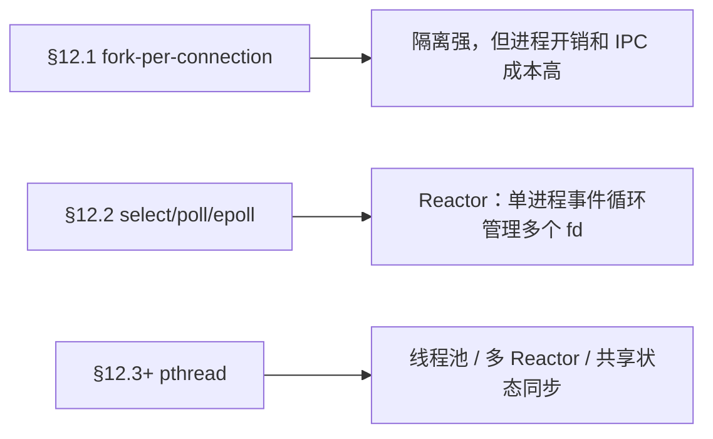

你现在的三个例程就是三种最小 Reactor：

- `Chapter12/12.2/experiments/select_echo_server.c`
- `Chapter12/12.2/experiments/poll_echo_server.c`
- `Chapter12/12.2/experiments/epoll_echo_server.c`

---

## 易错点

- **以为 Reactor 等于 epoll → Reactor 是架构模式，epoll 只是 Linux 上常用的 demultiplexer。**
- **以为 fd ready 等于数据已经在用户 buffer → ready 只表示可以读/写，真正 I/O 仍要 handler 调 `read/write`。**
- **在 handler 里做阻塞操作 → 一个 handler 卡住会拖住同一个 event loop 上的所有连接。**
- **在 Reactor server 里直接用 `rio_readlineb` 读完整一行 → 半行输入可能阻塞整个事件循环，除非每连接有独立线程或完整非阻塞缓冲状态机。**
- **一直监听 `EPOLLOUT` → socket 常态可写，会造成 event loop busy loop。**
- **把 ET 当成 Reactor 必需条件 → Reactor 可以用 LT；ET 只是 epoll 的一种触发模式，使用时必须 nonblocking 并读写到 `EAGAIN`。**
- **忽略 EOF 和错误事件 → readable 也可能意味着对端关闭，必须处理 `read == 0`、`POLLHUP`、`EPOLLHUP`、`EPOLLERR`。**
- **把 CPU 密集业务直接放进 event loop → 高并发 I/O 模型会退化成单线程 CPU 瓶颈。**

---

## 工程关联

- **Nginx**：典型事件驱动服务器，worker 进程内部用事件循环处理大量连接。
- **Redis**：主线程事件循环处理网络 I/O 和命令执行，命令必须尽量快，否则会阻塞其他客户端。
- **Node.js / libuv**：JavaScript 层看到的是 callback / promise，底层事件循环在 Linux 上可使用 epoll。
- **Netty**：Java 网络框架，EventLoopGroup 本质就是多 Reactor 思想，channel 事件分发给 handler pipeline。
- **跨线程唤醒**：worker 线程把结果交回 event loop 时，常用 `eventfd` 把“有新任务/有响应可写”变成 epoll 可等待事件。
- **线上排障**：如果 Reactor 线程 CPU 打满或被阻塞，表现为所有连接延迟一起升高；可用 `perf top`、`strace -p`、线程栈、事件循环延迟指标定位。

---

## 实验题

**🧪 题 1：把三个 echo server 都看成 Reactor**

要求：

1. 运行：

```bash
cd Chapter12/12.2/experiments
make clean all
make demo
```

2. 对照三份源码，分别指出：
   - event loop 在哪里；
   - demultiplexer 是哪个系统调用；
   - listenfd ready 时哪个代码块相当于 AcceptHandler；
   - connfd ready 时哪个代码块相当于 ReadHandler。

**🧪 题 2：用 strace 观察三种 demultiplexer**

要求：

```bash
strace -tt -e trace=pselect6,select,accept,read,write ./select_echo_server 18080
strace -tt -e trace=poll,ppoll,accept,read,write ./poll_echo_server 18081
strace -tt -e trace=epoll_create1,epoll_ctl,epoll_wait,accept,read,write ./epoll_echo_server 18082
```

分别连接客户端：

```bash
printf 'hello reactor\n' | ./echo_client 127.0.0.1 18080
```

要求观察：

1. select 版阻塞在 `pselect6` 或 `select`；
2. poll 版阻塞在 `poll` 或 `ppoll`；
3. epoll 版启动时有 `epoll_create1` / `epoll_ctl`，运行时阻塞在 `epoll_wait`。

**🧪 题 3：验证 handler 阻塞会拖住整个 event loop**

源码改动建议：在 `ReadHandler` 读到数据后临时加入：

```c
sleep(5);
```

要求：

1. 启动任意一个 echo server；
2. 同时启动两个 client；
3. 让 client A 先发送一行；
4. client B 立刻发送一行；
5. 观察 B 的响应也会被 A 的 handler 延迟影响；
6. 恢复代码后重新验证。

结论：单 Reactor 线程里 handler 不能长时间阻塞。

**🧪 题 4：思考 Proactor 的差异**

要求：

1. 用一句话解释 `epoll_wait` 返回时，数据是否已经被读入用户 buffer。
2. 查阅 `io_uring` 的 submit/completion queue 概念，解释它为什么更接近 completion-based 模型。
3. 用表格对比：`epoll`、`io_uring`、Windows IOCP 的通知语义。

---

## 小结

Reactor 的核心不是某个 API，而是这条控制流：

```text
注册 fd 和 handler
    ↓
事件循环等待 fd ready
    ↓
分发给 handler
    ↓
handler 同步执行 accept/read/write
    ↓
必要时更新关注事件，再回到事件循环
```

在 Linux 网络编程里，`select`、`poll`、`epoll` 都能实现 Reactor；`epoll` 只是大量连接场景下更常用、更高效的 demultiplexer。理解 Reactor 后，再看 Nginx、Redis、Node.js/libuv、Netty 的事件循环，就不会只停留在“用了 epoll”这个 API 层面，而能看懂它们如何组织连接、handler、缓冲区、线程池和跨线程唤醒。