# select：最早的 I/O 多路复用接口

`select` 的核心问题是：**一个进程只有一条执行流，怎样同时等待多个 fd 变得“可读/可写/异常”**。它不是让内核替你读写数据，而是让内核帮你睡眠并在“至少一个 fd 可能不会阻塞”时把你叫醒；醒来后，用户态仍然要自己 `accept`、`read`、`write`，并处理 EOF、短读、短写、`EINTR`、`EAGAIN`。

一句话模型：

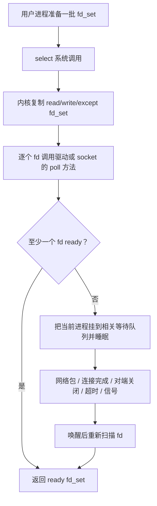

---

## 先建立直觉：select 等的不是“数据”，而是“状态变化后的可操作性”

**🎯 ready 的含义**

`select` 返回某个 socket 可读，通常表示后续一次 `read` / `recv` **大概率不会阻塞**，常见情况包括：

- 接收缓冲区已有数据；
- 对端关闭连接，`read` 会返回 `0`；
- socket 上有错误，`read` / `write` 会返回错误；
- 监听 socket 上有已完成握手的连接，`accept` 不会阻塞。

所以可读不等于“一定读到业务数据”。EOF 和错误也会让 fd 变成 ready。

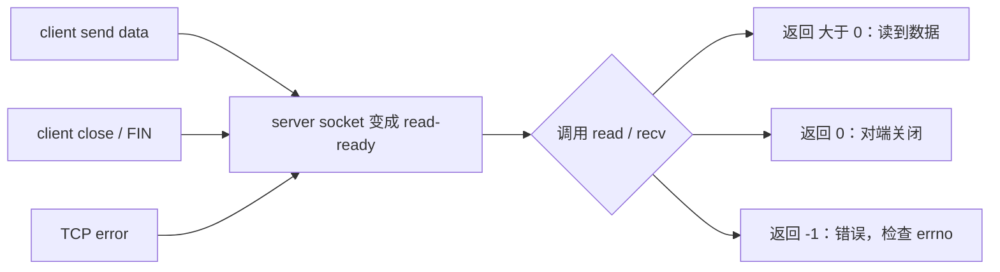

**⚠️ select 是 level-triggered（水平触发）**

只要状态仍然满足 ready，下一轮 `select` 还会继续报告它。


这和后面 `epoll` 的默认 LT 行为一致，和 `EPOLLET` 边缘触发不同。

---

## 用户态接口

**🎯 API 形状：三组 fd_set + 一个 nfds**

```c
#include <sys/select.h>

int select(int nfds,
           fd_set *readfds,
           fd_set *writefds,
           fd_set *exceptfds,
           struct timeval *timeout);
```

常用宏：

| 宏 | 作用 | 典型使用位置 |
|---|---|---|
| `FD_ZERO(&set)` | 清空整个 fd 集合 | 初始化 `all_reads` |
| `FD_SET(fd, &set)` | 把某个 fd 加入集合 | 新建监听集合；`accept` 得到新 `connfd` 后加入 `all_reads` |
| `FD_CLR(fd, &set)` | 把某个 fd 从集合中删除 | 客户端关闭或出错后，从 `all_reads` 移除 `connfd` |
| `FD_ISSET(fd, &set)` | 判断某个 fd 是否在集合中 | `select` 返回后，检查 `listenfd` / `connfd` 是否 ready |

最小用法：

```c
FD_ZERO(&all_reads);
FD_SET(listenfd, &all_reads);

ready_reads = all_reads;
select(maxfd + 1, &ready_reads, NULL, NULL, NULL);

if (FD_ISSET(listenfd, &ready_reads)) {
    // listenfd 本轮 ready，可以 accept 新连接
}
```

这些宏的第一个参数都是“要操作的 fd 编号”，不是固定必须传 `listenfd`。这里用 `listenfd` 是因为 echo server 首先要监听新连接；当 `FD_ISSET(listenfd, &ready_reads)` 为真时，含义是监听 socket 的 accept queue 非空，接下来调用 `accept(listenfd, ...)` 大概率不会阻塞。

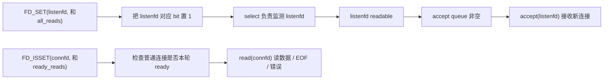

参数含义：

| 参数 | 含义 | 常见写法 |
|---|---|---|
| `nfds` | 需要检查的 fd 范围上界，必须是 `maxfd + 1` | `select(maxfd + 1, ...)` |
| `readfds` | 关心哪些 fd 可读 | 监听 socket、已连接 socket |
| `writefds` | 关心哪些 fd 可写 | 发送缓冲区可能满时再关心 |
| `exceptfds` | 关心异常条件 | TCP OOB 很少用，教学阶段可忽略 |
| `timeout` | 最多睡多久 | `NULL` 永久等；`0` 轮询；正数限时等 |

**⚠️ `select` 会修改 fd_set，所以每轮都要重建临时集合**

```c
fd_set all_reads, ready_reads;
FD_ZERO(&all_reads);
FD_SET(listenfd, &all_reads);

while (1) {
    ready_reads = all_reads;              // 必须复制
    int nready = select(maxfd + 1, &ready_reads, NULL, NULL, NULL);
    if (nready < 0 && errno == EINTR) {
        continue;
    }

    if (FD_ISSET(listenfd, &ready_reads)) {
        // 只有 ready_reads 里保留的是“本轮 ready 的 fd”
    }
}
```

如果直接把 `all_reads` 传进去，返回后没 ready 的 fd 会被内核清零，下一轮就丢失监听对象。

**⚠️ `FD_SETSIZE` 是 select 的经典硬限制**

`fd_set` 在用户态通常是固定大小 bitset，glibc 默认 `FD_SETSIZE == 1024`。`FD_SET(fd, &set)` 对 `fd >= FD_SETSIZE` 的行为不是“返回错误”，而是可能越界写内存。

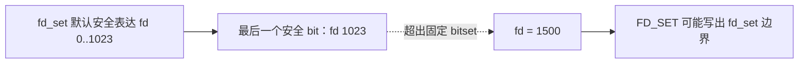

真实服务中 fd 数量一多，`select` 就不再合适；这是 `poll` / `epoll` 的重要动机之一。

---

## select 事件循环长什么样

**🎯 单进程并发 echo server 的核心状态**

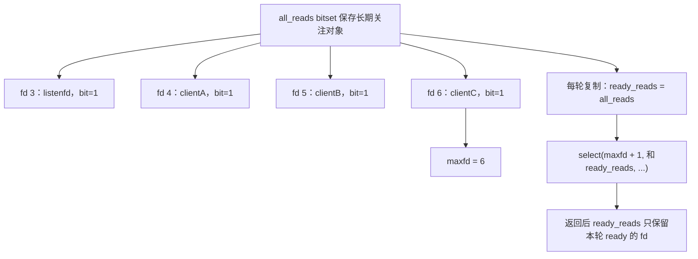

**🎯 listenfd 和 connfd 在事件循环里的分工**

`listenfd` 和 `connfd` 都是 fd，但语义完全不同：

- `listenfd` 是监听 socket，只负责接收新连接；它 readable 表示 accept queue 非空，应该调用 `accept`。
- `connfd` 是已连接 socket，代表某一个客户端连接；它 readable 表示这个连接上可能有数据、EOF 或错误，应该调用 `read`。

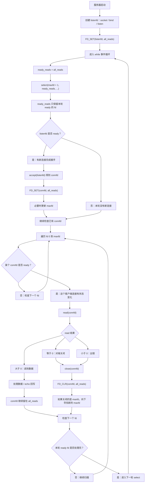

注意这个流程里的两个关键转换：

1. **`listenfd` ready 后不会读数据，而是 `accept` 出一个新的 `connfd`。**
2. **新的 `connfd` 必须 `FD_SET(connfd, &all_reads)`，否则下一轮 `select` 根本不会监测这个客户端。**

可以把它类比成：

- `listenfd`：餐厅门口的迎宾台，发现有人排队就把人领进来；
- `connfd`：已经入座的一桌客人，后续点菜、说话、离开都通过这张桌子的连接处理。

**🔧 例程骨架：select 版并发 echo server**

下面是核心循环，省略 `open_listenfd`、`rio_*` 这类前面章节已经写过的包装函数。

```c
#include <errno.h>
#include <sys/select.h>
#include <unistd.h>

#define MAXLINE 8192

static void handle_client_line(int fd, fd_set *all_reads, int *maxfd) {
    char buf[MAXLINE];

    // 这里的 fd 是某个已连接客户端的 connfd，不是 listenfd。
    // connfd readable 表示：可能有数据、EOF，或者错误。
    ssize_t n = read(fd, buf, sizeof(buf));

    if (n > 0) {
        ssize_t off = 0;
        while (off < n) {
            ssize_t m = write(fd, buf + off, (size_t)(n - off));
            if (m > 0) {
                off += m;
            } else if (m < 0 && errno == EINTR) {
                continue;
            } else {
                break;
            }
        }
        return;
    }

    // n == 0 表示 EOF；n < 0 表示错误。教学版都关闭连接。
    close(fd);
    FD_CLR(fd, all_reads);

    // 如果关闭的是当前最大 fd，需要往回找新的 maxfd。
    if (fd == *maxfd) {
        while (*maxfd >= 0 && !FD_ISSET(*maxfd, all_reads)) {
            --(*maxfd);
        }
    }
}

void select_echo_loop(int listenfd) {
    // all_reads：用户态长期维护的“关注集合”。
    // 它应该包含 listenfd + 当前所有还活着的 connfd。
    fd_set all_reads;

    // ready_reads：每轮传给 select 的临时集合。
    // select 返回后，它会被内核改写成“本轮 ready 的 fd 集合”。
    fd_set ready_reads;

    // maxfd：all_reads 中最大的 fd 编号；select 的 nfds 参数必须传 maxfd + 1。
    int maxfd = listenfd;

    FD_ZERO(&all_reads);
    FD_SET(listenfd, &all_reads); // 先把“接新连接”的 listenfd 加入长期关注集合。

    while (1) {
        // select 会原地修改 fd_set：
        //   调用前 ready_reads 是“想检查哪些 fd”；
        //   返回后 ready_reads 变成“本轮哪些 fd ready”。
        // 所以不能直接把 all_reads 传给 select，也不能复用上一轮的 ready_reads；
        // 每轮都必须从 all_reads 重新复制一份完整的待检查集合。
        ready_reads = all_reads;

        // nready：本轮 ready 的 fd 总数，不是某个 fd 下标。
        // 后面每处理完一个 ready fd，就把 nready 减 1；
        // 当 nready 变成 0，说明本轮 ready fd 都处理完了，可以停止扫描。
        int nready = select(maxfd + 1, &ready_reads, NULL, NULL, NULL);
        if (nready < 0) {
            if (errno == EINTR) {
                continue;
            }
            break;
        }

        // listenfd ready：不是有业务数据可读，而是有新连接可以 accept。
        if (FD_ISSET(listenfd, &ready_reads)) {
            int connfd = accept(listenfd, NULL, NULL);
            if (connfd >= 0) {
                // accept 返回的新 connfd 必须加入 all_reads，下一轮 select 才会监测它。
                // 如果漏掉这一步，客户端连接虽然建立了，但后续发数据时服务端不会被唤醒。
                FD_SET(connfd, &all_reads);
                if (connfd > maxfd) {
                    // select 只扫描 fd 0..maxfd，所以新 fd 更大时必须更新 maxfd。
                    maxfd = connfd;
                }
            }

            // listenfd 本身也是一个 ready fd，已经被 accept 处理完了，
            // 所以剩余未处理 ready 数量要减 1。
            // 如果减完正好为 0，说明本轮只有 listenfd ready，
            // 后面没有 connfd 需要处理，直接进入下一轮 select，避免无意义扫描。
            if (--nready == 0) {
                continue;
            }
        }

        // 处理普通客户端连接：connfd ready 后才 read。
        // fd 必须从 0 扫到 maxfd，是 select/fd_set 的接口限制；
        // 但 nready > 0 可以让我们在处理完所有 ready fd 后提前结束扫描。
        for (int fd = 0; fd <= maxfd && nready > 0; ++fd) {
            if (fd != listenfd && FD_ISSET(fd, &ready_reads)) {
                // 找到一个本轮 ready 的 connfd，剩余 ready 数量减 1。
                // 这和前面对 listenfd 的 --nready 是同一个设计：
                // nready 始终表示“本轮还剩几个 ready fd 没处理”。
                --nready;
                handle_client_line(fd, &all_reads, &maxfd);
            }
        }
    }
}
```

这段代码展示的是事件循环结构，不是生产级网络库：生产实现通常会把 socket 设为 nonblocking，并为每个连接维护输入/输出缓冲区，避免单个慢客户端卡住写路径。

---

## 运行过程中内核在做什么

下面用 socket 为例。`select` 最关键的点是：**内核不是保存一份长期的 fd 兴趣集合；每次调用都要从用户态复制 fd_set，然后重新扫描、重新挂等待队列。**

**🎯 `select` 到底怎么知道 socket 可读**

`select` 自己并不会理解 TCP 协议，也不会主动去网卡里“找数据”。它做的是两件事：

1. 通过 fd 找到内核里的 `struct file`，再调用这个文件对象的 `poll` 方法；
2. socket 的 `poll` 方法检查 TCP socket 当前状态，并在未 ready 时把当前进程登记到 socket 的等待队列。

概念链路可以这样看：

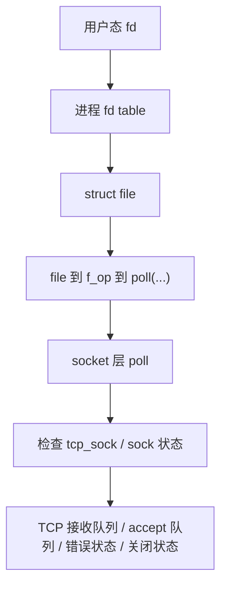

对一个**已连接 TCP socket**，read-ready 通常来自这些内核状态：

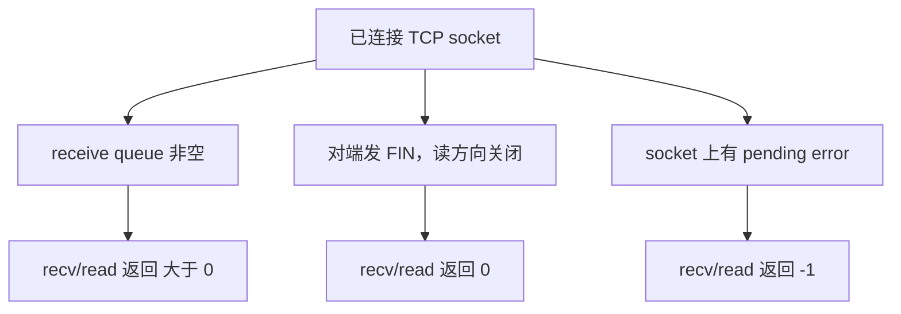

对一个**监听 socket**，read-ready 的含义不是“有字节可读”，而是：


所以 `select` 返回“可读”时，真正的判断者是 socket/TCP 栈的 `poll` 回调；`select` 只是统一调度这些 fd 的 `poll` 回调，并把结果汇总成 fd_set 返回给用户态。

**🔧 网络包到达后，等待中的 `select` 怎么被叫醒**

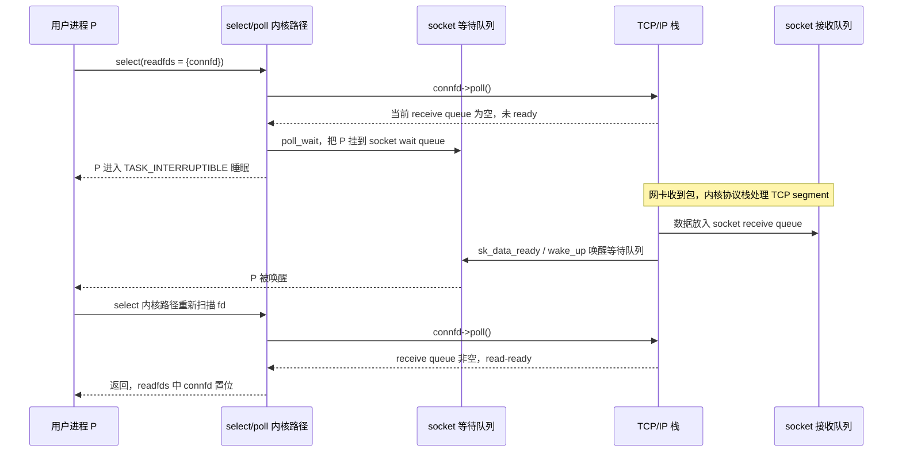

这张时序图可以拆成三个阶段：

1. 第一次扫描：`connfd->poll()` 发现接收队列为空，`poll_wait` 把进程登记到 socket 等待队列。
2. 网络包到达：TCP 栈把 payload 放入 socket receive queue，并唤醒 socket wait queue。
3. 重新确认：`select` 醒来后再次调用 `connfd->poll()`，确认 read-ready 后把 `connfd` 写回 ready fd_set。

关键点是：**唤醒只说明“可能有状态变化”，不等于直接把哪个 fd 的最终结果告诉用户态**。所以 `select` 醒来后必须重新扫描 fd，并重新调用各自的 `poll` 方法确认 ready 状态。


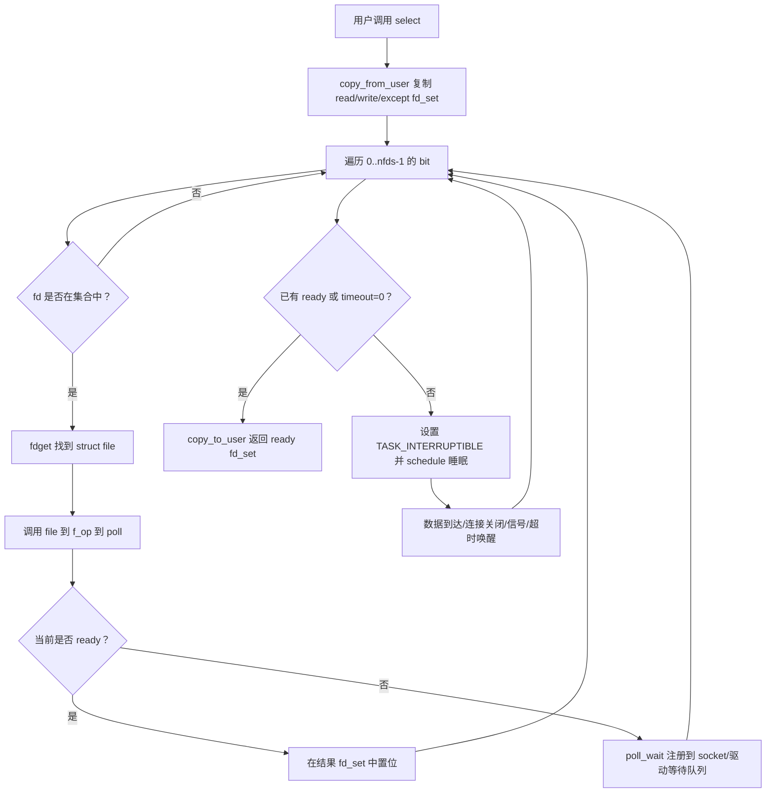

这张流程图对应的关键步骤是：`copy_from_user` 复制 fd_set、逐 fd 调用 `poll`、必要时 `poll_wait` 登记等待关系、睡眠、唤醒后重新扫描，最后 `copy_to_user` 返回 ready fd_set。

**🎯 等待队列关系图**

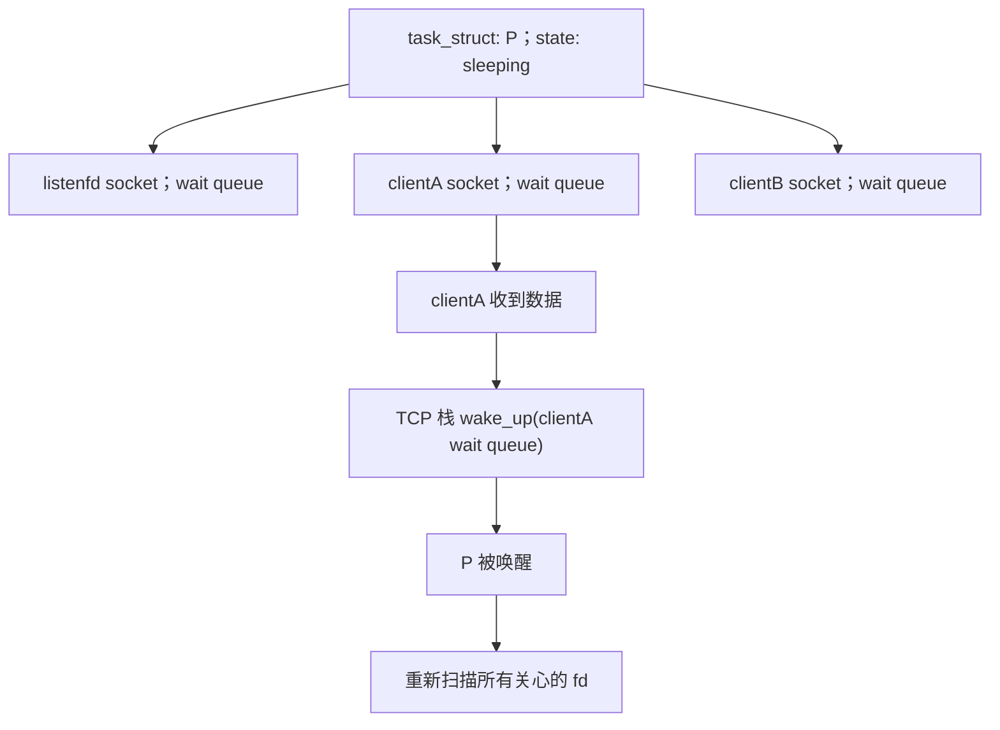

为什么要重新扫描？因为唤醒可能是信号、超时、多个 fd 同时变化，也可能是虚假唤醒；内核最终必须再问一遍每个 fd 的 `poll` 方法，把返回结果精确写回用户态。

---

## 复杂度和性能直觉

**🎯 select 的成本和 fd 范围有关，不只和活跃连接有关**

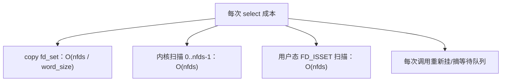

如果只有 10 个连接，但最大 fd 是 900，循环也经常要围绕 `0..900` 工作。


这就是 `select` 在稀疏 fd 场景下的浪费。

**⚠️ select 没有“内核长期记住兴趣集合”**

每一轮都需要：


这和 `epoll` 的 `epoll_ctl` 先注册、`epoll_wait` 后只取就绪队列，是本质差别。

---

## 常见易错点

- **以为 `FD_SET` / `FD_ISSET` 的第一个参数必须是 `listenfd` → 第一个参数只是要操作的 fd，传 `listenfd` 是为了监听新连接，传 `connfd` 是为了检查普通连接数据。**
- **以为 `select` 会返回“读到的数据” → 它只返回 ready 状态，真正的数据仍要自己 `read`。**
- **忘记每轮复制 fd_set → `select` 会原地修改集合，导致下一轮漏监听 fd。**
- **`nfds` 传连接数 → 正确是最大 fd 加 1，不是 fd 的数量。**
- **忽略 `FD_SETSIZE` → 默认 1024 限制下，`FD_SET(1500, ...)` 可能越界写内存。**
- **可读就认为一定有业务数据 → EOF、错误、监听 socket 上的 pending connection 也会表现为 readable。**
- **没有处理 `EINTR` → 信号打断 `select` 是正常情况，应按需求重试或退出。**
- **在阻塞 fd 上做大块 `write` → 某个慢客户端可能让单进程事件循环卡住。**
- **关闭 fd 后忘记 `FD_CLR` → 后续 `select` 可能返回 `EBADF`，或者 fd 号复用后误操作新连接。**

---

## 工程关联

- **CSAPP Tiny / echo server 的下一步演进**：§12.1 是 `fork` 一个子进程服务一个连接，§12.2 的 `select` 是一个进程用事件循环管理多个连接。
- **Redis 早期事件循环的入门模型**：真实 Redis 会按平台选择 `epoll` / `kqueue` / `select` 等后端，但抽象层仍是“等待 fd ready，再执行回调”。
- **GUI / 网络库主循环**：事件循环不是网络独有，GUI 等鼠标键盘事件、定时器、pipe/eventfd 通知，本质也都是“等待多个事件源”。
- **线上排障看 fd 数量**：`ulimit -n`、`lsof -p <pid>`、`/proc/<pid>/fd` 直接影响 `select` 可扩展性；fd 号过大时即使连接数不多也可能踩 `FD_SETSIZE`。

---

## 建议实验

**🧪 题 1：观察 fd_set 被 select 修改**

要求：

1. 写一个程序监听 stdin fd 0。
2. 调用 `select` 前后分别打印 `FD_ISSET(0, &set)`。
3. 在 timeout=0 且没有输入时观察：返回后 bit 被清掉。
4. 解释为什么真实循环必须保留 `all_reads`，每轮复制到 `ready_reads`。

**🧪 题 2：验证 `nfds=maxfd+1`**

要求：

1. 创建 pipe，得到两个 fd。
2. 故意把 `nfds` 传成 `1` 或连接数量，而不是 `readfd + 1`。
3. 往 pipe 写入数据，观察 `select` 不报告 readfd ready。
4. 修正为 `readfd + 1` 后再次验证。

**🧪 题 3：用 strace 看 select 阻塞与唤醒**

要求：

```bash
strace -tt -e trace=pselect6,select ./select_server 8080
```

1. 客户端连接前，观察进程卡在 `pselect6`。
2. 客户端连接后，`pselect6` 返回。
3. 客户端关闭连接后，服务端 `read` 返回 0，并关闭 fd。

说明：glibc 的 `select` 在现代 Linux 上常通过 `pselect6` 系统调用实现，这是正常现象。
