# §12.3 基于线程的并发编程

这一节的主线是：**线程把“并发执行流”和“进程资源容器”分开——同一进程中的多个线程各自拥有寄存器、程序计数器和栈，却共享代码、全局数据、堆、虚拟地址空间以及打开文件表**。POSIX 线程用 `pthread_create` 创建执行流，用 `pthread_join` 或 detach 管理线程资源；线程共享资源使通信比进程直接，但也意味着一个线程的越界写、`close`、`exit` 或数据竞争会影响整个进程。基于线程的并发服务器因此比 fork-per-connection 更轻量，但必须正确处理连接参数的所有权、共享 fd 语义和线程生命周期。

> 本节代码组织：`experiments/thread_echo_server.c` 是教材 thread-per-connection echo server 的可运行实现，复用第 10 章 RIO 和第 11 章 socket 封装；`experiments/Makefile` 会复用 §12.1 的客户端源码构建本地 `echo_client`。执行 `make demo` 会先建立一条延迟发送的连接，再验证另外两条连接仍能及时回显。

---

## 线程执行模型

**🎯 线程是进程中的逻辑执行流**

一个传统单线程进程只有一条执行流；多线程进程则包含多条由内核独立调度的执行流：

```text
单线程进程                         多线程进程
┌──────────────────┐              ┌──────────────────┐
│ 虚拟地址空间      │              │ 共享虚拟地址空间  │
│ 代码/数据/堆      │              │ 代码/数据/堆      │
│                  │              │                  │
│ thread 0         │              │ thread 0         │
│ PC/寄存器/栈      │              │ PC/寄存器/栈      │
└──────────────────┘              │ thread 1         │
                                  │ PC/寄存器/栈      │
                                  └──────────────────┘
```

每个线程独有自己的执行上下文：

- 线程 ID；
- 程序计数器 `PC`；
- 通用寄存器和条件码；
- 栈指针和逻辑上的私有栈；
- 调度状态以及线程局部存储（TLS）。

进程内线程共享：

- 同一份代码段和全局/静态数据；
- 堆和内存映射区；
- 同一个虚拟地址空间；
- 进程级打开文件描述符表；
- 当前工作目录、用户身份和多数进程级资源。

```c
#include <pthread.h>
#include <stdio.h>
#include <stdlib.h>

static int global_count = 42;         // 所有线程共享
static _Thread_local int local_count; // 每个线程各有一份

static void *worker(void *arg) {
    int stack_value = 42;              // 位于当前线程的栈上
    local_count++;
    printf("arg=%p stack=%p global=%p tls=%p value=%d\n",
           arg, (void *)&stack_value,
           (void *)&global_count, (void *)&local_count, global_count);
    return NULL;
}
```

`stack_value` 由当前线程的栈分配，`global_count` 位于共享数据区，`local_count` 则由 TLS 机制为每个线程提供独立实例。

**⚠️ “线程私有栈”不是内存保护边界**

线程栈在逻辑上归各线程独立使用，但所有线程仍处于同一个地址空间；只要获得地址，一个线程就能访问另一个线程栈中的对象：

```c
static void *reader(void *arg) {
    int *p = arg;
    printf("%d\n", *p);  // 能访问另一个线程传来的栈地址
    return NULL;
}
```

这不代表传递栈地址总是安全：必须同时保证该对象在线程使用期间仍然存活，并为并发读写建立同步。进程之间默认有页表隔离，线程之间没有这种故障隔离；一个线程发生非法写或段错误，通常会破坏或终止整个进程。

**🎯 线程之间是对等关系**

创建进程后，父进程与子进程有明确的父子层级；线程模型则把所有线程看作同一线程池中的对等成员。创建者不会因为创建了新线程而天然拥有特殊控制权：

```text
main thread ──pthread_create──> worker A
      │
      └──────pthread_create──> worker B

worker A 也可以创建 worker C；
任意满足条件的线程都可以 join 一个 joinable 线程。
```

新线程从指定的 start routine 开始执行，并与创建者并发运行；`pthread_create` 返回时，无法假定创建者和新线程谁先执行下一条指令。

---

## 专题：到底哪些操作是原子的

多线程里“原子操作”最容易被误解成“执行时绝不会被操作系统打断”。更准确的定义是：**从其他线程的视角看，这个操作不可再分；其他线程只能看到它发生前或发生后的状态，看不到中间状态。**

线程仍然可能在原子操作前后，甚至在某些实现细节中被调度器切走；关键是语言、硬件或内核共同保证其他线程不会观察到半个结果。

```text
不是原子：
    其他线程可能看到中间状态，或多个线程的读改写互相覆盖。

原子：
    操作对其他线程表现为一个不可分割的点：

    before state ── atomic operation ── after state
                    ↑
              线性化点
```

**🎯 “一行 C 代码”不等于一个原子操作**

例如：

```c
counter = counter + 1;
```

它看起来是一行，但机器层面通常至少分成三步：

```text
load   counter -> register
add    register, 1
store  register -> counter
```

两个线程同时执行时，可能这样交错：

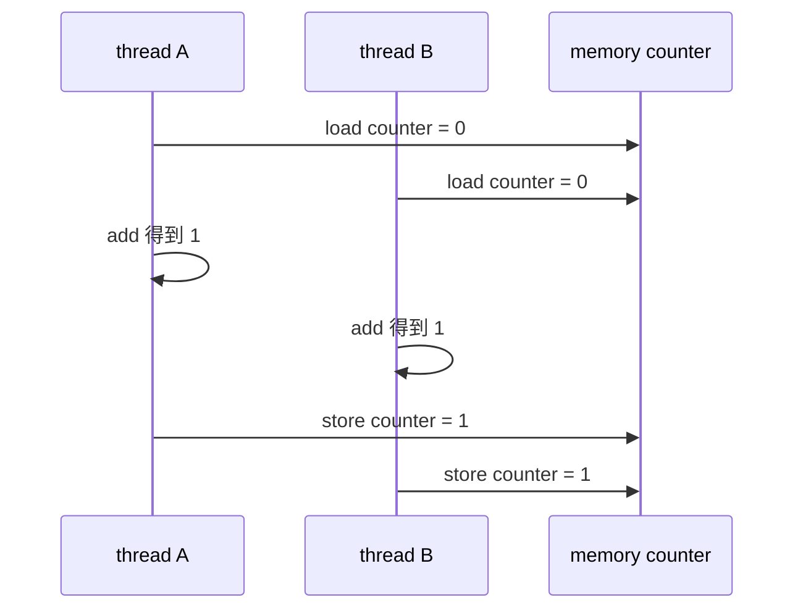

两个线程都执行了一次 `+1`，最终结果却是 `1`，不是 `2`。这叫 lost update。问题不在于编译器把一行拆成多行，而在于这个“读-改-写”整体没有被同步保护。

**⚠️ 普通变量的并发读写不是可靠原子语义**

在 C/C++ 里，只要多个线程并发访问同一个普通对象，其中至少一个是写，并且没有同步关系，就形成 data race；有 data race 的程序行为不可靠。

```c
static int counter;

static void *worker(void *arg) {
    counter++;  // 错误：普通 int 的 read-modify-write 没有同步
    return NULL;
}
```

即使某个平台上“对齐的 32 位 `int` 读写”在硬件上通常不会撕裂，也不等于这段 C 代码拥有可移植、可靠的多线程语义。语言层面仍然要求用 atomic 或锁来同步共享可变状态。

`volatile` 也不能解决这个问题：

```c
static volatile int counter;

counter++;  // 仍然不是线程同步，也不是原子 read-modify-write
```

`volatile` 主要约束编译器不要随意省略某些访问，常用于内存映射 I/O 或信号相关场景；它不是 mutex，也不是 atomic。

**🎯 真正可依赖的原子操作来自明确的同步原语**

在本章语境里，可以按层次理解：

| 类型 | 是否能依赖 | 例子 | 说明 |
|---|---|---|---|
| 普通表达式 | 不能当成原子 | `x++`、`x = x + 1`、`if (!flag) flag = 1` | 可能拆成多次读写，且没有同步关系 |
| 普通对象读写 | 不能作为跨线程同步 | `shared = 42`、`int v = shared` | 某些硬件上可能不撕裂，但 C/C++ data race 仍然不可靠 |
| C11 `_Atomic` / C++ `std::atomic` | 可以 | `atomic_load`、`atomic_store`、`atomic_fetch_add`、`compare_exchange` | 由语言定义原子性和内存序 |
| mutex 保护的临界区 | 可以作为整体互斥 | `pthread_mutex_lock` 后访问共享对象 | 临界区里的普通操作本身不神奇，但其他守规矩线程不能同时进入 |
| 条件变量 / join / semaphore | 提供同步关系 | `pthread_join`、`pthread_cond_wait` | 解决顺序和可见性，不等于把任意表达式变成原子 |
| 特定 syscall 语义 | 只能按文档依赖 | `O_APPEND` 写文件偏移、pipe 小于等于 `PIPE_BUF` 的写入 | 原子范围由内核接口定义，不能泛化到所有 I/O |

**🎯 `atomic_fetch_add` 才是原子的自增**

```c
#include <stdatomic.h>

static _Atomic int counter;

static void *worker(void *arg) {
    atomic_fetch_add_explicit(&counter, 1, memory_order_relaxed);
    return NULL;
}
```

这里的 read-modify-write 是一个原子操作：多个线程同时执行时，每次加一都不会丢。

```text
counter = 0

thread A: atomic_fetch_add(counter, 1)  线性化为第 1 次加法
thread B: atomic_fetch_add(counter, 1)  线性化为第 2 次加法

最终 counter = 2
```

`memory_order_relaxed` 已经保证这个计数操作本身是原子的，但它不保证和其他普通数据访问之间的先后可见关系。原子性和内存顺序是两个概念：

```text
atomicity：这个变量的一次操作是否不可分、是否会丢更新
ordering：这个操作前后的其他内存访问，其他线程按什么顺序可见
```

计数器、统计值常可用 relaxed；发布配置、队列节点、任务状态等需要跨变量传递含义时，就要用 acquire/release、seq_cst，或者直接用 mutex 把逻辑包起来。

**🎯 mutex 的原子性体现在“进入临界区”**

```c
static int counter;
static pthread_mutex_t mutex = PTHREAD_MUTEX_INITIALIZER;

static void *worker(void *arg) {
    pthread_mutex_lock(&mutex);
    counter++;
    pthread_mutex_unlock(&mutex);
    return NULL;
}
```

这里 `counter++` 本身仍然是 load/add/store，但所有访问 `counter` 的线程都遵守同一把锁时，同一时刻只有一个线程能执行这段临界区：

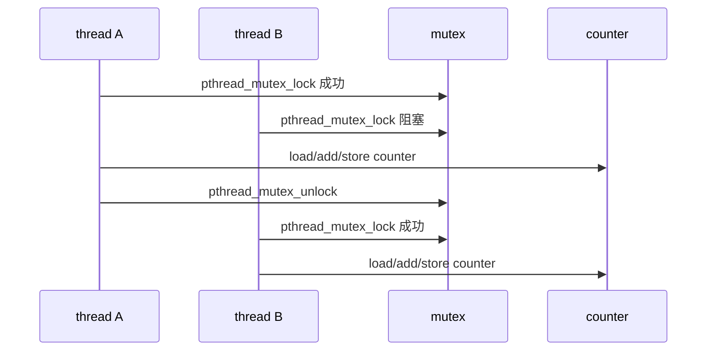

注意：线程 A 持锁期间仍然可能被操作系统抢占。只是线程 B 即使被调度运行，也会卡在同一把 mutex 上，无法进入这段受保护代码。因此 mutex 保护的是共享状态的互斥访问，不是保证持锁线程永远占着 CPU 不被切走。

**⚠️ 判断一个操作是否原子，要先问“在哪个层次上”**

```text
C 语言层面：
    只有 _Atomic 操作和同步原语给出可靠并发语义。

硬件层面：
    某些对齐的单字 load/store 可能天然不可撕裂；
    read-modify-write 通常需要 lock 指令或 LL/SC/CAS 等机制。

内核接口层面：
    某些 syscall 对某个内核对象有特定原子保证；
    这些保证只在文档规定的条件下成立。
```

工程里最稳的判断规则是：**共享可变数据要么只由一个线程拥有，要么用 mutex 保护，要么声明为 atomic 并清楚选择内存序。不要靠“这句代码很短”“这个类型机器一次能写完”“我觉得调度器不会刚好切走”来判断安全。**

---

## POSIX 线程基本接口

**🎯 `pthread_t` 是不透明线程标识**

POSIX 线程接口定义在 `<pthread.h>` 中。当前线程可通过 `pthread_self` 取得自己的 ID；比较两个 ID 应使用 `pthread_equal`，而不是假定 `pthread_t` 一定是整数：

```c
#include <pthread.h>

pthread_t me = pthread_self();
pthread_t other = /* 已保存的线程 ID */;

if (pthread_equal(me, other)) {
    /* 同一个线程 */
}
```

`pthread_t` 的实际类型由实现决定，可能是整数，也可能是指针或其他类型。它也不同于 Linux 内核中由 `gettid(2)` 返回的 TID，不能混为一谈。

**⚠️ pthread 接口通常直接返回错误码**

大部分 pthread 函数成功时返回 `0`，失败时直接返回非零错误编号，而不是返回 `-1` 并设置 `errno`：

```c
#include <errno.h>
#include <pthread.h>
#include <stdio.h>
#include <string.h>

pthread_t tid;
int rc = pthread_create(&tid, NULL, worker, NULL);
if (rc != 0) {
    fprintf(stderr, "pthread_create: %s\n", strerror(rc));
}
```

因此检查 `errno` 可能打印出与本次调用无关的旧错误；应把函数返回值传给 `strerror`。

**🔧 编译和链接 pthread 程序**

```bash
gcc -std=c11 -O2 -Wall -Wextra -Wpedantic -pthread thread_demo.c -o thread_demo
```

应使用 `-pthread` 而不只是手工写 `-lpthread`：前者除了链接线程库，还会启用编译阶段所需的线程相关宏和选项，并同时作用于编译与链接步骤。

---

## 创建线程与传递参数

**🎯 `pthread_create` 指定入口函数和一个无类型参数**

```c
int pthread_create(pthread_t *thread,
                   const pthread_attr_t *attr,
                   void *(*start_routine)(void *),
                   void *arg);
```

- `thread`：成功后写入新线程 ID；
- `attr`：线程属性，传 `NULL` 使用默认属性；
- `start_routine`：新线程入口；
- `arg`：原样传给入口函数的单个 `void *` 参数。

**🎯 `pthread_attr_t` 配置线程创建时的初始属性**

线程属性对象遵循固定的 `init → set → create → destroy` 生命周期：

```c
pthread_attr_t attr;
int rc = pthread_attr_init(&attr);
if (rc != 0) {
    fprintf(stderr, "pthread_attr_init: %s\n", strerror(rc));
    return 1;
}

rc = pthread_attr_setdetachstate(&attr, PTHREAD_CREATE_DETACHED);
if (rc != 0) {
    fprintf(stderr, "pthread_attr_setdetachstate: %s\n", strerror(rc));
    pthread_attr_destroy(&attr);
    return 1;
}

pthread_t tid;
rc = pthread_create(&tid, &attr, worker, arg);
pthread_attr_destroy(&attr); // 只销毁属性对象，不影响已经创建的线程

if (rc != 0) {
    fprintf(stderr, "pthread_create: %s\n", strerror(rc));
    return 1;
}
```

`pthread_create` 会复制创建线程所需的属性，因此调用返回后即可 `pthread_attr_destroy`；同一个已初始化的属性对象也可以重复创建多条配置相同的线程。POSIX 线程属性及常见 Linux 扩展如下：

| 属性 | set/get 接口 | 默认值或 Linux 行为 | 作用与关键限制 |
|---|---|---|---|
| 分离状态 | `pthread_attr_set/getdetachstate` | `PTHREAD_CREATE_JOINABLE` | 可设为 `PTHREAD_CREATE_DETACHED`，线程退出后自动回收且不能 `pthread_join`；若创建时已设 detached，worker 中不要再次 `pthread_detach` |
| 栈大小 | `pthread_attr_set/getstacksize` | Linux/glibc 通常根据进程启动时的 `RLIMIT_STACK` 决定，不能硬编码假定为 8 MiB | 控制每线程栈的保留空间；必须不小于 `PTHREAD_STACK_MIN`，过小可能因深调用、递归、TLS 或大型局部变量栈溢出 |
| 自定义栈 | `pthread_attr_set/getstack` | 默认由 pthread 实现分配 | 同时指定栈地址和大小；调用者必须保证对齐、生命周期和最终释放，普通业务代码不建议使用；旧的 `set/getstackaddr` 已废弃 |
| 栈保护区 | `pthread_attr_set/getguardsize` | 通常至少一页，具体由实现决定 | 在栈边缘设置不可访问区域，使越界更早触发 `SIGSEGV`；自己用 `pthread_attr_setstack` 提供栈时，通常也要自己负责保护页 |
| 调度属性来源 | `pthread_attr_set/getinheritsched` | `PTHREAD_INHERIT_SCHED` | 设为 `PTHREAD_EXPLICIT_SCHED` 后，下面的调度策略和优先级才按属性对象生效 |
| 调度策略 | `pthread_attr_set/getschedpolicy` | 普通程序通常为 `SCHED_OTHER` | 还可请求实时策略 `SCHED_FIFO`、`SCHED_RR`；使用不当会饿死普通线程，并通常需要 `CAP_SYS_NICE` 或相应资源限制权限 |
| 调度优先级 | `pthread_attr_set/getschedparam` | `SCHED_OTHER` 通常要求 `sched_priority == 0` | 通过 `struct sched_param` 设置；实时策略的合法范围应由 `sched_get_priority_min/max` 查询，不能硬编码 |
| 竞争范围 | `pthread_attr_set/getscope` | Linux NPTL 只支持 `PTHREAD_SCOPE_SYSTEM` | POSIX 还定义 `PTHREAD_SCOPE_PROCESS`，但 Linux 设置它通常返回 `ENOTSUP` |
| CPU affinity（Linux 扩展） | `pthread_attr_set/getaffinity_np` | 默认继承创建者允许使用的 CPU 集合 | 创建时限制线程可运行的 CPU；需要 `_GNU_SOURCE`，适合基准测试或 NUMA 调优，但过度绑核可能造成负载不均衡 |

传 `NULL` 表示使用默认属性：

```c
pthread_create(&tid, NULL, worker, arg);
```

它通常表示创建一条 joinable、默认栈、继承创建者调度属性的线程。当前 thread-per-connection 实验传 `NULL`，再由 worker 调用 `pthread_detach(pthread_self())`；也可以创建一份 `PTHREAD_CREATE_DETACHED` 属性供所有 worker 共用，创建成功后线程从一开始就是 detached。

**⚠️ 不是所有线程状态都属于 `pthread_attr_t`**

线程名称用 Linux `pthread_setname_np`，取消状态用 `pthread_setcancelstate` / `pthread_setcanceltype`，signal mask 通常在创建前通过 `pthread_sigmask` 设置并由新线程继承，TLS 则使用 `_Thread_local` 或 `pthread_key_create`。`pthread_mutexattr_t` 和 `pthread_condattr_t` 分别配置 mutex 与 condition variable，也不能和 `pthread_attr_t` 混用。

```c
#include <pthread.h>
#include <stdio.h>

struct task {
    int id;
    const char *message;
};

static void *worker(void *arg) {
    struct task *task = arg;
    printf("worker %d: %s\n", task->id, task->message);
    return NULL;
}

int main(void) {
    pthread_t tid;
    struct task task = {.id = 1, .message = "hello"};

    int rc = pthread_create(&tid, NULL, worker, &task);
    if (rc != 0) {
        return 1;
    }

    rc = pthread_join(tid, NULL); // join 前 task 始终存活
    return rc != 0;
}
```

需要传多个值时，通常封装到一个结构体中；调用者必须保证结构体在线程使用期间仍然有效。

**⚠️ 循环变量地址会造成生命周期和竞态问题**

下面的代码把所有线程都指向同一个 `i`：

```c
pthread_t tids[4];

for (int i = 0; i < 4; ++i) {
    pthread_create(&tids[i], NULL, worker, &i); // 错误
}
```

这里容易误解成“每次循环都把当时的 `i` 值传给了线程”。实际上传的是 `&i`：一个地址。

```text
main thread 的栈

┌──────────────────────────────┐
│ for 循环变量 i                │  地址假设为 0x7ffe...100
└──────────────────────────────┘

第 0 次 pthread_create(..., &i) 传入 0x7ffe...100
第 1 次 pthread_create(..., &i) 传入 0x7ffe...100
第 2 次 pthread_create(..., &i) 传入 0x7ffe...100
第 3 次 pthread_create(..., &i) 传入 0x7ffe...100
```

`pthread_create` 会把 `arg` 这个指针值交给新线程，但不会替你复制 `*arg` 指向的对象。所以上面 4 个 worker 拿到的是同一个地址，而不是 4 份独立的 `0、1、2、3`。

如果 worker 这么写：

```c
static void *worker(void *arg) {
    int id = *(int *)arg;
    printf("id=%d\n", id);
    return NULL;
}
```

那么它什么时候解引用 `arg`，完全取决于调度。`pthread_create` 返回后，main thread 可能继续跑好几轮，worker 也可能马上运行：

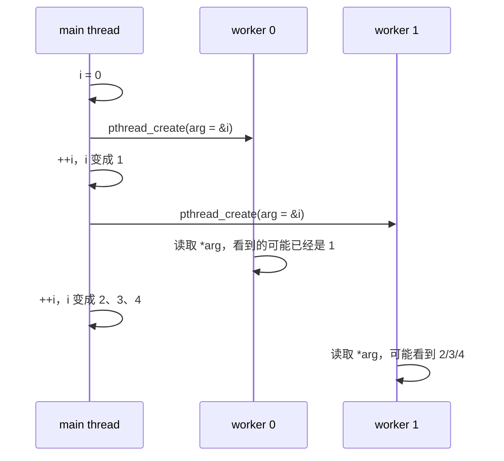

这里有两个独立问题。

**第一，data race。** main thread 在循环控制逻辑里持续写 `i`，worker thread 同时读 `i`。这两个访问没有 mutex、atomic、join、condition variable 等同步关系，其中至少一个是写操作，因此就是 data race。结果不只是“打印值不稳定”，而是程序行为已经不可靠。`pthread_create` 只能建立“创建前已经写好的数据可被新线程看到”的基本关系，不能冻结 `i` 的值，也不能保护创建之后 main 对 `i` 的继续修改。

```text
共享对象：i

main thread:   write i (++i)
worker thread: read  i (*(int *)arg)
同步关系：     没有

结论：data race
```

**第二，生命周期错误。** `for (int i = 0; ...)` 中的 `i` 是 main thread 栈上的自动变量。它的生命周期只覆盖这个 `for` 语句；第一段循环结束后，这个对象就不存在了。此时如果某个 worker 才开始运行，它手里的 `arg` 仍然是旧地址，但该地址已经不再指向一个有效的 `int i`。

```text
for 循环执行中：
    &i 仍然指向活着的对象，但 main 和 worker 并发读写它 → data race

for 循环结束后：
    i 生命周期结束，worker 再读 *(int *)arg → 悬空指针
```

这也是为什么“我马上在后面 join 所有线程”仍然不够。`pthread_join` 等的是线程结束，它发生在创建循环之后；而第一段循环变量 `i` 在进入 join 循环之前就已经销毁了。join 可以让 main 等 worker，但不能让一个已经结束生命周期的局部变量重新变得有效。

为每个线程分配稳定且独立的参数：

```c
struct task tasks[4];
pthread_t tids[4];

for (int i = 0; i < 4; ++i) {
    tasks[i].id = i;
    tasks[i].message = "work";
    pthread_create(&tids[i], NULL, worker, &tasks[i]);
}

for (int i = 0; i < 4; ++i) {
    pthread_join(tids[i], NULL);
}
```

每个线程只读取自己的 `tasks[i]`，且数组直到全部 join 完成后都保持存活。

这个修复同时满足两条规则：

```text
独立存储：
    worker 0 -> &tasks[0]
    worker 1 -> &tasks[1]
    worker 2 -> &tasks[2]
    worker 3 -> &tasks[3]

生命周期足够长：
    tasks[] 在 main 的栈帧中
    创建所有线程之后仍然存在
    join 所有线程之后才离开作用域
```

如果参数必须在函数返回后仍被 detached 线程使用，就不能放在调用者栈上，而应分配到堆上，并把释放责任明确交给 worker：

```c
int *id = malloc(sizeof(*id));
*id = i;

int rc = pthread_create(&tid, NULL, worker, id);
if (rc != 0) {
    free(id);
}
```

**⚠️ 创建成功不意味着新线程已经执行**

```c
pthread_create(&tid, NULL, worker, NULL);
printf("main\n");
```

输出既可能是：

```text
main
worker
```

也可能是：

```text
worker
main
```

调度顺序不能作为同步机制。若业务要求固定先后关系，必须使用 `pthread_join`、mutex、condition variable、semaphore 等明确的同步原语，而不是依赖 `sleep`。

---

## 线程终止

**🎯 一个线程有多种终止路径**

线程可以通过以下方式结束：

1. start routine 执行 `return retval`；
2. 调用 `pthread_exit(retval)`；
3. 被其他线程通过 `pthread_cancel` 请求取消；
4. 整个进程终止时，所有线程一起消失。

```c
#include <pthread.h>

static void *return_worker(void *arg) {
    return arg;
}

static void *exit_worker(void *arg) {
    pthread_exit(arg);
}
```

对 start routine 而言，`return arg` 与 `pthread_exit(arg)` 都只终止当前线程，并把 `arg` 作为退出值交给 join 它的线程。

**⚠️ `exit` 与 `pthread_exit` 的作用域完全不同**

```c
static void *worker(void *arg) {
    if (fatal_for_request(arg)) {
        pthread_exit(NULL); // 只结束当前线程
    }

    if (fatal_for_process(arg)) {
        exit(EXIT_FAILURE); // 终止整个进程及全部线程
    }
    return NULL;
}
```

任意线程调用 `exit`、`_exit`，或者进程因未处理的致命信号而退出，都会结束整个进程。`main` 函数执行 `return` 等价于调用 `exit`，不会只结束 main thread：

```c
int main(void) {
    pthread_t tid;
    pthread_create(&tid, NULL, worker, NULL);
    return 0; // 可能在 worker 完成前终止整个进程
}
```

如果 main thread 想结束自己但让其他线程继续，可以调用：

```c
pthread_exit(NULL);
```

不过工程中通常更推荐明确 join 所有需要等待的线程，使生命周期和错误处理更清晰。

**⚠️ 线程退出值必须在 join 时仍然有效**

下面返回了已失效的栈地址：

```c
static void *bad_worker(void *arg) {
    int result = 42;
    return &result; // 错误：线程退出后其栈对象生命周期结束
}
```

可由调用者提供结果存储，或让 worker 在堆上分配结果并把释放责任交给 join 者：

```c
static void *good_worker(void *arg) {
    int *result = malloc(sizeof(*result));
    if (result != NULL) {
        *result = 42;
    }
    return result;
}

int *result = NULL;
pthread_join(tid, (void **)&result);
if (result != NULL) {
    printf("%d\n", *result);
    free(result);
}
```

---

## 回收 joinable 线程

**🎯 `pthread_join` 等待线程结束并回收资源**

```c
int pthread_join(pthread_t thread, void **retval);
```

默认创建的线程是 joinable。`pthread_join` 会阻塞到目标线程终止，回收其尚未释放的线程资源，并可取得退出值：

```c
pthread_t tid;
void *result = NULL;

pthread_create(&tid, NULL, worker, task);
int rc = pthread_join(tid, &result);
if (rc == 0) {
    consume_result(result);
}
```

`retval == NULL` 表示不需要退出值。目标线程若响应取消请求而终止，成功 join 后退出值为 `PTHREAD_CANCELED`。

**🎯 join 同时建立明确的 happens-before 关系**

若 worker 在结束前写入共享对象，成功 `pthread_join` 后，join 者可以观察到这些写入：

```c
static int result;

static void *worker(void *arg) {
    result = 42;
    return NULL;
}

int main(void) {
    pthread_t tid;
    pthread_create(&tid, NULL, worker, NULL);
    pthread_join(tid, NULL);
    printf("%d\n", result); // join 后读取 42
}
```

这里 worker 写入发生在退出前，而 join 返回发生在退出后，因此 main 的读取有同步保证。若去掉 join 并让两个线程并发读写 `result`，就可能形成 data race。

**⚠️ joinable 线程结束后不会自动释放全部资源**

已经终止但尚未 join 的 joinable 线程不再执行代码，却仍保留供 `pthread_join` 获取状态所需的资源；长期创建后不 join，会造成类似“资源泄漏”的积累：

```c
for (;;) {
    pthread_t tid;
    pthread_create(&tid, NULL, worker, NULL);
    // 既没有 pthread_join，也没有 pthread_detach：错误
}
```

它与僵尸进程有相似的“已结束但待回收”直觉，但不是可由 `waitpid` 回收的进程，也不应简单等同为 Linux 进程表中的僵尸状态。

**⚠️ 一个线程只能被成功 join 一次**

同时由多个线程 join 同一个目标，或在已经成功 join 后再次 join，其行为不具备可移植保证；线程 ID 也可能在资源回收后被复用。应明确指定唯一的 join 所有者。

---

## 分离 detached 线程

**🎯 detached 线程终止后自动回收资源**

不需要返回值、也不需要等待完成的线程可被分离：

```c
int pthread_detach(pthread_t thread);
```

典型 worker 在入口处分离自己：

```c
static void *worker(void *arg) {
    pthread_detach(pthread_self());
    handle_task(arg);
    return NULL;
}
```

线程也可在创建时通过 `pthread_attr_setdetachstate` 设置为 detached：

```c
pthread_attr_t attr;
pthread_attr_init(&attr);
pthread_attr_setdetachstate(&attr, PTHREAD_CREATE_DETACHED);
pthread_create(&tid, &attr, worker, arg);
pthread_attr_destroy(&attr);
```

线程终止后，其栈和线程控制结构等资源由实现自动回收，不需要、也不能再通过 `pthread_join` 获取退出值。

**⚠️ detach 不是让线程脱离进程**

分离只改变“谁负责回收线程资源”，不会创建新的进程、不会使线程拥有独立地址空间，也不会保证 main thread 或进程退出后该线程继续运行：

```text
joinable：终止 → 等待 pthread_join 回收
 detached：终止 → 自动回收

两者：进程退出 → 都立即消失
```

“无需 join”也不等于“无需管理”。如果进程关闭前必须确保任务完成，就不能仅 detach 后直接退出，而应设计关闭协议、任务计数、condition variable 或改用可 join 的 worker pool。

**⚠️ detach 后不能可靠地取得任务结果**

fire-and-forget 工作若失败，创建者不能通过 `pthread_join` 收到结果；工程上必须另外设计状态上报、日志、future/promise 或任务队列。对服务端连接线程而言，错误通常在线程内部完成记录和清理，因此适合 detached；对必须汇总结果的并行计算则通常适合 joinable。

---

## 一次性初始化

**🎯 `pthread_once` 保证初始化函数恰好执行一次**

多个线程可能同时首次使用某个共享子系统。仅用普通布尔变量会产生 data race 和重复初始化：

```c
static int initialized;

if (!initialized) {
    initialize_library(); // 多个线程可能同时进入
    initialized = 1;
}
```

POSIX 提供一次性初始化接口：

```c
pthread_once_t once_control = PTHREAD_ONCE_INIT;

int pthread_once(pthread_once_t *once_control,
                 void (*init_routine)(void));
```

用法如下：

```c
#include <pthread.h>

static pthread_once_t once = PTHREAD_ONCE_INIT;
static struct config *global_config;

static void initialize_config(void) {
    global_config = load_config();
}

static void *worker(void *arg) {
    pthread_once(&once, initialize_config);
    use_config(global_config);
    return NULL;
}
```

无论多少线程并发调用 `pthread_once(&once, initialize_config)`，初始化函数只会成功执行一次；其他线程在初始化完成后才继续，因此也能安全观察初始化结果。

**🔧 C++ 中对应 `std::call_once` 与局部静态初始化**

```cpp
#include <mutex>

std::once_flag flag;

void use_service() {
    std::call_once(flag, [] {
        initialize_service();
    });
}
```

C++11 起函数局部 `static` 的初始化也由语言保证线程安全：

```cpp
Service &service() {
    static Service instance;
    return instance;
}
```

`pthread_once` 适合 C/POSIX 接口；现代 C++ 代码优先使用语言和标准库提供的 RAII 设施。

---

## 基于线程的并发服务器

**🎯 thread-per-connection 把每个连接交给一个线程**

整体结构与 fork-per-connection 类似，但 `pthread_create` 代替 `fork`：

```text
main thread
  │
  ├─ accept connfd A ─→ worker thread A ─→ service connfd A
  ├─ accept connfd B ─→ worker thread B ─→ service connfd B
  └─ accept connfd C ─→ worker thread C ─→ service connfd C
```

最小结构如下：

```c
#include <pthread.h>
#include <stdlib.h>
#include <unistd.h>

static void *serve_client(void *arg) {
    int connfd = *(int *)arg;
    free(arg);                         // worker 接管并释放参数
    pthread_detach(pthread_self());   // 无需 main thread join

    echo(connfd);
    close(connfd);                    // 服务完成后由 worker 关闭
    return NULL;
}

int main(void) {
    int listenfd = open_listenfd("8080");

    for (;;) {
        int connfd = accept(listenfd, NULL, NULL);
        if (connfd < 0) {
            continue;
        }

        int *connfdp = malloc(sizeof(*connfdp));
        if (connfdp == NULL) {
            close(connfd);
            continue;
        }
        *connfdp = connfd;

        pthread_t tid;
        int rc = pthread_create(&tid, NULL, serve_client, connfdp);
        if (rc != 0) {
            free(connfdp);
            close(connfd);
        }
    }
}
```

这里建立了清晰的所有权转移：

```text
accept 成功
  main 拥有 connfd
      │
      ├─ pthread_create 失败 → main 释放参数并 close(connfd)
      │
      └─ pthread_create 成功 → worker 拥有参数和 connfd
                                 ├─ free(connfdp)
                                 └─ 服务结束后 close(connfd)
```

**⚠️ 不能把循环中同一个 `connfd` 地址传给所有线程**

错误写法：

```c
for (;;) {
    int connfd = accept(listenfd, NULL, NULL);
    pthread_create(&tid, NULL, serve_client, &connfd);
}
```

main thread 可能在 worker 解引用前再次执行 `accept` 并覆盖 `connfd`；多个线程因此可能读取同一个新值，甚至处理或关闭错误连接。这既是参数生命周期问题，也是未同步并发读写造成的 data race。

为每次连接单独 `malloc` 一个参数，是书中示例用于避免该竞态的关键步骤。也可以从受同步保护的任务队列中传递值，但不能让线程异步借用一个会被立即复用的局部变量。

**⚠️ 线程版不能照搬进程版的 fd 关闭规则**

fork-per-connection 中，父进程和子进程拥有各自的 fd table；父进程可在 `fork` 后立即关闭自己的 `connfd` 副本：

```text
进程版：parent close(connfd) 不会关闭 child fd table 中的副本
```

同一进程内的线程共享 fd table。如果 main thread 在创建 worker 后立即调用 `close(connfd)`，关闭的是整个进程中的该描述符；worker 再使用它会收到 `EBADF`，更危险的是 fd 数字被复用后误操作其他连接：

```text
线程版：main close(connfd) == 从共享 fd table 删除该 fd
                              worker 不再拥有独立副本
```

因此线程版通常由 worker 在服务结束后关闭 `connfd`，main 在创建成功后不再访问它。若确实需要独立的 fd 引用，可显式 `dup`，但两个 fd 仍指向同一个 open file description，文件状态等语义仍需仔细分析。

**⚠️ thread-per-connection 不是无限扩展方案**

每条连接创建一个线程的优点是控制流直观，阻塞式 I/O 容易编写；缺点包括：

- 每个线程需要栈和线程控制结构；
- 大量线程会增加调度和上下文切换；
- 跨 CPU 调度会增加 cache/TLB 扰动；
- 一个恶意客户端可能用大量空闲连接耗尽线程资源；
- 创建/销毁线程本身有成本，且难以实施统一背压。

例如默认栈上限若为 8 MiB，创建 10,000 个线程会保留巨大的虚拟地址空间，即使物理页尚未全部实际分配：

```bash
ulimit -s
cat /proc/<pid>/status | grep -E 'Threads|VmSize|VmRSS'
```

真实服务通常使用固定大小线程池、任务队列和并发上限；连接数很大且多数空闲时，常见架构是 `epoll`/Reactor 管连接，把 CPU 密集或阻塞任务投递给有界 worker pool，而不是为每条连接永久创建线程。

---

## 专题：线程和协程的区别

这一章要抓住一个核心分界：**线程是操作系统内核调度的执行流；协程是语言或运行时在用户态调度的可暂停计算单元**。线程让同一进程内的多条执行流可以被内核抢占和分配到不同 CPU 上；协程则把一段逻辑拆成“可以暂停、保存状态、稍后恢复”的任务，通常由 event loop 或协程调度器在少量线程上切换执行。

```text
线程：kernel scheduler 直接调度

process
  ├─ thread A  ← 内核可随时抢占 / 放到 CPU0
  ├─ thread B  ← 内核可随时抢占 / 放到 CPU1
  └─ thread C  ← 内核可随时抢占 / 放到 CPU2

协程：runtime scheduler 在某些线程上调度

process
  ├─ thread 0
  │    ├─ coroutine a
  │    ├─ coroutine b
  │    └─ coroutine c
  └─ thread 1
       ├─ coroutine d
       └─ coroutine e
```

**🎯 一句话对比**

| 维度 | 线程 | 协程 |
|---|---|---|
| 调度者 | 操作系统内核 | 语言运行时 / async runtime / event loop |
| 调度方式 | 通常是抢占式，时间片用完、阻塞、优先级变化都会触发切换 | 通常是协作式，运行到 `await` / `yield` / 挂起点才主动让出 |
| 执行位置 | 直接运行在 CPU 上，是内核可见的调度实体 | 必须借助某条线程运行；协程本身不是 CPU 调度实体 |
| 并行能力 | 多个线程可在多个 CPU 核上同时运行 | 单线程上的多个协程不能同时运行；要并行仍需多个线程 |
| 阻塞影响 | 一个线程阻塞，内核可调度其他线程 | 协程若调用真正阻塞 syscall，可能卡住承载它的整个线程 |
| 状态保存 | 内核保存寄存器、PC、栈指针等线程上下文 | 运行时保存协程帧、局部变量、挂起位置；有栈协程还保存独立栈 |
| 内存成本 | 每线程通常有较大的栈保留空间和内核线程结构 | 单个协程通常更轻，但大量挂起协程仍会占用堆上的状态 |
| 编程风险 | data race、锁竞争、死锁、fd 共享竞态 | 忘记 `await`、阻塞 event loop、取消和生命周期泄漏、跨线程共享状态竞态 |

**🎯 协程不是“更轻的线程”这么简单**

更准确的层次关系如下：

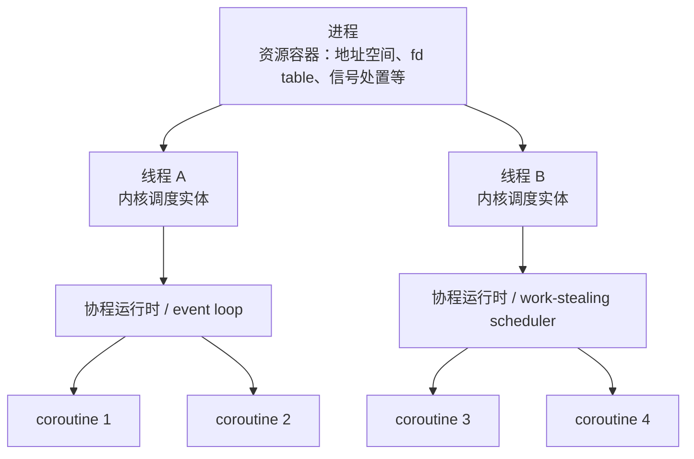

进程是资源容器，线程是内核调度单位，协程是运行时调度的任务。协程通常寄生在线程上：没有线程，协程没有地方执行；只有一个线程时，协程再多也只是交错运行，不会在多个 CPU 上同时执行。

---

### 调度：抢占式线程 vs 协作式协程

**🎯 线程切换可以发生在你没有写让出的位置**

内核线程的调度权在操作系统手里。线程 A 正在执行用户代码时，可能因为时间片用完、发生中断、主动阻塞在 `read` / `futex` / `nanosleep`、被更高优先级线程抢占等原因被切走。

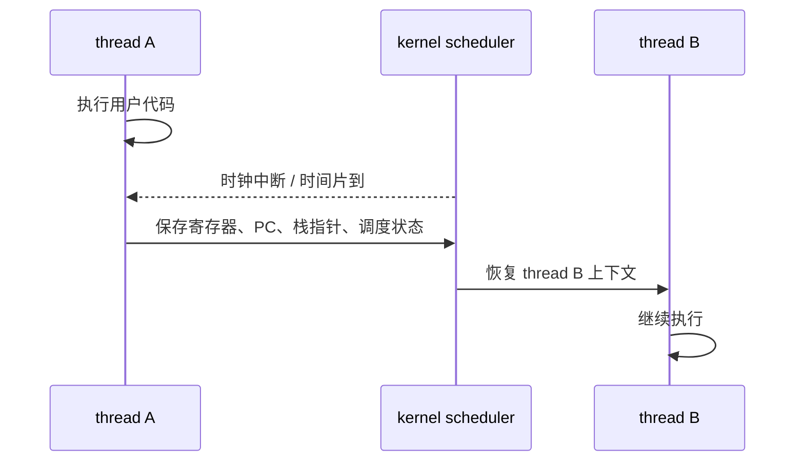

这就是为什么多线程代码中“看起来连续的几行代码”也可能被其他线程穿插：

```c
counter = counter + 1;
```

这行语句在机器层面通常包含 load、add、store 多步。内核可能在这些步骤之间切走当前线程；其他线程也能同时读写 `counter`，因此需要 mutex、atomic 或其他同步机制。

**🎯 协程切换通常发生在显式挂起点**

协程的调度权在语言或运行时中。以 async/await 风格为例，协程执行到一个尚未完成的异步操作时挂起，把控制权还给 event loop；等 I/O ready、定时器到期或任务被唤醒后，运行时再恢复它。

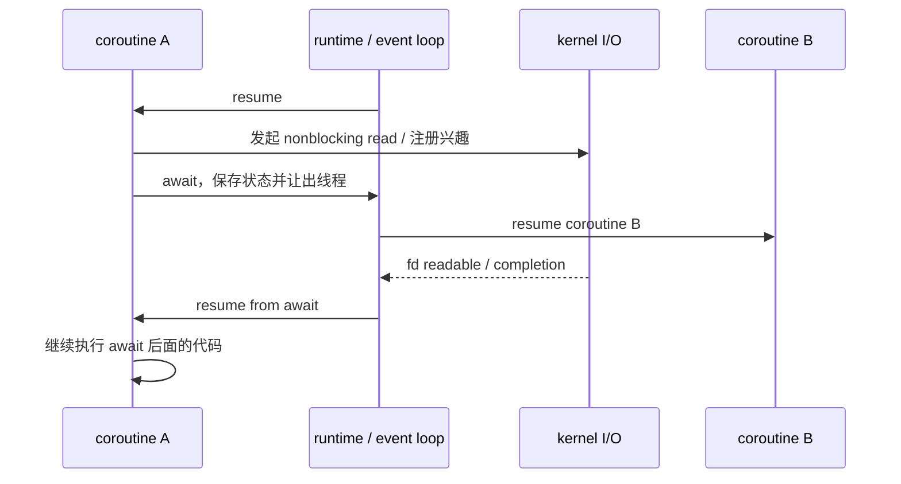

在单线程 event loop 中，协程 A 不执行到 `await`，协程 B 就没有机会运行。协程的“并发”来自大量任务在 I/O 等待期间让出线程，而不是来自每个任务都占用一个内核线程。

---

### 上下文：线程保存栈，协程保存挂起状态

**🎯 线程上下文是内核级执行现场**

线程被切换时，内核需要保存足够的信息，使它之后能像从未离开过一样继续执行：

```text
thread context
  ├─ PC / instruction pointer：下一条要执行的指令
  ├─ general registers：通用寄存器
  ├─ stack pointer：当前线程栈位置
  ├─ CPU flags / signal mask / scheduling state
  └─ kernel bookkeeping：TID、内核栈、调度队列节点等
```

线程栈通常保留较大的虚拟地址空间。即使物理内存按需分配，线程数量上去后，栈保留、页表、调度结构和上下文切换成本仍然会变成实打实的限制。

```text
process virtual address space

┌──────────────────────────────┐
│ code / rodata                │  所有线程共享
├──────────────────────────────┤
│ global / static data         │  所有线程共享
├──────────────────────────────┤
│ heap                         │  所有线程共享
├──────────────────────────────┤
│ mmap region                  │  所有线程共享
├──────────────────────────────┤
│ thread A stack               │  逻辑归 A 使用，但地址空间内可达
├──────────────────────────────┤
│ thread B stack               │  逻辑归 B 使用，但地址空间内可达
└──────────────────────────────┘
```

**🎯 无栈协程通常被编译成状态机**

很多现代语言的 async coroutine 是 stackless coroutine。它没有一条像线程那样独立增长的调用栈，而是把跨越 `await` 仍需保留的局部变量放进一个协程帧，并记录当前挂起在哪个状态。

原始写法类似：

```text
async function handle(conn) {
    req = await read_request(conn)
    resp = process(req)
    await write_response(conn, resp)
}
```

运行时或编译器可以把它理解成状态机：

```text
coroutine frame
  ├─ state = WaitingRead / Processing / WaitingWrite / Done
  ├─ conn
  ├─ req
  ├─ resp
  └─ promise / waker / continuation
```

流程图如下：

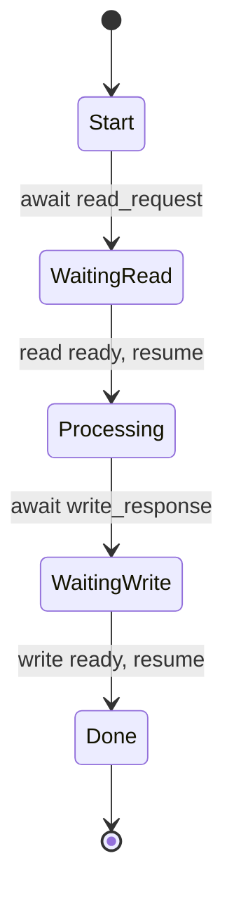

这解释了协程为什么可以很轻：挂起时通常只保留必要的局部状态和恢复位置，而不是长期占用一个完整内核线程。但它也解释了另一个事实：如果某个局部对象跨越 `await` 仍被使用，它会进入协程帧并延长生命周期；大量挂起协程一样会消耗内存。

**🎯 有栈协程更像用户态线程，但仍不是内核线程**

有些协程库使用 stackful coroutine / fiber：每个协程有自己的用户态栈，切换时保存和恢复寄存器、栈指针等上下文。

```text
thread T
  ├─ fiber A stack + registers
  ├─ fiber B stack + registers
  └─ fiber C stack + registers

runtime 在 thread T 内切换 fiber；
kernel 只看到 thread T，不知道里面有 A/B/C。
```

它比无栈 async 更接近“轻量线程”的直觉，但关键区别仍然不变：调度发生在用户态，内核只调度承载它的线程。

---

### 阻塞 I/O：协程高并发的关键不是“换个语法”

**⚠️ 阻塞 syscall 会阻塞承载线程**

假设一个单线程 event loop 上跑了 10,000 个协程。如果某个协程直接调用阻塞式 `read(fd, ...)`，而这个 fd 暂时没有数据，那么阻塞的是整条线程。由于其他协程也依赖这条线程执行，它们都会被一起拖住。

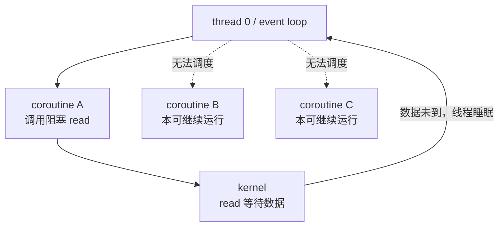

所以协程服务端必须满足至少一个条件：

- socket 设为 nonblocking，并把 `EAGAIN` / `EWOULDBLOCK` 转成 `await`；
- 运行时用 `epoll` / `kqueue` / IOCP / io_uring 等机制等待 I/O 事件；
- 对无法异步化的阻塞调用，投递到专门的 blocking thread pool。

**🎯 正确的 async I/O 路径**


可以把线程版和协程版 echo server 的等待位置对照起来：

```text
thread-per-connection:
    worker thread A 阻塞在 read(connA)
    worker thread B 阻塞在 read(connB)
    worker thread C 阻塞在 read(connC)

coroutine + event loop:
    coroutine A await read(connA) 后挂起
    coroutine B await read(connB) 后挂起
    coroutine C await read(connC) 后挂起
    event loop thread 阻塞在 epoll_wait，统一等待所有 fd
```

区别在于：线程版让内核保存很多阻塞线程；协程版让运行时保存很多挂起任务，只用少量线程去等大量 fd 的 readiness 或 completion。

---

### 并发与并行：协程本身不提供多核加速

**🎯 单线程协程只有并发，没有并行**

```mermaid
gantt
    title 单线程 event loop 上的协程交错执行
    dateFormat X
    axisFormat %s
    section thread 0
    coroutine A runs      :a1, 0, 2
    coroutine B runs      :b1, 2, 4
    coroutine C runs      :c1, 4, 6
    coroutine A resumes   :a2, 6, 8
```

同一时刻只有一个协程占用这条线程。它适合 I/O 密集任务，因为大量连接多数时间在等待网络；它不适合把一个 CPU 密集循环自动变快：

```text
错误直觉：把 1 个 CPU 密集任务拆成 1000 个协程，程序就会用满 1000 个核
真实情况：如果只有 1 条承载线程，1000 个协程仍然轮流占用同一个 CPU
```

**🎯 多线程运行时可以让协程获得并行**

Go 的 goroutine、Tokio 的 multi-thread runtime、Java virtual thread 的底层 carrier thread，都体现了同一个思想：用户创建大量轻量任务，运行时把 runnable 任务分发到一组内核线程上。

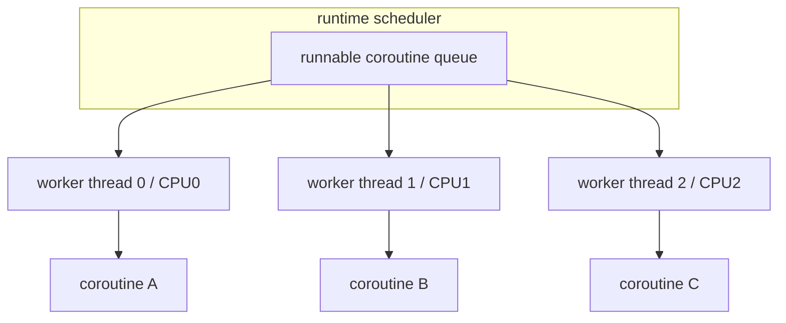

这时协程可以并行，但并行能力来自底层线程池，而不是协程对象本身。只要多个协程可能同时跑在不同线程上，共享数据仍然必须按多线程规则同步。

---

### 内存模型和共享状态：轻量不等于自动安全

**⚠️ 协程之间也可能发生共享状态竞态**

如果所有协程永远固定在同一条线程上运行，并且只在 `await` 点切换，那么普通语句内部不会被另一个协程抢占；但一旦出现多线程运行时、跨线程任务迁移、共享对象被多个线程访问，data race 问题就回来了。

```text
单线程 event loop：
    coroutine A 和 B 不会在同一 CPU 时刻并行执行
    但 A 在 await 前后看到的共享状态可能已经被 B 改过

多线程 coroutine runtime：
    coroutine A 和 B 可能同时运行在不同 worker thread
    共享可变状态需要 mutex / atomic / channel / actor 等机制
```

协程代码中尤其要警惕“跨 `await` 持有锁”：

```text
coroutine A:
    lock(m)
    await read_from_network()
    unlock(m)

coroutine B:
    lock(m)  // 可能长时间等 A 被 I/O 唤醒
```

如果 `await` 后恢复需要同一个锁、同一个 event loop 或同一个资源，甚至可能形成异步死锁。工程上常见规则是：**不要跨挂起点持有普通互斥锁；把需要保护的临界区缩短到不包含 `await` 的同步片段，或使用异步运行时提供的 async-aware primitive，并清楚理解其调度语义。**

---

### 线程池、协程和 Reactor 的组合关系

**🎯 三者不是互斥选项，而是常被叠在一起**

现代网络服务经常长这样：

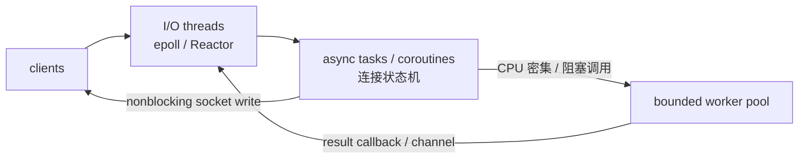

职责划分：

| 层 | 主要职责 | 不能做什么 |
|---|---|---|
| I/O 线程 / Reactor | 管理 fd readiness、连接生命周期、轻量协议解析 | 长时间阻塞、做重 CPU 计算 |
| 协程任务 | 用顺序代码表达异步流程，挂起时释放线程 | 把阻塞调用伪装成异步 |
| worker pool | 承接 CPU 密集或无法异步化的阻塞任务 | 无上限排队、反向卡住 I/O loop |

所以协程和 §12.2 的 Reactor 关系很近：Reactor 是底层事件分发结构；协程把回调式状态机重新包装成接近顺序代码的写法。

回调写法：

```text
on_read(conn, req) {
    process(req, function(resp) {
        on_write(conn, resp, function() {
            close(conn)
        })
    })
}
```

协程写法：

```text
async handle(conn) {
    req = await read_request(conn)
    resp = await process(req)
    await write_response(conn, resp)
    close(conn)
}
```

两者底层都要解决同一批问题：fd 何时 ready、挂起任务存在哪里、谁唤醒它、取消时谁释放资源、写缓冲积压时如何背压。

---

### 从 CSAPP 视角看本质差异

**🎯 线程把阻塞点交给内核，协程把阻塞点显式暴露给运行时**

在本章 thread-per-connection echo server 中，每个 worker 可以直接写阻塞式逻辑：

```c
while ((n = rio_readlineb(&rio, buf, sizeof(buf))) > 0) {
    rio_writen(connfd, buf, n);
}
```

慢客户端让该 worker 阻塞，但不会阻塞其他 worker，因为每个连接有自己的线程，内核会继续调度其他线程。

协程版的直觉会变成：

```text
async handle(conn) {
    while ((line = await read_line(conn)) != EOF) {
        await write_all(conn, line)
    }
}
```

看起来仍是顺序代码，但 `await read_line` 不能是普通阻塞 `read` 的薄包装。它必须在“暂时读不到完整一行”时挂起当前协程，并让 event loop 继续处理其他连接。

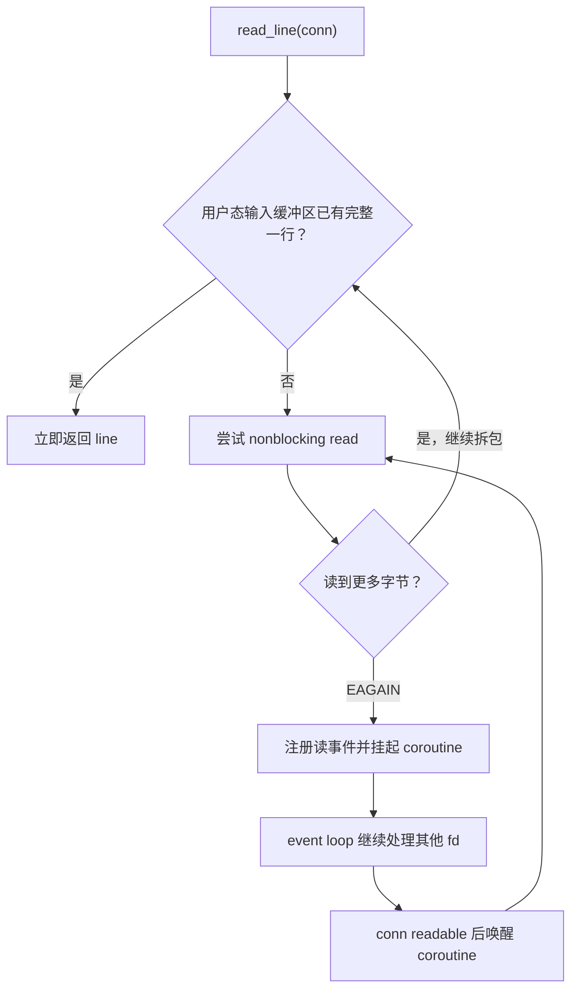

这就是“协程能抗大量空闲连接”的真正原因：空闲连接不绑定空闲线程，只绑定运行时中的一个挂起状态和少量连接状态。

**⚠️ 协程不能消除系统调用和协议状态机**

即使使用协程，也仍然要处理：

- TCP 字节流没有消息边界；
- `read` / `write` 可能短读短写；
- 输出缓冲区满时要等待 writable；
- peer close、half-close、timeout、cancel 都要释放连接资源；
- backpressure 不能靠无限创建协程解决。

协程改善的是控制流表达，不是替代网络编程的基本功。

---

### 选型判断

**🎯 按瓶颈选，不按流行度选**

| 场景 | 更自然的选择 | 原因 |
|---|---|---|
| 少量后台任务，需要利用多核 CPU | 线程 / 线程池 | 内核线程能真正并行，模型直接 |
| 每个连接逻辑简单，连接数中等 | thread-per-connection 或线程池 | 阻塞式代码简单，调试直观 |
| 大量长连接，大多数时间等网络 | Reactor + 协程 | 挂起任务比阻塞线程便宜，连接状态表达更清楚 |
| I/O 密集但包含少量 CPU 重活 | Reactor/协程 + bounded worker pool | I/O loop 不被重活卡住，同时限制排队 |
| 需要强隔离或崩溃隔离 | 多进程 | 线程和协程都共享地址空间，隔离不足 |
| 调用库只有阻塞接口，且无法改造 | 线程池或专用阻塞池 | 放在 event loop 协程里会卡住承载线程 |

最终可以浓缩为三条判断：

1. **要多核并行，底层必须有多个内核线程或多个进程。**
2. **要高连接数，不能让每个空闲连接长期占住一个昂贵执行实体。**
3. **要代码可维护，必须明确任务的所有权、取消、超时、背压和共享状态同步。**

---

### 常见误解

- **“协程一定比线程快” → 只在大量等待型任务上通常更省；CPU 密集任务仍受 CPU 核数限制。**
- **“协程不会有并发 bug” → 单线程协程也有跨 `await` 状态变化问题，多线程运行时仍有 data race。**
- **“用了 async 就不会阻塞” → 只有底层 I/O 真正 nonblocking 或被运行时 offload，`await` 才能释放承载线程。**
- **“协程能替代 epoll” → 在 Linux 网络服务里，协程运行时常常正是基于 epoll/io_uring 等机制实现等待和唤醒。**
- **“线程私有栈安全，协程帧也一定安全” → 线程和协程都在同一进程地址空间内；对象生命周期和共享可变访问仍需管理。**
- **“一个请求一个协程就不需要限流” → 协程便宜但不是免费，挂起帧、缓冲区、定时器、fd、队列项都会消耗资源。**

---

## 常见并发模型对比

**🎯 选择模型的关键是隔离、共享成本和负载形态**

| 模型 | 执行单位 | 地址空间 | 通信方式 | 故障隔离 | 典型适用场景 |
|---|---|---|---|---|---|
| process-per-connection | 子进程 | 默认隔离 | IPC | 较强 | 连接不多、重隔离、实现简单 |
| thread-per-connection | 线程 | 共享 | 直接读写共享内存 | 较弱 | 中等并发、阻塞式任务、教学/简单服务 |
| event loop / Reactor | 少量线程 | 线程内串行状态 | callback/任务队列 | 较弱 | 大量空闲连接、I/O 密集服务 |
| coroutine + event loop | 协程任务 + 少量线程 | 共享 | `await` / channel / 任务队列 | 较弱 | 大量 I/O 等待、希望用顺序代码表达异步流程 |
| Reactor + worker pool | I/O loop + 固定 worker | 共享但职责分层 | 有界任务队列 | 较弱 | 高连接数且包含计算/阻塞任务 |

一个线程不一定绑定一个 CPU；内核可以让多个 runnable 线程在多个核上真正并行，也可以在单核上交错执行：

```text
concurrency：多个任务的执行时间区间重叠
parallelism：多个任务同一时刻在不同硬件资源上执行
```

线程提供并发执行流，但是否获得并行加速还取决于 CPU 核数、任务可并行比例、同步开销和内存瓶颈。协程提供的是更轻的任务挂起/恢复机制；它能降低大量等待型任务的线程占用，但要获得多核并行，底层仍然需要多个内核线程或多个进程。

---

## 易错点

- **把线程理解成拥有独立地址空间的轻量进程 → 同一进程的线程共享整个虚拟地址空间，只有执行上下文和栈等逻辑上独立。**
- **认为线程的栈无法被其他线程访问 → 栈是逻辑私有而非硬件隔离，只要地址可达就能跨线程访问。**
- **直接用 `==` 比较 `pthread_t` → `pthread_t` 是不透明类型，可移植代码应使用 `pthread_equal`。**
- **pthread 函数失败后读取 `errno` → 大多数 pthread 接口直接返回错误编号，应检查返回值本身。**
- **把 `pthread_create` 返回当成新线程已经执行 → 创建者和新线程此后的调度顺序不确定。**
- **向多个线程传递同一个循环变量地址 → 变量会被并发改写且可能先结束生命周期，应提供每线程独立且稳定的参数。**
- **从 start routine 返回局部变量地址 → 线程退出后栈对象生命周期结束，join 得到的是悬空指针。**
- **认为 `main` 返回只结束 main thread → `main` 返回等价于 `exit`，会终止整个进程及所有线程。**
- **把 `pthread_exit` 当成 `exit` → 前者只结束调用线程，后者结束整个进程。**
- **创建 joinable 线程后既不 join 也不 detach → 线程终止后仍保留待回收资源，持续创建会造成资源泄漏。**
- **认为任意多个线程都能重复 join 同一个线程 → 一个 joinable 线程应只有一个明确的 join 所有者。**
- **detach 后仍调用 `pthread_join` → detached 线程自动回收，不能再 join 获取退出值。**
- **认为 detach 能让线程在进程退出后继续运行 → detached 只改变回收方式，进程退出时它仍会终止。**
- **用普通布尔变量实现一次性初始化 → 并发检查与写入会竞态，应使用 `pthread_once` 或 C++ `std::call_once`。**
- **在线程服务器中由 main 创建线程后立即 `close(connfd)` → 线程共享 fd table，该操作会让 worker 的 fd 一起失效。**
- **把 thread-per-connection 当成无限扩展架构 → 线程栈、调度、上下文切换和资源耗尽限制了可承载连接数。**
- **把协程当成内核线程 → 协程必须运行在某条线程上；单线程协程不能多核并行。**
- **在协程里调用阻塞 I/O → 会卡住承载它的线程，除非运行时把调用转换为 nonblocking I/O 或投递到阻塞线程池。**
- **跨 `await` 持有普通锁 → 可能长时间阻塞其他协程，甚至制造异步死锁。**
- **认为共享内存会自动保持一致 → 共享只表示地址可达，并不提供原子性、互斥或执行顺序，具体同步问题属于 §12.4-§12.5。**

---

## 工程关联

- **Linux 任务模型**：用户态看到 pthread，内核调度的是 task；可用 `ps -L -p <pid>` 或 `/proc/<pid>/task/` 查看进程内各线程。
- **崩溃作用域**：线程共用进程地址空间，一个线程越界写、double free 或收到未处理的 `SIGSEGV` 通常会让整个服务进程退出，不能获得进程模型的隔离性。
- **文件描述符生命周期**：所有线程共享 fd table，跨线程 `close` 与 fd 数字复用是网络服务中的高危竞态，工程上要明确 fd/connection 的单一所有者。
- **线程池**：生产服务常预先创建固定数量 worker，通过有界队列提交任务，既摊薄创建成本，也能用队列上限实施背压。
- **Reactor + worker pool**：I/O loop 负责 nonblocking socket 和连接状态，worker 执行 CPU 密集或阻塞业务，结果再投递回连接所属 loop，避免在 I/O 线程中阻塞。
- **协程运行时**：协程通常建立在 event loop、多路复用器和任务调度器之上；它把 callback 状态机包装成顺序代码，但不改变 fd readiness、短读短写、背压和取消清理这些底层问题。
- **资源观测**：`ps -L`、`top -H` 和 `/proc/<pid>/status` 的 `Threads` 可查线程数量，`pstack`/`gdb thread apply all bt` 可看所有线程栈。
- **性能分析**：`perf sched` 可观察调度延迟和上下文切换，`perf stat -e context-switches,cpu-migrations` 可判断线程过多造成的调度成本。
- **内存观测**：`ulimit -s`、`pthread_attr_setstacksize` 和 `/proc/<pid>/maps` 可帮助理解每线程栈的保留空间；减小栈前必须评估递归和大型局部变量。
- **C++ RAII**：`std::thread` 析构时若仍 joinable 会调用 `std::terminate`，C++20 `std::jthread` 会在析构时请求停止并 join，更适合结构化生命周期管理。
- **初始化安全**：动态库、日志系统、连接池和全局配置的惰性初始化都需要 `pthread_once`、`std::call_once` 或线程安全局部静态，不能手写无同步的双重检查。
- **数据竞争检测**：GCC/Clang 的 ThreadSanitizer 用 `-fsanitize=thread` 检测未同步共享访问，是学习 §12.4 共享变量和 §12.5 同步的核心工具。

---

## 实验题

**🧪 题 1：观察线程共享地址空间但拥有独立栈**

源码片段：

```c
#include <pthread.h>
#include <stdio.h>

static int shared;

static void *worker(void *arg) {
    int local = 0;
    ++shared;
    printf("tid=%lu local=%p shared=%p value=%d\n",
           (unsigned long)pthread_self(),
           (void *)&local, (void *)&shared, shared);
    return NULL;
}

int main(void) {
    pthread_t a, b;
    pthread_create(&a, NULL, worker, NULL);
    pthread_join(a, NULL);
    pthread_create(&b, NULL, worker, NULL);
    pthread_join(b, NULL);
    return 0;
}
```

要求：

1. 用 `gcc -std=c11 -O0 -g -Wall -Wextra -pthread thread_layout.c -o thread_layout` 编译。
2. 运行后确认两个 worker 看到相同的 `&shared`，但局部变量位于各自线程栈；栈地址可能被后续线程复用，不能把地址不同当成永久线程身份。
3. 运行期间用 `ps -L -p <pid> -o pid,tid,comm,stat` 或查看 `/proc/<pid>/task/`，观察一个进程中的多个 TID。
4. 在 GDB 中用 `info threads` 和 `thread apply all bt` 查看每条执行流的调用栈。
5. 解释为什么同一全局变量可直接访问，但这不代表并发执行 `++shared` 是安全的。

**🧪 题 2：用 ThreadSanitizer 复现参数传递竞态**

错误源码片段：

```c
#include <pthread.h>
#include <stdio.h>

static void *worker(void *arg) {
    printf("id=%d\n", *(int *)arg);
    return NULL;
}

int main(void) {
    pthread_t tids[4];
    for (int i = 0; i < 4; ++i) {
        pthread_create(&tids[i], NULL, worker, &i);
    }
    for (int i = 0; i < 4; ++i) {
        pthread_join(tids[i], NULL);
    }
    return 0;
}
```

要求：

1. 用 `gcc -std=c11 -O1 -g -Wall -Wextra -pthread -fsanitize=thread arg_race.c -o arg_race` 编译。
2. 多运行几次，记录输出是否重复、跳号或变化；不要用输出恰好正确来证明代码安全。
3. 阅读 TSan 报告中的读线程、写线程以及变量所在栈帧，确认 worker 读 `i` 与 main 写 `i` 冲突。
4. 改为 `int ids[4]`，先写 `ids[i] = i`，再向第 `i` 个线程传 `&ids[i]`，并在数组离开作用域前 join 全部线程。
5. 重新运行 TSan，验证 data race 报告消失，并解释“独立存储 + 足够长生命周期”分别解决了什么问题。

**🧪 题 3：对比 joinable 与 detached 的资源管理**

源码片段：

```c
static void *worker(void *arg) {
    return arg;
}

pthread_t tid;
pthread_create(&tid, NULL, worker, payload);

void *result = NULL;
pthread_join(tid, &result); // joinable 路径：等待、取值、回收
```

以及：

```c
pthread_attr_t attr;
pthread_attr_init(&attr);
pthread_attr_setdetachstate(&attr, PTHREAD_CREATE_DETACHED);
pthread_create(&tid, &attr, worker, payload);
pthread_attr_destroy(&attr); // detached 路径：退出后自动回收
```

要求：

1. 编译时使用 `-pthread -Wall -Wextra`，分别实现 joinable 和 detached 两个版本。
2. joinable 版让 worker 返回堆对象，main join 后读取并 `free`；禁止返回 worker 局部变量地址。
3. detached 版不要再调用 `pthread_join`，而是让 worker 自己完成 payload 和结果资源清理。
4. 让 main 立即 `return`，观察 detached worker 可能来不及输出；再解释为什么 detach 不提供进程外生存能力。
5. 总结两种所有权契约：谁等待完成、谁读取结果、谁释放输入参数、谁释放结果。

**🧪 题 4：运行教材 thread-per-connection echo server**

完整源码见 `experiments/thread_echo_server.c`；worker 的关键所有权逻辑为：

```c
static void *serve_client(void *arg) {
    int connfd = *(int *)arg;
    free(arg);

    int rc = pthread_detach(pthread_self());
    if (rc != 0) {
        fprintf(stderr, "pthread_detach: %s\n", strerror(rc));
    }

    echo(connfd);
    close(connfd);
    return NULL;
}
```

main thread 在创建前拥有参数和 fd，只有 `pthread_create` 成功后才转移给 worker：

```c
int *connfdp = malloc(sizeof(*connfdp));
*connfdp = connfd;

int rc = pthread_create(&tid, NULL, serve_client, connfdp);
if (rc != 0) {
    free(connfdp);
    close(connfd);
}
/* 成功后 main 不再访问 connfdp 或 connfd。 */
```

要求：

1. 编译并运行自动并发验证：

   ```bash
   cd Chapter12/12.3/experiments
   make clean all
   make demo
   ```

2. 确认 `make demo` 先建立一条延迟两秒发送数据的连接，让一个 worker 阻塞在 `rio_readlineb`，再让另外两个客户端分别发送一行；两者必须在两秒超时内取得正确回显。
3. 阅读 server 日志，确认三次 `accept` 对应三个 worker 服务过程；线程 ID 可以在线程退出后被后续线程复用，不能当成永久身份。
4. 对照 main 的错误路径，说明 `malloc` 或 `pthread_create` 失败时为何必须由 main 释放参数并关闭 fd，而创建成功后为何必须改由 worker 负责。
5. 解释这与 fork-per-connection 版的不同根源：进程拥有各自的 fd table，而线程共享进程的同一 fd table，main 提前 `close(connfd)` 会让 worker 的描述符一起失效。
6. 手动启动 server 并保持多个客户端连接，用 `ps -L -p <server-pid>` 和 `top -H -p <server-pid>` 观察线程数量，再用：

   ```bash
   strace -f -e trace=clone,accept,read,write,close \
     ./thread_echo_server 18083
   ```

   观察线程创建以及 worker 对各自 `connfd` 的读、写和关闭。
7. 只做小规模实验；解释为什么 thread-per-connection 会受线程栈、调度和上下文切换限制，生产环境通常改用有界线程池或 Reactor + worker pool。

**🧪 题 5：用 C++20 `co_await` 观察协程挂起与恢复**

完整源码见 `experiments/cpp20_coroutine_scheduler.cpp`。C++20 已经提供标准协程语法和 `<coroutine>` 基础设施，因此本题直接使用 `co_await` 写异步流程；为了让例子不依赖第三方库，源码里仍保留一个最小 `Scheduler` 和 `SleepAwaiter`，负责把挂起的协程句柄放进 timer queue 并在之后恢复。

核心协程函数如下：

```cpp
Task handle_request(Scheduler &scheduler,
                    std::string name,
                    int read_delay,
                    int write_delay) {
    std::cout << "[tick " << scheduler.now() << "] "
              << name << ": start read\n";

    co_await scheduler.sleep_for(read_delay);

    std::string request = "request-from-" + name;
    std::cout << "[tick " << scheduler.now() << "] "
              << name << ": read complete\n";

    co_await scheduler.sleep_for(write_delay);

    std::string response = "echo(" + request + ")";
    std::cout << "[tick " << scheduler.now() << "] "
              << name << ": write complete\n";
}
```

这段代码看起来是顺序执行，但每个 `co_await scheduler.sleep_for(...)` 都是一个挂起点。挂起时，编译器生成的 coroutine frame 会保存恢复位置、函数参数、`request` 这类跨挂起点仍要使用的局部变量；调度器稍后通过 `std::coroutine_handle<>::resume()` 让它继续执行。

本例里 `Task::promise_type` 是 C++20 协程和返回类型之间的桥：

```cpp
class Task {
public:
    struct promise_type {
        Task get_return_object();
        std::suspend_always initial_suspend() noexcept;
        std::suspend_always final_suspend() noexcept;
        void return_void() noexcept;
        void unhandled_exception();
    };
};
```

`SleepAwaiter` 则定义一次 `co_await` 如何挂起：

```cpp
class SleepAwaiter {
public:
    bool await_ready() const noexcept;
    void await_suspend(std::coroutine_handle<> handle) const;
    void await_resume() const noexcept;
};
```

三者关系可以这样看：

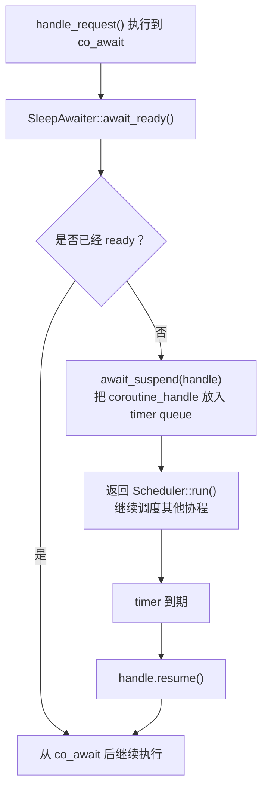

单个协程的状态转换：

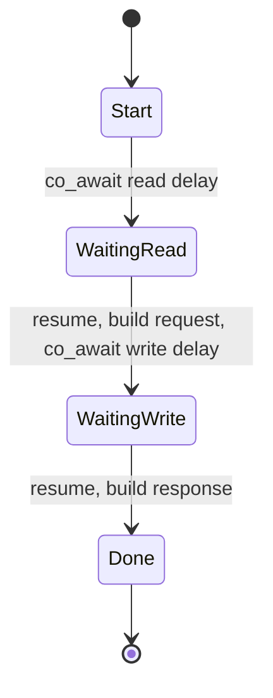

多个协程由一个 `Scheduler` 在同一条执行流中轮流恢复：

```text
ready queue:
    coroutine-A, coroutine-B, coroutine-C

timer queue:
    wake_tick -> coroutine_handle

co_await sleep_for(n)：
    不调用 sleep(2)，不阻塞当前线程；
    只是把当前 coroutine_handle 登记到 tick+n。

timer 到期：
    Scheduler 把 coroutine_handle 放回 ready queue；
    稍后调用 handle.resume()。
```

要求：

1. 编译并运行：

   ```bash
   cd Chapter12/12.3/experiments
   make clean cpp20_coroutine_scheduler
   ./cpp20_coroutine_scheduler
   ```

   或直接运行：

   ```bash
   make coroutine-demo
   ```

2. 观察输出顺序，确认 `coroutine-A` 第一次 `await` 之后没有阻塞整个程序；`coroutine-B` 和 `coroutine-C` 仍然能被调度执行。
3. 对照源码解释：`SleepAwaiter::await_suspend` 为什么不是让当前线程睡眠，而是保存 `std::coroutine_handle<>` 并返回调度器。
4. 找出哪些数据会进入编译器生成的 coroutine frame：至少包括 `name`、`read_delay`、`write_delay`，以及跨第二个 `co_await` 仍要使用的 `request`。
5. 修改三个 `handle_request` 的 read/write delay，预测输出顺序，再运行验证。
6. 把 `co_await scheduler.sleep_for(read_delay)` 临时删掉，观察输出变化，解释“没有挂起点就不会让出执行权”。
7. 说明它和线程的区别：这个例子没有创建多个线程，同一时刻只执行一个协程片段；并发来自 `co_await` 主动挂起后调度器恢复其他协程，不来自内核抢占式调度。
