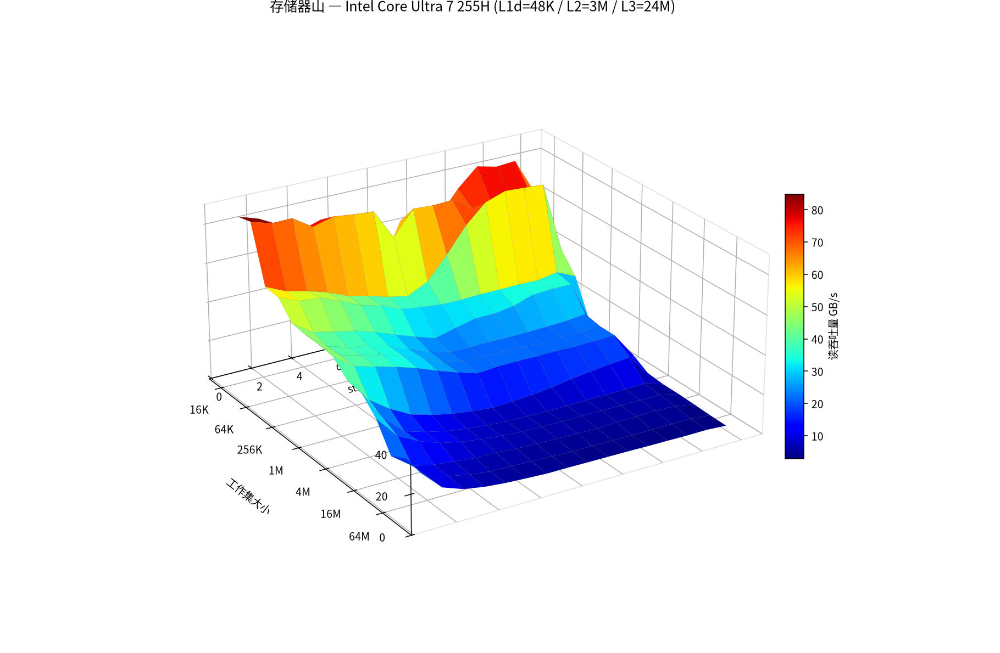
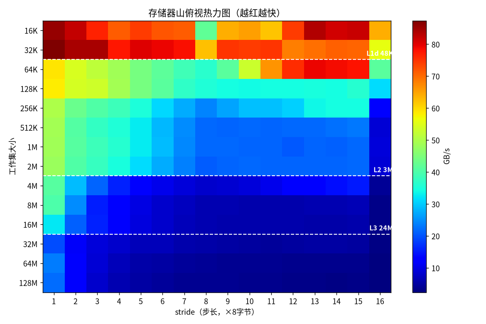

# §6.6 综合：高速缓存对程序性能的影响

§6.4 讲了 cache 硬件怎么工作，§6.5 讲了怎么写缓存友好的代码，这一节把两者**量化**：用一个会随「工作集大小」和「访问步长」两个维度变化的基准程序，把存储层次的真实性能形状画出来——这就是**存储器山（memory mountain）**。一句话主线：**程序的访存性能不是一个常数，而是一座山——「工作集大小」决定你站在哪一级存储（山的纵深台阶），「步长」决定你利用了多少空间局部性（山的横向斜坡）；写高性能代码，就是想办法把数据点挪到山上更高的位置。**

本节所有图表均由 `expirements/mountain.c` 在本机实测生成（非课本插图），机器为 **Intel Core Ultra 7 255H**，绑核 0 运行。





> 上面两张是 `expirements/plot_mountain.py` 用实测 `mountain.csv` 渲染的真图：3D 曲面看「山形」，热力图看「cache 边界断崖」（白色虚线标出 L1d=48K / L2=3M / L3=24M 的位置）。下文的 ASCII 图是同一份数据的纯文本版，方便在终端/diff 里直接读。

---

## 存储器山：两个维度刻画访存性能（§6.6.1）

**🎯 基准程序：用 (size, stride) 两个旋钮扫描存储层次**

核心就一个读循环 `test(elems, stride)`：对一个数组，从头到尾每隔 `stride` 个元素读一次，反复读、计时，算出**读吞吐量（MB/s）**。

```c
long test(long elems, long stride) {
    long acc0=0,acc1=0,acc2=0,acc3=0;          // 4 个独立累加器，压满访存流水线
    for (long i=0; i<elems-stride*4; i+=stride*4) {
        acc0 += data[i];          acc1 += data[i+stride];
        acc2 += data[i+stride*2]; acc3 += data[i+stride*3];
    }
    return (acc0+acc1)+(acc2+acc3);
}
```

两个旋钮各自调一个维度：

| 旋钮 | 控制什么 | 物理含义 |
|------|----------|----------|
| **工作集大小 size** = `elems × 8B` | 数据**落在哪一级存储**（L1/L2/L3/主存） | 时间局部性：集越小，越能整个驻留在快的那层 |
| **步长 stride**（元素数） | 一条 cache line 里用掉几个字节 | 空间局部性：stride 越大，每条 line 的有效利用越低 |

把 (size, stride) 两维都扫一遍，吞吐量就构成一个二维曲面——一座山。

**🎯 本机实测存储器山（吞吐量 MB/s）**

行 = 工作集大小（向下变大），列 = 步长 s1..s16（向右变大）：

```
size    s1    s2    s3    s4    s5    s6    s7    s8   ...  s16
16K  85511 82088 76638 71122 74348 ...                    63812   ← L1d (48K) 内，山顶
32K  87369 84140 84249 77567 ...                          55904   ← 仍在 L1
64K  59047 54274 51780 ...                                41398   ← 越过 L1 → L2
256K 50002 43029 40550 ...                                12986   ← L2 (3M) 内
2M   47995 40464 37671 ...                                 8837   ← L2 边缘
4M   41162 28828 21493 ...                                 4139   ← 越过 L2 → L3
16M  32551 21045 15769 ...                                 3306   ← L3 (24M) 内
32M  19488 11657  9323 ...                                 2980   ← 越过 L3 → 主存
128M 21993 11895  8095 ...                                 2376   ← 主存，山脚
```

**🎯 同一座山的 ASCII 热力图**（越亮=吞吐越高）

字符浓淡映射吞吐：`@ % # * + = - : .` 从高到低。一眼看到**山顶（左上，小工作集+小步长）到山脚（左下/右下）**的滑落：

```
        stride:  1 2 3 4 5 6 7 8 910...      16
  16K |@@%%%%##%%####==####**%%@@%%%%##|   ┐
  32K |@@@@@@%%%%%%%%**%%%%%%########**|   ┘ L1 山脊（最亮）
  64K |**++++++==========++##%%%%%%%%==|   ┐
 256K |++======------::--------------..|   │ L2 台地
   2M |++====------::::::::::::::::::..|   ┘
   4M |==--::........................  |   ┐
  16M |--::........                    |   ┘ L3 缓坡
  32M |::......                        |   ┐
 128M |::....                          |   ┘ 主存 山脚（最暗）
```

热力图里有三件事要看懂：

- **从上往下三道明显的「断崖」**：48K（出 L1）、3M（出 L2）、24M（出 L3）处吞吐量陡降——这正是本机各级 cache 的容量边界，山被切成四级台阶。
- **每一行从左往右变暗**：步长越大空间局部性越差，吞吐量单调下降——这是山的横向斜坡。
- **越往山下，横向斜坡越陡**：L1 那行（16K/32K）几乎全亮，stride 怎么变都快；主存那行（128M）从 s1 到 s16 暴跌近 10 倍。原因见下面「为什么山顶平、山脚陡」。

**🎯 纵切面：固定 stride=1，只看工作集越界（时间局部性维度）**

这是把空间局部性拉满（stride=1）后，纯粹看「工作集一旦装不下当前 cache，吞吐量掉多少」：

```
  16K   85511 ████████████████████████████████████████  ┐ L1: ~85 GB/s
  32K   87369 ████████████████████████████████████████  ┘
  64K   59047 ███████████████████████████  ← 跌！出 L1(48K)
 256K   50002 ██████████████████████       ┐
   2M   47995 █████████████████████        ┘ L2 台地 ~48 GB/s
   4M   41162 ██████████████████  ← 跌，出 L2(3M)，进 L3
  16M   32551 ██████████████      ┐ L3 ~33-40 GB/s
  32M   19488 ████████  ← 跌，出 L3(24M)，进主存
 128M   21993 ██████████          主存 ~20 GB/s
```

四级清晰的台阶：**L1≈85 → L2≈48 → L3≈33 → 主存≈20 GB/s**。每跨一级 cache 边界吞吐量掉一截，这就是「存储层次」四个字的实测形状。

**🎯 横切面：固定大工作集，只看步长（空间局部性维度）**

固定 128M（主存驻留，每次访问都得去主存），只调 stride，看空间局部性单独的贡献：

```
   s1   21993 ████████████████████████████████████  一条 line(8 long)全用上
   s2   11895 ███████████████████  ← 只用一半 → 吞吐砍半
   s3    8095 █████████████
   s4    6241 ██████████
   s8    3982 ██████  ← stride=8 → 每条 line 只取 1 个元素
  s16    2376 ███     空间局部性彻底没了，吞吐量是 s1 的 1/9
```

stride 从 1 涨到 8，吞吐量几乎线性下降到 1/8——因为一条 64 字节 line 装 8 个 long，stride=1 时 8 个全用上（一次 miss 摊到 8 次访问），stride≥8 时每条 line 只用 1 个，**miss 摊不下去**，每次访问都触发一次主存传输。**stride>8 后曲线压平**：因为再大也是「每 line 取 1 个」，坏到头了。

**⚠️ 为什么山顶平、山脚陡（步长在不同层影响不同）**

- 在 L1 那行（16K），stride 从 1 到 16 吞吐量几乎不变——因为整个工作集都在 L1 里，**根本没有 miss**，stride 只改变访问哪个已在 cache 的字节，空间局部性无所谓。
- 在主存那行（128M），stride 直接决定每次访问要不要去主存，**空间局部性是唯一救命稻草**，所以斜坡极陡。
- 结论：**工作集越大、所处存储越慢，空间局部性（stride）的价值越高**。优化访存模式，对内存密集型大数据程序收益最大，对小热点循环几乎无感。

---

## 重排循环提升空间局部性：矩阵乘法 6 版本（§6.6.2）

**🎯 同一个 C = A×B，6 种循环嵌套顺序，性能差几倍**

矩阵乘法三重循环 `i,j,k` 的顺序可以任意排列，共 `3!=6` 种写法，**计算结果完全一样**，但访存模式天差地别。按「内层循环里 A/B/C 谁是 stride-1」分成三类：

| 版本（外→内） | 内层循环体 | A 的访问 | B 的访问 | C 的访问 | 每次迭代 miss 数 | 快慢 |
|---------------|-----------|----------|----------|----------|-----------------|------|
| **ijk / jik** | `sum += A[i][k]*B[k][j]` | 行优先 ✅0.25 | 列优先 ❌1.0 | 寄存器 | **1.25** | 中 |
| **jki / kji** | `C[i][j] += A[i][k]*B[k][j]` | 列优先 ❌1.0 | 寄存器 | 列优先 ❌1.0 | **2.0** | 最慢 |
| **kij / ikj** | `C[i][j] += r * B[k][j]` | 寄存器 | 行优先 ✅0.25 | 行优先 ✅0.25 | **0.5** | **最快** |

> miss 数按「一条 line 装 8 个元素」估算：stride-1 访问每 8 次 miss 1 次 = 0.25；列优先访问每次跨一整行、stride 大，每次都 miss = 1.0。

**🎯 为什么 kij/ikj 赢**

C 语言数组**行优先（row-major）**存储，所以「行优先遍历」才是 stride-1。kij 版本的内层循环里，B 和 C 都按行（stride-1）走，A 退化成一个标量寄存器 `r`，**两个数组都吃满空间局部性，每次迭代只 0.5 次 miss**——是最慢的 jki（2.0）的 1/4。书里实测大矩阵下 kij/ikj 比 jki/kji 快**几倍**，且矩阵越大差距越显著（工作集越界，正对应存储器山「山脚斜坡最陡」）。

```c
// kij：最快版本。注意内层 j 让 B[k][j] 和 C[i][j] 都是 stride-1
for (int k = 0; k < n; k++)
    for (int i = 0; i < n; i++) {
        double r = A[i][k];                 // A 提成标量，整个内层不再访存
        for (int j = 0; j < n; j++)
            C[i][j] += r * B[k][j];         // B、C 全部行优先 → 缓存友好
    }
```

**⚠️ 计算量没变，变的只是访存顺序**

6 个版本做的乘加次数完全相同（都是 n³），编译器优化也类似，性能差异**纯粹来自 cache miss 率**——这是「两段逻辑相同的代码性能差很多」最干净的实例，也是验收标准第 5 条的答案模板。

---

## 在程序中利用局部性：可操作的优化清单（§6.6.3）

**🎯 把存储器山的规律落成三条行动准则**

1. **让最频繁访问的数据待在更高的山上**：缩小热点循环的工作集，尽量让它装进 L1/L2（分块 tiling 就是干这个——把大矩阵切成能装进 cache 的小块，把容量 miss 变成块内命中）。
2. **每条 cache line 进来就榨干它**：用 stride-1 顺序访问，一次 miss 把 64 字节都用上（对应横切面 s1 的最高吞吐）。结构体把一起访问的字段放一起（hot/cold 分离）也是这个道理。
3. **一旦数据上了 cache，就在它被驱逐前把该算的都算完**：提高时间局部性，比如循环融合（fusion）把对同一数组的多趟遍历合成一趟。

**🔧 这三条对应存储器山的三个方向**

- 准则 1 = 沿纵深维度往山顶爬（减小工作集）
- 准则 2 = 沿步长维度往左走（stride→1）
- 准则 3 = 增加重复访问的密度，让数据点在快层多停留

---

## 易错点

- 存储器山有**两个独立维度**，别只盯一个：工作集大小管「在哪级存储」（时间局部性 / 纵深台阶），步长管「空间局部性」（横向斜坡）——两个都优化才能爬到山顶
- 山顶平、山脚陡：**工作集装进 L1 时 stride 几乎不影响性能**（没有 miss 可摊），只有当数据落到 L2/L3/主存，空间局部性才开始救命——优化访存模式对大数据程序收益远大于小热点
- stride 的伤害到「每条 line 只剩 1 个元素」（本机 stride=8，8 个 long=64B=一条 line）就到顶了，再大步长曲线压平，不会无限恶化
- 矩阵乘 6 个版本**计算量完全相同**，性能差几倍纯来自 cache miss 率，不是算法复杂度差异
- C 数组行优先，所以**行优先遍历才是 stride-1**；kij/ikj 快是因为 B、C 都按行走，不是因为「k 在外面」这种表面顺序
- 列优先遍历（`A[i][j]` 固定 j 变 i）每次跨一整行，stride = 行长，几乎每次必 miss——这是把缓存友好代码写成缓存灾难的最常见方式
- 吞吐量 MB/s 用十进制 10⁶，cache/工作集容量用二进制 2²⁰（48K=49152B），两套单位别混
- 实测存储器山一定要**绑核**（`taskset -c 0`）并关掉频率波动干扰，否则线程迁移和 turbo 会把台阶抹平

---

## 工程关联

- `taskset -c 0 ./mountain` 跑出的纵切面台阶位置，直接反推本机各级 cache 容量——和 `lscpu` / `/sys/.../cache/` 报告的 L1d=48K、L2=3M、L3=24M 一一对上，是「用软件量出硬件参数」的经典手法
- 存储器山是 `perf stat` cache miss 率的连续版可视化：山脚那些点就是 `LLC-load-misses` 高的区域，山顶是全 L1 命中区
- 矩阵乘 ikj vs jki 是 BLAS / OpenBLAS / Eigen 等库做循环重排 + 分块的最小教学模型；真实 GEMM 在此之上再叠加寄存器分块、SIMD、预取
- 数据库列存 vs 行存、图像处理的 tiling、CNN 的 im2col + 分块卷积，本质都是「把工作集切到能装进 cache」——准则 1 的工业放大版
- `valgrind --tool=cachegrind` 能在没有 PMU 的环境下模拟出每个矩阵乘版本的 D1 miss 数，复现 6 版本的性能排序
- 硬件预取器会沿 stride-1 提前搬数据，所以真实机器上 s1 的吞吐量比「纯 miss 模型」预测的更高——这也是为什么顺序访问的 demand-miss 测不准（见 §6.4 易错点）

---

## 实验题

**🧪 题 1：跑出你自己的存储器山，反推 cache 容量**

```bash
gcc -O2 -o mountain mountain.c
taskset -c 0 ./mountain > mountain.csv
```

要求：

- 跑出完整 CSV，画出 stride=1 的纵切面（本目录已有脚本思路）
- 找出吞吐量陡降的三个工作集位置，反推本机 L1d / L2 / L3 容量
- 用 `lscpu` / `cat /sys/devices/system/cpu/cpu0/cache/index*/size` 核对，看断崖位置是否精确落在 cache 容量边界
- 解释：为什么断崖不是绝对锐利、而是有一两档过渡（提示：cache 不是装满才开始 miss，工作集接近容量时冲突 miss 已经上升）

**🧪 题 2：横切面验证「一条 line 8 个 long」**

要求：

- 固定一个主存驻留的工作集（如 128M），把 stride 从 1 扫到 16，画横切面
- 验证吞吐量在 stride 1→8 间近似按 1/stride 下降，stride≥8 后压平
- 解释这个拐点为什么恰好在 stride=8（64 字节 line ÷ 8 字节 long）
- 把数组元素类型换成 `int`（4 字节），预测拐点会移到 stride=16，再实测验证

**🧪 题 3：矩阵乘 6 版本性能对比**

```c
void mm_ijk(int n, double A[n][n], double B[n][n], double C[n][n]) {
    for (int i=0;i<n;i++) for (int j=0;j<n;j++) {
        double s=0; for (int k=0;k<n;k++) s += A[i][k]*B[k][j];
        C[i][j]=s;
    }
}
// 再写 jki、kij 两个版本（k/j/i 调换顺序）
```

要求：

- 实现 ijk、jki、kij 三个代表版本，n 取 1024，`-O2` 编译
- 用 `clock_gettime` 计时，验证 kij 最快、jki 最慢，差几倍
- `perf stat -e L1-dcache-load-misses,LLC-load-misses ./mm` 对比三者的 miss 数，确认性能差异来自 miss 率
- 解释为什么 kij 内层把 `A[i][k]` 提成标量 `r` 后，B、C 都成了 stride-1

**🧪 题 4：分块（tiling）把容量 miss 变块内命中**

要求：

- 拿题 3 的 jki（最慢版）或 ijk，改写成分块版本：外层按 `B×B` 子块遍历，块大小 B 选成让 `3×B²×8` 字节能装进 L2（3MB）
- 对 n=2048，对比朴素版和分块版的运行时间与 `LLC-load-misses`
- 解释：分块为什么能把「整行整列反复换进换出」的容量 miss，变成「子块在 cache 里被反复命中」——对应存储器山准则 1（往山顶爬）
- 试几个块大小（B=16/32/64），找出本机最优值，体会「装进 L2 但别太小导致循环开销」的权衡
