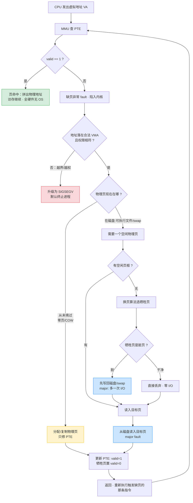

# §9.1-9.5 虚拟内存：寻址、地址空间、DRAM 缓存、内存管理与保护

这五节合起来给出**虚拟内存的三重身份**：① 把主存（DRAM）当作磁盘的缓存（§9.3）；② 给每个进程一套独立页表，从而极大简化链接、加载、共享、分配（§9.4）；③ 在 PTE 里塞权限位，让每次访存都顺带做一次访问控制（§9.5）。三者共用同一套机制——CPU 发虚拟地址、MMU 查页表翻译、PTE 决定命中/缺页/越权——只是看待这套机制的视角不同。

- §9.1：物理寻址 vs 虚拟寻址，MMU 是中间翻译层
- §9.2：地址空间的本质——同一数据对象可以有多个独立的地址
- §9.3：虚拟页/物理页、页表、页命中、缺页、按需调页、工作集
- §9.4：每进程独立页表，简化链接 / 加载 / 共享 / 分配
- §9.5：PTE 权限位（SUP/READ/WRITE/EXEC）+ MMU 越权检查 → SIGSEGV

---

## 物理寻址与虚拟寻址

**🎯 两种寻址方式**

- **物理寻址**：CPU 直接把物理地址放上总线访问内存。早期 PC、单片机、DSP 至今这么干
- **虚拟寻址**：CPU 生成**虚拟地址（VA）**，由芯片上的 **MMU（内存管理单元）** 查表翻译成**物理地址（PA）**后才访问主存。这个翻译过程叫**地址翻译**

```
CPU ──虚拟地址 VA──▶ MMU ──物理地址 PA──▶ 主存
                     ▲
                     │ 查页表（页表存放在主存中，由 OS 维护）
```

**🎯 关键分工**

- 硬件（MMU）：每次访存做翻译，纯查表，不懂策略
- 操作系统：维护页表内容，决定"哪个虚拟页映射到哪个物理页"
- 两者合作完成翻译——这是贯穿整个第 9 章的主线

**🔧 在 Linux 里的直接体现**

你在 C 程序里 `printf("%p", &x)` 打出来的、gdb 里看到的、`/proc/<pid>/maps` 里列出的，**全部是虚拟地址**。两个进程打印同一个变量地址可能完全相同，但物理上各占一块内存——这就是 §8.2 学过的"私有地址空间"假象的实现机制。

---

## 地址空间

**🎯 定义**

地址空间就是一组非负整数地址的有序集合：

- **虚拟地址空间**：N = 2ⁿ 个地址，n 是虚拟地址位数。x86-64 Linux 下 n = 48（新硬件可选 57），所以用户态能用到 256 TB 级别的虚拟地址
- **物理地址空间**：M = 2ᵐ 个地址，对应机器实际插了多少 DRAM

**🎯 本节最重要的一句话**

> 数据对象（字节）和它的属性（地址）是分开的，**同一个数据对象可以有多个独立的地址**。

一个字节可以同时拥有：一个虚拟地址（程序看到的）+ 一个物理地址（DRAM 里的实际位置）。后面 §9.8 还会看到：两个进程的不同虚拟地址可以映射到**同一个**物理页（共享库、COW），这全是"地址与数据分离"这一抽象的红利。

**⚠️ 虚拟地址空间通常远大于物理地址空间**

8 GB 内存的机器上，每个进程都"看到" 256 TB 的虚拟地址空间。这不矛盾——虚拟地址空间绝大部分是**未分配**的，不占任何资源。

---

## 虚拟内存 = 用 DRAM 缓存磁盘

**🎯 概念框架：VM 是存储层次中的一级缓存**

虚拟内存的内容（概念上）存放在磁盘上，主存 DRAM 是它的缓存。虚拟地址空间被切成固定大小的**虚拟页（VP）**，物理内存切成同样大小的**物理页（PP，页帧）**，Linux x86-64 默认页大小 P = 4 KB。

任意时刻，虚拟页的集合分成三类：

| 状态 | 含义 | 例子 |
|------|------|------|
| 未分配 | 还不存在，不占磁盘也不占内存 | 堆和栈之间的巨大空洞 |
| 已缓存 | 已分配，且当前在 DRAM 里 | 正在频繁访问的代码和数据 |
| 未缓存 | 已分配，但只在磁盘（或还没初始化） | 被换出的页、还没读进来的文件页 |

**🎯 DRAM 缓存的组织结构由不命中代价决定**

DRAM 比 SRAM 慢约 10 倍，但磁盘比 DRAM 慢约 **100,000 倍**。这个悬殊的代价差决定了 DRAM 缓存（相对 L1/L2/L3 SRAM 缓存）的所有设计选择：

| 设计维度 | SRAM 缓存（L1-L3） | DRAM 缓存（虚拟内存） | 原因 |
|----------|------------------|---------------------|------|
| 块大小 | 64 B | 4 KB（甚至 2 MB 大页） | miss 代价大 → 一次多搬点，摊薄成本 |
| 相联度 | 4/8/16 路组相联 | **全相联**（任意 VP 可放任意 PP） | miss 太贵，必须最大化命中率 |
| 替换策略 | 硬件近似 LRU | OS 用复杂软件算法 | 替换错了代价是 ms 级，值得花软件开销 |
| 写策略 | 写穿/写回都有 | **永远写回** | 每次写都同步磁盘不可接受 |

**⚠️ 不要把虚拟内存等同于"交换区"**

"虚拟内存 = 内存不够时用硬盘凑"是最常见的误解。交换（swap）只是 VM 作为缓存这一面的一个表现；VM 同时还是内存管理工具（§9.4）和保护工具（§9.5）。即使机器永不 swap，每一次访存也都在走虚拟地址翻译。

---

## 页缓存（page cache）：§9.3「DRAM 缓存磁盘」在文件上的工程落地

上一节的「DRAM 缓存磁盘」是 CSAPP 给的**抽象**——把整个虚拟内存看成一个缓存，每个虚拟页 cached / uncached。Linux 把这个抽象**拆成两条腿**落地：**文件页走 page cache，匿名页走 swap**。page cache 就是其中你每天 `free` 都能看见、也是日常排查最常打交道的那条。这一节专门把它讲透——它是把书上的"caching 工具"对应到真实 Linux 现象的关键缺环。

**🎯 page cache 是什么**

内核用**当前空闲的物理内存**缓存**文件内容**的那部分。任何对普通文件的 `read` / `write` / `mmap`，数据都不在磁盘和用户 buffer 间直达，而是先进 page cache：内核以 `(文件的 address_space, 页内偏移)` 为 key，给文件的每一页在内存里留一份副本，**全机器同一文件同一页只存一份**。这正是上一节三态表里「已缓存 / 未缓存」落到**文件页**上的实现：

- 页在 page cache 里 = cached → 访问是**页命中**，纳秒级、不碰盘
- 页不在 = uncached → 访问触发 **major fault**，从磁盘读入这页、放进 page cache 再返回

**🎯 一张表：书本抽象 → Linux 的两条腿**

| §9.3 抽象 | 文件页（file-backed） | 匿名页（anonymous：堆 / 栈） |
|-----------|---------------------|---------------------------|
| 后备存储 | 磁盘上的原文件 | 无（靠 swap 分区 / 文件） |
| "缓存"叫什么 | **page cache**（`free` 的 buff/cache） | 就是常规物理页，无专名 |
| cached → uncached 的回收 | 干净页直接丢、脏页先回写**原文件** | 换出：必须先写到 **swap** |
| 没有后备存储时 | 总有原文件可回写，永远能回收 | 无 swap 则匿名脏页不可驱逐 → OOM |

一句话记牢：**page cache 只装文件页**。你 `malloc` 的堆、函数栈这些匿名页**不在 page cache 里**，它们对应的"缓存层"是 swap（呼应「脏页」节文件页 vs 匿名页的写回去向）。

**🔧 它代表什么——要掌握的三件事**

- **文件 I/O 的性能底座**：命中 page cache 就零磁盘 I/O。"程序冷启动慢、第二次秒开"就是第二次代码 / 数据文件页已在 page cache（实验题 3 用 `drop_caches` 前后 majflt 的天差地别亲手验证这一点）
- **`buff/cache` 高是好事，不是内存要满**：page cache 干净页随时可回收，所以判断"还能用多少内存"看 `MemAvailable`（把可回收 cache 算进去）而非 `MemFree`。看到 `free` 里一大半是 buff/cache 不要慌，那是 Linux 在拿空闲内存当缓存
- **脏页是 page cache 里还没回写的子集**：写文件先把对应缓存页标脏、异步落盘（细节见「脏页」节）；page cache 同时是"多进程读写同一文件互相立即可见"的会合点——大家命中的是同一份缓存页

**🔧 怎么查（系统 / 文件 / 进程三个粒度）**

```bash
# ① 系统级：buff/cache 就是页缓存总量
free -h
grep -E '^(Cached|Buffers|Dirty|Mapped|Active\(file\)|Inactive\(file\)):' /proc/meminfo
#   Cached=文件页缓存主体  Buffers=块设备元数据缓存  Mapped=被 mmap 进某进程地址空间的文件页
#   Active(file)/Inactive(file)=page cache 的冷/热两条 LRU 链   Dirty=其中尚未回写的部分

# ② 文件级：某个文件有多少页已在缓存里
fincore bigfile            # util-linux 自带，列出该文件 RES/PAGES 缓存量
vmtouch -v bigfile         # 逐页标 0/1 + 缓存百分比（需另装）；程序内精确查用 mincore(2)

# ③ 进程级：smaps 里带文件路径的映射区，Rss 即该进程命中的缓存文件页
grep -A4 '\.so' /proc/<pid>/smaps | grep -E 'Rss|Referenced'

# ④ 清空验证：丢掉 page cache，再访问命中就变 major fault
sync && echo 1 | sudo tee /proc/sys/vm/drop_caches   # 1=页缓存 2=dentry/inode 3=全部
```

**⚠️ page cache（DRAM 缓存磁盘）vs §6 的 CPU cache（SRAM 缓存 DRAM），别混成一个**

两者都叫 cache，但层级、管理者、粒度、寻址全不同，是**串联的两级**：

| | page cache | CPU cache（L1/L2/L3，§6） |
|--|-----------|--------------------------|
| 缓存谁 | 磁盘文件 → DRAM | DRAM → SRAM |
| 谁管理 | 内核软件 | 硬件 |
| 粒度 | 4 KB 页 | 64 B 行 |
| 寻址 | `(inode, 页偏移)` | 物理地址 |

一次 `m[i]`（mmap 文件）的访问可能：page cache 命中（数据在 DRAM）但 L3 miss（还没进 SRAM），也可能两级都命中。它们各自独立统计，排查时别用一个解释另一个。

---

## 匿名页与 swap：§9.3 抽象的另一条腿

上一节说 page cache 管**文件页**。那没有文件的内存——堆、栈、BSS、私有匿名 mmap——谁给它们当"磁盘"？答案是 **swap**。这是把 §9.3「DRAM 缓存磁盘」补全到匿名页的另一半，和 page cache 一文一武凑成完整图景。

**🎯 匿名页（anonymous page）是什么**

不对应任何文件的物理页。典型来源：

- `malloc` / `brk` 的堆、函数调用栈、`.bss`（只读未写的 `.bss` 先共享内核零页，**写后**才变独立匿名页）
- `mmap(MAP_ANONYMOUS)` 私有匿名映射
- `fork` 写时复制后被写过、复制出来的私有副本（COW 后的页）

"匿名"的含义就是**没有原文件可回写**：文件脏页能写回原文件、干净文件页能直接丢，匿名页这两条路都不通——它在内存里是**唯一副本**。所以要回收一个匿名页，只剩一条路：**先写到 swap，再释放物理页**。

**🎯 swap 是什么、解决什么**

swap 是磁盘上专门给匿名页当后备存储的区域（独立分区，或一个 swap 文件）。有了它，匿名页也能像文件页一样换出 / 换入：

- **换出（swap out，`so`）**：内存紧张时，内核挑冷的匿名页写进 swap，腾出物理页
- **换入（swap in，`si`）**：进程再访问这页 → 触发 **major fault** → 从 swap 读回内存

于是 §9.3 的三态在匿名页上也成立：在内存 = cached（页命中）、被换出到 swap = uncached（再访问 major fault）。**一句话：swap 就是匿名页的"磁盘"，page cache 的后备是原文件、swap 是匿名页的后备。**

**🎯 内核在"丢文件页 vs 换匿名页"之间怎么选：`vm.swappiness`**

内存回收时两类页都是候选，`vm.swappiness`（默认 60，范围 0–100，新内核可到 200）是倾向旋钮：值越高越倾向**换出匿名页**（留住文件 cache），越低越倾向**丢文件页**（留住匿名页）。设 0 不是禁用 swap，只是"尽量先丢文件页、实在不行才动匿名页"；真要禁用得 `swapoff`。延迟敏感服务常调低。

**⚠️ 三个关键易错点**

- **无 swap = 匿名脏页无处可去**：机器没配 swap（或被 cgroup 限死）时，匿名页根本不能驱逐，内存一紧张就只能触发 **OOM killer** 杀进程——这正是很多容器"内存一满直接被 kill、没有先变慢的缓冲"的原因
- **判断 swap 压力看速率 `si`/`so`，不是 SwapUsed**：swap 里躺着些冷页很正常、无害；真正致命的是 **swap thrashing**——`vmstat` 的 `si`/`so` 持续高位，说明热页被反复换出又换入，每次都 major fault，和文件页抖动一样让系统瘫在 I/O 上。只看 `SwapFree` 变少会误判
- **swap ≠ 虚拟内存**：swap 只是 VM「作为缓存」这一面**针对匿名页**的实现，不是虚拟内存的全部（呼应本章第一条易错点）

**🔧 怎么查**

```bash
free -h                                       # Swap 行：total/used/free
swapon --show                                 # 有哪些 swap 设备/文件、类型、用量、优先级
grep -E 'VmSwap' /proc/<pid>/status           # 单进程被换出了多少
grep -E '^(Swap|SwapPss):' /proc/<pid>/smaps  # 按映射区看换出量（SwapPss 是按共享均摊版）
vmstat 1                                       # si/so 两列——swap 抖动的关键指标，远比 SwapUsed 重要
cat /proc/sys/vm/swappiness                    # 换匿名页的倾向
```

补充：`SwapCached`（`/proc/meminfo`）= 换出过、又被读回内存但 swap 里副本仍保留的页，类似"文件干净页"——再次换出可免写直接丢。云主机常用 **zram / zswap**：拿一块压缩内存当 swap，换出走内存压缩而非真磁盘，缓解抖动。

---

## 页表、页命中与缺页

**🎯 页表：VP → PP 的映射表**

页表是一个 **PTE（页表条目）数组**，常驻主存，每个虚拟页对应一条 PTE。CSAPP 的简化模型里每条 PTE = 有效位 + 物理页号（或磁盘地址）：

```
PTE = [ valid | 地址字段 ]
  valid=1 → 地址字段是物理页号（DRAM 中）
  valid=0 且地址非空 → 页在磁盘上
  valid=0 且地址为空 → 未分配
```

**🎯 页命中（page hit）**

MMU 查 PTE，valid = 1，直接拿物理页号拼出物理地址，访存继续。全程硬件完成，无 OS 介入。

**🎯 缺页（page fault）= valid 为 0 的 PTE 被访问**

缺页是一种**故障（fault）**——回忆 §8.1：故障处理后**重新执行当前指令**。完整流程：

1. MMU 发现 PTE valid = 0，触发缺页异常，陷入内核
2. 内核缺页处理程序选一个**牺牲页**，若它是脏页则先写回磁盘
3. 把目标页从磁盘读入腾出的物理页，更新两条 PTE（牺牲页置 invalid，新页置 valid）
4. 返回，**重新执行引发缺页的那条指令**——这次就是页命中了

**🎯 按需调页（demand paging）= 缺页机制的一类用法，不是独立机制**

系统不会预先把页加载进内存，而是**一直等到缺页才搬**。关键是分清两个层次：缺页（page fault）是**机制**——只要访问到 valid=0 的 PTE 就触发；demand paging 是这套机制最常见的**触发场景**——"映射已登记、物理页还没填，等第一次访问才填"。所以问"demand paging 什么时候发生"，答案永远落在**某条指令第一次访问一个 valid=0 的页**那一刻，而不是分配那一刻。

**🎯 一句话：发生在「first touch（首次触摸）」，不是分配时**

`malloc(1GB)` 立即返回——此刻内核只在 VMA 链表里登记了"这段虚拟地址合法"，PTE 还是 valid=0、**零物理页**；直到执行 `p[i]=...` 触摸到那一页，才缺页、才拿到物理页。这就是"malloc 1 GB 秒回，但 RSS 不涨，第一次写才涨"的原因。

**🎯 具体在程序生命周期的哪几个时刻触发**

谁把 PTE 置成"valid=0 但合法"，就决定了 demand paging 在哪爆发：

| 触发时刻 | 谁制造了 valid=0 的合法页 | 通常类型 |
|---------|------------------------|---------|
| `malloc`/`mmap` 后**第一次读写** | 分配只登记 VMA，未填物理页 | minor（零页，不碰磁盘） |
| `execve` 后**程序取指 / 访问数据** | 代码数据段 mmap 到可执行文件，PTE 标未缓存，跑到哪换到哪 | major（首次从文件读入） |
| `fork` 后**第一次写共享页（COW）** | 父子共享只读，谁先写谁缺页、内核才复制 | minor（复制即可） |
| 被换出的页**再次被访问** | 内存压力下页被换到 swap，PTE 置 valid=0 | major（从 swap 读回） |

前三种多是 **minor fault**（物理页不用从磁盘读，修 PTE/复制即可，微秒级），只有"代码段首次从文件读入"和"从 swap 换回"是 **major fault**（真等磁盘 I/O，毫秒级）。所以完整答案是：**任何时候一条指令访问到"映射合法但当前无物理页"的虚拟页——可能从没填过（首触/取指），也可能曾经有、被换出了。**

**🎯 一张图串起 命中 / 缺页 / demand paging / 驱逐回写**

下图把前面所有文字流程合到一处：上半是每次访存都走的硬件快路径，下半是缺页后内核的慢路径，三个出口分别对应 SIGSEGV、demand paging（minor）、换入+换出回写（major）。



**读图要点**：① 命中是纯硬件路径，OS 完全不参与；② demand paging 走的就是"合法 VMA → 物理页从未填过"那条黄色 minor 支路（malloc 首触、COW）；③ 蓝色 major 支路才碰磁盘——目标页要从可执行文件/swap 读入，且当内存满时还要先把脏的牺牲页写回；④ 回写（write-back）只在"无空闲页 + 牺牲页是脏"时才作为驱逐兜底出现，是脏页落盘四条路里最被动的一条（见下文「脏页」）；⑤ 所有非 SIGSEGV 出口最后都回到"重新执行那条指令"，这次必然命中。

**🎯 抖动（thrashing）**

只要程序的**工作集**（当前活跃使用的页集合）小于物理内存，缺页只在冷启动时出现，之后全是命中。一旦工作集超过物理内存，页面被换出又马上被换回，程序时间全花在等磁盘上——这就是抖动，表现为机器"卡死"但 CPU 占用不高、磁盘灯狂闪。

---

## 脏页

**🎯 定义**

脏页 = **被写过、但内容还没同步回后备存储的页**。"脏"指的是不一致：DRAM 里的副本比磁盘上的新。它是写回（write-back）策略的直接产物——写操作只改 DRAM 副本、不立刻落盘，所以从写下第一个字节起这个页就是脏的，直到内核把它写回才重新变"干净"。

**🎯 为什么驱逐时必须区分干净/脏**

这就是缺页流程第 2 步"牺牲页若是脏页则先写回"的原因：

| 牺牲页状态 | 驱逐动作 | 成本 |
|-----------|---------|------|
| 干净 | 磁盘副本就是最新的，直接丢弃 | 零 I/O |
| 脏 | 内存版本更新，必须先写回磁盘再驱逐 | 多一次磁盘 I/O |

脏页驱逐成本是干净页的两倍量级，所以换页算法优先挑干净页下手。

**🎯 脏页什么时候被写回：驱逐只是兜底**

绝大多数脏页回写**不是**等到驱逐才发生的——驱逐时写回是最被动的一条路。按触发源分四类，文件页和匿名页适用范围不同：

- **周期 + 过期（文件页主力）**：内核 flusher 线程（`kworker/flush`）每 `vm.dirty_writeback_centisecs`（默认 500，即 5 s）醒一次，把存在超过 `vm.dirty_expire_centisecs`（默认 3000，即 30 s）的脏页刷盘。这条保证脏页最多躺 30 s 就落盘，是"断电最多丢几十秒数据"的来源
- **比例阈值**：脏页占可用内存比超 `vm.dirty_background_ratio`（默认 10%）→ flusher 后台**异步**刷，应用无感；再超 `vm.dirty_ratio`（默认 20%）→ 正在 `write()` 的进程被**同步阻塞**、亲自下场刷盘（dirty throttling），就是上面 `/proc/sys/vm/dirty_ratio` 说的"写进程被强制同步刷盘"那一档
- **显式同步**：`sync`/`syncfs` 刷全系统，`fsync`/`fdatasync` 刷单文件，`msync` 刷 mmap 区——数据库 WAL、commit 落盘等不了 30 s，全靠应用主动调用
- **内存回收**：kswapd 后台回收或 direct reclaim 扫 LRU 遇脏页先写回再驱逐——上面缺页流程第 2 步"牺牲页若是脏页则先写回"就是这一条，但它是最后兜底，正常系统很少走到

匿名页只适用最后一条：没有对应文件、没有持久化一致性需求，所以没有周期回写，只在内存压力下由回收路径换出到 swap。**所以文件脏页有"最多脏 30 s"的硬上限，匿名脏页却能一直赖在内存里直到内存紧张才被换出。**

**🎯 硬件怎么知道页脏了：`_PAGE_DIRTY`**

就是 PTE 第 6 位 `_PAGE_BIT_DIRTY`：CPU 对某页执行写操作时由 MMU **硬件自动置位**，软件零开销；内核换页时读这一位决定要不要写回。它和 `_PAGE_ACCESSED`（读过就置位，供 LRU 近似用）是一对，都是"硬件汇报、软件决策"契约的典型。

**🎯 两类脏页，写回去向不同**

- **文件页**（mmap 的文件、页缓存）：写回**对应的文件**。`write()` 写文件后数据先变成页缓存里的脏页，由内核刷写线程异步落盘——这是"断电丢数据"风险的来源，也是 `sync`/`fsync` 存在的意义
- **匿名页**（堆、栈，没有对应文件）：没有原文件可写回，只能写到 **swap 分区**；机器没配 swap 时匿名脏页根本无法驱逐，内存紧张只能走 OOM killer

**🔧 在 Linux 里直接观察**

```bash
grep Dirty /proc/meminfo          # 全系统当前脏页总量
cat /proc/sys/vm/dirty_ratio      # 脏页占比超过阈值，写进程被强制同步刷盘
```

`vm.dirty_ratio`/`vm.dirty_background_ratio` 是数据库、存储服务最常调的内核参数之一：脏页攒太多，集中刷盘造成 I/O 风暴和写延迟毛刺；攒太少又浪费写合并机会。"服务周期性卡顿 + iostat 显示写突发"，第一个该怀疑的就是脏页刷写策略。

---

## 虚拟内存作为内存管理工具（§9.4）

VM 的第二重身份：操作系统给**每个进程一套独立的页表**，于是每个进程都拥有一份从 0 开始、布局一致的私有虚拟地址空间。这一个设计同时简化了四件原本很棘手的事——记忆口诀是"**链接、加载、共享、分配**"。

**🎯 简化链接（linking）**

每个进程的虚拟地址空间布局都一样：代码段、数据段、堆、栈的起始虚拟地址在所有进程里完全相同（x86-64 Linux 非 PIE 时代码从 `0x400000` 起；现代 PIE 下基址随机化，但段与段的相对布局固定）。链接器因此可以生成"假装独占整个地址空间"的可执行文件，完全不必关心代码最终落在物理内存哪里——物理位置交给 MMU 运行时翻译。

```bash
readelf -l a.out | grep LOAD     # 链接期就钉死的虚拟地址（VirtAddr 列），与物理内存无关
```

**🎯 简化加载（loading）**

`execve` 加载程序时**并不把可执行文件读进物理内存**，而是把一段连续虚拟页**内存映射（mmap）**到磁盘上的文件区域，只创建/标记 PTE（标为未缓存），然后立即返回。真正的页是后面执行到时靠 demand paging 一页页换入的。

- `.text`/`.rodata`/`.data` 段映射到**可执行文件本身**（文件页）
- `.bss` 和堆栈映射到**匿名零页**（无对应文件）

这就是"几百 MB 的大程序也能瞬间启动"的原因——启动时只建立映射，不搬数据。

**🎯 简化共享（sharing）**

不同进程的虚拟页可以映射到**同一个物理页**，让 OS 在隔离与共享之间自由权衡：

- **只读共享**：libc、内核代码、只读常量——全机器只在物理内存留一份，N 个进程的 PTE 都指过去
- **私有写时复制（COW）**：`fork` 后父子共享全部物理页且标为只读，谁先写谁触发缺页、内核才复制一份（呼应 §8.4 fork 的"假拷贝"）

```bash
pmap -X <pid> | grep libc        # 多个进程看 libc，物理映射是同一批页帧
```

**🎯 简化内存分配（allocation）**

进程申请 k 个连续**虚拟**页时，OS 只需找 k 个**物理**页帧，它们可以**散落在物理内存任意位置**、彼此不连续。虚拟地址的连续假象由页表把分散的物理页"缝"起来。没有 VM 的话，分配大块连续内存会被物理碎片卡死。

---

## 虚拟内存作为内存保护工具（§9.5）

VM 的第三重身份：既然每次访存都要过 MMU 查 PTE，**顺手在 PTE 里加几个权限位**，就能让访问控制零额外成本地搭在地址翻译的便车上——每条 load/store 都自动被检查一次。

**🎯 在 PTE 里增加权限位**

CSAPP 模型给每条 PTE 加三类许可位，MMU 翻译时一并校验：

| CSAPP 许可位 | 含义 | x86-64 实际位 |
|------|------|------|
| SUP | 是否仅内核态可访问 | `_PAGE_USER`（置位=用户态可访问，与 SUP 反义） |
| READ | 可读 | x86 上读权限隐含，无独立位 |
| WRITE | 可写 | `_PAGE_RW`（第 1 位） |
| EXEC | 可执行 | `_PAGE_NX`（第 63 位，置位=**不可**执行） |

**🎯 MMU 越权即触发故障 → 内核报 SIGSEGV**

任何一次访存违反 PTE 许可位，MMU 立刻触发保护故障陷入内核，Linux 把它转成 **SIGSEGV**（默认动作终止进程并打印 "Segmentation fault"）。三类典型越权：

- **写只读页**：改字符串字面量、写 `.text`、写 COW 尚未复制的页
- **用户态访问内核页**：用户代码解引用内核地址（`_PAGE_USER`=0 的页）
- **执行不可执行页**：跳到栈/堆上的数据去执行（`_PAGE_NX`=1）——栈溢出注入 shellcode 攻击就被这一位挡住

**⚠️ 段错误 ≠ 缺页，是缺页处理的"另一条出口"**

缺页处理程序先查这次访问的地址**是否落在某个合法 VMA（虚拟内存区域）内、且权限相符**：合法 → demand paging 换入页、重新执行指令（§9.3 的正常路径）；非法（越界 / 越权）→ 升级为 SIGSEGV。两者入口相同（都是缺页异常），出口不同。

**🔧 在 Linux 里直接看权限位**

`/proc/<pid>/maps` 每行末尾的 `rwxp`/`r-xp`/`r--p` 就是这些许可位的人类可读形式：

```
555...000-555...001 r-xp ...  /bin/cat      ← 代码段：可读可执行不可写
555...600-555...601 r--p ...  /bin/cat      ← 只读数据：连写都不行
7ff...000-7ff...021 rw-p ...  [stack]       ← 栈：可读可写但不可执行（NX 生效）
```

`mprotect(addr, len, PROT_READ)` 可在运行时改一段内存的权限位，随后写它必触发 SIGSEGV——这是验证保护机制最直接的实验（见实验题 6）。

---

## Linux 内核中的页表数据结构（关注点 ①）

**🎯 真实页表不是一张大数组，而是 4/5 级基数树**

CSAPP 本节的"单级页表"是教学简化：x86-64 下若真用单级表，每个进程要 2⁴⁸/2¹² × 8 B = 512 GB 的 PTE 数组。真实方案是多级页表（详细原理在 §9.6.3），Linux 把它建模成最多 5 级，每级是一个 4 KB 页、装 512 个 8 字节条目，虚拟地址每 9 位索引一级：

```
虚拟地址（48 位）:  [ PGD 9位 | PUD 9位 | PMD 9位 | PTE 9位 | 页内偏移 12位 ]
级别（5 级时多一层 P4D）:  pgd_t → p4d_t → pud_t → pmd_t → pte_t
```

**🎯 内核源码里的类型定义**（Linux 6.x，`arch/x86/include/asm/pgtable_64_types.h`）

每一级条目本质就是一个 64 位整数，内核刻意用单成员结构体包一层，防止不同级别的条目被混用（编译期类型检查）：

```c
typedef unsigned long   pteval_t;
typedef unsigned long   pmdval_t;
typedef unsigned long   pudval_t;
typedef unsigned long   pgdval_t;

typedef struct { pteval_t pte; } pte_t;     /* 最后一级条目，对应 CSAPP 的 PTE */
typedef struct { pmdval_t pmd; } pmd_t;
typedef struct { pudval_t pud; } pud_t;
typedef struct { pgdval_t pgd; } pgd_t;     /* 顶级目录条目 */
```

**🎯 PTE 内部的位布局**（`arch/x86/include/asm/pgtable_types.h`）

CSAPP 图里的"有效位"在 x86 上就是第 0 位 `_PAGE_PRESENT`；§9.5 要讲的权限位、§9.4 的脏位也全在这一个 64 位里：

```c
#define _PAGE_BIT_PRESENT   0   /* 在内存中（CSAPP 的 valid 位） */
#define _PAGE_BIT_RW        1   /* 可写 */
#define _PAGE_BIT_USER      2   /* 用户态可访问 */
#define _PAGE_BIT_ACCESSED  5   /* 被访问过（CPU 硬件置位，换页算法用） */
#define _PAGE_BIT_DIRTY     6   /* 被写过（CPU 硬件置位，决定换出时是否写回） */
#define _PAGE_BIT_NX       63   /* 不可执行（栈不可执行保护就靠它） */
```

内核用一组内联函数读这些位，命名一目了然：

```c
/* arch/x86/include/asm/pgtable.h（简化） */
static inline int pte_present(pte_t a) { return pte_flags(a) & _PAGE_PRESENT; }
static inline int pte_write(pte_t pte) { return pte_flags(pte) & _PAGE_RW; }
static inline int pte_dirty(pte_t pte) { return pte_flags(pte) & _PAGE_DIRTY; }
```

**🎯 页表根挂在哪：`mm_struct->pgd`**（`include/linux/mm_types.h`）

每个进程一套页表，根指针存在进程的内存描述符里：

```c
struct mm_struct {
    ...
    pgd_t *pgd;          /* 顶级页目录的虚拟地址，整套页表的根 */
    unsigned long total_vm;   /* 映射的总页数 */
    ...
};
/* 访问链：task_struct->mm->pgd */
```

上下文切换时，内核把新进程 `mm->pgd` 对应的**物理地址**写进 **CR3 寄存器**——MMU 永远从 CR3 出发逐级查表。"切换页表"就是改写一个寄存器，这就是每个进程拥有私有地址空间的全部秘密。

**🔧 内核自己怎么"手动查页表"**（`mm/memory.c` 中缺页处理的逐级下钻，简化）

```c
/* __handle_mm_fault() 的骨架：和 MMU 硬件做的事一模一样 */
pgd = pgd_offset(mm, address);       /* mm->pgd + 取 VA 第 39-47 位做索引 */
p4d = p4d_offset(pgd, address);
pud = pud_offset(p4d, address);
pmd = pmd_offset(pud, address);
pte = pte_offset_map(pmd, address);  /* 走到最后一级，拿到 pte_t */
```

MMU 硬件查表和这段软件代码逻辑完全相同；区别只是硬件查表发生在每次访存（有 TLB 加速），软件查表只在缺页处理等慢路径上执行。

---

## 时间局部性的好坏怎么判断（关注点 ②）

**🎯 判定标准：重用距离（reuse distance）**

时间局部性 = 同一数据被访问后，**很快**再次被访问。"很快"的精确度量是**重用距离：两次访问同一数据之间，访问了多少个不同的数据**。

> **重用距离 < 缓存容量 → 第二次访问命中；重用距离 > 缓存容量 → 数据早被逐出，重访等于没访问过。**

所以判断时间局部性不看"数据被重复用了多少次"，而看**两次重用隔了多远**。

**🎯 具体代码：同样的访问总量，局部性天差地别**

两个版本都把一个 256 MB 数组的每个元素累加 10 遍——访问的元素集合、总访问次数完全相同，只是顺序不同：

```c
#define N      (64 * 1024 * 1024)   /* 64M 个 float = 256 MB，远大于 LLC */
#define BLOCK  (256 * 1024)         /* 1 MB，稳稳放进 LLC */
float a[N];

/* 版本 A：时间局部性差
 * a[i] 两次被访问之间隔了整整 N 个其他元素（重用距离 = N = 256 MB）
 * 远超 LLC（典型 8-32 MB）→ 第 2~10 遍来时 a[i] 早被逐出，每遍都从内存重读 */
float pass_then_repeat(void) {
    float sum = 0;
    for (int pass = 0; pass < 10; pass++)
        for (long i = 0; i < N; i++)
            sum += a[i];
    return sum;
}

/* 版本 B：时间局部性好
 * 把数组切成 1 MB 的块，块内连刷 10 遍再前进
 * a[i] 的重用距离 = BLOCK = 1 MB < LLC → 第 2~10 遍全部 cache 命中 */
float blocked_repeat(void) {
    float sum = 0;
    for (long blk = 0; blk < N; blk += BLOCK)
        for (int pass = 0; pass < 10; pass++)
            for (long i = blk; i < blk + BLOCK; i++)
                sum += a[i];
    return sum;
}
```

**🎯 怎么实测验证**

```bash
gcc -O1 locality.c -o locality        # 别用 -O2/-O3，避免循环被向量化重排干扰对比
perf stat -e LLC-load-misses,LLC-loads,instructions,cycles ./locality
```

预期：两版本 `instructions` 几乎相同，但版本 A 的 `LLC-load-misses` 约是版本 B 的 10 倍（每遍全 miss vs 只有第一遍 miss）。**指令数相同、cache miss 数倍差距——这就是"时间局部性好坏"在性能数据上的样子。**（注意：本实验是顺序访问，硬件预取器会掩盖大部分 miss 延迟，墙钟时间差距实测只有 ~20%；随机访问才会让时间差距追上 miss 差距，见题 2 实测结果。）

**⚠️ 时间局部性和空间局部性是两个独立维度**

版本 A 的**空间局部性其实很好**（顺序扫描，每条 cache line 的 16 个 float 都被用上），坏的是时间局部性（重访太晚）。分析程序时要分开问两个问题：相邻数据有没有一起用（空间）？同一数据重访够不够快（时间）？

**🔧 这个判定思路对应的真实工程手法**

矩阵分块（blocking/tiling）、数据库的批量处理、`fread` 按块读文件，本质都是同一招：**把"对全量数据各做一轮的多趟操作"重排成"对一小块数据做完所有操作再前进"**，压缩重用距离到缓存容量以内。第 6 章的矩阵乘法实验会再次用到。

---

## perf 缓存事件怎么读：load 的漏斗模型（关注点 ② 配套）

`LLC-loads`、`LLC-load-misses` 这类事件名的含义，要放在"一次 load 逐级穿透缓存层次"的漏斗里才能读懂——每个事件名标记的是漏斗的一个断面。

**🎯 LLC 是谁：Last-Level Cache = L3**

以 Core Ultra 7 255H 的 P-core 为例，一次 load（如 `addss (%rax),%xmm0` 发出的读请求）逐级向下找数据：

```
load 请求
  ↓ L1d 命中？（48 KB/核，~5 周期）────命中 → 结束（绝大多数停在这）
  ↓ miss
  ↓ L2 命中？（~3 MB/核，~16 周期）───命中 → 结束
  ↓ miss                          ←── 走到这一步，计入 LLC-loads
  ↓ L3/LLC 命中？（24 MB 全核共享，~50-70 周期）─命中 → 结束
  ↓ miss                          ←── 走到这一步，计入 LLC-load-misses
  ↓ DRAM（~300-400 周期）
```

**🎯 三个指标的精确定义**

- `LLC-loads`：L1、L2 都没找到、不得不来问 L3 的 load 次数——不是"总访存次数"，而是**穿透了前两级的漏网之鱼**
- `LLC-load-misses`：连 L3 也没找到、必须去 DRAM 的次数——整个层次里**代价最高的事件**，性能优化的头号观察对象
- LLC miss rate = misses ÷ loads，即 perf 注释里的 `# xx% of all LL-cache accesses`

用题 2 实测数据验证漏斗形状：总 load ≈ 7 亿（`L1-dcache-loads`）→ LLC-loads 84 万 → LLC-load-misses 66 万。**99.9% 的 load 在 L1/L2 就解决了**，逐级递减是健康程序的常态；性能问题 = 漏斗下游突然变粗。

**⚠️ LLC-loads 少 ≠ 访存少**

blocked 版照样执行了 6.4 亿次 load 指令，只是几乎全被 L1/L2 消化，轮不到 L3 出场（LLC-loads 仅 12 万）。看缓存行为要从 L1 往下逐级看，每一级都是上一级的漏网。

**⚠️ miss rate 的分母陷阱**

题 2 里 blocked 版 miss rate 47.7% 看似不低，但分母只有 pass 版的 1/7，绝对量才 5.7 万次。**分母不同量级时比率没有对比意义，对比实验先看绝对计数。**

**⚠️ 这些事件默认只统计 demand load，不含硬件预取**

pass 版扫了 2.56 GB 内存，按 cache line 算理论应有约 4 亿次 miss，实测 demand miss 只有 66 万——预取器抢先把数据搬到位，miss 记到了预取请求头上。所以 demand miss 低只说明"延迟被藏住了"，不代表内存流量小。

**🎯 通用事件名是跨平台抽象**

`LLC-loads` 是 perf 的 generic event，运行时翻译成本机微架构的原始事件（`perf list --details` 可看映射）。不同 CPU 上语义有细微差别，绝对值跨机器不可比；同机对比两个程序版本才是它的主战场。

**🔧 工程判读口诀**

- IPC 低 + LLC-load-misses 高 → memory-bound，优化数据布局和访问顺序（第 6 章）
- IPC 低 + LLC miss 少 → 瓶颈在别处（分支预测、依赖链、TLB……），换事件继续排查（第 5 章 topdown 方法）
- IPC ≥ 1.5 且 miss 少 → 计算瓶颈，去看向量化和指令级并行

---

## 用 /proc 统计缺页次数（关注点 ③）

**🎯 数据源：`/proc/<pid>/stat` 的第 10/12 字段**

内核为每个进程维护两个累计计数器，暴露在 `/proc/<pid>/stat`（按空格分隔的字段，1 起数）：

| 字段序号 | 名称 | 含义 |
|---------|------|------|
| 10 | `minflt` | **minor fault**：缺页但不需要磁盘 I/O——物理页其实已在内存（零页、页缓存、COW），只需修一下 PTE |
| 12 | `majflt` | **major fault**：缺页且需要读磁盘——真正的"从磁盘换入"，代价 ms 级 |

```bash
# 看任意进程的累计缺页数（注意：comm 字段可能含空格，字段序号可能被打偏，
# 稳妥做法是先用 sed 去掉前两个字段再数）
sed 's/.*) //' /proc/<pid>/stat | awk '{print "minflt="$7, "majflt="$9}'

# 更省事的等价方式：ps 直接帮你解析好
ps -o pid,min_flt,maj_flt,comm -p <pid>
```

**🎯 在自己的程序里读：观察 demand paging 的现场**

```c
#include <stdio.h>
#include <stdlib.h>
#include <string.h>

/* 读 /proc/self/stat 的 minflt/majflt
 * 坑：第 2 个字段 comm 形如 (a.out)，本身可能含空格和括号，
 *     必须用 strrchr 找最后一个 ')' 再往后解析，不能傻 split */
static void show_faults(const char *tag) {
    char buf[512];
    FILE *f = fopen("/proc/self/stat", "r");
    fgets(buf, sizeof buf, f);
    fclose(f);
    char *p = strrchr(buf, ')') + 2;            /* 跳到第 3 个字段 state */
    long minflt, majflt;                        /* 跳过 state ppid pgrp session tty tpgid flags */
    sscanf(p, "%*c %*d %*d %*d %*d %*d %*u %ld %*u %ld", &minflt, &majflt);
    printf("[%-12s] minflt=%-8ld majflt=%ld\n", tag, minflt, majflt);
}

int main(void) {
    show_faults("start");

    size_t sz = 256 * 1024 * 1024;              /* 256 MB = 65536 个 4KB 页 */
    char *p = malloc(sz);
    show_faults("after malloc");                /* minflt 几乎不变：只登记映射 */

    for (size_t i = 0; i < sz; i += 4096)
        p[i] = 1;                               /* 逐页触摸，每页第一次写触发一次缺页 */
    show_faults("after touch");                 /* minflt 暴涨约 65536 */

    for (size_t i = 0; i < sz; i += 4096)
        p[i] = 2;
    show_faults("touch again");                 /* 第二遍几乎不涨：页已在内存 */
    return 0;
}
```

预期输出（数量级）：

```
[start       ] minflt=150      majflt=0
[after malloc] minflt=152      majflt=0      ← malloc 不分配物理页
[after touch ] minflt=65690    majflt=0      ← 每 4KB 页恰好一次 minor fault
[touch again ] minflt=65692    majflt=0      ← demand paging 只发生一次
```

**🎯 配套工具交叉验证**

```bash
/usr/bin/time -v ./a.out      # 输出含 Major/Minor page faults 两行（注意不是 shell 内置 time）
perf stat -e page-faults,minor-faults,major-faults ./a.out
```

程序内还可以用 `getrusage(RUSAGE_SELF, &ru)` 拿 `ru.ru_minflt`/`ru.ru_majflt`，数据源相同。

**⚠️ 怎么才能看到 major fault**

日常程序 majflt 几乎总是 0，因为文件大概率已在页缓存里。想制造 major fault：`sync && echo 3 | sudo tee /proc/sys/vm/drop_caches` 清掉页缓存后，再 mmap 读一个大文件——首次访问每个页都要真正读磁盘。

---

## 易错点

- 虚拟内存不是"内存不够拿硬盘凑"的交换区，它首先是地址空间抽象，每次访存都在做地址翻译，与是否 swap 无关
- 缺页是正常机制不是错误，demand paging 全靠它工作；只有访问未分配或无权限的页，缺页处理程序才升级成 SIGSEGV
- `malloc` 成功只是登记了虚拟页映射，物理页要等第一次触摸时缺页才分配，所以 malloc 大块内存秒回且 RSS 不涨
- minor fault 不碰磁盘（修 PTE 即可），major fault 才要等磁盘 I/O，看缺页统计必须区分这两列
- DRAM 缓存是全相联 + 写回 + 大页块，所有设计都由"miss 代价是 ms 级"这一点逆推出来，不要拿 SRAM 缓存的直觉套
- page cache（页缓存）是 §9.3「DRAM 缓存磁盘」抽象**只在文件页这条线上**的落地，匿名堆栈页不在其中（走 swap）；`free` 里 buff/cache 占一大半不代表内存紧张——干净页可回收，判断可用内存看 `MemAvailable` 而非 `MemFree`
- page cache 和 §6 的 CPU cache（L1/L2/L3）是串联两级、别混：前者是内核软件管理、4 KB 页、缓存磁盘文件；后者是硬件、64 B 行、缓存 DRAM。mmap 文件命中 page cache 不等于命中 L3
- 时间局部性看的是重用距离（两次重访之间隔了多少不同数据）而不是重复次数，访问集合相同、顺序不同，局部性可以天差地别
- 脏页的"脏"是相对后备存储而言（内存副本比磁盘新），不是相对其他进程；匿名脏页只能写回 swap，无 swap 时不可驱逐，内存紧张只能 OOM
- 脏页回写的主力是后台 flusher 线程的周期（5 s 醒）+ 过期（30 s）+ 阈值（dirty_ratio）机制，驱逐时写回只是兜底；别以为"不缺页就不刷盘"——文件脏页最多躺 30 s 必落盘
- CSAPP 的单级页表是教学简化，真实 x86-64 是 4/5 级基数树，否则每进程仅页表就要 512 GB
- 解析 `/proc/<pid>/stat` 不能直接按空格 split，第 2 个字段 `(comm)` 可能含空格，要从最后一个 `)` 之后再数字段
- 只读不写的全局大数组（.bss）所有页都映射到内核共享零页，物理内存几乎为零，做 cache/内存 benchmark 必须先写入初始化，否则测的根本不是真实内存流量
- 混合架构 CPU（P-core + E-core）上 perf stat 会按 PMU 分三组输出，括号里是该组计数的时间覆盖率，覆盖率极低（如 1.25%）的行是按比例外推的噪声，只能信覆盖率高的那组
- `execve` 加载程序不等于"把文件读进内存"，它只建立虚拟页到磁盘文件的映射，代码数据靠后续 demand paging 换入——所以大程序启动也很快，RSS 启动瞬间远小于文件大小
- 共享库在物理内存只有一份，N 个进程的 PTE 都指向它；统计内存时把每个进程 maps 里的 libc 大小直接相加会严重高估，要区分 RSS 与 PSS（按共享份数均摊）
- 段错误和缺页走的是同一个缺页异常入口，区别在出口：地址合法且权限相符就 demand paging，越界或越权才升级成 SIGSEGV——别把"段错误"理解成和缺页无关的独立机制
- x86-64 的 PTE 没有独立"可读位"，读权限是隐含的；`PROT_READ` 与否在 `/proc/maps` 上体现为 `r` 与 `-`，但底层并非靠某一位单独控制，别去 PTE 里找"read bit"

## 工程关联

- 每个进程一套页表，根指针在 `task_struct->mm->pgd`；上下文切换就是把它写进 CR3 寄存器——"私有地址空间"假象的硬件落点
- `_PAGE_DIRTY`/`_PAGE_ACCESSED` 由 CPU 硬件置位，内核换页算法（LRU 近似）和"换出前是否写回"全靠这两位，这是 PTE 作为软硬件契约的典型例子
- 栈不可执行（防代码注入攻击）的实现就是 PTE 第 63 位 `_PAGE_NX`，`readelf -l` 里 GNU_STACK 段的 RW 标志最终落到这一位
- 线上服务"越跑越卡、CPU 不高、磁盘狂闪"优先怀疑抖动：`ps -o min_flt,maj_flt` 或 `sar -B` 看 majflt 速率，工作集超物理内存就是实锤
- **大量脏页回写同样会让应用发卡，是另一类"CPU 不高却卡"，但根因和抖动相反**——抖动是缺页换入（读），这里是脏页写出（写）造成 I/O 拥塞：脏页堆到 `vm.dirty_ratio`（默认 20%）后，正在 `write()` 的进程被同步 throttle 直接阻塞，集中刷盘又占满磁盘带宽，连累其他进程的读和 `fsync` 一起排队；调度器照样能调度，但大家都卡在 D 状态等 I/O，`vmstat` 里表现为 `wa`(iowait) 飙高、`bo`(块写出) 突发。排查分三步：
  - **看现象**：`watch -n0.5 'grep -E "Dirty|Writeback" /proc/meminfo'` 看脏页/在刷量是否持续高位；`vmstat 1` 看 `bo` 和 `wa`；`iostat -x 1` 看磁盘 `%util` 是否打满、`w_await`（写延迟）是否变大
  - **抓写者**：`iotop -o`（只显示有 I/O 的进程）或 `pidstat -d 1`（每进程读写速率）找谁在狂写；`/proc/<pid>/io` 的 `write_bytes` 是该进程累计写出字节数，适合脚本采样
  - **避坑（最关键）**：`iotop` 里真正在刷盘的常显示成 `kworker/*+flush*`——那是内核回写线程**替所有进程**刷脏页，不是真凶；产生脏页的应用才是。必须用 `pidstat -d` 或 `/proc/<pid>/io` 的 `write_bytes` 回溯到写得最多的那个进程，再决定是限流、改用 `O_DIRECT` 绕开页缓存，还是调小 `dirty_background_ratio` 让回写更平滑
- `perf stat -e minor-faults` 数量异常大的服务，常见原因是频繁 malloc/free 大块内存导致页面反复归还内核又重新缺页（glibc 的 `M_MMAP_THRESHOLD` 行为）
- 数据库/科学计算的 blocking、批处理本质都是压缩重用距离到缓存容量内，是时间局部性判定标准的直接应用
- `fork` 的写时复制（COW）就是 §9.4 简化共享 + §9.5 写保护的合成：父子先共享只读物理页，任一方写入触发写保护 SIGSEGV 路径里的"非真正错误"分支，内核复制页、改 PTE 为可写后重执行——`vfork`/`posix_spawn` 则连这步复制都想省掉
- 只读字符串字面量崩在 `char *s="x"; s[0]='y';` 上，就是写 `.rodata` 触发 §9.5 写保护；改成 `char s[]="x"` 放栈上才可写，这是 C 新手最经典的段错误来源
- JIT / 动态代码生成必须 `mmap(PROT_READ|PROT_WRITE)` 写入机器码后再 `mprotect(PROT_READ|PROT_EXEC)`，因为 W^X（可写与可执行互斥）策略下 `_PAGE_NX` 不允许同时可写可执行——理解这点才能调通 JIT 引擎的内存权限
- 容器/进程内存统计要用 PSS（`/proc/<pid>/smaps` 的 Pss 行）而非 RSS，正是因为 §9.4 的共享页让多个进程的 RSS 重复计了同一批物理页
- page cache 是文件 I/O 的统一缓冲层，`read`/`write`/`mmap` 都过它："重启后第一次跑慢、之后快"就是它在预热；`fincore`/`vmtouch` 查某文件缓存命中率，`O_DIRECT` 绕过它（数据库自管缓冲、避免双重缓存），`posix_fadvise(...DONTNEED)` 主动驱逐不再用的文件页、`READAHEAD` 提示预读——调这些的前提是先认清"page cache 命中与否"才是顺序大文件 I/O 快慢的主因

## 实验题

**🧪 题 1：用 /proc/self/stat 观察 demand paging**

使用上文 `show_faults` 完整程序：

要求：

- 编译运行，确认四个观测点的 minflt 变化符合预期（malloc 后不涨、首次触摸暴涨约 sz/4096、二次触摸不涨）
- 把触摸步长从 4096 改成 8192，验证 minflt 增量减半——证明缺页以页为粒度
- 用 `/usr/bin/time -v ./a.out` 交叉验证 minor fault 总数

**🧪 题 2：时间局部性 perf 对比**

使用上文 `pass_then_repeat` / `blocked_repeat` 两个版本：

要求：

- `gcc -O1` 编译，命令行参数选择跑哪个版本（避免一次进程里互相污染缓存）
- `perf stat -e LLC-load-misses,LLC-loads,instructions,cycles` 分别测量
- 验证：instructions 基本相同，LLC-load-misses 相差约 10 倍；用"重用距离 vs LLC 容量"解释这个倍数（`getconf -a | grep CACHE` 查本机 LLC 大小）

**🧪 题 2 实测结果（2026-06-11，Core Ultra 7 255H，gcc -O1，数组已写入初始化）**

只取 `cpu_core` 组（覆盖率 ~92%，`cpu_atom` 覆盖率 <9% 为外推噪声）：

| 指标 | pass（局部性差） | blocked（局部性好） | 倍数 |
|------|------|------|------|
| LLC-load-misses | 663,558 | 56,606 | **11.7×** |
| LLC-loads | 842,994 | 118,679 | 7.1× |
| LLC miss rate | 78.7% | 47.7% | — |
| instructions | 3.25 G | 3.31 G | ≈1（前提成立） |
| IPC | 1.49 | 1.80 | 1.2× |
| 墙钟时间 | 0.437 s | 0.371 s | 1.18× |

结论与解读：

- **LLC-load-misses 绝对值差 11.7 倍**是局部性差异的直接证据：pass 版重用距离 256 MB ≫ LLC（24 MB），每遍重访都 miss；blocked 版重用距离 1 MB ≪ LLC，第 2~10 遍全命中
- **miss rate（78.7% vs 47.7%）反而有误导性**：两边分母差 7 倍，blocked 的 47.7% 是"小分母上的大比率"，绝对量才 5.7 万次。对比实验先看绝对计数，比率只做辅助
- **instructions 几乎相同（差 2%）是对比实验的合法性前提**：两版做同样多的工作，差异只来自访存模式
- **墙钟只差 18%，远小于 miss 数的 11.7 倍**：顺序访问被硬件预取器掩盖，miss 的延迟代价没有暴露在关键路径上（第 6 章 Memory Mountain 实验会用随机访问打败预取器）
- 输出 16777216.000000 = 2²⁴：float 有效位数 24 bit，sum 累加到 2²⁴ 后再 `+1.0f` 因舍入丢失，结果不再增长——呼应 §2.4 浮点精度

**🧪 题 3：制造并观察 major fault**

```c
/* mmap 读一个大文件的第一个字节 × 每页 */
int fd = open("bigfile", O_RDONLY);
char *m = mmap(NULL, st.st_size, PROT_READ, MAP_PRIVATE, fd, 0);
long sum = 0;
for (off_t i = 0; i < st.st_size; i += 4096) sum += m[i];
```

要求：

- 用 `dd if=/dev/urandom of=bigfile bs=1M count=512` 造一个 512 MB 文件
- 第一次直接跑，记录 majflt（文件刚写完，大概率在页缓存里，majflt ≈ 0、minflt 很大）
- `sync && echo 3 | sudo tee /proc/sys/vm/drop_caches` 后再跑，majflt 应暴涨到约 512MB/4KB 量级（实际会因预读 readahead 少一些），对比两次运行的耗时差距
- 解释：同一段代码，minor 和 major 的差别只在"页缓存里有没有"

**🧪 题 4：在内核头文件里找到页表类型定义**

要求：

- `dpkg -l | grep linux-headers` 确认本机装了内核头文件（没有则 `sudo apt install linux-headers-$(uname -r)`）
- 在 `/usr/src/linux-headers-$(uname -r)/arch/x86/include/asm/` 下 grep 出 `pgd_t`、`pte_t` 的 typedef 和 `_PAGE_BIT_PRESENT` 的定义，和本文核对
- 数一数 `pgtable_64_types.h` 里 PGDIR_SHIFT/PUD_SHIFT/PMD_SHIFT/PAGE_SHIFT 的值（48 位下应为 39/30/21/12），验证"每级 9 位索引 + 12 位页内偏移"的拆分

**🧪 题 5：观察共享库的物理页共享（§9.4 简化共享）**

要求：

- 写一个最简单的 `int main(){ pause(); }`，编译后在两个终端各跑一份，拿到两个 pid
- `pmap -X <pid1>` 和 `pmap -X <pid2>` 各看一遍，确认 libc 的映射地址、大小一致
- 用 `grep -e libc -e Rss -e Pss /proc/<pid>/smaps` 对比 Rss 与 Pss：libc 这种共享段的 Pss ≈ Rss/共享进程数，亲手验证"共享页被均摊"
- 思考题：为什么 `text`（r-xp）段能跨进程共享，而 `data`（rw-p）段一旦写入就不能再共享？（答：COW，呼应 §9.5 写保护）

**🧪 题 6：用 mprotect 亲手制造 SIGSEGV（§9.5 内存保护）**

```c
#include <stdio.h>
#include <stdlib.h>
#include <string.h>
#include <sys/mman.h>
#include <unistd.h>

int main(void) {
    long pg = sysconf(_SC_PAGESIZE);
    /* 必须按页对齐分配，mprotect 只接受页对齐地址 */
    char *p = aligned_alloc(pg, pg);
    p[0] = 'A';                         /* 此刻可写，正常 */
    printf("before mprotect: p[0]=%c\n", p[0]);

    mprotect(p, pg, PROT_READ);         /* 把这一页改成只读 */
    printf("read after RO: p[0]=%c\n", p[0]);   /* 读仍然 OK */

    p[0] = 'B';                         /* 写只读页 → 触发写保护 → SIGSEGV */
    printf("这行打不出来\n");
    return 0;
}
```

要求：

- 编译运行，确认程序在 `p[0]='B'` 处崩在 "Segmentation fault"，前面的读正常
- `dmesg | tail` 看内核记录的段错误地址，确认就是 p 所在页
- 进阶：注册 `SIGSEGV` 处理函数（用 `sigaction` + `SA_SIGINFO`），在 handler 里打印 `siginfo->si_addr`（出错地址）和 `si_code`，再用 `mprotect` 把页改回可写并从 handler 返回——这正是用户态缺页处理 / 增量 GC / `userfaultfd` 类技术的内核协作雏形

**🧪 题 7：观察 /proc/maps 里的权限位与 NX**

要求：

- 对任意运行中的进程 `cat /proc/<pid>/maps`，找出 `r-xp`（代码）、`r--p`（只读数据）、`rw-p`（数据/堆/栈）三类段，对照 §9.5 的许可位表
- 确认 `[stack]` 段是 `rw-p` 而非 `rwxp`——栈不可执行（NX）已默认开启
- 反面验证：`gcc -z execstack` 编译同一程序，再看 `[stack]` 变成 `rwxp`，并用 `readelf -l a.out | grep GNU_STACK` 看 RWE 标志的变化，理解"NX 最终落到 PTE 第 63 位"这条链路
