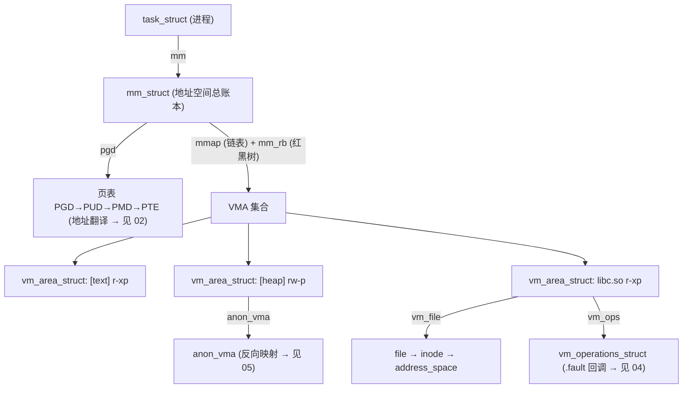

# 1. 地址空间的组织

进程的虚拟地址空间不是一整块，而是**一串各自映射到某个对象的区域**。内核用三层对象描述它：
`mm_struct`（地址空间总账本）→ 一组 `vm_area_struct`（VMA，每个区域）→ 页表（`pgd` 指向，负责地址翻译）。
本章讲这三层在 5.10 的真实数据结构（对照 `kernel-src/include/linux/mm_types.h`），并在末尾用「演进注」点出
6.x 的两处变化（maple tree、folio）。

## 1.1 全局关系



一句话：`pgd` 管「地址**怎么翻译**」，`mmap`/`mm_rb` 管「这段地址**合不合法、映射的是谁**」。两条线并行，
缺页处理（`03`）要同时用到：先用 `mm_rb` 查地址落在哪个 VMA、合不合法，再操作 `pgd` 那棵页表填映射。

## 1.2 mm_struct：地址空间总账本

定义：`kernel-src/include/linux/mm_types.h:407`

```c
struct mm_struct {
    struct {
        struct vm_area_struct *mmap;       /* VMA 链表头（按地址排序，用于遍历）*/
        struct rb_root         mm_rb;      /* VMA 红黑树根（O(log n) 查找）*/
        unsigned long          mmap_base;  /* mmap 区域基址 */
        unsigned long          task_size;  /* 用户空间大小（ARM64: 256TB）*/
        pgd_t                 *pgd;         /* 页全局目录——页表的根，调度时装入 TTBR0 */
        atomic_t               mm_users;    /* 共享此 mm 的线程数 */
        atomic_t               mm_count;    /* mm_struct 引用计数 */
        int                    map_count;   /* VMA 数量 */
        spinlock_t             page_table_lock; /* 保护页表（PGD/PUD/PMD）修改 */
        struct rw_semaphore    mmap_lock;   /* 保护地址空间拓扑：读锁=缺页/查找，写锁=mmap/munmap */
        unsigned long start_code, end_code, start_data, end_data;
        unsigned long start_brk, brk, start_stack;  /* 堆/栈边界 */
        /* ... total_vm / exec_vm / stack_vm 等统计 ... */
    };
};
```

| 字段 | 作用 | 关联 |
|------|------|------|
| `mmap` | VMA 单链表头，按地址排序 | 顺序遍历地址空间 |
| `mm_rb` | VMA 红黑树根 | `find_vma` 的 O(log n) 查找（`03` 缺页第一关）|
| `pgd` | 页表根，进程切换时其物理地址写入 `TTBR0_EL1` | 地址翻译（`02`）|
| `mmap_lock` | 读写信号量，缺页持读锁、改地址空间持写锁 | 见 1.6 锁序 |
| `map_count` | VMA 个数，几百上千很常见 | 决定 `mm_rb` 查找的树高 |

## 1.3 vm_area_struct：一个区域

定义：`kernel-src/include/linux/mm_types.h:308`

```c
struct vm_area_struct {
    unsigned long vm_start;            /* 区间起始虚拟地址（含）*/
    unsigned long vm_end;              /* 区间结束（不含）→ [vm_start, vm_end) */
    struct vm_area_struct *vm_next, *vm_prev;  /* VMA 链表（按地址排序）*/
    struct rb_node vm_rb;              /* 红黑树节点（快速查找）*/
    struct mm_struct *vm_mm;           /* 反指所属地址空间 */
    pgprot_t       vm_page_prot;       /* 页表级权限（与 PTE 权限位对应）*/
    unsigned long  vm_flags;           /* VM_READ/WRITE/EXEC/SHARED... */
    struct anon_vma     *anon_vma;       /* 匿名页反向映射锚点（→ 05）*/
    struct list_head     anon_vma_chain; /* fork 形成的 anon_vma 层级链 */
    const struct vm_operations_struct *vm_ops;  /* 文件映射回调（.fault 等 → 04）*/
    struct file         *vm_file;        /* 映射的文件；匿名映射为 NULL */
    unsigned long        vm_pgoff;       /* 映射在文件内的页偏移 */
};
```

🎯 **区域的两种映射来源**（决定缺页怎么填、写了回不回盘，详见 `04`）：
- `vm_file != NULL` → **文件映射**：缺页时由 `vm_ops->fault` 从文件/page cache 取页。
- `vm_file == NULL` → **匿名映射**：缺页时给置零页（堆、栈、`.bss`、`malloc` 大块）。
- `vm_flags & VM_SHARED` → 共享（写回盘、跨进程可见）；否则私有（写时复制 COW）。

### vm_flags 常用标志（`mm.h`）

| 标志 | 含义 |
|------|------|
| `VM_READ`/`VM_WRITE`/`VM_EXEC` | 读/写/执行权限 |
| `VM_SHARED` | 共享映射（修改对其他映射者可见、回写文件）|
| `VM_GROWSDOWN` | 向低地址增长（栈）|
| `VM_LOCKED` | mlock 锁定，不可换出（`06` 的 UNEVICTABLE）|

### 典型进程地址空间布局（ARM64，48 位 VA）

```
0xFFFF_FFFF_FFFF  ┌────────────────────┐  内核空间（TTBR1，用户不可见）
                  ├────────────────────┤
0x0000_FFFF_....  │   [stack]          │  VMA: VM_READ|VM_WRITE|VM_GROWSDOWN
                  │       ↓            │
                  │   (空洞)            │
                  │   libc.so (代码)    │  VMA: r-xp（共享，COW）
                  │   libc.so (数据)    │  VMA: rw-p
                  │   [mmap 区域]       │  VMA: 你 mmap 的文件/匿名大块
                  │   (空洞)            │
                  │   [heap]   ↑       │  VMA: rw-p（brk 管理，匿名）
                  │   [.bss]/[.data]    │  VMA: rw-p（匿名/文件）
0x0000_0000_....  │   [.text]          │  VMA: r-xp（文件映射，COW）
                  └────────────────────┘
```

## 1.4 VMA 的双结构：红黑树 + 链表

5.10 里 VMA 同时挂在两套结构上（`mm/mmap.c`）：

```
mm->mm_rb   红黑树   →  给地址找 VMA：find_vma(mm, addr) 走它，O(log n)
mm->mmap    单链表   →  按地址顺序遍历所有 VMA（vma->vm_next）
+ vmacache（每线程 4 槽 VMA 缓存，命中则跳过红黑树）
```

```
mm/mmap.c:find_vma() [行 2407]
  1. 先查 vmacache（每线程 4 槽缓存）
  2. 未命中 → 红黑树 mm_rb 查找 O(log n)，返回第一个 vm_end > addr 的 VMA
  3. 更新 vmacache
```

⚠️ **演进注（6.x）**：6.1 起内核用一棵 **maple tree**（`mm->mm_mt`）同时顶替「红黑树查找 + 链表遍历」，
删除了 `mm_rb`/`mmap`/`vma->vm_next` 与 vmacache。优点是 RCU 读近乎无锁、B 树节点对 cache 更友好。
本说明书对照的 5.10 还是红黑树+链表——查 `kernel-src` 看到的是 `mm_rb`，不是 `mm_mt`。

## 1.5 物理页描述符：struct page

定义：`kernel-src/include/linux/mm_types.h:71`。系统中每个物理页帧一个 `struct page`，大量用 union 复用字段省内存：

```c
struct page {
    unsigned long flags;          /* 状态标志 + 区域/节点编码 */
    union {
        struct {                  /* 页缓存 / 匿名页 */
            struct list_head lru;       /* LRU 链表节点（active/inactive，见 06）*/
            struct address_space *mapping; /* 文件页→inode->i_mapping；匿名页→anon_vma（最低位=1，见 05）*/
            pgoff_t index;              /* 在映射中的偏移 */
            unsigned long private;
        };
        struct { /* slab */ };
        struct { unsigned long compound_head; };  /* 复合页尾页：指向首页 */
        /* ... */
    };
    atomic_t _mapcount;        /* 被多少 PTE 映射（rmap 依赖，见 05）*/
    atomic_t _refcount;        /* 引用计数 */
};
```

常用页面标志（`include/linux/page-flags.h`）：`PG_locked`（I/O 中）、`PG_dirty`（已改待回写，见 `07`）、
`PG_lru`/`PG_active`（在哪条 LRU，见 `06`）、`PG_referenced`（最近访问，LRU 决策）、`PG_writeback`（回写中）。

⚠️ **演进注（6.x）**：内核大量用复合页（THP 大页、hugetlb），由多个连续页帧组成、有「头页/尾页」之分，
函数拿到 `struct page*` 不知是头是尾，误碰尾页元数据是反复出现的 bug。5.16 起引入 `struct folio`——内存上
重叠一个 page、类型上**保证指向头页**，新 API（`folio_referenced`/`folio_get`）只收 folio。本说明书对照的
5.10 还没有 folio，`kernel-src` 里 `try_to_unmap(struct page *)`、`page_referenced(struct page *)` 收的都是
`page`（见 `05`）。CSAPP 的「物理页」概念在两个版本里都成立。

## 1.6 用户态怎么看这套结构

`/proc/<pid>/maps` 的**每一行就是一个 VMA**（红黑树/链表的可读投影）：

```
55a3c1000000-55a3c1021000 r-xp 00000000 fd:01 1314    /usr/bin/cat   ← vm_start-vm_end vm_flags ... vm_file
...
7f8b...-7f8b...           rw-p 00000000 00:00 0        [heap]         ← 匿名，vm_file 为空
7ffe...-7ffe...           rw-p 00000000 00:00 0        [stack]
```

权限位末位 `p`=private(COW)、`s`=shared；带路径的是文件映射，`[heap]`/`[stack]`/无名是匿名映射。
`/proc/<pid>/smaps` 进一步给每个 VMA 的 `Rss`/`Pss`/`Anonymous`/`Shared_*`/`Private_*`/`Swap`——
能直接看出哪些页共享、COW 后变私有多少、被换出多少。实验见 [08](08-observation-and-experiments.md)。

## 1.7 关键锁序（来自 mm/rmap.c 注释，权威）

```
mmap_lock (mm_struct)
  └─ page lock (PG_locked)
       └─ mapping->i_mmap_rwsem
            └─ anon_vma->rwsem
                 └─ page_table_lock / pte_lock
                      └─ lruvec lock / swap_lock
```

修改 VMA 拓扑（mmap/munmap）持 `mmap_lock` 写锁；缺页处理（`03`）持读锁。理解锁序能解释「为什么缺页
和回收能并发、为什么改地址空间要串行」。完整锁序见 `kernel-src/mm/rmap.c` 文件头注释。
