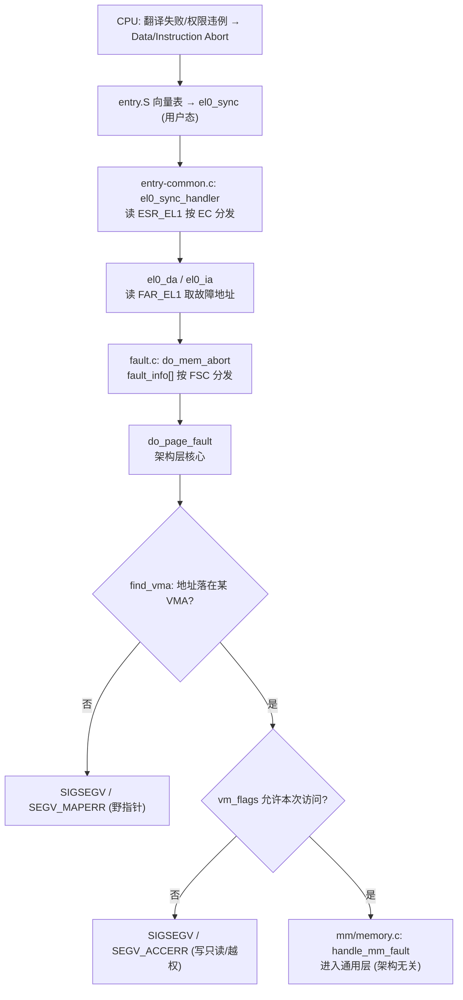
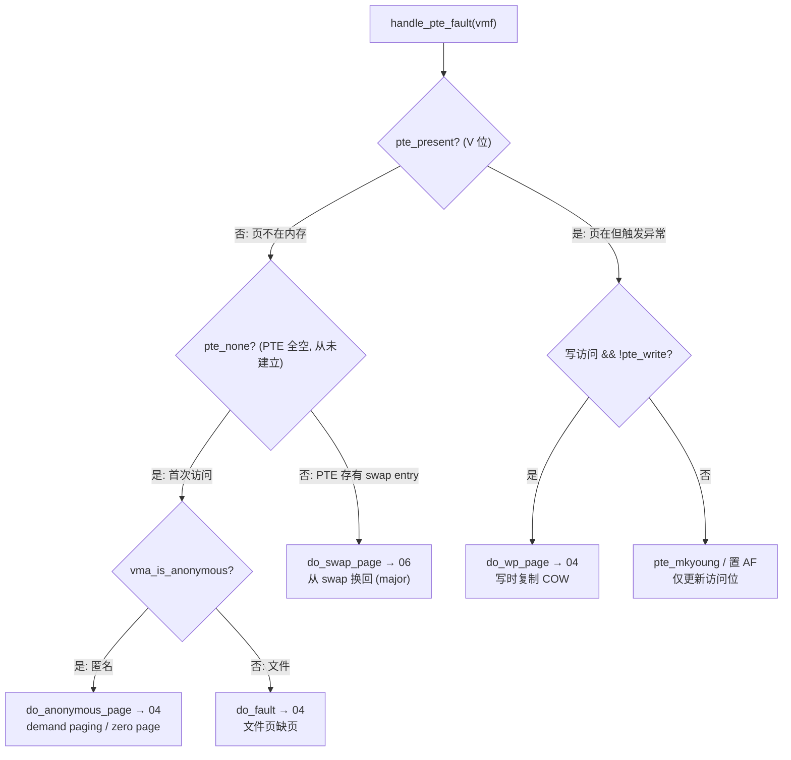

# 3. 缺页处理主线

缺页（page fault）是虚拟内存所有「延迟」机制的总开关：demand paging、COW、swap 换入、文件映射，
本质都是「先建 VMA 不给物理页，等真访问时缺页，再按需补」。本章走完这条主线——从 ARM64 硬件异常进内核，
到 `handle_pte_fault` 按 PTE 状态分流到各处理函数；各分支的细节在 `04`（demand paging/COW/文件页）与
`06`（swap）展开。这是整套说明书的中轴。

## 3.1 缺页分类：minor vs major

```
┌─────────────────────────────────────────────────────────┐
│                       Page Fault                          │
├──────────────────────────┬────────────────────────────────┤
│  Minor Fault (无需 I/O)   │  Major Fault (需磁盘 I/O)        │
│  - 首次访问匿名页(置零页)  │  - 从文件读页 (do_fault 首次)    │
│  - COW 写时复制           │  - 从 swap 读回 (do_swap_page)   │
│  - zero page 只读映射     │  - 文件页不在 page cache         │
│  计入 minflt              │  计入 majflt                     │
└──────────────────────────┴────────────────────────────────┘
```

区别只在「要不要等磁盘」。两者都走下面同一条代码主线，分流点在 `handle_pte_fault`。
实测把两类分开见 [08 实验 3](08-observation-and-experiments.md)（minor 32774 / major 32768）。

## 3.2 从硬件异常到内核：ARM64 入口（架构相关）



🎯 **两个关键 ARM64 寄存器**：
- `FAR_EL1`（Fault Address Register）：硬件填入触发缺页的虚拟地址。`el0_da` 用 `read_sysreg(far_el1)` 取出。
- `ESR_EL1`（Exception Syndrome Register）：异常综合信息。高位 EC（异常类别）区分数据/指令 abort、系统调用等；
  低 6 位 **FSC（Fault Status Code）** 进一步区分故障种类——这正是「缺页三关」的硬件分类依据。

🎯 **FSC 直接对应 CSAPP §9.7 的缺页三关**（`fault.c` 的 `fault_info[]` 分发表）：

| FSC | 故障类型 | 处理 | 结局 | 对应「三关」 |
|-----|---------|------|------|------------|
| 4-7 | Translation fault（地址没映射）| `do_translation_fault`→`do_page_fault` | 地址不在 VMA → `SEGV_MAPERR` | 关卡①：地址合法吗 |
| 13-15 | Permission fault（权限违例）| `do_page_fault` | 写只读/越权 → `SEGV_ACCERR` | 关卡②：访问合法吗 |
| 9-11 | Access flag fault（AF 未置）| `do_page_fault` | 正常补 AF / 缺页 | 关卡③：正常缺页 |

⚠️ **段错误和正常换页是同一个硬件异常的两种结局**：都从 Data/Instruction Abort 进 `do_page_fault`，
区别只在 `find_vma`（地址在不在任何 VMA）和权限检查（`vm_flags` 允不允许本次访问）两关有没有挂掉。
野指针解引用挂在关卡①，写字符串字面量挂在关卡②，都还没走到 `handle_mm_fault`。

> 对比 x86-64：入口是 `arch/x86/mm/fault.c:exc_page_fault → do_user_addr_fault`，故障地址在 `CR2`、
> 错误码在异常压栈的 error_code。**从 `handle_mm_fault` 往后完全相同**——这是「文档讲 ARM64、实验跑 x86
> 不矛盾」的分界线。

## 3.3 通用层入口：handle_mm_fault → __handle_mm_fault

进了 `mm/memory.c` 就是架构无关代码。`handle_mm_fault` 做统计与准备，`__handle_mm_fault` 逐级走/补
页表（用 `02` 的 `*_alloc` 链），顺带处理大页，最后落到 `handle_pte_fault`：

```
mm/memory.c:handle_mm_fault()                 [行 5307]
  ├── count_vm_event(PGFAULT)                  # 统计：/proc/vmstat 的 pgfault++
  ├── arch_vma_access_permitted()             # 架构级权限二次确认
  ├── if (hugetlb VMA) → hugetlb_fault()      # 大页单独路径
  └── __handle_mm_fault()                      [行 4859]
        ├── pgd = pgd_offset(mm, address)      # 逐级走/补页表（见 02.2）
        ├── p4d_alloc / pud_alloc / pmd_alloc
        ├── if (pmd 空 && THP 可用)
        │     → create_huge_pmd()              # 尝试直接建 2MB 透明大页
        └── handle_pte_fault(vmf)              [行 4728]   # PTE 级分流（下一节）
```

## 3.4 分流核心：handle_pte_fault

这是整条主线的「调度台」——按最后一级 PTE 的状态，把缺页分给不同处理函数。**每条分支对应一个 CSAPP 概念**：



对应的 ASCII 调用链（`mm/memory.c:handle_pte_fault() [行 4728]`）：

```
handle_pte_fault(vmf)
  ├── if (!pte_present)                        # 页不在内存
  │     ├── if (pte_none)                       # PTE 从未建立（首次访问）
  │     │     ├── vma_is_anonymous → do_anonymous_page()   # → 04 匿名页/zero page
  │     │     └── else                → do_fault()           # → 04 文件页
  │     └── else (有 swap entry)       → do_swap_page()       # → 06 换回（major fault）
  │
  └── if (pte_present)                          # 页在内存但仍触发异常
        ├── if (写 && !pte_write)    → do_wp_page()           # → 04 COW
        └── else                     → pte_mkyoung()+置 AF     # 仅刷访问位
```

## 3.5 贯穿路径的上下文：struct vm_fault

从 `__handle_mm_fault` 起，缺页的所有信息打包进一个 `struct vm_fault`，随调用链往下传，避免层层传一堆参数：

```c
// include/linux/mm.h
struct vm_fault {
    struct vm_area_struct *vma;     /* 命中的 VMA（find_vma 的结果）*/
    unsigned long address;          /* 故障虚拟地址（页对齐，来自 FAR_EL1）*/
    enum fault_flag flags;          /* FAULT_FLAG_WRITE / _USER / _REMOTE ... */
    pmd_t *pmd;  pud_t *pud;        /* 走到的中间级表项 */
    pte_t  orig_pte;                /* 缺页时读到的 PTE 原值（分流靠它判断）*/
    pte_t *pte;  spinlock_t *ptl;   /* 最后一级表项指针 + 页表锁 */
    struct page *page;              /* 处理函数填入的结果页 */
};
```

`flags` 里的 `FAULT_FLAG_WRITE` 是「读缺页还是写缺页」的判据——`do_anonymous_page` 用它决定走 zero page
还是分配实页（`04`），`handle_pte_fault` 用它决定要不要进 `do_wp_page`。`orig_pte` 是分流的核心依据。

## 3.6 处理完之后

每个处理函数最终都：① 构造好新的 PTE、`set_pte_at` 写进页表；② 必要时加入 rmap（`05`）和 LRU（`06`）；
③ 返回 `VM_FAULT_*`。控制权回到 ARM64 入口，**重新执行**触发缺页的那条指令（呼应 §8.1 故障「返回当前
指令重试」）——这次翻译就命中了。整条链对应用户态可见的就是 `minflt`/`majflt` 计数 +1。

下一章 `04` 钻进三条最常见的分支：`do_anonymous_page`（demand paging）、`do_fault`（文件页）、
`do_wp_page`（COW）。
