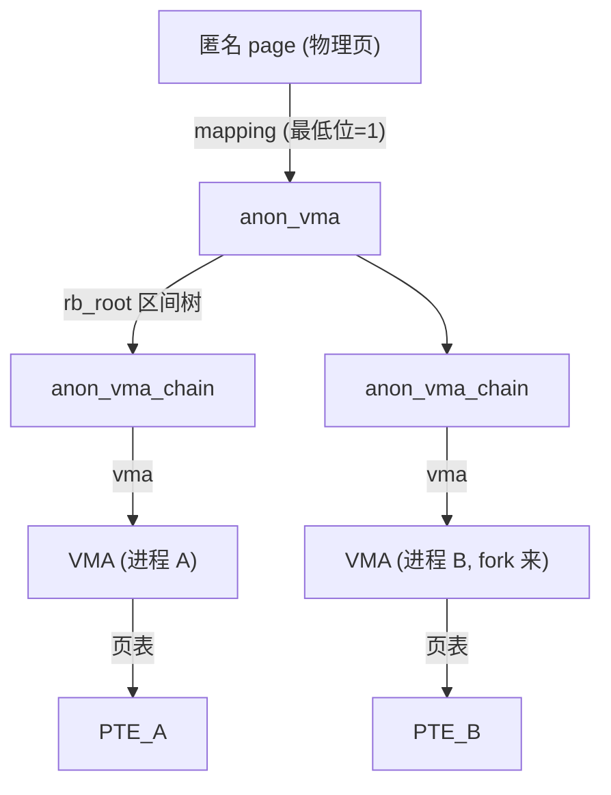

# 5. 反向映射 (rmap)

CSAPP 没讲反向映射，但它是页回收（`06`）的地基。正向映射是「虚拟地址 → 物理页」，页表干的；反向映射
（reverse mapping, rmap）反过来回答：**给定一个物理页，有哪些进程的哪些 PTE 正指着它？** 回收或迁移一个
物理页前，必须把这些 PTE **全部**找到并解除，否则那些进程会读到错页。源码：`kernel-src/mm/rmap.c`。

> 5.10 的 rmap 接口收 `struct page *`（`try_to_unmap(page)`、`page_referenced(page)`）；6.x 改为 folio
> 版本（`try_to_unmap(folio)`、`folio_referenced(folio)`）。结构和逻辑一致，本章按 5.10 的 page 写。

## 5.1 为什么需要 rmap

```
正向：  虚拟地址 ──页表──▶ 物理页          （每次访存都走，MMU 干）
反向：  物理页 ──rmap──▶ {PTE_A, PTE_B, ...}（回收/迁移时才走，内核软件干）
```

⚠️ 不能靠「遍历所有进程的所有页表找谁映射了这页」——一个页可能被几十个进程（fork 后）共享，全量扫描
页表代价爆炸。rmap 用 per-物理页的辅助结构，让「物理页 → 全部 PTE」是近似 O(映射数) 的。匿名页和文件页
各有一套 rmap 机制。

## 5.2 匿名页反向映射：anon_vma

匿名页（堆/栈/`malloc`）的 rmap 锚点是 `struct anon_vma`（`kernel-src/include/linux/rmap.h`）：

```c
struct anon_vma {
    struct anon_vma *root;          /* 根 anon_vma（fork 层级的根）*/
    struct rw_semaphore rwsem;      /* 保护 rb_root */
    atomic_t refcount;
    struct rb_root_cached rb_root;  /* 区间树：所有映射此 anon_vma 的 VMA */
};

struct anon_vma_chain {            /* 连接 VMA ↔ anon_vma 的「胶水」*/
    struct vm_area_struct *vma;     /* 关联的 VMA */
    struct anon_vma *anon_vma;      /* 关联的 anon_vma */
    struct list_head same_vma;      /* 挂在 vma->anon_vma_chain 上 */
    struct rb_node rb;              /* 挂在 anon_vma->rb_root 区间树上 */
};
```



🎯 **page→anon_vma 的链路**：匿名 page 的 `mapping` 字段指向 `anon_vma`（用最低位 =1 与文件页的
`address_space` 区分；`page_anon_vma(page)` 取出它）。从一个匿名页出发，经 `anon_vma->rb_root` 区间树遍历到
所有映射它的 VMA，再用 `vm_pgoff`/`vm_start` 算出每个 VMA 里对应的虚拟地址，进而定位 PTE。

🎯 **fork 与 anon_vma 层级**：fork 时子进程的 VMA 通过新建的 `anon_vma_chain` 既链到自己的新 anon_vma、
又链到父的 anon_vma（`root` 指向共同祖先）。这样一个 COW 共享页能被父子双方反查到——这正是 `04` 里
`do_wp_page` 判断「这页还有几个映射者」（`page_mapcount`）的依据。

## 5.3 文件页反向映射：address_space

文件页（page cache）的 rmap 更简单，不需要 anon_vma：

```
文件 page → page->mapping → address_space → i_mmap (区间树)
   → 遍历所有映射该文件区域的 VMA
     → 用 vm_pgoff + 页在文件内的 index 算虚拟地址
       → 定位 PTE
```

🎯 因为文件页天然有「文件 + 页偏移」这个全局身份，所有映射同一文件区域的 VMA 都挂在该文件
`address_space->i_mmap` 区间树上，按页偏移就能查到。匿名页没有文件后备，才需要 anon_vma 这套额外结构。

## 5.4 rmap 的两个核心操作

回收（`06`）通过统一的 `rmap_walk` 遍历一个 page 的所有映射，对每个映射执行回调：

```
mm/rmap.c:try_to_unmap(page, flags)           [行 1843]   # 回收前：解除 page 的所有映射
  → rmap_walk(page, &rwc)
    → 对每个映射 try_to_unmap_one(page, vma, addr):       [行 1448]
        → page_vma_mapped_walk()              # 遍历该 VMA 里指向此 page 的 PTE
        → ptep_clear_flush()                  # 清 PTE + 刷 TLB
        → 匿名页: set_swp_pte()               # PTE 改写成 swap entry（记下换到哪）
        → 文件页: 直接清（干净页可重读，脏页前面已回写）
        → page_remove_rmap()                  # 映射计数 _mapcount--

mm/rmap.c:page_referenced(page, ...)          [行 871]    # 回收候选时：这页最近被访问过吗？
  → rmap_walk → page_referenced_one():
        → 遍历每个 PTE，检查 AF/accessed 位（pte_young）
        → 清 accessed 位（给 "second chance"）
        → 返回引用计数，喂给 LRU 决策（→ 06）
```

🎯 **try_to_unmap 是回收的关键一步**：要换出一个物理页，必须先把所有指向它的 PTE 清掉（匿名页改成
swap entry 以便日后换回）。完成后这页才「无人引用」，能归还。

🎯 **page_referenced 驱动 LRU**：回收扫描时靠它遍历 rmap、读各 PTE 的 AF 位，判断「最近是否被访问」，
决定这页是降级回收还是保留——这是 `06` Second Chance / LRU 决策的数据来源。

## 5.5 rmap 在全局中的位置

rmap 不是独立功能，而是被多处调用的基础设施：
- **页回收**（`06`）：`try_to_unmap` 解映射、`page_referenced` 判冷热。
- **写时复制**（`04`）：`do_wp_page` 靠 `page_mapcount` 判断复用还是复制；复制后 `page_add_new_anon_rmap`
  给新页建 rmap。
- **页迁移 / compaction**：移动一个物理页时，靠 rmap 把所有 PTE 改指新位置。
- **缺页**（`04`）：`do_anonymous_page`/`do_swap_page` 给新页 `page_add_*_anon_rmap` 登记。
