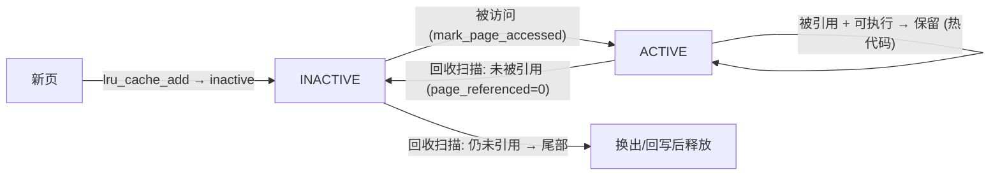

# 6. 页回收与交换

CSAPP §9.3 说虚拟内存把 DRAM 当磁盘的缓存，但没讲「缓存满了换出谁、怎么换、怎么换回」。本章补这一块：
内核用 LRU 近似挑牺牲页（`mm/vmscan.c`、`mm/swap.c`），后台 kswapd 与前台直接回收按水位线触发，匿名页
换出到 swap、脏文件页回写后丢弃，换出的页日后由 `do_swap_page` 换回（一次 major fault）。

## 6.1 哪些页能回收

```
可直接丢弃: clean 的文件页（可从磁盘重读）           ← 最便宜
需先回写:   dirty 的文件页（先写回原文件，见 07）     ← 中等
需换出:     匿名页（无文件后备，必须写 swap）          ← 最贵，且要有 swap
不可回收:   内核页表 / slab(不可移动) / mlock / unevictable
```

⚠️ **无 swap = 匿名脏页无处可去**：没配 swap（或被 cgroup 限死）时，匿名页根本不能驱逐，内存一紧张
只能触发 OOM killer——这就是很多容器「内存一满直接被 kill、没有先变慢的缓冲」的原因（呼应 §9.1-9.5）。

## 6.2 LRU：active / inactive 双链表

每个 lruvec（NUMA 节点级或 memcg 级）维护 5 条 LRU 链表（`include/linux/mmzone.h`）：

```
LRU_ACTIVE_ANON    活跃匿名页              LRU_ACTIVE_FILE    活跃文件页
LRU_INACTIVE_ANON  不活跃匿名页(回收候选)   LRU_INACTIVE_FILE  不活跃文件页(回收候选)
LRU_UNEVICTABLE    不可驱逐页(mlock 等)
```

anon 与 file 分开，是因为两者回收代价不同（匿名要写 swap，文件干净页可直接丢）。页在 active/inactive
间的流转就是 LRU 近似 + Second Chance：



🎯 **Second Chance（`shrink_active_list` [行 2077]）**：扫描 active 链表时调 `page_referenced`（经 rmap 遍历
PTE 读 AF 位，见 `05`），引用过的清掉 AF、保留或回 inactive 头（再给一次机会），没引用的降到 inactive 尾
（即将回收）。热代码页（referenced + mapped + executable）不轻易降级。

## 6.3 谁来回收：kswapd vs 直接回收 + 水位线

每个内存区有三条水位线，分配路径据此决定回收方式：

```
                   ┌──────────────────────┐
  high  ───────────│ kswapd 睡眠(回收到此停)│
                   ├──────────────────────┤
  low   ───────────│ 唤醒 kswapd(后台异步)  │  ← 跌破 low：wakeup_kswapd，不阻塞分配
                   ├──────────────────────┤
  min   ───────────│ 直接回收(阻塞分配者)   │  ← 跌破 min：分配进程自己同步回收，延迟毛刺来源
                   ├──────────────────────┤
  0     ───────────│ OOM Kill              │  ← 回收救不回来：杀进程
                   └──────────────────────┘
水位由 min_free_kbytes 按各 zone 比例算：low=min+min/4，high=min+min/2。
```

```
kswapd（每 NUMA 节点一个内核线程，mm/vmscan.c:kswapd [行 3976]）
  while (1):
    等待唤醒 (pgdat->kswapd_wait)
    balance_pgdat():                        [行 3656]
      for priority = 12 downto 0:           # 优先级越低扫得越狠
        kswapd_shrink_node() → shrink_node()
        if (空闲恢复到 high) break

直接回收（kswapd 来不及时，分配者自己来）
  __alloc_pages_slowpath()
    → __alloc_pages_direct_reclaim() → try_to_free_pages() → shrink_node()  # 同一核心函数
```

🔧 **观测**：`/proc/vmstat` 的 `pgscan_kswapd`/`pgsteal_kswapd`（后台扫描/换出页数）vs
`pgscan_direct`/`pgsteal_direct`（**直接回收，这个涨 = 内存吃紧到卡分配了**）；`pswpin`/`pswpout` 看 swap 抖动。

## 6.4 核心回收函数：shrink_node → shrink_page_list

```
mm/vmscan.c:shrink_node()                    [行 2776]
  ├── shrink_lruvec()                        [行 2531]
  │     ├── get_scan_count()                 [行 2328]  # 决定扫 anon vs file 的比例（受 swappiness 影响）
  │     ├── shrink_active_list()             [行 2077]  # active → inactive 降级（Second Chance）
  │     └── shrink_inactive_list()
  │           ├── isolate_lru_pages()        # 从 inactive 尾批量取页
  │           └── shrink_page_list()         # 逐页尝试回收（下面）
  └── shrink_slab()                          # 顺带回收 dentry/inode 等缓存（shrinker 回调）

mm/vmscan.c:shrink_page_list()              [行 1122]   # 逐页回收的核心
  for each page:
    ├── if (PageWriteback) → 跳过（正在回写）
    ├── page_referenced() → 若最近被访问且有映射 → 放回 active，不回收
    ├── if (匿名页 && 未在 swap cache) → add_to_swap()   # 分配 swap 槽位
    ├── try_to_unmap(page)                   # 解除所有 PTE 映射（见 05）
    ├── if (PageDirty) → pageout()           # 脏页回写：文件页→writepage，匿名页→swap_writepage
    └── if (clean && unmapped) → __remove_mapping() → free → 归还 buddy
```

## 6.5 swap：匿名页的后备

🎯 **swap entry 藏在 PTE 里**：匿名页换出时，`try_to_unmap` 把 PTE 改写成一个 `swp_entry_t`（含 swap
设备号 type + 槽位 offset），物理页释放。日后访问该地址，PTE「存在但非 present」，`handle_pte_fault`
分流到 `do_swap_page`（`03`）：

```c
swp_entry_t:  ┌── type (设备号) ──┬── offset (槽位) ──┐   存在被换出页的 PTE 里
```

```
mm/memory.c:do_swap_page(vmf)                [行 3619]   # PTE 里是 swap entry → 换回
  ├── entry = pte_to_swp_entry(orig_pte)
  ├── page = lookup_swap_cache(entry)         # 先查 swap 缓存
  ├── if (未命中) → swapin_readahead()        # 从磁盘读（含预读）→ MAJOR FAULT（计入 majflt）
  ├── set_pte_at(mk_pte(page))                # 重建 PTE
  ├── page_add_anon_rmap()                    # 重建反向映射（见 05）
  └── swap_free(entry)                        # 释放 swap 槽位
```

🎯 **swappiness 调回收倾向**（`/proc/sys/vm/swappiness`，默认 60）：`get_scan_count` 用它分配扫描比例——
`anon_prio = swappiness`、`file_prio = 200 - swappiness`。值越大越积极换匿名页、越小越倾向回收文件页 cache。
0 表示尽量不换匿名页（除非极紧张）。

## 6.6 演进注：MGLRU（6.1+）

本说明书对照的 5.10 用的就是上面这套 active/inactive 双链表 + Second Chance。⚠️ 这套「最近是否访问」信号
偏粗——6.1 起内核引入可选的 **MGLRU（Multi-Gen LRU，多代 LRU）**：给页分「代龄」、用更细的扫描区分冷热，
回收决策更准、扫描开销更低，开关在 `/sys/kernel/mm/lru_gen/enabled`。**5.10 的 `kernel-src` 里没有 MGLRU**，
查到的还是 `shrink_active_list`/`shrink_inactive_list` 这套；知道有这个演进方向即可。

> 与脏页回写的关系：本章的回收在内存压力下**顺路**回写脏文件页（`pageout`）；而 `07` 的脏页回写是
> **独立**的、由时间/脏比例驱动的子系统，内存不紧张也照样周期刷盘。两条路别混。
