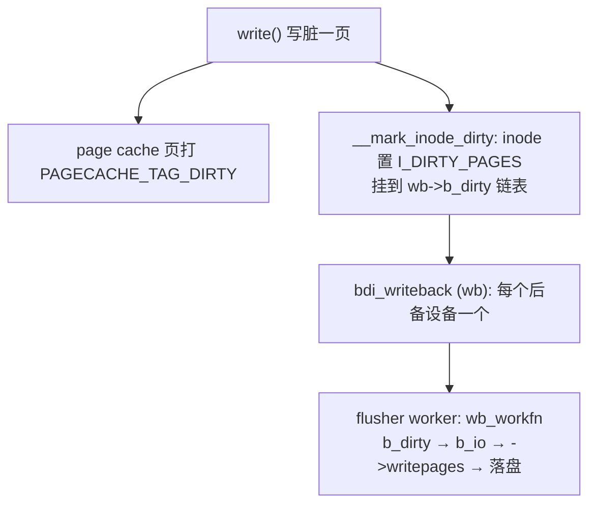

# 7. 脏页回写 (writeback)

CSAPP §6.4 的写回（write-back）策略只说「先写 cache、晚点落盘」，但「晚多久、谁来写、写多快」是个黑盒。
本章打开它：脏页回写是一个**独立于页回收**的子系统（`mm/page-writeback.c`、`fs/fs-writeback.c`），
由时间和脏比例驱动，用「水位 + 反馈限流」把突发写入摊平成磁盘扛得住的稳定速率。

> 行号说明：参考文档对 writeback 仅轻提，本章不引用行号，只给 `文件:函数`，避免编造。

## 7.1 回写 ≠ 回收（先厘清）

| | 页回收（`06`，reclaim/kswapd） | 脏页回写（本章，writeback） |
|---|---|---|
| 动机 | **内存压力**：腾出物理页 | **时间 + 脏比例**：让已改数据及时落盘 |
| 触发 | 空闲跌破水位 | 周期定时 / 脏页超阈值 / fsync |
| 与内存关系 | 内存紧才动 | **内存很空也照样周期刷老脏页** |
| 交叉 | 回收时**顺路**回写脏文件页（`pageout`）| 主动、独立回写 |

两条路最终都可能落到文件系统的 `->writepages`，但动机完全不同。别把「Dirty 高」当成「内存不足」。

## 7.2 谁来写：per-bdi flusher



🎯 **per-bdi（不再是单个 pdflush）**：每个后备设备（一块盘 / 一个网络文件系统）有一个
`struct backing_dev_info`（bdi），内嵌 `struct bdi_writeback`（wb，`include/linux/backing-dev-defs.h`）。
回写由 wb 上的 workqueue worker `wb_workfn()`（`fs/fs-writeback.c [行 2076]`）执行。

⚠️ **设计演进**：早期是**一个全局 pdflush** 线程，一块慢盘会拖垮所有设备的回写；现在 **per-bdi
（甚至 per-cgroup-per-bdi）各管各的**，慢 U 盘卡住不影响 NVMe 的回写节奏。`ps` 里看到的
`kworker/u*:*+flush-<major>:<minor>` 就是某个 bdi 的 flusher——它是回写**执行者**，不是制造脏页的元凶；
真正要找的是「谁把页弄脏了」（呼应 §9.1-9.5 回写风暴排查）。

## 7.3 脏在哪记：两层

```
页级（page cache 内）:
  写脏一页 → 在 address_space 的 xarray 上打 PAGECACHE_TAG_DIRTY (= XA_MARK_0)
            （回写时只遍历脏页、跳过干净页，O(脏页数) 而非 O(全部缓存页)）

inode 级:
  __mark_inode_dirty()  [fs/fs-writeback.c 行 2237]  →  inode 置 I_DIRTY_PAGES
                        →  把 inode 挂到所属 wb 的脏链表 wb->b_dirty
  flusher 干活时按链表流转: b_dirty ──取一批──▶ b_io（本轮待写）──没写完──▶ b_more_io
```

`PAGECACHE_TAG_DIRTY`（`include/linux/fs.h`）让回写按标记快速定位脏页；`b_dirty`/`b_io`/`b_more_io`
（`backing-dev-defs.h`）让 flusher 按 inode 一轮轮组织回写。

## 7.4 何时写：五个触发源

```
1. 周期性     flusher 每 dirty_writeback_centisecs(默认 5s) 醒一次，
              回写"脏龄"超过 dirty_expire_centisecs(默认 30s)的老脏页 → 脏数据最长寿命有界
2. 过 background  脏页超 dirty_background_ratio(10%) → 唤醒 flusher 后台异步回写，不阻塞写者
3. 过 dirty       脏页超 dirty_ratio(20%) → 写者在 balance_dirty_pages 里被同步节流（见 7.5）
4. 显式           fsync/fdatasync(单文件)、msync(mmap)、sync(全局)
5. 回收顺路       reclaim 扫到脏文件页时 pageout() 触发（与 06 交叉）
```

⚠️ 阈值百分比基于**可脏内存**（dirtyable ≈ free + 可回收 file 页），不是物理内存总量——大内存机实测的
回写触发点常明显低于 `MemTotal × 比例`。

## 7.5 怎么不写爆：balance_dirty_pages 反馈限流

每次写文件，write 路径末尾调 `balance_dirty_pages_ratelimited()`（`mm/page-writeback.c [行 1905]`）。它**不是**
简单「超阈值就睡」，而是一个反馈控制器：

```
balance_dirty_pages():                        [mm/page-writeback.c 行 1580]
  ├── 估计当前脏页在 (background, limit) 区间的位置  → 目标回写速率（position control）
  ├── 结合每个 wb 实测回写带宽（wb_update_bandwidth）  → 给写进程分配脏页配额 + 应暂停时间（rate control）
  └── 脏页越接近 limit，插入的 sleep 越长
        → 把写入速率平滑拽到接近磁盘回写带宽，避免"冲到 limit 才急刹车"
```

撞到 limit 时写进程同步睡在 `balance_dirty_pages` 里——这正是 §9.1-9.5 说的「`wchan` 卡在
`balance_dirty_pages` = 被脏页限流」的代码出处。

🔧 **实测（[08 实验 5](08-observation-and-experiments.md)，`dirty_writeback.c`，x86 32GB/NVMe）**：
持续写 12GB 不 fsync——起步 ~6000 MB/s（纯 page cache 吸收、Dirty 线性涨）→ ~1GB 处吞吐腰斩到 ~3000 MB/s
（balance_dirty_pages 软节流）→ ~2GB 后 Writeback 转非 0（flusher 介入）、Dirty 稳在 ~2.2-3.1GB 平台不再涨。
⚠️ NVMe 回写够快，全程稳在 background 水位、没撞 limit；慢盘（HDD/U盘）才会看到吞吐被硬拽到磁盘带宽、
Dirty 顶死 limit。

## 7.6 观测与调优

🔧 **观测**：`/proc/meminfo` 的 `Dirty`（待回写）/`Writeback`（正在回写）；`/proc/vmstat` 的
`nr_dirty`/`nr_writeback`/`nr_written`/`dirty_threshold`。`Dirty` 持续高不降 = 写入盖过回写、撞 `dirty_ratio`；
`Writeback` 持续非 0 = flusher 在忙。

🔧 **调优**：大内存机用 `vm.dirty_bytes`/`dirty_background_bytes`（绝对值，比 `*_ratio` 精确）削峰；慢盘上
`dirty_ratio` 太高 → 突发写积压几 GB → 一次 `fsync`/`sync` 要等全部刷完造成延迟尖峰，应调低或改用
`dirty_bytes`；自己 `fsync` 控落盘的数据库另算。

一句话设计意图：writeback 用「水位 + 反馈限流」既不让脏数据无限堆积（数据安全 + 控内存），又尽量不阻塞
应用——这就是书本一句「write-back」背后真正的工程。
