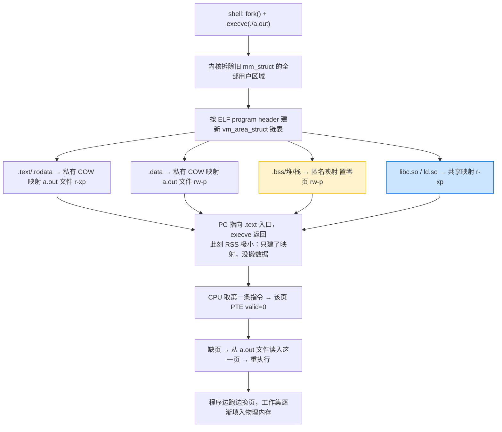
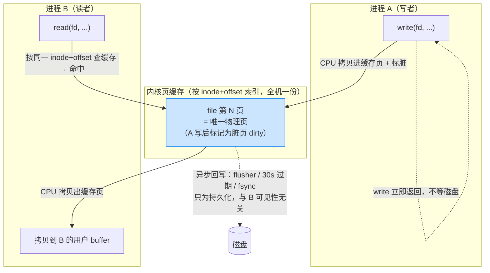
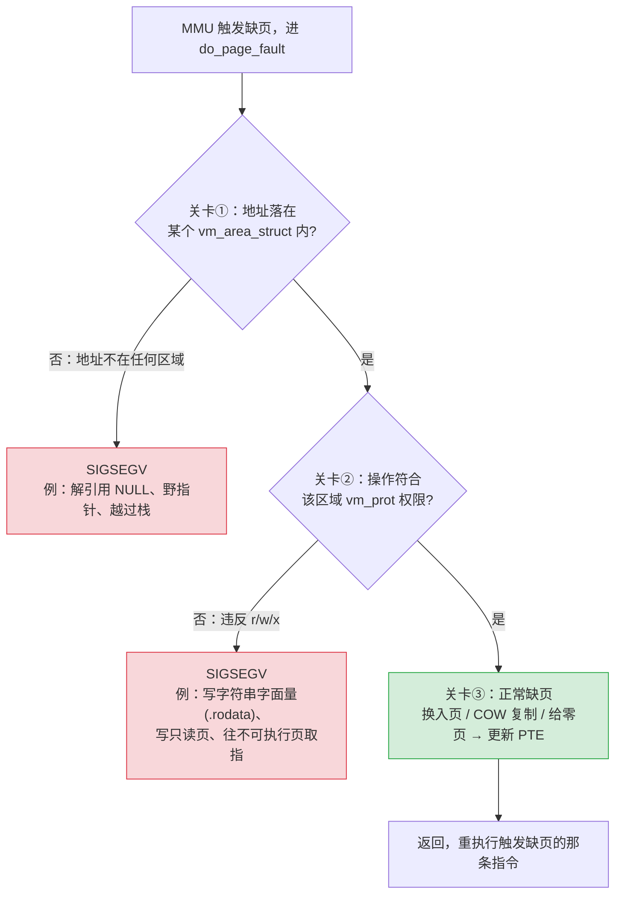
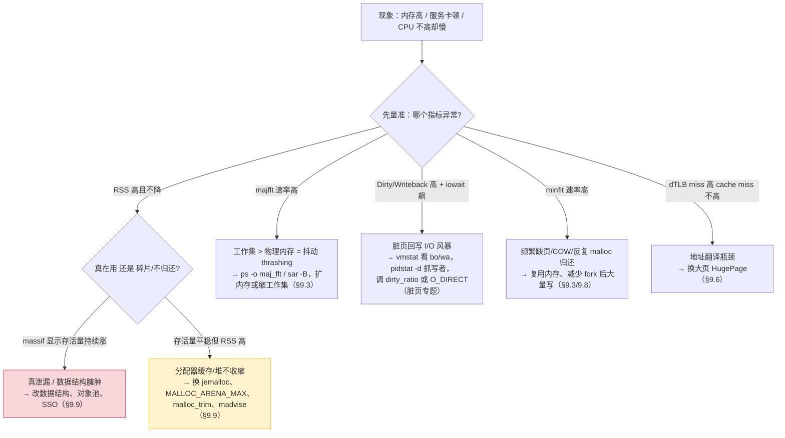

# 虚拟内存实战：日常开发场景串讲

前面四份 `summary.md` 是**按小节、从机制到实现**纵向讲虚拟内存：§9.1-9.5 给机制（地址翻译、缺页、保护），§9.6 讲翻译怎么加速（TLB、多级页表），§9.7-9.8 讲 Linux 怎么用这套机制（`vm_area_struct`、内存映射、COW），§9.9-9.10 讲分配器和 GC。这份文档反过来——**以程序员每天都在做的事为线索，横向把全章机制重新串一遍**。每个场景回答同一个问题：「我写下这行再普通不过的代码，虚拟内存系统在背后到底做了什么？」

每个场景按四件套组织：**一张图**（流程/数据结构）+ **一段最小可编译代码** + **一组可观测命令**（`strace`/`perf`/`/proc`）+ **🔗 串到的小节**（回链全章知识点）。读完应当能把「启动程序、malloc、读写文件、fork、踩段错误、共享内存、性能调优、线上排查」这八件日常事，逐一拆解成第 9 章学过的机制。

---

## 场景 1：程序启动与加载动态库——`./a.out` 按下回车那一刻

🎯 **一行 `execve` 背后：换一本全新的地址空间账本**
shell 里敲 `./a.out`，shell 先 `fork` 出子进程，子进程调 `execve("./a.out", ...)`。`execve` **不把程序读进内存**，它做的是「换账本」：拆掉旧的 `vm_area_struct` 区域链表，按 a.out 的 ELF program header 重建一串新区域，然后把 PC 指向 `.text` 入口就返回。真正的代码、数据，是 CPU 执行到、访问到时靠 **demand paging** 一页页缺页换入的。



🔧 **共享库的代码全机器只有一份物理页**
`libc.so` 被映射成**共享、只读**区域（`r-xp`）。机器上同时跑 100 个动态链接程序，每个进程的页表里都有一条指向 libc `.text` 的 PTE，但它们**指向同一批物理页帧**——内核磁盘缓存里 libc 代码只存一份。这就是「开 100 个进程内存不会成比例暴涨」的根本原因（呼应 §9.4 简化共享）。所以统计进程内存要用 PSS（按共享份数均摊）而非 RSS。

🧪 **三条命令把启动过程看透**
```bash
# ① 看 execve → 一串 mmap（映射 ld.so/libc/可执行文件）→ mprotect（GOT 改只读，呼应 §7 RELRO）
strace -e trace=execve,mmap,mprotect,openat ./a.out

# ② 程序跑起来后看它的区域：r-xp 代码、r--p 只读数据、rw-p 数据/堆、带路径的是文件映射
cat /proc/$(pgrep a.out)/maps

# ③ 看两个进程的 libc 是不是同一批物理页（pmap -X 的 Mapping/RSS 列）
pmap -X $(pgrep a.out) | grep libc

# ④ 链接期就钉死的虚拟地址（与物理内存无关，靠 MMU 运行时翻译）
readelf -l a.out | grep LOAD
```

⚠️ **「大程序启动慢」的锅不在加载**：几百 MB 的可执行文件也能瞬间 `execve` 返回——启动只建映射不读盘。真正的慢出现在**之后**：首次执行到的每个代码页都要从文件 major fault 换入。所以「冷启动慢、第二次快」是页缓存预热的效果，不是加载逻辑变了。

🔗 **串到的小节**：§9.4 简化加载/共享、§9.8.3 execve 的内存映射视角、§9.3 demand paging（取指即首次触摸）、§9.6 多级页表（每进程一套、CR3 切换）。

---

## 场景 2：申请堆内存——`malloc` 到底找谁要内存

🎯 **两层分工：malloc 切字节，内核给页**
`malloc(n)` 绝大多数情况**根本不进内核**——它在分配器已经从内核要来的那片堆里做字节级切分。只有堆里没有合适空闲块时，才向内核要「原料地」，且分两条路：

```
小块（< M_MMAP_THRESHOLD，默认 ~128KB）：
   malloc ──找堆里的空闲块──▶ 不够 ──▶ brk() 把堆顶上移一大片 ──▶ 切块返回
                                          （一次扩一大片，摊薄系统调用开销）

大块（≥ 128KB）：
   malloc ──▶ mmap(MAP_ANONYMOUS) 单独建一个匿名区域 ──▶ 返回
                                          （free 时直接 munmap 还给内核，RSS 立降）

      ┌─ 用户态库函数（malloc/free，字节粒度，几乎不进内核）
      └─ 系统调用（brk/mmap，页粒度，一次一大片）  ← 别把「一次 malloc = 一次系统调用」当真
```

🎯 **`malloc` 成功 ≠ 占了物理内存：first touch 才给页**
`malloc(1GB)` 立即返回、RSS 纹丝不动——此刻内核只在 `vm_area_struct` 里登记了「这段虚拟地址合法」，PTE 还是 `valid=0`、零物理页。直到你 `p[i]=...` **第一次写**某一页，才触发 minor fault、内核才分配一个物理页填进去。这就是「malloc 大块秒回，RSS 第一次写才涨」的原因（呼应 §9.3 demand paging 发生在首次触摸）。

```c
/* 验证 first touch：malloc 后 RSS 不涨，逐页触摸才涨 */
#include <stdio.h>
#include <stdlib.h>
#include <sys/resource.h>

static long rss_kb(void) {           /* 读自己的峰值 RSS */
    struct rusage r;
    getrusage(RUSAGE_SELF, &r);
    return r.ru_maxrss;              /* 单位 KB */
}

int main(void) {
    size_t sz = 256UL * 1024 * 1024; /* 256 MB */
    char *p = malloc(sz);
    printf("malloc 后  RSS=%ld KB（几乎不涨：只登记映射）\n", rss_kb());

    for (size_t i = 0; i < sz; i += 4096)
        p[i] = 1;                    /* 逐页首次写，每页一次 minor fault */
    printf("触摸后    RSS=%ld KB（暴涨约 256MB）\n", rss_kb());

    free(p);
    printf("free 后   RSS=%ld KB（通常不降：分配器留着复用）\n", rss_kb());
    return 0;
}
```

⚠️ **「free 了为什么 RSS 不降」往往不是泄漏**：小块 `free` 后分配器把空闲块留在堆里复用，不还给内核（避免反复 `brk` 抖动）；堆只能从顶部收缩，中间的空闲块还不掉。只有大块（走 mmap 的）`free` 时 `munmap`，RSS 才立刻降。判断真泄漏要用 `valgrind --tool=massif` / `heaptrack` 看「分配点的存活量」是否持续涨。

🧪 **用现成实验看 brk/mmap 分界 + 内部碎片**
本目录已有的 `9.9-9.10/expirements/alloc.c` 正好覆盖这个场景：
```bash
cd Chapter9/9.9-9.10/expirements && gcc -O0 -o alloc alloc.c

./alloc                                       # 看 chunk 大小阶梯跳变（对齐造成的内部碎片）
strace -e trace=brk,mmap,munmap ./alloc       # 1000 次小 malloc 只触发少数几次 brk；
                                              # 1MB 大 malloc 单独一行 mmap，free 对应 munmap
```

🔗 **串到的小节**：§9.3 demand paging / first touch、§9.9 分配器（隐式/显式/分离链表、内外碎片、brk/mmap 阈值）、§9.4 简化分配（分散物理页缝成连续虚拟页）。

---

## 场景 3：读写文件——`read` 两次拷贝 vs `mmap` 零拷贝

🎯 **`read`/`write` 走页缓存，比你想的多一次拷贝**
`read(fd, buf, n)` 不是「磁盘 → 你的 buf」直达，而是先把磁盘页 DMA 进**内核页缓存**，再由 CPU 从页缓存拷一份到你的用户 buffer——**两次搬运**。`mmap` 把页缓存的物理页**直接映射进你的地址空间**，访问内存即访问文件，省掉用户态那次拷贝；多进程映射同一文件还能共享这份页缓存。

```
read():   磁盘 ──DMA──▶ 内核页缓存 ──CPU 拷贝──▶ 用户 buffer      （2 次搬运）

mmap():   磁盘 ──DMA──▶ 内核页缓存 ◀──映射 PTE──  用户地址空间    （省掉 CPU 那次拷贝）
                          └─ 多进程映射同一文件 → 共享这份页缓存（物理寻址 cache 也只占一行）
```

```c
/* mmap 读大文件：像访问数组一样读文件，缺页按需把文件页换入 */
#include <fcntl.h>
#include <stdio.h>
#include <sys/mman.h>
#include <sys/stat.h>
#include <unistd.h>

int main(int argc, char **argv) {
    int fd = open(argv[1], O_RDONLY);
    struct stat st; fstat(fd, &st);

    /* MAP_PRIVATE：改动 COW 到私有页、不回盘；想改文件用 MAP_SHARED */
    char *m = mmap(NULL, st.st_size, PROT_READ, MAP_PRIVATE, fd, 0);

    long sum = 0;
    for (off_t i = 0; i < st.st_size; i += 4096)
        sum += m[i];                 /* 每页首次访问 → 缺页换入；冷缓存时是 major fault */

    printf("sum=%ld\n", sum);
    munmap(m, st.st_size);
    close(fd);
    return 0;
}
```

🎯 **写文件 = 制造脏页，落盘是异步的**
无论 `write()` 还是写 `MAP_SHARED` 映射，数据先变成页缓存里的**脏页**（内存副本比磁盘新）。它什么时候落盘？驱逐时写回只是最被动的兜底，主力是：① flusher 线程**周期**（5s 醒）+ **过期**（脏页最多躺 30s 必刷）；② 脏页占比超 `vm.dirty_background_ratio`（默认 10%）异步刷、超 `vm.dirty_ratio`（默认 20%）让写进程**同步阻塞**亲自刷；③ `fsync`/`msync` 应用主动落盘（数据库 WAL/commit 等不了 30s）。

🎯 **A 写、B 立刻读到——靠的是共享同一份页缓存，不是等回盘**
进程 A `write` 完，进程 B `read` 同一个文件**立刻就能读到 A 写的内容，根本不用等数据落盘**。原因是：内核页缓存**按 `(inode, 页内偏移)` 索引**——同一个文件的同一页，全机器只有一份物理页。A 的写把这份页改成脏页，B 的读按同一个 key 命中的**就是这份页**。回盘是**异步的、纯为持久化**，和「另一个进程能不能看见」毫无关系（这点和场景 7 共享内存本质一样：两进程经由同一物理页通信）。



⚠️ **「写后立即读」只在走页缓存时成立，三种情况会破功**：① 用 `fwrite`（stdio）写：数据先压在**用户态 C 库缓冲**里没进内核，B 读不到，必须 `fflush`/`fclose` 才进页缓存；② 任一方用 `O_DIRECT`：绕过页缓存直连磁盘，跨进程就不再天然一致，要自己同步；③ 跨**不同机器**（NFS/分布式 FS）：各自有独立页缓存，得靠协议层一致性，不能套用本机这套直觉。

⚠️ **`MAP_SHARED` 改到磁盘，`MAP_PRIVATE` 改不到**：`MAP_PRIVATE` 写映射触发 COW，改动落在进程私有页、`munmap`/退出即丢，文件原封不动。想用 mmap 改文件必须 `MAP_SHARED`。这也是「mmap 写了文件却没变化」最常见的坑。

🎯 **两个进程同时写同一文件——文件系统不会坏，坏的是逻辑内容**
反过来问：A、B 同时写一个文件会怎样？内核用 inode 锁把并发 `write` 串行化，**元数据安全、不会写出乱码**（单次 `write()` 是原子的，不会字节级交错）；出问题的是**逻辑内容**，且全看两个写者的 file offset 怎么来：

```
两个写者          各自的 file offset                  结果
──────────────────────────────────────────────────────────────
A、B 各自 open()  各有独立 offset，互不知道对方       写到重叠区 → 互相覆盖（lost update）
fork 后共享 fd    共享同一 offset，写完接着推进       首尾相接不重叠（但交替写顺序乱）
都用 O_APPEND     每次写前内核原子定位到"当前末尾"    各自追加、互不覆盖 ← 并发写的正解
```

要点：① **不带 `O_APPEND` 各自 open** 时，两进程都用自己缓存的 offset（都以为末尾在同一处）→ 互相踩。② **`O_APPEND`** 把「定位末尾 + 写入」做成一个不可分割的原子动作，是多进程写同一日志（如 Nginx 多 worker 写 access.log）不丢行的根本，但只保证**单次 write 原子**——一条记录要拼成一个 buffer 一次写完。③ 要更新**同一区域**得用咨询锁 `fcntl(F_SETLK)`（字节范围锁）/`flock`，或 `pwrite` 让各进程写互不重叠的区段。

```c
/* 并发写同一文件：O_APPEND 与否的差别一目了然
   用法：./append_race 0 → 不带 O_APPEND（行数 < 2N，部分被覆盖）
         ./append_race 1 → 带 O_APPEND（行数 == 2N，无丢失） */
#include <fcntl.h>
#include <stdio.h>
#include <stdlib.h>
#include <sys/wait.h>
#include <unistd.h>

#define N 50000

static void writer(int use_append, char tag) {
    int flags = O_WRONLY | O_CREAT | (use_append ? O_APPEND : 0);
    int fd = open("race.log", flags, 0644);     /* 各进程独立 open → 独立 offset */
    char line[8];
    int len = snprintf(line, sizeof line, "%c line\n", tag);
    for (int i = 0; i < N; i++)
        write(fd, line, len);                    /* 每次 write 7 字节，原子，不会撕裂一行 */
    close(fd);
}

int main(int argc, char **argv) {
    int use_append = (argc > 1 && argv[1][0] == '1');
    close(open("race.log", O_WRONLY | O_CREAT | O_TRUNC, 0644));  /* 先清空 */

    if (fork() == 0) { writer(use_append, 'B'); _exit(0); }       /* 子进程写 B */
    writer(use_append, 'A');                                       /* 父进程写 A */
    wait(NULL);

    printf("O_APPEND=%d，期望行数=%d\n", use_append, 2 * N);
    return 0;
}
```

```bash
gcc -O2 -o append_race append_race.c
./append_race 0 && wc -l race.log                       # 不带：行数 == 50000 < 100000
./append_race 0; grep -c '^A' race.log; grep -c '^B' race.log   # 实测稳定 A=0 B=50000（子进程整片覆盖 A）
./append_race 1 && wc -l race.log                       # 带 O_APPEND：行数 == 100000，A、B 都在，一行不少
```

> ⚠️ **lost update 的本质是「谁最后写完谁赢」，被覆盖者整片消失**——不是 A/B 各半混着。本例实测**稳定全是 B（A=0）**，原因有三：① 父子都从 offset 0 起、逐字节完全重叠地写；② 每段 5 万次写是纯 CPU + 页缓存、中途不阻塞，能在一个调度时间片内一口气跑完，所以两段**不会细粒度交错**；③ `fork` 后父进程 A 抢先写完就阻塞在 `wait()`，子进程 B 随后整片覆盖，**B 总是最后写完**。这不是「随机调度」——把父进程 A 延后写（`writer` 前 `usleep(50000)`）就稳定翻转成全 A，正好印证「后写者赢」。想看到 A/B 交错的块，得让突发被打断（插 `fsync`/`sched_yield`，或 N 大到超过一个时间片）。文件大小始终只有单份（50000 行）。

🔧 **`O_APPEND` 在 C / C++ 里怎么落地**
原子追加的语义在三个层面都有入口，本质都是给底层 `open` 带上 `O_APPEND` 标志：

```c
/* ① C 系统调用：直接给标志位（最底层，多进程写日志首选） */
int fd = open("app.log", O_WRONLY | O_CREAT | O_APPEND, 0644);
write(fd, buf, len);                         /* 每次写前内核原子定位到末尾 */

/* ② C 标准库：fopen 的 "a" 模式 == O_APPEND（"a+" 再带可读 O_RDWR） */
FILE *fp = fopen("app.log", "a");
fprintf(fp, "...\n");
fflush(fp);                                  /* ⚠️ stdio 有用户态缓冲，不刷别的进程读不到 */

/* ③ 已打开的 fd 中途补上（O_APPEND 是少数能用 F_SETFL 事后改的标志之一） */
fcntl(fd, F_SETFL, fcntl(fd, F_GETFL) | O_APPEND);
```

```cpp
// C++：std::ofstream 用 ios::app
std::ofstream log("app.log", std::ios::app); // app ↔ O_APPEND，每次写前定位末尾，并发安全
log << "...\n";
log.flush();                                 // 或 std::endl（会 flush）；'\n' 不 flush
```

⚠️ **`ios::app` 和 `ios::ate` 是两回事，别用错**：`app`（append）对应 `O_APPEND`——**每次写入前**都定位到末尾，并发追加才安全；`ate`（at end）只在**打开时**定位一次末尾，之后用普通 offset，**没有每次写的原子追加保证**，多进程并发写照样互相覆盖。这是 C++ 里写日志最容易踩的坑。另外注意 `O_APPEND`/`"a"`/`ios::app` 只解决**内核层**的「定位末尾+写入」原子性，C 库 / C++ 流的**用户态缓冲**是另一层——并发写日志要么裸 `write`、要么每条记录及时 flush，两层都对齐才真正不丢不串。

🧪 **观察脏页与 major fault**
```bash
# 看全系统脏页量、正在回写量
watch -n0.5 'grep -E "Dirty|Writeback" /proc/meminfo'

# 制造 major fault：清掉页缓存后再 mmap 读大文件，每页都要真读磁盘
dd if=/dev/urandom of=bigfile bs=1M count=512
sync && echo 3 | sudo tee /proc/sys/vm/drop_caches
/usr/bin/time -v ./a.out bigfile          # 看输出里 Major page faults 那一行暴涨
```

🔗 **串到的小节**：§9.8.4 mmap（read vs mmap 的拷贝差异）、§9.8.1 共享对象 vs 私有对象（SHARED 回盘 / PRIVATE COW）、§9.1-9.5「脏页」专题（回写四条路、`_PAGE_DIRTY` 硬件置位）、§9.3 major vs minor fault、§10.8 共享文件（open file description / offset 共享、`O_APPEND` 原子追加、文件锁）。

---

## 场景 4：`fork` 创建子进程——复制账本，不复制数据（COW）

🎯 **fork 快的秘密：把复制推迟到第一次写**
`fork()` 创建子进程，内核**复制 `mm_struct`、区域链表、页表**，但**不复制任何物理页数据**——它把父子双方所有私有页的 PTE 都标成**只读**、区域标为 private COW。于是父子初始共享全部物理页。任何一方**写**某页 → 触发写保护故障 → handler 发现是 COW 区域 → **只复制被写的那一页**、改成可写、更新该进程的 PTE → 重执行写指令。没写过的页继续共享。

```
① fork 后（未写）           ② 子进程写某页 → 写保护故障      ③ handler 复制那一页
 父 PTE ─┐                  父 PTE ─┐                       父 PTE ──▶ 物理页 P
         ├─▶ 物理页 P(只读)          ├─▶ 物理页 P(只读)
 子 PTE ─┘ (private COW)     子 PTE ─┘  ✗写触发故障          子 PTE ──▶ 物理页 P'(P 的副本,可写)
   零复制，共享一份                                            只复制被写的那一页（4KB 粒度）
```

```c
/* 量化 COW：子进程只读不触发复制，改写才每页一次 minor fault */
#include <stdio.h>
#include <stdlib.h>
#include <string.h>
#include <sys/resource.h>
#include <sys/wait.h>
#include <unistd.h>

#define SZ (64UL * 1024 * 1024)      /* 64MB = 约 1.6 万页 */

static long minflt(void) {
    struct rusage r; getrusage(RUSAGE_SELF, &r); return r.ru_minflt;
}

int main(void) {
    char *p = malloc(SZ);
    memset(p, 1, SZ);                /* 父进程先写满，确保物理页都已分配 */

    if (fork() == 0) {               /* 子进程 */
        long a = minflt();
        long s = 0;
        for (size_t i = 0; i < SZ; i += 4096) s += p[i];   /* 只读：共享父页 */
        long b = minflt();
        for (size_t i = 0; i < SZ; i += 4096) p[i] = 2;    /* 改写：每页触发 COW */
        long c = minflt();
        printf("只读阶段 minflt 增量=%ld（几乎为 0）\n", b - a);
        printf("改写阶段 minflt 增量=%ld（≈ 64MB/4KB ≈ 16384）\n", c - b);
        fflush(stdout);              /* _exit 不刷 stdio 缓冲，子进程打印前必须手动刷 */
        _exit(0);
    }
    wait(NULL);
    return 0;
}
```

⚠️ **「fork 慢因为要拷贝整个地址空间」是错的**：fork 只复制页表、标只读，地址空间多大都不直接拷数据。真正的开销是**之后**——子进程（或父进程）写得越多，COW 复制的页越多。所以 `fork` 一个占了几十 GB 的进程依然很快，但如果父子随后都大量写共享页，COW 风暴才是成本所在。

🔧 **fork 完马上 exec：白复制的账本**
shell 的 `fork + execve` 模式里，fork 辛苦复制的页表 execve 上来就全拆了。所以有 `vfork`/`posix_spawn`/`clone(CLONE_VM)` 这类优化——账本马上要丢，就别白复制。

🧪 **命令**
```bash
gcc -O0 -o cow cow.c && ./cow              # 看只读 vs 改写两阶段 minflt 的悬殊
perf stat -e minor-faults,major-faults ./cow   # COW 复制全是 minor fault（不碰磁盘）
```

🔗 **串到的小节**：§9.8.2 fork 的内存映射视角、§9.5 写保护（COW 靠「写只读页触发故障」实现，是 SIGSEGV 路径里的「非真正错误」分支）、§9.4 简化共享、§9.3 minor fault。

---

## 场景 5：栈自动增长与递归爆栈——栈为什么会「自己长大」又会「撞墙」

🎯 **栈是按需向下生长的区域，guard page 是它的墙**
`[stack]` 也是一个 `vm_area_struct`，初始只占几页。函数调用越深、局部变量越多，栈指针 `%rsp` 不断向**低地址**移动，碰到尚未分配物理页的栈页就缺页、内核**自动把栈区域向下扩展**一页——这就是「栈不用 malloc 也能长大」。栈区域下方留一个 **guard page**（不可访问的保护页）：一旦 `%rsp` 越过它（递归过深 / 巨大局部数组），访问落到 guard page 或合法栈区之外，缺页 handler 发现「地址不在任何合法区域 / 越过栈上限」→ `SIGSEGV`，即栈溢出崩溃。

```
高地址  ┌────────────────────┐
        │  环境变量 / 参数     │
        │  [stack] 已用栈帧    │ ┐
        │        ↓ %rsp 向下移 │ │ 栈按需向下生长，
        │  ……（缺页则扩展）…… │ │ 每次撞到新页就缺页扩一页
        │                     │ ┘
        ├────────────────────┤  ← guard page（不可访问，撞上即 SIGSEGV）
        │   未映射空洞         │
        │  [heap] ↑ 向上生长   │
        │  .bss / .data        │
低地址  │  .text               │
        └────────────────────┘
   栈和堆相向生长，中间巨大空洞是「未分配」虚拟页：不占磁盘也不占内存
```

```c
/* 两种爆栈方式，都会撞穿 guard page → SIGSEGV */
#include <stdio.h>

/* ① 无限递归：每层一个栈帧，栈一路向下吃到越界 */
long deep(long n) { return n + deep(n + 1); }

/* ② 单个巨大局部数组：一帧就跨过 guard page */
void big_frame(void) {
    char buf[64 * 1024 * 1024];   /* 64MB 局部数组，远超默认 8MB 栈上限 */
    buf[0] = 1;
    printf("%c\n", buf[0]);
}

int main(void) {
    /* 取消注释其一运行，观察 Segmentation fault */
    // return (int)deep(0);
    // big_frame();
    return 0;
}
```

⚠️ **栈溢出和「数组越界写邻居」是两码事**：这里的栈溢出是 `%rsp` 越过栈区边界撞 guard page，由 MMU + 缺页 handler 当场拦下报 SIGSEGV；而第 3 章讲的「缓冲区溢出覆盖返回地址」是在**合法栈页内部**越界写，MMU 看权限合法、根本不报错——后者要靠 stack canary / ASLR 防，前者靠 guard page 兜底。别混。

🧪 **命令**
```bash
ulimit -s                                   # 看默认栈上限（通常 8192 KB = 8MB）
ulimit -s 16384                             # 临时调大到 16MB 再跑深递归
cat /proc/$(pgrep a.out)/maps | grep stack  # 看 [stack] 区域大小随递归增长
dmesg | tail                                # 崩溃后内核记录的段错误地址
```

🔗 **串到的小节**：§9.8 区域（栈是 vm_area_struct，按需扩展）、§9.8 缺页三关（撞墙 = 第一关「地址不在合法区域」挂掉）、§9.5 保护、§9.3 demand paging（栈页也是首次触摸才填）。

---

## 场景 6：段错误——空指针 / 野指针 / 写只读，崩在缺页三关的哪一关

🎯 **段错误不是独立机制，是缺页处理的「另一个出口」**
所有访存都先过 MMU 查 PTE。缺页异常进内核后，`do_page_fault` 依次问三个问题，前两关任意一关挂掉就升级成 `SIGSEGV`：



```c
/* 三类典型段错误，分别崩在三关 */
#include <stdio.h>

int main(void) {
    /* ① 关卡① 挂掉：NULL/野指针，地址不在任何合法区域 */
    int *p = NULL;
    // *p = 1;                       /* SIGSEGV：0 地址不属于任何 vma */

    /* ② 关卡② 挂掉：写只读页。"abc" 在 .rodata，r--p 不可写 */
    char *s = "abc";
    // s[0] = 'x';                   /* SIGSEGV：地址合法但越权写 */
    /* 改成 char s[]="abc"; 放栈上才可写——C 新手最经典的段错误来源 */

    /* ③ 正常路径：栈上数组可读可写，走关卡③ 正常缺页，不崩 */
    char buf[] = "abc";
    buf[0] = 'x';
    printf("%s\n", buf);
    return 0;
}
```

🔧 **用信号处理器抓出错地址，精确定位崩在哪一关**
```c
#include <signal.h>
#include <stdio.h>
#include <stdlib.h>
#include <unistd.h>                  /* _exit */

static void handler(int sig, siginfo_t *si, void *ctx) {
    /* si_addr = 触发故障的地址，对照 /proc/self/maps 看它落在哪个区域 */
    printf("SIGSEGV at addr=%p, si_code=%d\n", si->si_addr, si->si_code);
    /* si_code: SEGV_MAPERR=地址不在任何区域(关卡①), SEGV_ACCERR=越权(关卡②) */
    fflush(stdout);                  /* _exit 不刷缓冲，打印后手动刷 */
    _exit(1);
}

int main(void) {
    struct sigaction sa = {0};
    sa.sa_sigaction = handler;
    sa.sa_flags = SA_SIGINFO;
    sigaction(SIGSEGV, &sa, NULL);

    *(int *)0 = 1;                   /* 触发，handler 打印 si_addr=0x0、si_code=1(MAPERR) */
    return 0;
}
```

⚠️ **`si_code` 直接告诉你崩在哪一关**：`SEGV_MAPERR`（值 1）= 关卡① 地址不在任何区域（NULL/野指针）；`SEGV_ACCERR`（值 2）= 关卡② 权限不符（写只读 / 往 NX 页取指）。这比盲猜高效得多——这套「handler 拦 SIGSEGV + 改 mprotect 后返回」也正是 userfaultfd、增量 GC、CRIU 等技术的雏形。

🧪 **命令**
```bash
gcc -g -o segv segv.c && ./segv           # 崩溃
dmesg | tail                              # 内核记录 "segfault at 0 ip ... error 6"
cat /proc/<pid>/maps                       # 把 si_addr 对照各区域，确认越界/越权
```

🔗 **串到的小节**：§9.8 Linux 缺页处理三关（`do_page_fault`）、§9.5 PTE 权限位与 SIGSEGV、§9.6.1 保护在翻译阶段完成（cache 不管保护）。

---

## 场景 7：共享内存 IPC——两个进程读写「同一块内存」

🎯 **地址与数据分离的极致：不同 VA 映射同一物理页**
§9.2 那句「同一个数据对象可以有多个独立地址」在共享内存里兑现到极致：两个进程各自的虚拟地址可能完全不同，但都通过 PTE 指向**同一批物理页**。一方写下的字节另一方立刻看见——**不经过内核拷贝、不经过 read/write**，这是最快的 IPC。

```
   进程 A 地址空间                物理内存                进程 B 地址空间
   VA_A = 0x7f...000 ─┐                                ┌─ VA_B = 0x7e...000
                      ├──▶  物理页帧 PPN  ◀──┤
   （A 写这里）        ┘      （唯一一份）       └─ （B 立刻读到 A 写的）
        两进程 VA 可以不同，PTE 都指向同一物理页 → 写立即互见
        物理寻址 cache 也只为这页占一行（§9.6.1 共享页共享 cache 行）
```

```c
/* POSIX 共享内存：父子进程通过 mmap(MAP_SHARED) 通信 */
#include <fcntl.h>
#include <stdio.h>
#include <string.h>
#include <sys/mman.h>
#include <sys/wait.h>
#include <unistd.h>

int main(void) {
    /* MAP_SHARED|MAP_ANONYMOUS：父子共享、写互见、不关联文件 */
    char *shm = mmap(NULL, 4096, PROT_READ | PROT_WRITE,
                     MAP_SHARED | MAP_ANONYMOUS, -1, 0);

    if (fork() == 0) {                       /* 子进程写 */
        strcpy(shm, "hello from child");
        _exit(0);
    }
    wait(NULL);                              /* 等子进程写完 */
    printf("父进程读到：%s\n", shm);          /* 直接读到子进程写的内容，无拷贝 */
    munmap(shm, 4096);
    return 0;
}
```

⚠️ **`MAP_SHARED` 和 fork 默认的 COW 私有页正好相反**：fork 出的普通堆/栈页是 `MAP_PRIVATE` COW——子进程写就复制、父子互不可见；而 `MAP_SHARED` 区域**不触发 COW**，写直接落在共享物理页上、双方可见。想让 fork 后父子真正共享数据，必须显式 `MAP_SHARED`（或 `shm_open` + mmap）。

🧪 **命令**
```bash
gcc -o shm shm.c && ./shm
# 看共享段：/proc/<pid>/smaps 里该区域的 Shared_Clean/Shared_Dirty 不为 0，
# Private_* 为 0，说明物理页被多进程共享、被均摊计入 PSS
grep -A20 'rw-s' /proc/<pid>/smaps
pmap -X <pid>                              # 共享匿名段会单独成行
```

🔗 **串到的小节**：§9.2 地址与数据分离、§9.4 简化共享、§9.8.1 共享对象（MAP_SHARED 回写/互见）、§9.6.1 物理寻址 cache 让共享页只占一行、§9.4 RSS vs PSS。

---

## 场景 8：大数组遍历的性能——为什么随机访问慢，大页能救

🎯 **每次访存都要翻译地址，TLB 是翻译的缓存**
load/store 给的是虚拟地址，MMU 必须先把 VPN 翻译成 PPN。TLB 缓存「翻译结果」，命中则翻译零内存访问；miss 才走多级页表逐级下钻（x86-64 是 4 级）。顺序访问时一页内连续访问几百次、TLB 命中率极高；**随机跳页**访问让每次落在不同页、超出 TLB 覆盖范围（典型 L1 dTLB 几十项、L2 TLB 一两千项），TLB 反复 miss——这就是「逻辑相同、随机比顺序慢很多」的一大来源。

```
一次 load 的地址翻译漏斗：
  VA ──VPN──▶ TLB 命中? ──是──▶ 直接得 PPN（零内存访问，芯片内完成）
                 │ 否（miss）
                 ▼
            走多级页表 PGD→PUD→PMD→PT（最多 4 次内存访问取目录项）
                 ▼ 得 PPN，回填 TLB
            PA = PPN ∥ VPO ──▶ 再查物理寻址 L1/L2/L3 cache 取数据

  大页（2MB）：一条 TLB 项覆盖 2MB 而非 4KB → 同样数据用到的页数降 512 倍 → TLB miss 暴跌
```

```c
/* 随机跳页 vs 大页：制造并缓解 TLB miss */
#include <stdlib.h>
#include <sys/mman.h>

#define NPAGES (1 << 20)             /* 2^20 页 = 4GB 虚拟跨度，远超 TLB 覆盖 */

int main(void) {
    size_t bytes = (size_t)NPAGES * 4096;
    char *buf = mmap(NULL, bytes, PROT_READ | PROT_WRITE,
                     MAP_PRIVATE | MAP_ANONYMOUS, -1, 0);
    /* 想测大页：加 madvise(buf, bytes, MADV_HUGEPAGE); 用 2MB 透明大页 */

    for (long i = 0; i < NPAGES; i++) buf[(size_t)i * 4096] = 1;  /* 先写入，别测零页 */

    long sum = 0;
    for (long k = 0; k < 50000000L; k++)
        sum += buf[(size_t)(rand() % NPAGES) * 4096];  /* 随机跳页 → 高概率 TLB miss */

    return (int)sum;
}
```

⚠️ **TLB miss 高 ≠ cache miss 高，是两个独立瓶颈**：cache 缓存的是「内存内容」（物理地址寻址），TLB 缓存的是「翻译结果」（VPN 寻址）。随机跳页可能数据本身在 cache 里命中，但翻译这一步在 TLB miss——要用 `dTLB-load-misses` 单独量化。`dTLB miss 高 + cache miss 不高`，换大页通常立竿见影；这是数据库 / JVM / 大堆服务的常见调优。

🧪 **命令**
```bash
gcc -O1 -o tlb tlb.c
perf stat -e dTLB-load-misses,dTLB-loads,cycles,instructions ./tlb   # 记录 dTLB miss rate
lscpu | grep -i tlb        # 或 cpuid，看本机 TLB 规格（如 L2 TLB 1536 项）
# 加 MADV_HUGEPAGE 重编译再跑，对比 dTLB-load-misses 的下降（页数降 512 倍）
```

🔗 **串到的小节**：§9.6.2 TLB、§9.6.3 多级页表、§9.6 端到端翻译漏斗、§9.6 工程关联（大页 / PCID / `perf stat -e dTLB-*`）、§9.1-9.5「perf 缓存事件漏斗」。

---

## 场景 9（收尾）：综合排查——内存涨不下来 / 服务周期性卡顿

前八个场景每个都带了诊断手段。线上「内存高」「服务发卡」时，真正的难点是**先判断现象属于哪一类**，再用对应工具回溯根因。下面这张决策图把全章诊断串成一条流程。



🔧 **一张「现象 → 工具 → 根因」速查表**

| 现象 | 第一怀疑 | 抓证据的工具 | 根因与对策（回链） |
|------|---------|------------|------------------|
| RSS 高、free 后不降 | 分配器不归还 vs 真泄漏 | `valgrind massif` / `heaptrack`；`/proc/<pid>/smaps_rollup` | 存活量涨=泄漏→改结构；平稳=缓存→换 jemalloc / `malloc_trim`（§9.9） |
| majflt/s 高、磁盘狂闪、CPU 不高 | 抖动（工作集 > 内存） | `ps -o min_flt,maj_flt`、`sar -B`、`vmstat 1` | 扩内存或缩工作集（blocking 压重用距离，§9.3/§6） |
| 周期性卡顿、`wa` 飙、`bo` 突发 | 脏页集中回写 | `grep Dirty /proc/meminfo`、`iostat -x 1`、`pidstat -d 1` | 调 `dirty_background_ratio` 让回写平滑 / `O_DIRECT`（脏页专题） |
| minflt/s 异常高 | 频繁缺页 / COW / 反复 malloc | `perf stat -e minor-faults` | 复用内存、对象池、避免 fork 后大量写（§9.8 COW） |
| 同逻辑随机比顺序慢几倍 | TLB 翻译瓶颈 | `perf stat -e dTLB-load-misses` | 换 2MB 大页（§9.6） |
| 多进程统计内存翻倍 | RSS 重复计共享页 | `/proc/<pid>/smaps` 的 Pss | 改用 PSS 口径（§9.4 共享） |

🔧 **从 `/proc/<pid>/smaps` 算一个进程的 RSS / PSS / USS 总量**
`smaps` 把进程的每个映射区（VMA）逐个展开，每区约 23 行明细，一个链接了十几个 `.so` 的进程能有上百个区、几千行——内容多不是冗余，是「区域链表」（§9.7）的逐项打印。要的总量就是把各区的对应字段累加：

- **RSS** = `Σ Rss`：页表指向的物理页全额计入，**共享页被每个进程各算一遍**（会虚高）。
- **PSS** = `Σ Pss`：共享页按「多少进程共享它」均摊，`1/N` 计入，**`Σ PSS ≈ 真实物理占用`**。
- **USS** = `Σ (Private_Clean + Private_Dirty)`：纯独占内存，进程退出能立刻释放这么多。

```bash
# 一条命令同时出 RSS / PSS / USS（单位 kB）
awk '/^Rss:/{r+=$2} /^Pss:/{p+=$2} /^Private_Clean:|^Private_Dirty:/{u+=$2}
     END{printf "RSS=%d  PSS=%d  USS=%d kB\n", r, p, u}' /proc/<pid>/smaps

# 内核已有现成汇总文件，直接给 Rss/Pss 总和，不用自己累加
grep -E '^(Rss|Pss):' /proc/<pid>/smaps_rollup

# 想看「谁吃内存」：按各映射区 PSS 排序，找代码段/堆/某个 .so 大头
awk '/^[0-9a-f]+-/{if(r!="")print p"\t"rss"\t"n; n=$6?$6:"[anon]"; rss=0; p=0; r=$1}
     /^Rss:/{rss=$2} /^Pss:/{p=$2} END{if(r!="")print p"\t"rss"\t"n}' \
     /proc/<pid>/smaps | sort -rn | head -20

smem -t -k -c "pid command uss pss rss"     # 现成工具，按 PSS/USS 列汇总排序
```

判断口径：`RSS − PSS` 就是「被别的进程分摊掉的共享部分」（主要是 libc/libstdc++ 等 `.so` 只读代码段）；某个映射区 `RSS / PSS` 的比值 ≈ 共享它的进程数（如 libc 代码段 `1128/34 ≈ 33`，说明被约 33 个进程共用）。差值≈0 的区是你真正独占、可优化的内存（自己的代码段、堆、匿名可写页）。

⚠️ **`iotop` 里刷盘的 `kworker/*flush*` 不是真凶**：它是内核回写线程**替所有进程**刷脏页。要用 `pidstat -d` 或 `/proc/<pid>/io` 的 `write_bytes` 回溯到真正写得多的应用进程，再决定限流 / `O_DIRECT` / 调内核参数。同理排查抖动时 `kswapd` 高只是结果，根因是某进程工作集太大。

🔗 **串到的小节**：§9.3 抖动 / demand paging、§9.1-9.5 脏页回写四条路、§9.4 RSS vs PSS / 共享、§9.6 TLB 与大页、§9.9 分配器归还 / 碎片 / 内存优化手段、§9.10 可达性与泄漏分类（`valgrind --leak-check` 的 definitely lost vs still reachable）。

---

## 全章一张总览：一行代码触发了哪些机制

| 你写的代码 | 立即发生 | 真正占物理内存的时刻 | 核心机制 | 小节 |
|-----------|---------|--------------------|---------|------|
| `./a.out` | execve 重建区域链表，PC 指入口 | 取指 / 访问数据时缺页换入 | 内存映射 + demand paging + 共享库 | §9.4/9.8 |
| `malloc(n)` | 堆里切块 或 brk/mmap 扩张 | 第一次写该页（first touch） | 分配器 + 匿名映射 + demand paging | §9.3/9.9 |
| `read`/`mmap` 文件 | 建映射 / 拷到用户 buf | 访问页时从页缓存或磁盘换入 | 页缓存 + 脏页 + 零拷贝映射 | §9.8 |
| `fork()` | 复制页表、私有页标只读 | 任一方写某页时 COW 复制那一页 | 写时复制 + 写保护 | §9.5/9.8 |
| 深递归 / 大局部数组 | %rsp 向下移 | 撞到新栈页缺页、内核扩展栈 | 栈区域按需扩展 + guard page | §9.8 |
| 解引用 NULL / 写字面量 | MMU 查 PTE | —（直接 SIGSEGV） | 缺页三关 + 权限位 | §9.5/9.8 |
| `mmap(MAP_SHARED)` | 多进程 PTE 指同一物理页 | 缺页填入后共享 | 地址与数据分离 + 共享映射 | §9.2/9.4 |
| 随机遍历大数组 | 每次 load 要翻译地址 | 数据页 + 页表页都要在内存 | TLB + 多级页表 | §9.6 |

> **一句话收尾**：虚拟内存的全部魔法，都建立在「虚拟地址只是一张映射表的入口，物理页能拖到真正用时才给、能在进程间共享、能在写时才复制、能在翻译时顺手做权限检查」这几条之上。本章学的每个机制，都是这几条原则在不同场景下的展开。
